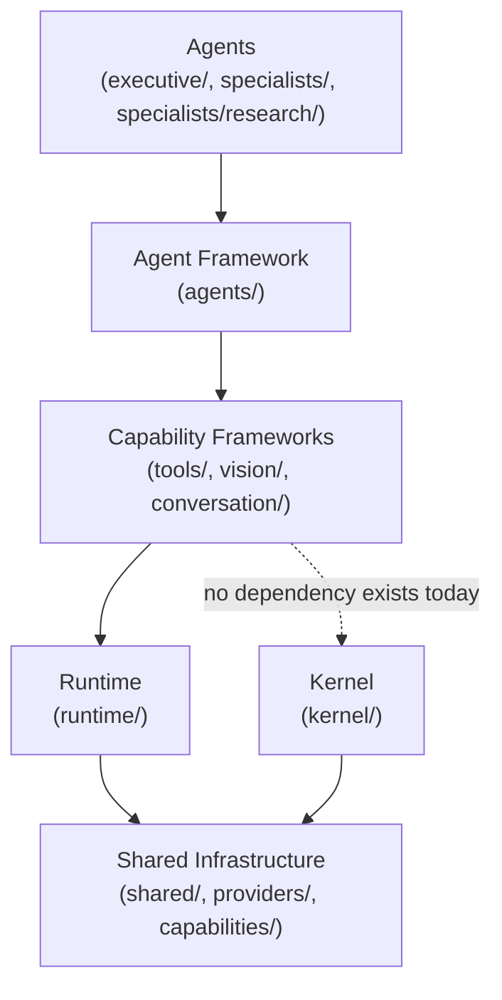

# Dependency Rules

This document states which packages under `app/services/ai/` may import which others. Every rule below is verified automatically, on every test run, by `app/tests/architecture/` (see [Enforcement](#enforcement)) — this document and that test suite are required to agree; if they ever diverge, the test suite is authoritative for what the code actually does, and this document should be corrected to match (exactly what happened once already — see the note in Enforcement). Treat a violation of these rules as a real architectural regression, not a style nit.

## The Rule

Dependencies point strictly **downward** through these layers. A package may depend on anything in a layer below it, and never on anything in a layer above it or beside it in the same layer (with the specific, named exceptions below).

## Package-by-Package Rules

### `shared/`
**May depend on**: `providers/` only — `shared/response.py`'s `ProviderResponse` needs `ProviderName` to know which provider produced a response. Since `providers/` is itself a dependency-free enum leaf, this creates no cycle risk.
**May NOT depend on**: everything else in `app.services.ai`.
**Verified**: `shared/*.py` has zero `from app.services.ai.<other>` imports besides `providers/` (and `shared/base_factory.py` → `shared/exceptions.py`, intra-package).

### `providers/`, `capabilities/`
**May depend on**: nothing.
**May NOT depend on**: everything else. These are pure enum leaf packages.

### `kernel/`
**May depend on**: `shared/` — and only via one file, `kernel/context.py`, importing `SharedExecutionContext`.
**May NOT depend on**: `runtime/`, `conversation/`, `agents/`, `tools/`, `vision/`, or anything else in `app.services.ai`.
**Verified**: every other kernel module imports only from other `kernel/*` modules. `kernel/types.py` deliberately re-declares its own `Metadata`/`Payload` aliases rather than importing `shared/execution_types.Metadata`, even though they're identical — this is intentional isolation, not an oversight (see [Philosophy.md](../00_OVERVIEW/Philosophy.md)).
**Why**: the Kernel is meant to be the platform's most stable, dependency-free layer — a foundation nothing above it can accidentally destabilize by changing.

### `runtime/`
**May depend on**: `shared/`, `conversation/` (`ConversationProviderFactory`, `ConversationProvider`, `ConversationResponse`), `providers/`, `prompt_builder/` (`PromptPackage`, external to `app.services.ai`).
**May NOT depend on**: `kernel/`, `agents/`, `tools/`, `vision/`.
**Verified**: no `runtime/*.py` file imports from `agents`, `tools`, or `vision`.
**Why**: Runtime is a capability execution engine, not a kernel-composed layer (see [Kernel.md](../02_KERNEL/Kernel.md) for why these two are currently separate) and it must stay usable by any future consumer without dragging in agent- or tool-specific concepts.

### `conversation/`
**May depend on**: `shared/`, `providers/`, `prompt_builder/`.
**May NOT depend on**: `runtime/` — the dependency runs the other way (Runtime depends on Conversation, never the reverse).
**Verified**: no `conversation/*.py` file imports from `runtime`.

### `agents/` (the framework itself, not `executive/`/`specialists/`)
**May depend on**: `shared/`, `kernel/` (`RetryPolicy`, `ExecutionMetrics`, `TokenUsageReference` — explicitly allowed reuse), `runtime/` (`RuntimeResponse`, composed by `AgentExecutionResult`).
**May NOT depend on**: `tools/`, `vision/`, `agents/executive/`, `agents/specialists/` — the generic Agent Framework must stay usable by any future agent and must not know about specific agents built on top of it.
**Verified**: zero imports from `tools`, `vision`, `agents.executive`, or `agents.specialists` anywhere in `agents/*.py` (excluding the `executive/`/`specialists/` subpackages themselves).

### `agents/executive/`
**May depend on**: `agents/`, `agents/specialists/` (`SpecialistRegistry`/`SpecialistDispatcher`, for delegation), `shared/`, `kernel/`, `runtime/`, `providers/`. The last two are not optional extras: `ExecutiveAgent` calls `AIRuntime` directly for its own conversational capability (not only delegation to specialists), so it constructs `RuntimeRequest`/reads `RuntimeResponse` and needs `ProviderName` — this was found and corrected during the M20.1 enforcement pass; the original version of this document omitted it.
**May NOT depend on**: `agents/specialists/research/` (a specific specialist) — the Executive dispatches to specialists generically, through the registry/dispatcher, and must never import a concrete specialist by name.

### `agents/specialists/`
**May depend on**: `agents/`, `tools/` (via `ToolAdapter`), `runtime/` (via `RuntimeAdapter`), `retrieval/` (via `MemoryAdapter`), `shared/`, `kernel/`.
**May NOT depend on**: `agents/executive/`, `agents/specialists/research/` (the generic specialist framework must not know about the Executive or any one concrete specialist).

### `agents/specialists/research/`
**May depend on**: `agents/specialists/` (and transitively `agents/`), `tools/`, `shared/`, `runtime/`, `kernel/`, `providers/`. As with the Executive, `ResearchAgent` holds a `RuntimeAdapter` but also constructs/reads `RuntimeRequest`/`RuntimeResponse` directly (the adapter wraps the call, not the value objects it takes/returns) and reuses `ExecutionMetrics`/`ProviderName` — also found and corrected during the M20.1 enforcement pass.
**May NOT depend on**: `agents/executive/`, any other specialist.

### `tools/`
**May depend on**: `shared/`, `runtime/` (`CancellationToken`, `RuntimeTimeout` — reused, not duplicated), `kernel/` (`RetryPolicy`).
**May NOT depend on**: `agents/` (in either direction — a tool is invoked by an agent via `ToolAdapter`/`ToolExecutor`, never the reverse), `vision/`, `agents/executive/`, `agents/specialists/`.
**Verified**: zero imports from `agents` anywhere in `tools/*.py`.

### `vision/`
**May depend on**: `shared/`, `runtime/` (`CancellationToken`, `RuntimeTimeout`), `kernel/` (`ExecutionMetrics`), `providers/`.
**May NOT depend on**: `agents/`, `tools/`, `agents/executive/`, `agents/specialists/`, `conversation/`. Vision is a shared OS capability like Conversation, not an agent — it must remain reachable by any agent without ever depending on one.
**Verified**: zero imports from `agents` or `tools` anywhere under `vision/`.

## Cross-Cutting Rule: No Vendor Coupling Above the Provider Layer

No file outside a `*/base_provider.py`-adjacent concrete provider implementation may import a vendor SDK, HTTP client, or vendor-specific type. As of M19, this is trivially true for Conversation and Vision because **no concrete vendor provider exists yet** — but the rule is what keeps it true when one is added: a new `OpenAIConversationProvider` may import `openai`; `AIRuntime`, `RuntimeExecutor`, and every capability framework never may.

## Intelligence-Layer Packages (outside `app/services/ai/`)

These follow a separate but analogous rule: `context/` never imports `ranking/` or `semantic_search_service.py` (or vice versa) — `retrieval/adapters.py` is the only file translating between their types. `prompt_builder/` depends only on `context/` (for `ContextPackage`), never on `ranking/`, embeddings, or a vendor SDK. See [Package_Architecture.md](Package_Architecture.md) and [Retrieval.md](../03_INTELLIGENCE/Retrieval.md).

## `embedding/` and `vector_store/`: Migrated onto `GenericProviderRegistry` (M20.5)

`EmbeddingProviderFactory`/`VectorStoreFactory` live outside `app/services/ai/` entirely (under `app/services/`, serving the Knowledge/Memory Engine, M12/M13) but had each hand-rolled the same module-level-dict "registry" shape `GenericProviderRegistry` already generalizes. Migrating them was explicitly out of scope for the M19 completion pass (which was scoped to `app/services/ai/` subsystems only) and was flagged as a known, unresolved duplication at the time.

**M20.5 closed this gap**: `app/services/embedding/registry.py` (`EmbeddingProviderRegistry`) and `app/services/vector_store/registry.py` (`VectorStoreRegistry`) now both extend `GenericProviderRegistry`, each with `_registration_error` set to its own domain exception (`EmbeddingProviderError`, `VectorStoreError`) — the identical pattern every AI-OS registry follows. `EmbeddingProviderFactory.create()`/`VectorStoreFactory.create()` resolve through these registries instead of a bare dict; their public APIs, exception types, and error messages are byte-for-byte unchanged (verified: 2029 tests passing, same count as before this change). The previously-tested module-level `_PROVIDERS`/`_STORES` dicts (see `app/tests/test_enums.py`) are preserved as backward-compatible snapshots (`X.all_registered()`, computed once at import time) rather than removed.

**This introduces one new, deliberate cross-boundary dependency**: `app/services/embedding/` and `app/services/vector_store/` now depend on `app.services.ai.shared.provider_registry`. This does not violate the layering described elsewhere in this document (which governs dependencies *within* `app/services/ai/`) — `app.services.ai.shared` has zero dependencies of its own and is explicitly designed as a dependency-free leaf any package may build on, so this creates no cycle. It does mean `app.services.ai.shared` is no longer purely an "AI Operating System-internal" package in practice; it is now the platform's shared registry primitive, full stop.

## Enforcement

These rules are enforced automatically, on every `pytest` run, by `app/tests/architecture/` (added in M20.1 — "Architecture Enforcement"):

- `app/tests/architecture/dependency_rules.py` — **the dependency validator**. It parses every module under `app/services/ai/` with Python's `ast` module (never by importing the modules and never by grepping source text), builds the real import graph, and checks every AI-OS-internal import against a declared per-boundary allow-list (`ALLOWED_DEPENDENCIES`) plus named single-module exceptions (`MODULE_EXCEPTIONS`, e.g. `kernel.context`). A second, independent check (`find_vendor_import_violations`) scans the same graph for any import of a known vendor SDK/HTTP client/OCR/image library.
- `app/tests/architecture/test_dependency_rules.py` — the test suite: one comprehensive sweep (`test_no_package_boundary_violations_anywhere_in_the_ai_operating_system`) covering every boundary, plus named tests matching each rule in this document (e.g. `test_kernel_boundary_forbidden_dependencies`, `test_vision_boundary_forbidden_dependencies`), plus a standalone, independent check that `kernel.context` is the *only* kernel module allowed to import outside the kernel (this one doesn't even trust `ALLOWED_DEPENDENCIES`/`MODULE_EXCEPTIONS` — it asserts the exact module name directly, as defense-in-depth for the Kernel's isolation specifically).

**This is how the three corrections above were actually found**: building the validator and running it against the real codebase surfaced `agents.executive`'s and `agents.specialists.research`'s direct `runtime`/`providers` dependencies and `shared`'s dependency on `providers` — all real, legitimate, pre-existing code this document had simply failed to capture. The validator was corrected to allow them (they are genuine architecture, not violations), and this document was corrected to match. No production code changed as a result — this is documentation and test infrastructure catching up to what the code already, correctly, did.

A new illegal cross-package import (or a new vendor SDK import) now fails the test suite the same run as any other regression — there is no separate, optional lint step to remember to run.
