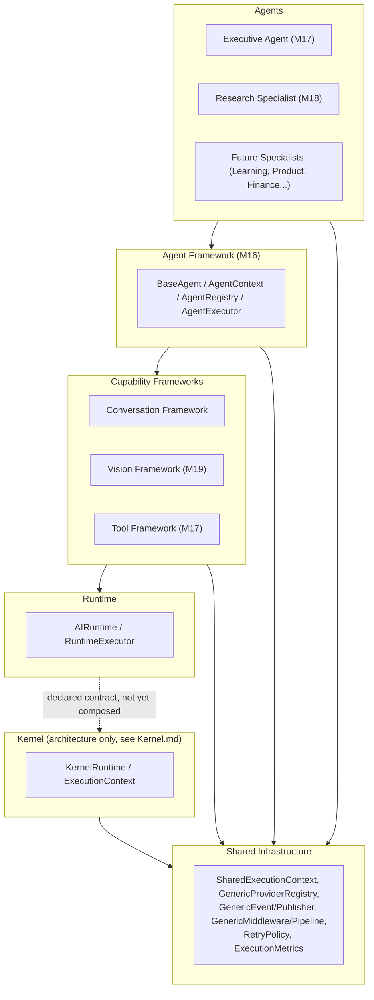
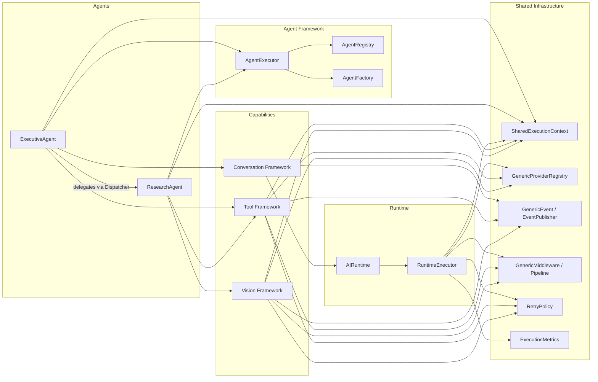
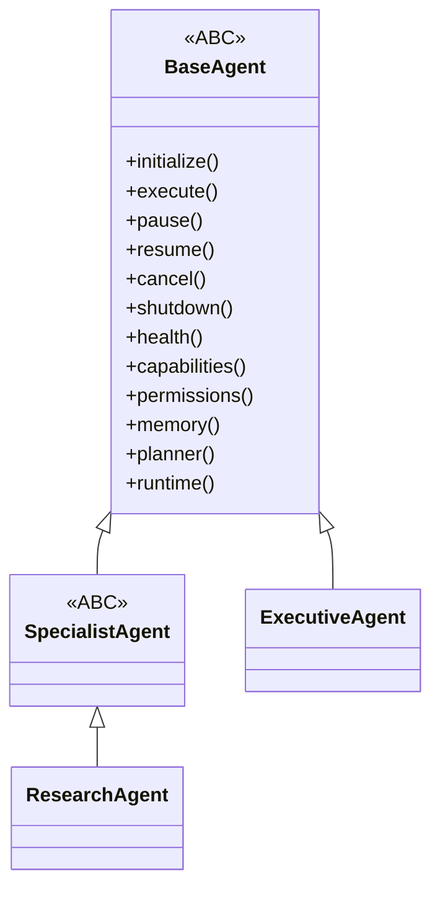
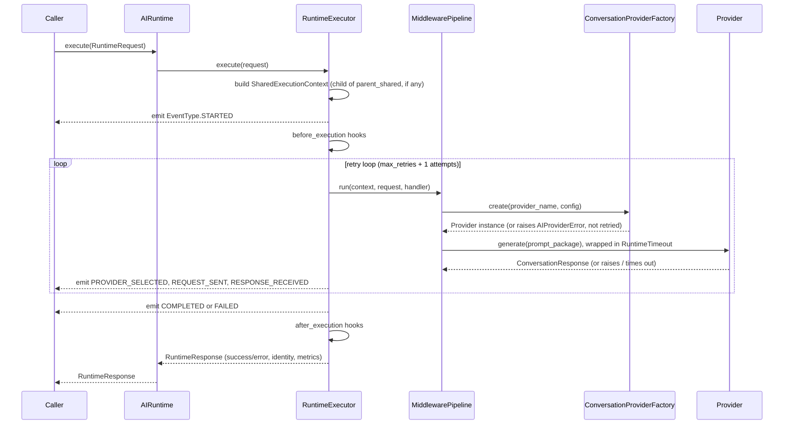

# System Architecture

This is the blueprint for the AI Operating System (`app/services/ai/`) as it exists after M19. It describes the layers, how they compose, and how a request actually flows through the system today — as opposed to what is architected-but-not-yet-implemented (the Kernel; see the callout below) or roadmap (see [Roadmap.md](../00_OVERVIEW/Roadmap.md)).

## Layered Architecture



**Read this diagram carefully**: the Kernel (L1) is drawn separately because, as of M19, it is a fully-specified but largely unimplemented contract layer — `KernelRuntime.execute()` validates its input and then raises `NotImplementedError`. The Runtime (L2) does **not** currently sit on top of the Kernel; it is a separate, working execution engine that was built to replace an earlier capability-agnostic draft engine, and is provider-coupled (conversation-specific) by design. Every other layer depends on Shared Infrastructure (L0) directly. See [Kernel.md](../02_KERNEL/Kernel.md) for the full accounting of what the Kernel actually implements today.

## Component Diagram



## Capability Hierarchy

> See [Capability_Routing.md](Capability_Routing.md) for how capability enums (`AgentCapability`, `ToolCapability`, `SpecialistTaskType`, `VisionCapabilityCategory`) drive dispatch platform-wide, and where routing is intentionally identity-based instead.

Every capability framework — Conversation, Vision, and (structurally) Tools — follows the same shape, deliberately:

```
Agent → Capability Framework → Provider (abstract contract) → Provider Implementation (vendor-specific)
```

| Capability | Framework package | Provider ABC(s) | Providers registered today |
|---|---|---|---|
| Conversation | `app/services/ai/conversation/` | `ConversationProvider` | None — architecture only |
| Vision — Image | `app/services/ai/vision/image/` | `ImageVisionProvider` | None — architecture only |
| Vision — Document | `app/services/ai/vision/document/` | `DocumentVisionProvider` | None — architecture only |
| Vision — Extraction | `app/services/ai/vision/extraction/` | `ExtractionProvider` | None — architecture only |
| Vision — Analysis | `app/services/ai/vision/analysis/` | `AnalysisProvider` | None — architecture only |
| Tools | `app/services/ai/tools/` | `BaseTool` (tools self-register directly, no separate provider layer) | None built-in yet |

No concrete, vendor-specific provider exists anywhere in this platform as of M19 — every capability is exercised in tests via hand-written fakes implementing the real ABCs. This is intentional: the frameworks are proven provider-agnostic by construction, not by convention.

## Agent Hierarchy



`ExecutiveAgent` self-registers in `AgentRegistry` under the name `"executive"`; `ResearchAgent` self-registers under `SpecialistRegistry` (a distinct, specialist-scoped registry that additionally records `specialization`/`supported_tasks` at registration time — see [Specialist_Framework.md](../03_INTELLIGENCE/Specialist_Framework.md)). Both are still full `BaseAgent`s and are also discoverable through `AgentRegistry`.

## Request Lifecycle (Conversation, the fully-implemented path)



This same shape (executor → middleware pipeline → factory-resolved provider → structured response, never a raised exception) is repeated, with capability-specific types, by `ToolExecutor` and `VisionExecutor`. See [Runtime.md](../02_KERNEL/Runtime.md), [Tool_Framework.md](../04_CAPABILITIES/Tool_Framework.md), and [Vision_Framework.md](../04_CAPABILITIES/Vision_Framework.md).

## Data Flow: Retrieval → Context → Prompt → Execution

This is the path a user query actually takes to become a grounded LLM call, spanning the Intelligence layer and the Runtime:

```mermaid
flowchart LR
    Q[User query] --> SS[SemanticSearchService]
    SS -->|SemanticSearchResult list| AD1["adapters.semantic_results_to_ranking_candidates"]
    AD1 --> RE[RankingEngine]
    RE -->|RankedCandidate list| AD2["adapters.ranking_results_to_context_results"]
    AD2 -->|RetrievalResult list| CB[ContextBuilder pipeline]
    CB -->|ContextPackage| PB[PromptBuilder]
    PB -->|PromptPackage| RT[AIRuntime / RuntimeExecutor]
    RT --> PR[ConversationProvider]
```



The `MemoryRetrievalPipeline` (`app/services/retrieval/`) is the single orchestration point tying `SemanticSearchService`, `RankingEngine`, and `ContextBuilder` together; `ContextBuilder` and `RankingEngine` never import each other directly — the adapters in `app/services/retrieval/adapters.py` are the only glue. See [Retrieval.md](../03_INTELLIGENCE/Retrieval.md) and [Prompt_Builder.md](../03_INTELLIGENCE/Prompt_Builder.md).

## Shared Infrastructure at a Glance

Every subsystem above composes rather than redefines:

- **Identity**: `SharedExecutionContext` (execution/correlation/causation/parent tracking) — see [Execution_Context.md](../02_KERNEL/Execution_Context.md).
- **Registries**: `GenericProviderRegistry` — see [Shared_Infrastructure.md](Shared_Infrastructure.md).
- **Events**: `GenericEvent`/`EventPublisher` — see [Event_System.md](../02_KERNEL/Event_System.md).
- **Middleware**: `GenericMiddleware`/`GenericMiddlewarePipeline` — see [Middleware.md](../02_KERNEL/Middleware.md).
- **Retry**: `kernel.retry.RetryPolicy`, reused (never redefined) by Tool/Specialist/Vision execution policies.
- **Metrics**: `kernel.metrics.ExecutionMetrics`, composed by `VisionResponse` and others.

Full detail in [Shared_Infrastructure.md](Shared_Infrastructure.md).

## Package-Level Detail

For a package-by-package breakdown (purpose, responsibilities, dependencies, public API) see [Package_Architecture.md](Package_Architecture.md). For which packages may depend on which, see [Dependency_Rules.md](Dependency_Rules.md).
