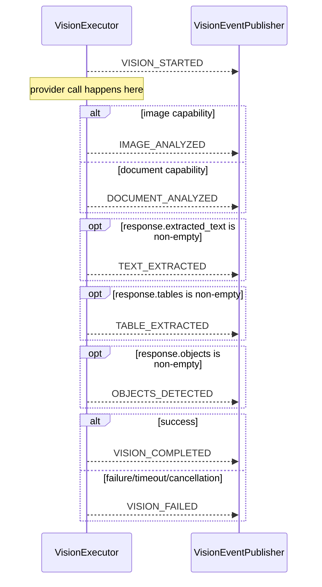

# Event System

Every execution engine in the AI Operating System emits a typed trail of events describing what happened during one `execute()` call. This document covers the shared event model (`GenericEvent`/`EventPublisher`) and every concrete event type built on it.

## The Shared Base

**File**: `app/services/ai/shared/events.py`

```python
@dataclass(frozen=True, kw_only=True)
class GenericEvent:
    event_type: Any
    execution_id: str
    correlation_id: str | None = None   # defaults to execution_id if omitted
    timestamp: float                     # default_factory=time.time
    data: Metadata                       # coerced to MappingProxyType

    __hash__ = hash_event

class EventPublisher(Generic[TEvent]):
    def subscribe(self, callback) -> None: ...
    def unsubscribe(self, callback) -> None: ...
    def publish(self, event: TEvent) -> None: ...
    def subscriber_count(self) -> int: ...
```

`EventPublisher` is synchronous, in-process pub/sub: subscribers are dispatched to in registration order, on the same thread that calls `publish()`. There is no event bus, no queue, no async dispatch anywhere in this platform. A future subscriber wanting real delivery (webhooks, a message queue) would be built as a subscriber of one of these publishers, not as a replacement for them.

## The Hashing Fix

A frozen dataclass's auto-generated `__hash__` hashes every field, including `data` — a `MappingProxyType`, which is not hashable (it wraps a `dict`). Calling `hash()` on any event before this fix raised `TypeError: unhashable type: 'mappingproxy'`. The fix, `hash_event()`, is defined once:

```python
def hash_event(event: "GenericEvent") -> int:
    return hash((event.execution_id, event.event_type, event.timestamp))
```

**The subtlety that makes this worth documenting explicitly**: a custom `__hash__` does not survive being re-decorated with `@dataclass` in a subclass unless the subclass restates it. Every concrete event subclass narrows `event_type`'s type (e.g. `event_type: VisionEventType` instead of the parent's `event_type: Any`), which requires re-applying `@dataclass(frozen=True, kw_only=True)` to that subclass — and `@dataclass` regenerates a fresh (broken) `__hash__` for any class where `__hash__` isn't already present in *that exact class's own* `__dict__`, not merely inherited. So every event subclass explicitly includes the line `__hash__ = hash_event` in its own class body. This was verified with a direct smoke test before being rolled out platform-wide (see [ADR-0001](../ADR/ADR-0001.md)) — omitting it on any one subclass silently reintroduces the bug for that type alone.

## `kw_only=True`

`GenericEvent`'s fields are `kw_only`. This is what lets `ToolEvent` add a *required* field (`tool_id: str`, no default) after the parent's already-defaulted fields (`timestamp`, `data`) without violating ordinary dataclass field-ordering rules (a required field may not normally follow a defaulted one). Every event across the platform is already constructed with keyword arguments only, so this was a zero-risk change when it was made.

## Concrete Event Types

| Type | Package | Extra fields beyond `GenericEvent` | Event type enum |
|---|---|---|---|
| `RuntimeEvent` | `runtime/types.py` | none | `EventType`: `STARTED`, `PROVIDER_SELECTED`, `REQUEST_SENT`, `RESPONSE_RECEIVED`, `COMPLETED`, `FAILED`, `CANCELLED`, `TIMEOUT` |
| `AgentEvent` | `agents/events.py` | `agent_id: str` (required); `execution_id` overridden to `str \| None = None` — coarse lifecycle events (`CREATED`, `INITIALIZED`, `PAUSED`, ...) can occur outside any one execution | `AgentEventType` |
| `ExecutiveEvent` | `agents/executive/events.py` | none | `ExecutiveEventType`: `PLAN_CREATED`, `TASK_CREATED`, `TASK_ASSIGNED`, `TASK_COMPLETED`, `TASK_FAILED`, `DELEGATION_STARTED`, `DELEGATION_COMPLETED`, `RESPONSE_GENERATED` |
| `ToolEvent` | `tools/events.py` | `tool_id: str` (required), `agent_id: str \| None = None` | `ToolEventType` |
| `ResearchEvent` | `agents/specialists/research/events.py` | `agent_id: str` (required) | `ResearchEventType`: `RESEARCH_STARTED`, `PLAN_CREATED`, `MEMORY_RETRIEVED`, `TOOLS_COMPLETED`, `SYNTHESIS_COMPLETED`, `REPORT_GENERATED`, `RESEARCH_COMPLETED`, `RESEARCH_FAILED` |
| `VisionEvent` | `vision/events.py` | none | `VisionEventType`: `VISION_STARTED`, `IMAGE_ANALYZED`, `DOCUMENT_ANALYZED`, `TEXT_EXTRACTED`, `TABLE_EXTRACTED`, `OBJECTS_DETECTED`, `VISION_COMPLETED`, `VISION_FAILED` |

**Note on "SpecialistEvent"**: there is no separate, specialist-generic event type. `ResearchEvent` is currently the only concrete specialist event, since Research is still the only concrete specialist. A second specialist (Learning, Product, Finance — see [Roadmap.md](../00_OVERVIEW/Roadmap.md)) would either reuse `ResearchEvent`'s shape under its own event-type enum, or a genuine `SpecialistEvent` base would be introduced at that point — this was deliberately not built ahead of a second real consumer.

## Event Ordering (Vision, as a representative example)



`VisionExecutor`'s content events are **data-driven, not purely capability-driven**: `IMAGE_ANALYZED`/`DOCUMENT_ANALYZED` are chosen by which capability ran, but `TEXT_EXTRACTED`/`TABLE_EXTRACTED`/`OBJECTS_DETECTED` are emitted based on what the provider's response actually populated — resolving the fact that Extraction and Analysis have no dedicated "started" event of their own in the type list. Every event, regardless of type, carries `execution_id`/`correlation_id`/`timestamp`.

## Not Yet Implemented: The Kernel's Event Family

`kernel/events.py` declares `ExecutionStarted`, `ExecutionCompleted`, `ExecutionFailed`, `ExecutionCancelled`, `ExecutionRetried`, `ProviderResolved`, `CapabilityResolved`, unioned as `KernelEvent`. These are plain dataclasses with **no publisher and no emission anywhere in the codebase** — a declared contract for a future Kernel-level event system, not something currently in use. Do not confuse this with the working `GenericEvent`-based system documented above.
