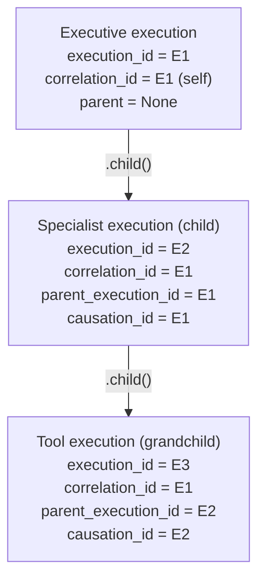

# Execution Context

This document covers exactly one type in depth: `SharedExecutionContext` (`app/services/ai/shared/execution_context.py`) — the single execution identity every subsystem in the AI Operating System composes rather than redefining.

## Why It Exists

Before this type existed, three subsystems (the Kernel's `ExecutionContext`, the Runtime's `RuntimeContext`, the Agent Framework's `AgentContext`) each defined their own notion of "who/what/why behind this execution" — describing the same underlying concept from three different angles, with no shared field names or semantics. `SharedExecutionContext` is the one place execution identity is now defined; every subsystem composes it (holds one as a field named `shared`) and adds only what's genuinely specific to that layer. See [ADR-0001](../ADR/ADR-0001.md).

## The Six Identity Fields

```python
@dataclass(frozen=True)
class SharedExecutionContext:
    execution_id: str            # default: uuid4() — this execution's own identity
    parent_execution_id: str | None = None
    correlation_id: str | None = None   # default: this context's own execution_id
    causation_id: str | None = None
    session_id: str | None = None
    request_id: str              # default: uuid4()
    organization_id: int | None = None
    user_id: int | None = None
    conversation_id: int | None = None
    created_at: datetime         # default: now(UTC)
    metadata: Metadata            # coerced to MappingProxyType
```

| Field | Meaning |
|---|---|
| `execution_id` | This specific execution's own identity. Never changes once set (frozen). Unique per execution. |
| `parent_execution_id` | Links a nested execution (a sub-agent call, a tool invocation, a runtime call triggered by an agent) back to whatever execution spawned it — forms an execution *tree*. |
| `correlation_id` | Ties every execution in one causal chain together for observability/tracing. Defaults to the context's own `execution_id` when not given — a root execution is the start of its own correlation chain, the same convention distributed-tracing systems use for a trace's root span. |
| `causation_id` | Names the specific execution/event that directly caused this one — distinct from `correlation_id` (the whole chain) and `parent_execution_id` (the execution tree specifically). |
| `request_id` | Identifies the originating HTTP/API request, distinct from any one execution within it. |
| `session_id` | Identifies a user session, spanning potentially many requests/executions. |

Also carried, but not identity fields in the strict sense: `organization_id`, `user_id`, `conversation_id` (tenant/user/conversation scoping) and `metadata` (a free-form, read-only mapping).

## The Execution Tree: `.child()`

```python
def child(self, **overrides) -> "SharedExecutionContext":
    defaults = dict(
        parent_execution_id=self.execution_id,
        correlation_id=self.correlation_id,      # propagated, not reset
        causation_id=self.execution_id,
        session_id=self.session_id,
        organization_id=self.organization_id,
        user_id=self.user_id,
        conversation_id=self.conversation_id,
    )
    defaults.update(overrides)
    return SharedExecutionContext(**defaults)
```

`.child()` builds a context for an execution nested under this one: a fresh `execution_id`/`request_id`, `parent_execution_id` and `causation_id` both set to the parent's own `execution_id` (this execution is both the parent and the direct cause of the child), and `correlation_id`/`session_id`/`organization_id`/`user_id`/`conversation_id` propagated unchanged — the whole chain shares one `correlation_id` unless a caller deliberately overrides it.



**This is what makes "Executive → Specialist → Tool → Runtime" one execution tree with one shared `correlation_id` in practice** — not merely a capability that exists on `SharedExecutionContext` in isolation. `RuntimeRequest.parent_shared`, `VisionRequest.parent_shared`, and the equivalent field on every other capability request are how a caller actually plugs its own context in as the parent before calling into that capability.

## `identity_fields()`

```python
def identity_fields(self) -> dict[str, str | None]:
    return {
        "execution_id": self.execution_id,
        "parent_execution_id": self.parent_execution_id,
        "correlation_id": self.correlation_id,
        "causation_id": self.causation_id,
    }
```

The one place the "which four fields does an execution *artifact* (a response, a metrics object) copy onto itself" mapping is defined. `RuntimeExecutor`, `AgentExecutor`, `ToolExecutor`, and `VisionExecutor` all build their final result via `**context.shared.identity_fields()` rather than each spelling out the four assignments independently.

## Hashability

`SharedExecutionContext` holds a `MappingProxyType` field (`metadata`), which is not hashable by default — the dataclass's auto-generated `__hash__` would try to hash it and fail. `SharedExecutionContext` defines a custom `__hash__` based on `execution_id` alone (guaranteed unique per execution, itself immutable):

```python
def __hash__(self) -> int:
    return hash(self.execution_id)
```

This same problem, and a more general version of this same fix, recurred for the Event System — see [Event_System.md](Event_System.md) and [ADR-0001](../ADR/ADR-0001.md).

## Who Composes It

| Composing type | Package | Adds |
|---|---|---|
| `RuntimeContext` | `runtime/` | `provider`, `provider_model`, `attempt`, `retry_count`, `timeout`, `runtime_metadata` |
| `AgentContext` | `agents/` | Agent-specific execution state |
| `ToolContext` | `tools/` | `cancellation_token` (a `CancellationToken`, held alongside `shared`) |
| `VisionContext` | `vision/` | `agent_id`, `capability_category` |
| `ExecutiveContext` | `agents/executive/` | Composes `AgentContext` (which itself composes `SharedExecutionContext`) |
| `ExecutionContext` (Kernel) | `kernel/` | The Kernel's own execution state — this is the Kernel's *one* sanctioned dependency outside itself |

Every one of these types uses a hand-written `__init__` (rather than a plain dataclass-generated one) so every field `SharedExecutionContext` already covers can still be passed as a flat keyword argument directly to the composing type's constructor — e.g. `VisionContext(execution_id=..., organization_id=...)` still works, forwarding into a freshly built `shared` when `shared` itself isn't given explicitly. This preserves backward-compatible flat-kwarg construction while still centralizing the actual field definitions in one place.
