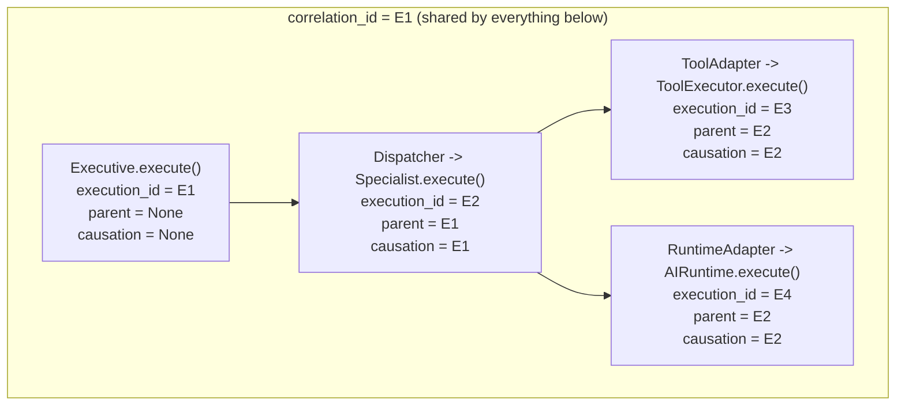

# Identity Model

[Execution_Context.md](Execution_Context.md) documents `SharedExecutionContext` itself in depth. This document is about the platform-wide *consequence* of that type: how identity actually propagates across every layer, on every execution artifact, so that a real Executive → Specialist → Tool → Runtime call chain is fully reconstructable after the fact from any one piece of it.

## The Four Fields That Travel Everywhere

`execution_id`, `parent_execution_id`, `correlation_id`, `causation_id` — collectively `SharedExecutionContext.identity_fields()` — are not just context-internal bookkeeping. They are copied onto every public execution result in the platform:

| Type | Where identity fields live |
|---|---|
| `RuntimeResponse` | Direct fields, populated via `context.shared.identity_fields()` |
| `AgentExecutionResult` | Direct fields, same convention |
| `ExecutionMetrics` | `execution_id` field (added during M16.6, "Execution Identity Hardening") |
| `VisionResponse` | Direct fields, defaulting to fresh `uuid4()`s for standalone constructibility in tests, but always overwritten by `VisionExecutor` with the real context's identity |
| `ToolResult` | Composes `ExecutionMetrics`, which carries `execution_id` |
| Every `*Event` (`RuntimeEvent`, `AgentEvent`, `ToolEvent`, `ExecutiveEvent`, `ResearchEvent`, `VisionEvent`) | `execution_id`/`correlation_id` direct fields (`AgentEvent.execution_id` is the one exception — optional, since coarse lifecycle events like `CREATED` can occur outside any one execution) |

This is why an Executive can answer "which execution produced this response" or "which events belong to this correlation chain" by reading the response/event directly — never by re-deriving it from context that may no longer be in scope.

## Building an Execution Tree in Practice

Nothing automatically wires a nested call's identity to its caller's. A caller must **explicitly** pass its own `SharedExecutionContext` as the nested call's `parent_shared`:

```python
# Inside an Executive agent, delegating to a Specialist, which calls a Tool:
specialist_request = SpecialistRequest(..., parent_shared=executive_context.shared)
# SpecialistExecutor internally does: shared = request.parent_shared.child()

tool_request_context = ToolContext(shared=specialist_context.shared.child())
```

Every capability request type carries this same field under the same name: `RuntimeRequest.parent_shared`, `VisionRequest.parent_shared`, and the equivalent on Tool/Specialist request types. If `parent_shared` is `None` (the default), the execution starts a **new, unrelated correlation chain** — its own `correlation_id` equals its own `execution_id`. This is a real, easy-to-miss failure mode: forgetting to pass `parent_shared` silently produces a disconnected execution tree, not an error.

## A Realistic Execution Tree



Every one of `E1`–`E4`'s emitted events, and every one of their final response objects, carries `correlation_id = E1`. An observability system (none exists in this codebase yet — see [Event_System.md](Event_System.md)) could reconstruct this entire tree from a flat stream of events by grouping on `correlation_id` and linking on `parent_execution_id`.

## Identity and Cancellation Are Independent

A `CancellationToken` is **not** part of `SharedExecutionContext` — it travels alongside it as a separate field on request types (`RuntimeRequest.cancellation_token`, `VisionRequest.cancellation_token`, `ToolContext.cancellation_token`). Cancelling a child execution's token does not cancel its parent's, and vice versa — cancellation propagation, if wanted, is the caller's responsibility to wire explicitly (e.g. by handing the same token to every nested call), it is not automatic the way identity propagation through `.child()` is.

## Identity and Hashing

`SharedExecutionContext` and every `*Event` type are frozen dataclasses that hold a `MappingProxyType` field (`metadata`/`data`) — unhashable by default. Both are fixed by a custom `__hash__` keyed on stable identity (`execution_id` alone for contexts; `(execution_id, event_type, timestamp)` for events, since one execution emits many events sharing one `execution_id`). See [Event_System.md](Event_System.md) for the event-side fix in full, and [ADR-0001](../ADR/ADR-0001.md) for why this was worth a platform-wide, single-implementation fix rather than a per-type patch.

## Known Gaps

- **No automatic propagation.** As noted above, `parent_shared` must be threaded through by hand at every layer boundary. There is no ambient/thread-local context that implicitly attaches to nested calls.
- **The Kernel's `KernelEvent` family carries no identity-propagation mechanism** — it is a declared dataclass family with no publisher, so this gap is theoretical today, but would need addressing before the Kernel's event system becomes real.
- **No cross-process propagation.** Everything above is in-process; nothing in this platform serializes a `SharedExecutionContext` across an HTTP boundary or a queue message today.
