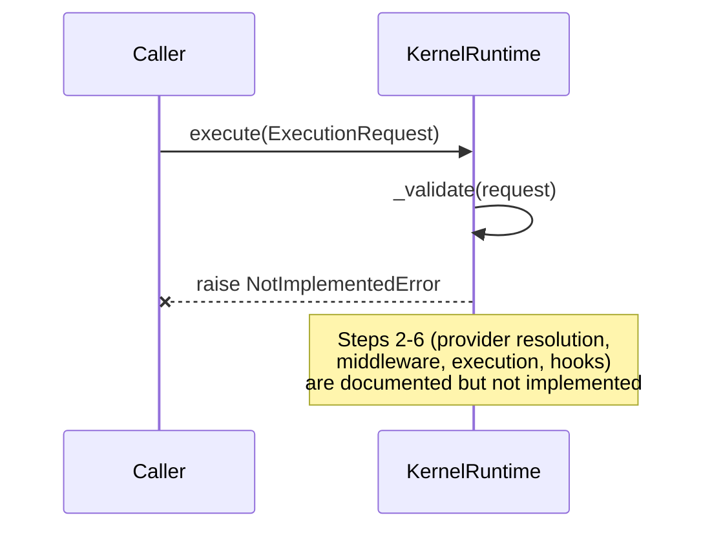

# Kernel

`app/services/ai/kernel/` is the AI Operating System's foundational, capability-agnostic execution layer. This document is deliberately explicit about what the Kernel **is** and **is not** as of M19, because its current state is easy to over-describe: it is a thorough, carefully-designed contract layer, not (yet) a working execution engine.

## Kernel Responsibilities

The Kernel declares the vocabulary and structure every capability-specific execution engine (Runtime today; a future Vision-native or Tool-native kernel-composed engine) is meant to use:

- **Execution identity**: `ExecutionContext` (composes `SharedExecutionContext`).
- **Generic request/response**: `ExecutionRequest`/`ExecutionResponse` — capability-agnostic (no `PromptPackage`, no vendor concept anywhere).
- **Retry**: `RetryPolicy`, `BackoffStrategy`, `RetryCondition`.
- **Cancellation**: `CancellationReason`, `CancellationPolicy`, `ExecutionCancellation` — a *contract* describing cancellation semantics; no cancellation mechanism is implemented here (the actual working `CancellationToken` lives in `runtime/cancellation.py` and is reused by Tools and Vision directly, bypassing the Kernel).
- **Events**: `ExecutionStarted`, `ExecutionCompleted`, `ExecutionFailed`, `ExecutionCancelled`, `ExecutionRetried`, `ProviderResolved`, `CapabilityResolved`, unioned as `KernelEvent`. No event bus or publisher exists for these.
- **Metrics**: `TokenUsageReference`, `CostEstimate`, `ExecutionMetrics` — provider-independent value objects. `ExecutionMetrics` specifically is reused directly by `VisionResponse`.
- **Middleware & Hooks**: `KernelMiddleware` (`before_execute`/`after_execute`/`on_error`, request/response-transforming) and `KernelHook` (`before_execution`/`after_execution`/`execution_failed`, observe-only) — both fully abstract ABCs with zero implementations anywhere in the repo.
- **Scheduling**: `ExecutionMode` (`IMMEDIATE`/`QUEUED`/`SCHEDULED`/`PARALLEL`/`DISTRIBUTED`) — a declared enum, no scheduler.
- **State**: `ExecutionState` — the full lifecycle enum (`PENDING` → ... → `COMPLETED`).
- **Graph**: `ExecutionNode`/`ExecutionEdge`/`ExecutionGraph` — a pure directed-graph structure describing execution relationships; no traversal or scheduling logic.
- **Model identity**: `ModelIdentity` — a provider-independent descriptor (family/model_name/version/capability flags).
- **Capability contract**: `CapabilityRuntime` ABC — the future contract a `ConversationRuntime`/`VisionRuntime`/etc. would implement to be Kernel-composable. Not wired into `KernelRuntime` today.
- **Registry**: `RuntimeRegistry` — instance-level (not global) holder of middleware/hooks/capability-runtimes for one `KernelRuntime`.
- **Pipeline**: `RuntimePipeline` — a frozen dataclass holding ordered middleware/hook tuples; its `run()` documents the intended flow but currently raises `NotImplementedError`.

## Execution Model — What `KernelRuntime.execute()` Actually Does Today

```python
class KernelRuntime:
    def __init__(self, registry: RuntimeRegistry | None = None, pipeline: RuntimePipeline | None = None): ...
    def execute(self, request: ExecutionRequest) -> ExecutionResponse: ...
```

`execute()` validates its input — confirms `request` is an `ExecutionRequest`, `request.capability` is non-empty, and `request.context` is an `ExecutionContext` — and then **unconditionally raises `NotImplementedError`**. Provider resolution, middleware execution, actual capability-provider execution, and hook invocation are documented in the source as the intended next steps (step 2 through 6 of the execution chain) but are not implemented.



## Why the Kernel and the Runtime Are Separate Today

This is the single most important fact to understand about the Kernel, and it is stated explicitly rather than left implicit: **the Runtime (`app/services/ai/runtime/`) does not sit on top of the Kernel**. `AIRuntime`/`RuntimeExecutor` is a separate, fully-working execution engine, deliberately coupled to the Conversation capability (`PromptPackage` in, `ConversationResponse` out), built to replace an earlier, more generic draft engine. It reuses some Kernel-adjacent *concepts* (its own `RetryPolicy`-compatible shape, its own cancellation/timeout) but does not call through `KernelRuntime.execute()` at any point.

This is an intentional, currently-open architectural gap, not a bug: the Kernel is the platform's aspirational, capability-agnostic execution substrate; the Runtime is what actually ships Conversation today. Unifying them — making `AIRuntime` a `CapabilityRuntime` the Kernel actually composes — is a real, identified piece of future work. See the "Remaining Platform Inconsistencies" note in the ADS-1 sprint summary and the Roadmap.

## Kernel's Shared Services

The Kernel imports nothing from elsewhere in `app.services.ai` except one line: `kernel/context.py` composing `app.services.ai.shared.execution_context.SharedExecutionContext`. Every other kernel module — including its own `Metadata`/`Payload` type aliases in `kernel/types.py` — depends on nothing outside the kernel, by explicit design (see [Dependency_Rules.md](../01_ARCHITECTURE/Dependency_Rules.md)). This means the Kernel's `RetryPolicy` and `ExecutionMetrics` are consumed *outward* by Agents/Tools/Vision, but the Kernel itself never reaches back out to consume anything from them.

## Policies

`RetryPolicy` (`kernel/retry.py`) is a pure value object — `max_attempts`, `backoff_strategy` (`BackoffStrategy` enum), `base_delay_ms`, `max_delay_ms`, `retry_on` (a tuple of exception types). Nothing in the Kernel enforces it; it is read by whichever execution engine composes it. This is why `agents/policies.py`, `tools/policies.py`, and `agents/specialists/shared/policies.py` each explicitly re-export it rather than declaring a near-identical copy — see [Shared_Infrastructure.md](../01_ARCHITECTURE/Shared_Infrastructure.md).

## Summary Table

| Kernel concept | Status |
|---|---|
| `ExecutionContext` | Implemented, composes `SharedExecutionContext` |
| `ExecutionRequest`/`ExecutionResponse` | Implemented as value objects |
| `RetryPolicy` | Implemented as a value object; actively reused by Tools/Agents/Specialists |
| `ExecutionMetrics` | Implemented as a value object; actively reused by Vision |
| `CancellationPolicy`/`ExecutionCancellation` | Declared contract only — no mechanism (Runtime's `CancellationToken` is the actual mechanism, used directly) |
| `KernelEvent` family | Declared dataclasses only — no publisher, no emission anywhere |
| `KernelMiddleware`/`KernelHook` | Fully abstract ABCs — zero implementations |
| `ExecutionMode` | Declared enum only — no scheduler |
| `ExecutionGraph` | Pure data structure — no traversal/scheduling logic |
| `CapabilityRuntime` | Declared ABC — not implemented by `AIRuntime` or `VisionRuntime` |
| `KernelRuntime.execute()` | Validates input, then raises `NotImplementedError` |

Do not read this table as a criticism of the Kernel's design — it is an accurate snapshot of a deliberately architecture-first milestone. Treat any future work that makes `KernelRuntime.execute()` functional, or that makes `AIRuntime` a real `CapabilityRuntime`, as a significant milestone in its own right, not an incidental fix.
