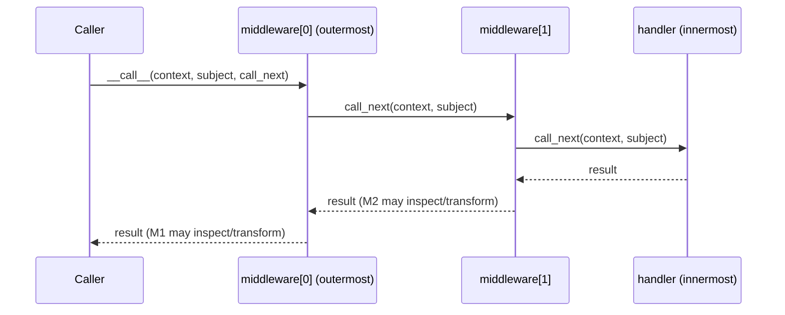

# Middleware

Middleware is how the AI Operating System lets a caller inspect, transform, or short-circuit an execution — request in, result out — without touching the executor itself. Every middleware contract in this platform is deliberately shaped like FastAPI/ASGI middleware, so the mental model transfers without new vocabulary.

## The Shared Base

**File**: `app/services/ai/shared/middleware.py`

```python
class GenericMiddleware(ABC):
    @abstractmethod
    def __call__(self, context: Any, subject: Any, call_next: GenericHandler) -> Any: ...

@dataclass(frozen=True)
class GenericMiddlewarePipeline:
    middleware: tuple = field(default_factory=tuple)

    def run(self, context: Any, subject: Any, handler: GenericHandler) -> Any:
        chain = handler
        for middleware in reversed(self.middleware):
            chain = self._bind(middleware, chain)
        return chain(context, subject)
```

## Composition Order

`run()` builds the call chain from the inside out: the innermost `handler` is wrapped by the *last* middleware in the tuple first, then that's wrapped by the second-to-last, and so on — so the *first* middleware in the tuple ends up outermost: the first to see the request, and the last to see the result.



A middleware may:
- **Pass through**, inspecting the request before calling `call_next` and/or the result after.
- **Transform**, returning a modified request to the rest of the chain, or a modified result to its own caller.
- **Short-circuit**, returning a result without calling `call_next` at all — the handler and every inner middleware never runs.
- **Raise**, aborting the chain (the executor's own exception handling then converts this into the standard structured failure result — see [Runtime.md](Runtime.md)).

## Concrete Middleware Contracts

| Type | Package | `__call__` signature |
|---|---|---|
| `RuntimeMiddleware` | `runtime/middleware.py` | `(RuntimeContext, RuntimeRequest, RuntimeHandler) -> RuntimeExecutionResult` |
| `ToolMiddleware` | `tools/middleware.py` | `(ToolContext, BaseTool, ToolHandler) -> ToolResult` |
| `VisionMiddleware` | `vision/middleware.py` | `(VisionContext, BaseVisionProvider, VisionHandler) -> VisionResponse` |

Each is declared as:

```python
class RuntimeMiddleware(GenericMiddleware):
    @abstractmethod
    def __call__(self, context: RuntimeContext, request: RuntimeRequest, call_next: RuntimeHandler) -> RuntimeExecutionResult:
        raise NotImplementedError
```

**Why `@abstractmethod` must be re-declared**: Python's ABC machinery only considers a method "still abstract" if no concrete override exists anywhere in the MRO. Since `GenericMiddleware.__call__` is abstract, a subclass that provides *any* body for `__call__` — even a type-narrowing override with a docstring and `raise NotImplementedError` — makes the method concrete unless `@abstractmethod` is explicitly re-applied. This was caught and fixed during the Vision milestone by direct smoke-testing (`VisionMiddleware()` must raise `TypeError`, not construct successfully) before being trusted at scale — see [ADR-0004](../ADR/ADR-0004.md) equivalent reasoning applied to Vision specifically in [Vision_Framework.md](../04_CAPABILITIES/Vision_Framework.md).

Corresponding pipelines (`MiddlewarePipeline`, `ToolMiddlewarePipeline`, `VisionMiddlewarePipeline`) are typically empty subclasses of `GenericMiddlewarePipeline` — all composition logic is inherited, unchanged.

## No Concrete Middleware Exists Yet

As of M19, every middleware contract in this platform (Runtime, Tool, Vision) has zero real implementations — logging, metrics, cost tracking, safety/prompt inspection, and caching middleware are all future work. Every middleware test in the suite uses a small hand-written fake (a recording middleware, a short-circuiting middleware) to prove the contract and composition logic work, not a production middleware.

## What Middleware Is Not

Middleware is not how you observe an execution without changing it — that's a [Hook](../01_ARCHITECTURE/Shared_Infrastructure.md)'s job (`RuntimeHook`, `ToolHook`, `VisionHook`), and hooks are deliberately a separate, simpler, non-abstract mechanism with concrete no-op defaults. See [Philosophy.md](../00_OVERVIEW/Philosophy.md), principle 7.

## The One Deliberately Different Middleware: `KernelMiddleware`

`kernel/middleware.py`'s `KernelMiddleware` (`before_execute`/`after_execute`/`on_error`) is **not** built on `GenericMiddleware` and is not a duplicate of it — it is a genuinely different shape (three named lifecycle methods, not one `__call__` wrapping a `call_next`), and was reviewed and deliberately left as its own thing during the M19 completion pass. See [Kernel.md](Kernel.md) and [Dependency_Rules.md](../01_ARCHITECTURE/Dependency_Rules.md).
