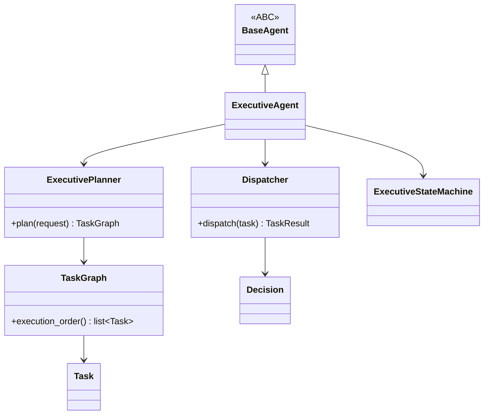

# Executive Framework

This document covers `app/services/ai/agents/executive/` as a **framework** — its architecture and extension points. For the concrete `ExecutiveAgent` itself as an agent (its behavior, its planning/dispatch flow end to end), see [Executive_Agent.md](../05_AGENTS/Executive_Agent.md). The split mirrors the Specialist Framework vs. Research Agent split: framework document = architecture, agent document = behavior.

## Purpose

The Executive is the platform's top-level coordinator — informally "PID 1," the first agent that receives a request and decides how it gets fulfilled: directly, or by delegating to one or more specialists. The Executive Framework is the set of types that make this possible: a deterministic planner, a capability-matching dispatcher, a task graph with dependency ordering, and a dedicated state machine whose failure semantics differ from a generic agent's.

## Architecture

- `executive_agent.py` — `ExecutiveAgent(BaseAgent)`, self-registers in `AgentRegistry` under the name `"executive"`.
- `planner.py` — `ExecutivePlanner(AgentPlanner)`, a **deterministic**, template-based planner producing a fixed 5-task plan shape — not an adaptive or learned planner.
- `dispatcher.py` — `Dispatcher`, routes a `Task` to a capability-matched specialist.
- `decision.py` — `Decision`, the planner's declared intent for a task (e.g. "requires memory," "requires web access").
- `task.py` / `task_graph.py` / `task_result.py` — `Task`, `TaskGraph` (topological ordering via Kahn's algorithm), `TaskResult`.
- `policies.py` — `ExecutivePolicy` (`maximum_depth`, `maximum_retries`, `maximum_runtime_seconds`, `allow_web`, `allow_tools`, `allow_delegation`, `maximum_parallel_tasks`).
- `state.py` — `ExecutiveState`/`ExecutiveStateMachine`.
- `events.py` — `ExecutiveEvent`/`ExecutiveEventPublisher` (see [Event_System.md](../02_KERNEL/Event_System.md)).
- `context.py` — `ExecutiveContext`, composing `AgentContext`.

## The Dispatch Bug That Shaped This Framework

`Dispatcher` matches a task to a capability-having specialist using `task.metadata["required_capability"]` — **not** by inspecting `Decision`'s blanket boolean flags (e.g. `Decision.requires_memory`) directly. This distinction matters: matching on `Decision.requires_memory` alone would route *every* task in a plan that happens to need memory access to a memory-capable specialist, even tasks whose actual work has nothing to do with memory retrieval. Routing on an explicit, task-scoped `required_capability` field avoids that over-broad match. This was a real bug found and fixed during the M17 build, not a hypothetical — treat any future planner/dispatcher change with this failure mode explicitly in mind.

## `TaskGraph.execution_order()`

Tasks form a dependency graph (a task may depend on another task's output). `execution_order()` returns a valid topological ordering via Kahn's algorithm — tasks with no unmet dependencies first, proceeding as dependencies are satisfied. This is what lets the Executive run a multi-step plan in a correct order without a hardcoded sequence.

## `ExecutiveState` — Why It Differs From `AgentState`

The general `AgentState` machine (in `agents/`) treats `COMPLETED`/`FAILED` as terminal states. `ExecutiveState` deliberately does not: **both `COMPLETED` and `FAILED` loop back to `IDLE`**, since an Executive is a long-lived coordinator meant to accept a new request immediately after finishing (successfully or not) the previous one — it is not a one-shot execution the way a single agent invocation is.

## Dependencies

`agents/` (`BaseAgent`, `AgentContext`), `agents/specialists/` (`SpecialistRegistry`, `SpecialistDispatcher` — for delegation, never a specific specialist by name), `shared/`, `kernel/` (`RetryPolicy`). See [Dependency_Rules.md](../01_ARCHITECTURE/Dependency_Rules.md).

## Extension Points

- **A different planning strategy**: `ExecutivePlanner`'s 5-task template is one concrete implementation of `AgentPlanner`; a different planning strategy (e.g. dynamic task count based on request complexity) would be a new `AgentPlanner` subclass, swapped in via `ExecutiveAgent`'s constructor.
- **A different dispatch strategy**: `Dispatcher`'s capability-matching logic is not the only possible routing strategy — a cost-aware or load-aware dispatcher could replace it without changing `TaskGraph` or `ExecutivePlanner`.
- **New capabilities to route on**: adding a new `required_capability` value requires no change to `Dispatcher` itself — it already reads this from task metadata generically; it only requires a specialist actually registered with that capability in its `supported_tasks`.
