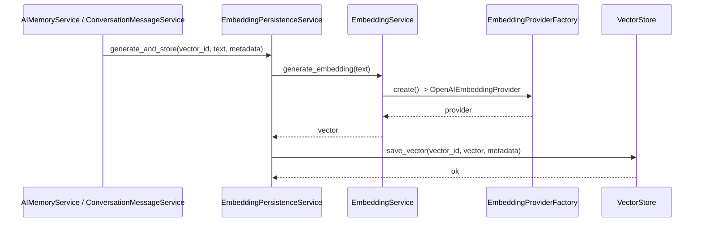
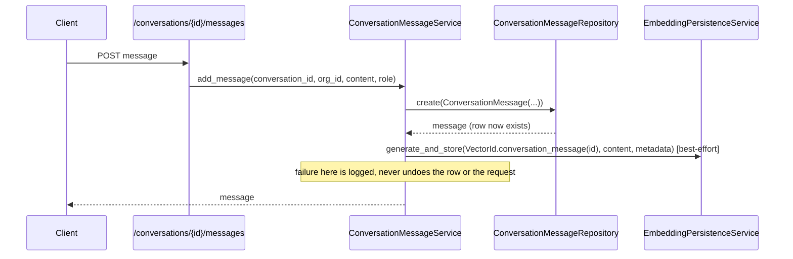

# Memory Layer Rationalization

This document is a full inventory of every memory-adjacent implementation in the codebase — five distinct layers that are easy to conflate because several share the word "memory" or "conversation" while meaning genuinely different things. It exists to answer, precisely: what does each layer actually do, who actually depends on it, and where real duplication exists versus where two things merely look similar.

**Scope note**: this is analysis only. No code is merged, renamed, or refactored as part of this document. Every recommendation below is a recommendation to consider in a future, explicitly-scoped change — not a decision already made.

## The Five Layers, at a Glance

| Layer | What it actually is | Has embeddings? | Primary consumer today |
|---|---|---|---|
| **Vector Memory** | Raw embedding generation + vector storage/retrieval | Is the embedding layer itself | Semantic Memory, and directly by Memory/Conversation Memory's write paths |
| **Semantic Memory** | Meaning-based retrieval: search → rank → build context | Reads vectors, doesn't store them | Agent Memory (`MemoryAdapter`), `PromptBuilder` (via `ContextPackage`) |
| **Key-Value Memory** | Simple, non-semantic key/value notes (`MemoryRecord`) | No | The `/memory` HTTP API only |
| **Agent Memory** | The agent-facing memory contract (`AgentMemory` ABC) | Indirectly, via Semantic Memory | `MemoryAdapter` implements it (M20.6) — `retrieve()`/`search()` working, `remember()`/`forget()` raise `NotImplementedError` |
| **Conversation Memory** | Persisted chat history (`Conversation`/`ConversationMessage`) | Yes, for messages | The `/conversations` HTTP API; read back semantically by Semantic Memory |

A critical naming disambiguation before going further: **"Conversation Memory"** (this document, `Conversation`/`ConversationMessage` — persisted chat history) is completely unrelated to **`app/services/ai/conversation/`** (documented in [Conversation_Framework.md](../04_CAPABILITIES/Conversation_Framework.md) — the AI Operating System's provider-agnostic contract for *talking to* a language model, `ConversationProvider`/`ConversationResponse`). They share a name and nothing else: one is a database-backed history table, the other is an execution-time capability framework. Nothing in this document refers to the latter.

---

## 1. Vector Memory

### Purpose
Turn text into vectors, and store/retrieve those vectors by an opaque id. This is the platform's lowest-level memory primitive — it has no concept of "a memory," "a conversation," or "an agent," only vectors and ids.

### Responsibilities
- **`app/services/embedding/`** — `EmbeddingProvider` (ABC: `embed(texts) -> list[list[float]]`), `OpenAIEmbeddingProvider` (concrete, direct HTTP via `httpx`, retry with backoff), `EmbeddingProviderRegistry` (extends the AI-OS's `GenericProviderRegistry` as of M20.5 — see [Shared_Infrastructure.md](../01_ARCHITECTURE/Shared_Infrastructure.md)), `EmbeddingProviderFactory` (resolves via `EmbeddingProviderName` + validation).
- **`app/services/embedding_service.py`** — `EmbeddingService`: a thin wrapper that "turns text into embeddings, nothing else" — no knowledge of storage.
- **`app/services/vector_store/`** — `VectorStore` (ABC: `save_vector`/`get_vector`/`delete_vector`/`health_check`/`search`), `NullVectorStore` (safe no-op default), `PgVectorStore` (Postgres pgvector, Euclidean distance), `VectorStoreRegistry` (extends `GenericProviderRegistry` as of M20.5), `VectorStoreFactory` (resolves + validates config), `VectorId` (the single source of truth for key format: `VectorId.memory(id)`, `VectorId.conversation_message(id)`, `VectorId.knowledge(id)`), `VectorMetadata`/`SearchResult`.
- **`app/services/embedding_persistence_service.py`** — `EmbeddingPersistenceService`: **the one place that combines** `EmbeddingService` and `VectorStore`. Its own docstring states this explicitly: "callers that want 'embed this text and store it' depend on this service, not on EmbeddingService and VectorStore separately." `generate_and_store()`/`generate_and_store_many()` (batched, one provider round-trip for N texts)/`get_vector()`/`delete_vector()`/`health_check()` (reports both halves' health separately: `{"embedding_provider": bool, "vector_store": bool}`).

### Dependencies
None upward. This is pure infrastructure — it has no idea that "memories" or "conversations" exist above it.

### Consumers
- `AIMemoryService` (Memory, part of Key-Value Memory's sibling — see §3 below) and `ConversationMessageService` (Conversation Memory, §5) each construct their **own** `EmbeddingPersistenceService` instance and call `generate_and_store()` on message/memory creation.
- `SemanticSearchService` (Semantic Memory, §2) uses `EmbeddingService` and `VectorStore` **directly** (not through `EmbeddingPersistenceService`, since it only needs to embed a query and search — it never persists).

### Execution Flow


---

## 2. Semantic Memory

### Purpose
Answer "what's relevant to this query" by meaning, not by exact id/key lookup — the retrieval pipeline documented fully in [Retrieval.md](Retrieval.md).

### Responsibilities
- `app/services/semantic_search_service.py` — `SemanticSearchService`: embeds a query, searches the vector store, hydrates matches back into full records via `MemoryRepository`/`ConversationMessageRepository`.
- `app/services/ranking/` — `RankingEngine`/`DefaultRankingStrategy` (similarity + recency blend).
- `app/services/context/` — `ContextBuilder` pipeline (dedupe → budget → group → format).
- `app/services/retrieval/` — `MemoryRetrievalPipeline` (the orchestrator), `adapters.py` (the only glue between the three).

### Dependencies
Vector Memory (§1, via `SemanticSearchService`'s `EmbeddingService`/`VectorStore`), `MemoryRepository`/`ConversationMessageRepository` (for hydration).

### Consumers
`MemoryAdapter` (Agent Memory, §4) → `ResearchAgent`. `PromptBuilder` (via the `ContextPackage` this layer produces) → `ExecutiveAgent`.

### Execution Flow
See [Retrieval.md](Retrieval.md#lifecycle) for the full sequence diagram (query → `SemanticSearchService` → adapters → `RankingEngine` → adapters → `ContextBuilder` → `ContextPackage`). Not repeated here to avoid two sources of truth for the same diagram.

---

## 3. Key-Value Memory

### Purpose
A simple, non-semantic note store: `key`/`value` pairs, nothing more.

### Responsibilities
`app/models/memory_record.py` (`MemoryRecord`), `app/services/memory_service.py` (`MemoryService`: `create`/`list_for_organization`/`update`/`delete`), `app/repositories/memory_record_repository.py` (`MemoryRecordRepository`, extends `BaseRepository`).

### Dependencies
`BaseRepository`/DB only. No embedding, no vector store, no semantic reach of any kind.

### Consumers
The `/memory` HTTP API (`app/api/v1/routes/memory.py`) exclusively — `POST`/`GET`/`PATCH`/`DELETE`. **No AI-OS component (agent, specialist, or executive) consumes this layer today.**

### Execution Flow
```
HTTP request → MemoryService → MemoryRecordRepository → DB
```
No branch, no embedding side effect, no degradation path — this is the simplest layer in the platform by a wide margin.

### A Naming Collision Worth Flagging Now
`MemoryRecord`/`MemoryService` (this layer) and `Memory`/`AIMemoryService` (the content+embedding layer folded into Vector/Semantic Memory's write path — see [Memory_System.md](Memory_System.md) for its full treatment) are both called "memory" in code and conversation, but are unrelated tables serving unrelated purposes. This is not a duplication to merge (see §6) — it's a naming ambiguity worth a future, separately-scoped renaming pass (e.g. `MemoryRecord` → something like `Note`) so "memory" stops being overloaded. Not done here — documentation only.

---

## 4. Agent Memory

### Purpose
The contract every agent is meant to use for memory — `remember`, `retrieve`, `forget`, `search` — regardless of what actually backs it.

### Responsibilities
- `app/services/ai/agents/memory.py` — `AgentMemory` (ABC, four abstract methods).
- `app/services/ai/agents/specialists/memory_adapter.py` — `MemoryAdapter`: **as of M20.6, a real `AgentMemory` implementation**, still a thin, direct-passthrough wrapper over `MemoryRetrievalPipeline`. `retrieve(query, **kwargs)` routes to `retrieve_memories`/`retrieve_conversations`/`retrieve_all` by an optional `scope=` kwarg (default `"all"`, matching the previous unconditional `retrieve_all` behavior); `search()` delegates to `retrieve()` (the same operation, not a second implementation — this platform has exactly one retrieval mechanism); `remember()`/`forget()` are implemented but raise `NotImplementedError` — there is no existing write-path adapter to reuse (`MemoryRetrievalPipeline` is read-only), so this is left honest rather than faked.

### Dependencies
Semantic Memory (§2, via `MemoryRetrievalPipeline`).

### Consumers
`ResearchAgent` — now depends on the `AgentMemory` *contract* (its `_retrieve_memory()` calls `.retrieve(query, organization_id=...)`, not `MemoryAdapter.retrieve_all()` directly) while still constructing a concrete `MemoryAdapter` by default; `ResearchAgent.memory()` (the `BaseAgent` accessor) now returns this instance rather than unconditionally `None`. See [Research_Agent.md](../05_AGENTS/Research_Agent.md). `remember()`/`forget()` still have no caller anywhere, since nothing backs them yet. `ExecutiveAgent` does not use `MemoryAdapter`/`AgentMemory` directly (it builds `ContextPackage` inputs via its own path — see [Executive_Agent.md](../05_AGENTS/Executive_Agent.md)).

### Execution Flow
```
ResearchAgent._retrieve_memory() → AgentMemory.retrieve(query, organization_id=..., scope="all")
    → MemoryAdapter.retrieve_all(query, organization_id)   # scope routing, no new logic
    → MemoryRetrievalPipeline (Semantic Memory, §2, full flow)
    → ContextPackage returned to the agent
```

---

## 5. Conversation Memory

### Purpose
Persisted, turn-by-turn chat history — a `Conversation` (a thread) containing ordered `ConversationMessage` rows (role + content + timestamp).

### Responsibilities
- `app/models/conversation.py` (`Conversation`: `organization_id`, `user_id`, `title`, `status` (`active`/`archived`), timestamps; cascading `messages` relationship).
- `app/models/conversation_message.py` (`ConversationMessage`: `conversation_id`, `role`, `content`; indexed on `(conversation_id, created_at)` for ordered history reads).
- `app/repositories/conversation_repository.py` / `conversation_message_repository.py` — extend `BaseRepository`, adding `get_by_organization`/`get_active_conversations` and `get_by_conversation` respectively.
- `app/services/conversation_service.py` — `ConversationService`: `create_conversation`/`get_conversation`/`list_conversations`/`list_active_conversations`/`archive_conversation`/`delete_conversation`.
- `app/services/conversation_message_service.py` — `ConversationMessageService`: `add_message`/`get_message`/`list_messages`, **plus its own best-effort embedding persistence** (`_build_embedding_persistence_service`/`_persist_embedding`) — see §6, finding A.
- `app/api/v1/routes/conversations.py`, `conversation_messages.py` — the `/conversations` HTTP API.

### Dependencies
Vector Memory (§1, via its own `EmbeddingPersistenceService` instance, for message embeddings). `BaseRepository`/DB.

### Consumers
- The `/conversations` HTTP API directly (create/list/archive/delete conversations; add/list/get messages).
- **Read back semantically** by `SemanticSearchService.search_conversation_messages()` / `MemoryRetrievalPipeline.search_conversation_messages()` (Semantic Memory, §2) — this is the one point where Conversation Memory and Semantic Memory meet: messages are *written* here, *read back by meaning* there.
- `SharedExecutionContext.conversation_id` / `RuntimeRequest.conversation_id` (see [Identity_Model.md](../02_KERNEL/Identity_Model.md)) carry a conversation's identity through AI-OS executions as a plain integer reference — **this is scoping, not memory retrieval**: nothing in the platform today automatically loads a conversation's message history into an agent's context just because `conversation_id` is set. Doing so would require an explicit call through `MemoryRetrievalPipeline.search_conversation_messages()` (or a future direct-by-id history fetch), which no agent currently wires up end to end.

### Execution Flow


---

## 6. Duplication Analysis and Recommendations

### Finding A — Real duplication: embedding-persistence boilerplate

`AIMemoryService` (documented in [Memory_System.md](Memory_System.md)) and `ConversationMessageService` (§5, above) each independently implement:
- A `_build_embedding_persistence_service()` static method constructing `EmbeddingPersistenceService()`, catching `EmbeddingProviderError`/`VectorStoreError`, logging, and degrading to `None`.
- A `_persist_embedding()` instance method calling `generate_and_store()` with a `VectorId`/`VectorMetadata` pair, again catching and logging the same two exception types, never propagating a failure back to the caller.

This is genuine duplicated **logic** (near-identical control flow and exception handling, not just similar shape) across two services that both sit directly on top of Vector Memory.

**Recommendation: merge.** Extract the shared "construct an optional `EmbeddingPersistenceService`, degrade to `None` on failure, and best-effort persist with the same two exceptions swallowed" behavior into one reusable helper (a small mixin, or a standalone function both services call) that `AIMemoryService` and `ConversationMessageService` both use. This mirrors the exact bar the platform already applies elsewhere (see `GenericProviderRegistry`/`GenericEvent`/`GenericMiddleware` in [ADR-0002](../ADR/ADR-0002.md)): duplicated *logic*, not merely duplicated *shape*, is what justifies extraction. **Not done in this pass** — this is a recommendation for a future, explicitly-scoped change, per this document's own scope.

### Finding B — Correct separation: Vector Memory vs. Semantic Memory

These are layered, not duplicated: Vector Memory is "store/retrieve a vector by id," Semantic Memory is "given a query, find and rank relevant content, then build a token-budgeted context." Semantic Memory depends on Vector Memory; the reverse is never true, and Vector Memory has no idea Semantic Memory exists.

**Recommendation: keep intentionally separate.** This is good layering — merging them would force every raw vector operation to carry ranking/context-building concerns it has no business knowing about.

### Finding C — Correct separation: Key-Value Memory vs. everything else

`MemoryRecord`/`MemoryService` has no embedding pipeline, no semantic reach, and exactly one consumer (its own HTTP API). It does not compete with or duplicate Vector/Semantic Memory's responsibilities — it solves a different problem (a flat note, not content that needs to be found by meaning).

**Recommendation: keep intentionally separate**, but see the naming-collision note in §3 — a future, separately-scoped renaming pass (not a merge) would remove the "which 'memory' do you mean" ambiguity between `MemoryRecord` and `Memory`.

### Finding D — Resolved (M20.6): `AgentMemory` ⊃ `MemoryAdapter`

This was previously "not yet reconcilable" — `AgentMemory` had zero implementations and `MemoryAdapter` didn't implement it. **M20.6 resolved this by making `MemoryAdapter` a genuine `AgentMemory` implementation** (option 1 of the two considered here: grow the existing adapter, rather than build a second, parallel implementation) — `retrieve()`/`search()` route to the adapter's existing passthrough methods with zero duplicated retrieval logic; `remember()`/`forget()` are implemented but honestly raise `NotImplementedError`, since no write-path adapter exists to reuse. `ResearchAgent` was updated to depend on the `AgentMemory` contract (`.retrieve()`) rather than the concrete adapter's `.retrieve_all()` directly, and `ResearchAgent.memory()` now returns the real instance instead of `None`. See [Memory_System.md](Memory_System.md) and [Research_Agent.md](../05_AGENTS/Research_Agent.md) for the full detail.

**Still open**: `remember()`/`forget()` remain unimplemented. Wiring them to `AIMemoryService`/`MemoryService` (the actual write-path services, in a different layer) was explicitly out of scope for M20.6 — that would be a new cross-boundary dependency and a genuinely new feature, not a reuse of something that already exists, and is tracked as future work rather than done by inertia here.

### Finding E — Correct separation: Conversation Memory vs. Key-Value Memory

`MemoryRecord`'s flat key/value shape could theoretically hold conversation-like data, but nothing does this today, and `Conversation`/`ConversationMessage` has real relational structure (foreign keys, an ordering index on `(conversation_id, created_at)`, cascading deletes, a message `role` field) that a generic key-value store should not be forced into.

**Recommendation: keep intentionally separate.** Forcing chat history through a flat key-value shape would be a regression in the data model's expressiveness, not a simplification.

### Finding F — Correct separation: Conversation Memory's write path vs. Semantic Memory's read path

`ConversationMessageService` owns writing messages (with a best-effort embedding side effect); `SemanticSearchService`/`MemoryRetrievalPipeline` own reading them back by meaning. This is a write/read split across two layers, not duplication — the same pattern `AIMemoryService`/`SemanticSearchService` follow for `Memory`.

**Recommendation: keep intentionally separate.**

### Summary Table

| Pair examined | Verdict | Action recommended |
|---|---|---|
| `AIMemoryService._persist_embedding` vs. `ConversationMessageService._persist_embedding` | Real logic duplication | **Merge** (future, scoped change) |
| Vector Memory vs. Semantic Memory | Correct layering | Keep separate |
| Key-Value Memory vs. Vector/Semantic Memory | Different problem entirely | Keep separate (but see naming note) |
| `AgentMemory` vs. `MemoryAdapter` | Was contract-vs-partial-implementation | **Resolved (M20.6)**: `MemoryAdapter` now implements `AgentMemory` |
| Conversation Memory vs. Key-Value Memory | Different structural needs | Keep separate |
| Conversation Memory (write) vs. Semantic Memory (read) | Write/read split, not duplication | Keep separate |

## What This Document Does Not Do

At the time this document was originally written (M20.3), it changed no code — every finding was a recommendation. **Finding D was subsequently acted on in M20.6** (`MemoryAdapter` now implements `AgentMemory`, as described above); that section has been updated in place to reflect what actually happened rather than left stale. Every other recommendation (Finding A's embedding-persistence merge, the `MemoryRecord` naming risk) remains exactly that — a recommendation, not yet acted on — and this document does not change `AIMemoryService`, `ConversationMessageService`, or any repository/model/route beyond what M20.6 already touched.
