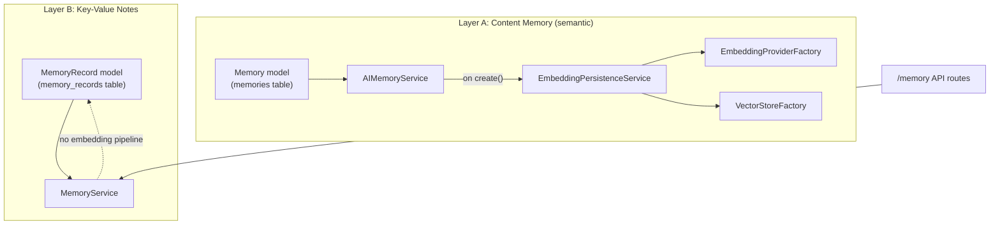

# Memory System

> **See also**: [Memory_Layer_Rationalization.md](Memory_Layer_Rationalization.md) covers the full picture across all five memory-adjacent layers in the platform (Vector Memory, Semantic Memory, Key-Value Memory, Agent Memory, and Conversation Memory — the persisted-chat-history layer, not to be confused with `app/services/ai/conversation/`), including where real duplication exists and merge/separate recommendations. This document focuses specifically on the two layers both still called "Memory."

"Memory" in this codebase refers to **two genuinely separate layers**, not two names for the same thing. Conflating them is the single easiest mistake to make when reading this part of the platform, so this document leads with the distinction.

## The Two Layers



| | Layer A — `Memory` / `AIMemoryService` | Layer B — `MemoryRecord` / `MemoryService` |
|---|---|---|
| Model | `app/models/memory.py` (`memories` table): `id`, `organization_id`, `user_id`, `memory_type`, `title`, `content` (Text) | `app/models/memory_record.py` (`memory_records` table): `id`, `organization_id`, `user_id`, `memory_type`, `key`, `value` (Text) |
| Service | `app/services/ai_memory_service.py` — `AIMemoryService` | `app/services/memory_service.py` — `MemoryService` |
| Embedding/vector-store wired in? | **Yes** — `create_memory()` calls `_persist_embedding()`, which generates and stores an embedding via `EmbeddingPersistenceService`, keyed `VectorId.memory(memory.id)` | **No** — pure CRUD, no embedding pipeline at all |
| Exposed via HTTP? | Not directly routed in `app/api/v1/routes/memory.py` — used internally | Yes — `/memory` routes (`POST`/`GET`/`PATCH`/`DELETE`) use `MemoryService`/`MemoryRecord` exclusively |
| Shape | Free-text `content`, used for semantic retrieval | Structured `key`/`value` note, a simple lookup store |

**In short**: `Memory` is content that gets embedded and becomes semantically searchable; `MemoryRecord` is a simple key/value note with no semantic dimension. The `/memory` HTTP API today only exposes the key/value layer (Layer B) — the content/embedding layer (Layer A) is currently reached only through `AIMemoryService` directly (e.g. by the retrieval pipeline's upstream callers), not through its own route.

## `AIMemoryService` — Public API

```python
class AIMemoryService:
    def __init__(self, db=None, embedding_persistence_service=None): ...
    def create_memory(self, organization_id, content, user_id=None, memory_type="general", title=None) -> Memory: ...
    def get_memory(self, memory_id, organization_id) -> Memory | None: ...
    def list_memories(self, organization_id, skip=0, limit=20): ...
    def update_memory(self, memory_id, organization_id, **fields) -> Memory | None: ...
    def delete_memory(self, memory_id, organization_id) -> bool: ...
```

Embedding persistence on create is **best-effort, not transactional**: if `EmbeddingPersistenceService` construction fails at `__init__` time (missing API key, misconfigured vector store), `_build_embedding_persistence_service()` catches `EmbeddingProviderError`/`VectorStoreError`, logs, and leaves `embedding_persistence_service = None` — memory creation still succeeds, just without an embedding. Likewise, `_persist_embedding()` itself swallows those same exceptions per-call. A `Memory` row can therefore exist with no corresponding vector — this is a deliberate graceful-degradation choice, not an oversight, but it means semantic search coverage over `Memory` rows is not guaranteed to be complete.

## `MemoryService` — Public API

```python
class MemoryService:
    def __init__(self, db=None): ...
    def create(self, key, value, organization_id, memory_type="note") -> MemoryRecord: ...
    def list_for_organization(self, organization_id, skip=0, limit=20): ...
    def update(self, record_id, organization_id, **fields) -> MemoryRecord | None: ...
    def delete(self, record_id, organization_id) -> bool: ...
```

Both services' repositories (`MemoryRepository`, `MemoryRecordRepository`) extend `app.repositories.base.BaseRepository[ModelType]`, adding only `get_by_organization(organization_id, skip, limit)`.

## The Agent-Facing Memory Contract: `AgentMemory`

**File**: `app/services/ai/agents/memory.py`

```python
class AgentMemory(ABC):
    @abstractmethod
    def remember(self, item, **kwargs) -> None: ...
    @abstractmethod
    def retrieve(self, query, **kwargs) -> Any: ...
    @abstractmethod
    def forget(self, item_id) -> None: ...
    @abstractmethod
    def search(self, query, **kwargs) -> Any: ...
```

The contract itself hasn't changed since M16. As of **M20.6**, it has a real concrete implementation — `MemoryAdapter`, below — so "does not assume any agent has working memory semantics" is no longer true unconditionally: `retrieve()`/`search()` were real and working from M20.6; as of **CP-01.2**, `remember()`/`forget()` are real and working too (see below) — all four methods are now fully implemented, with zero change to the ABC's frozen signatures.

## The Concrete `AgentMemory` Implementation: `MemoryAdapter`

**File**: `app/services/ai/agents/specialists/memory_adapter.py`

```python
class MemoryAdapter(AgentMemory):
    def __init__(
        self, pipeline: MemoryRetrievalPipeline | None = None, memory_service: AIMemoryService | None = None
    ): ...

    # Original, MemoryRetrievalPipeline-shaped methods - unchanged since M18:
    def retrieve_memories(self, query, organization_id, limit=10, max_context_tokens=4000) -> ContextPackage: ...
    def retrieve_conversations(self, query, organization_id, limit=10, max_context_tokens=4000) -> ContextPackage: ...
    def retrieve_all(self, query, organization_id, limit=10, max_context_tokens=4000) -> ContextPackage: ...

    # AgentMemory contract - retrieve()/search() added M20.6, remember()/forget() added CP-01.2:
    def retrieve(self, query, **kwargs) -> ContextPackage: ...   # routes to one of the three above by scope=...
    def search(self, query, **kwargs) -> ContextPackage: ...    # delegates to retrieve() - same operation, not a second implementation
    def remember(self, item, **kwargs) -> None: ...              # -> AIMemoryService.create_memory(); returns None per the frozen signature
    def forget(self, item_id: str) -> None: ...                  # item_id = "{organization_id}:{memory_id}" -> AIMemoryService.delete_memory()
```

`MemoryAdapter` is still a thin, direct-passthrough wrapper — no retrieval or write logic was duplicated to satisfy `AgentMemory`. `retrieve(query, **kwargs)` reads an optional `scope` kwarg (`"memories"`, `"conversations"`, or the default `"all"`) and every other kwarg (`organization_id`, `limit`, `max_context_tokens`) passes straight through to whichever of the three [`MemoryRetrievalPipeline`](Retrieval.md)-backed methods matches; `search()` simply calls `retrieve()`.

`remember(item, **kwargs)` (required: `organization_id`; optional: `user_id`, `memory_type` default `"general"`, `title`) coerces `item` to text if it isn't already a string and delegates to `AIMemoryService.create_memory()` — the platform's existing write-path service, never a parallel store. It returns `None`, exactly matching `AgentMemory`'s frozen signature: a caller that needs to later `forget()` what it just remembered finds it again via `retrieve()`/`search()` (whose `ContextItem.resource_id` is that same row's id) rather than being handed one back directly — consistent with this being a semantic-retrieval memory system, not an addressable CRUD store.

`forget(item_id: str)`'s frozen signature has no `organization_id` and no `**kwargs`, but `AIMemoryService.delete_memory()` is tenant-scoped and needs one. `item_id` is therefore the composite string `"{organization_id}:{memory_id}"`, parsed by `MemoryAdapter._parse_item_id()` — reconstructed by a caller from a prior `retrieve()`/`search()` result's `resource_id` plus the organization id it already has from its own execution context. This is a deliberate, documented accommodation of the frozen ABC's real constraint, not a workaround that bypasses it.

`ResearchAgent.memory()` returns this same `MemoryAdapter` instance (previously always `None`), and its internal `_retrieve_memory()` calls `AgentMemory.retrieve()` rather than `MemoryAdapter.retrieve_all()` directly — depending on the abstract contract, not the concrete adapter, per [Research_Agent.md](../05_AGENTS/Research_Agent.md). `PersonalIntelligenceAgent` (CP-01.2, the first agent to actually exercise `remember()`/`forget()`) goes one step further, depending only on `AgentMemory` via its own `PersonalMemoryService` wrapper — see [Personal_Intelligence_Agent.md](../05_AGENTS/Personal_Intelligence_Agent.md).

## Summary of What's Real vs. What's a Contract

| Piece | Status |
|---|---|
| `Memory`/`AIMemoryService` (content + embedding) | Implemented and working, with graceful degradation |
| `MemoryRecord`/`MemoryService` (key/value notes) | Implemented and working, routed via `/memory` |
| `MemoryRetrievalPipeline` (semantic retrieval over `Memory`) | Implemented and working — see [Retrieval.md](Retrieval.md) |
| `MemoryAdapter` (`AgentMemory` implementation) | Fully implemented as of **CP-01.2**: `retrieve()`/`search()` (M20.6) and `remember()`/`forget()` (CP-01.2) all real and working |
| `AgentMemory` ABC | Contract unchanged since M16; now has one real, complete implementation |
