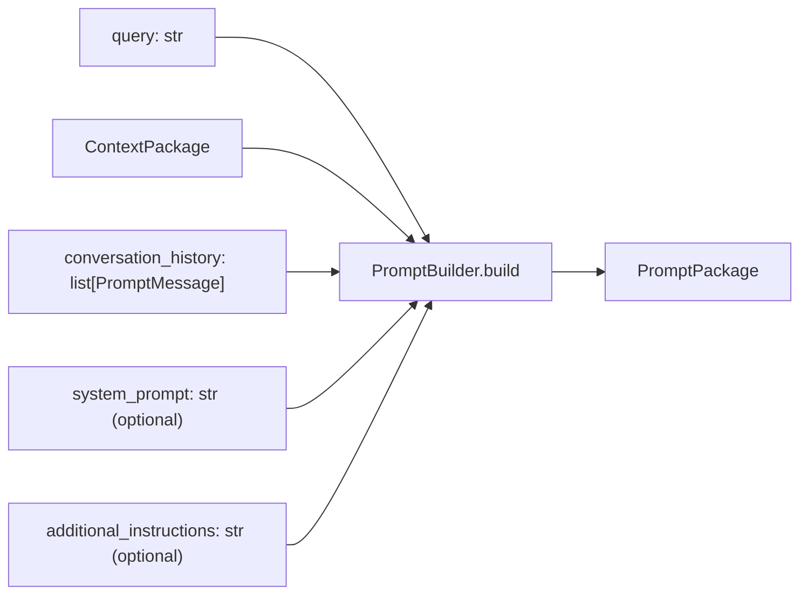
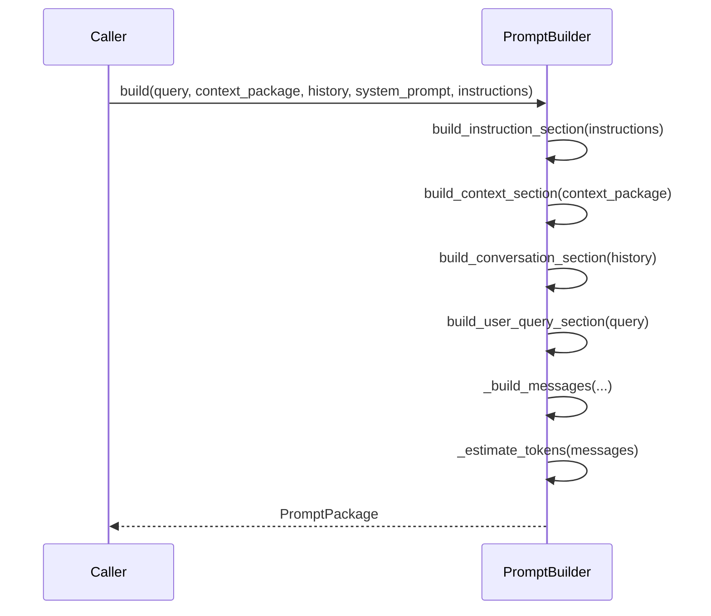

# Prompt Builder

`app/services/prompt_builder/` turns a query, retrieved context, and conversation history into the final `PromptPackage` a `ConversationProvider` consumes. It is a deterministic, pure transform — it has no LLM, database, ranking, or embedding dependency of any kind.

## Purpose

Every other stage in the retrieval pipeline (semantic search, ranking, context building) produces structured data. Something has to turn that structured data into the actual text a language model reads. That is the Prompt Builder's entire job, and nothing else — it does not call a provider, it does not retrieve anything, and it does not rank anything.

## Architecture



- `types.py` — `PromptMessage` (`role`, `content`), `PromptSection` (`title`, `content` — a human-inspectable logical section, distinct from a chat message), `PromptPackage` (`system_prompt`, `messages`, `sections`, `estimated_tokens`, `prompt_version`, `context_item_count`).
- `builder.py` — `PromptBuilder`, the single class in this package. No factory, no ABC — there is exactly one `PromptBuilder`.
- `sections.py` — pure functions building each `PromptSection` (`build_instruction_section`, `build_context_section`, `build_conversation_section`, `build_user_query_section`).
- `templates.py` — plain string constants only (`DEFAULT_SYSTEM_PROMPT`, `MEMORY_CONTEXT_HEADER`, `CONVERSATION_HEADER`, `USER_QUERY_HEADER`, `SAFETY_HEADER`). This is not a templating engine — no Jinja2, no `string.Template`, no f-string interpolation logic beyond simple concatenation.
- `renderers.py` — `render_messages(package) -> list[dict[str, str]]` (provider-agnostic `{"role", "content"}` dicts) and `render_text(package) -> str` (one flat text block).

## Public API

```python
class PromptBuilder:
    def build(
        self,
        query: str,
        context_package: ContextPackage,
        conversation_history: list[PromptMessage] | None = None,
        system_prompt: str | None = None,
        additional_instructions: str | None = None,
    ) -> PromptPackage: ...
```

Internally, `_build_messages()` assembles messages in a fixed order: **System → History → Context (if any) → User Query**. `_estimate_tokens()` uses the same `len(content) // 4` heuristic as the Context Builder's `BudgetStage` — a deliberately simple, consistent approximation used everywhere in this pipeline rather than a real tokenizer.

## Lifecycle



## Dependencies

`app.services.context.types.ContextPackage` — the input type produced by the [Context Builder](Retrieval.md#context-builder). Nothing else. This is a deliberately narrow dependency footprint: the Prompt Builder never needs to know how context was retrieved or ranked, only its final, already-assembled shape.

## Consumers

`ExecutiveAgent` (`agents/executive/executive_agent.py`) is the concrete consumer today: it holds a `PromptBuilder` instance and calls `.build(query, context_package, conversation_history=...)`, where `context_package` comes from the [Memory Retrieval Pipeline](Retrieval.md) (typically via `MemoryAdapter`). The resulting `PromptPackage` is what eventually becomes `RuntimeRequest.prompt_package` for an `AIRuntime.execute()` call.

## Extension Points

- **A different `PromptPackage` assembly order** — `_build_messages()`'s System/History/Context/Query ordering is hardcoded, not configurable. A caller needing a different order would currently need a different builder, not a parameter.
- **A real tokenizer** — the `len(content) // 4` heuristic is shared with the Context Builder's `BudgetStage`; replacing it would need to happen in both places to stay consistent, since nothing currently centralizes it.
- **Provider-specific rendering** — `renderers.py`'s `render_messages()` already produces provider-agnostic `{"role", "content"}` dicts; a provider needing a different shape (e.g. a single concatenated string with role markers) would use `render_text()` or add a new renderer function here, not modify `PromptBuilder` itself.
