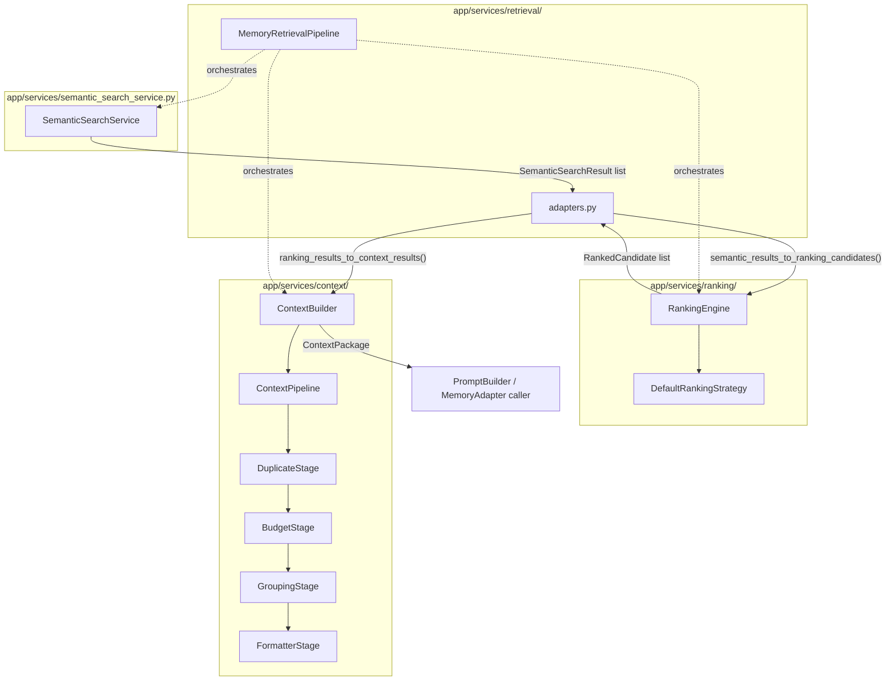
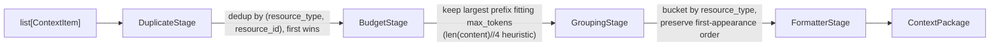
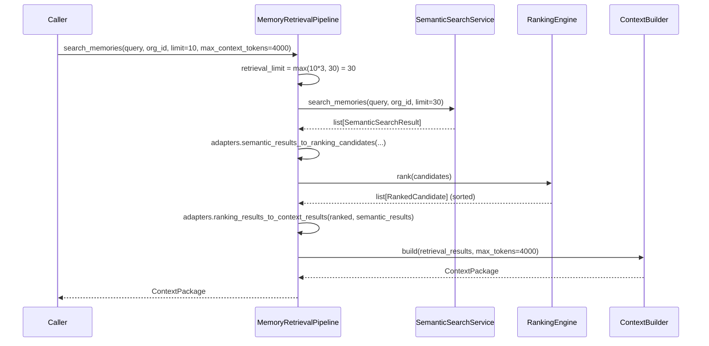

# Retrieval

> **See also**: [Memory_Layer_Rationalization.md](Memory_Layer_Rationalization.md) places this "Semantic Memory" pipeline in context alongside Vector Memory, Key-Value Memory, Agent Memory, and Conversation Memory — the platform's four other memory-adjacent layers.

This document covers the full path from a raw query to a token-budgeted `ContextPackage`: `SemanticSearchService` → `RankingEngine` → `ContextBuilder`, glued together by `app/services/retrieval/`.

## Purpose

Three packages exist independently and deliberately do not import each other: semantic search (vector similarity), ranking (scoring/ordering), and context building (deduplication/budgeting/grouping/formatting). `app/services/retrieval/` is the **only** place that translates between their distinct types and actually chains them together. This keeps each stage independently testable and reusable — `ContextBuilder` in particular has no idea where its input came from.

## Architecture



## `SemanticSearchService`

**File**: `app/services/semantic_search_service.py`

```python
class SemanticSearchService:
    def __init__(self, db=None, embedding_service=None, vector_store=None,
                 memory_repository=None, conversation_message_repository=None): ...
    def search_memories(self, query, organization_id, limit=10) -> list[SemanticSearchResult]: ...
    def search_conversation_messages(self, query, organization_id, limit=10) -> list[SemanticSearchResult]: ...
    def search_all(self, query, organization_id, limit=10) -> list[SemanticSearchResult]: ...
```

Embeds the query via `EmbeddingService`, searches the `VectorStore` (`PgVectorStore` by default, Euclidean-distance ordered), then hydrates matches back into full `SemanticSearchResult` records via the relevant repository. Errors are **not** swallowed here — they propagate unhandled, unlike the more defensive `AIMemoryService`.

## `RankingEngine`

**File**: `app/services/ranking/`

```python
class RankingStrategy(ABC):
    @abstractmethod
    def score(self, candidate: RankingCandidate) -> float: ...  # higher = better

class DefaultRankingStrategy(RankingStrategy):
    def __init__(self, similarity_weight=0.7, recency_weight=0.3, recency_half_life_days=30.0): ...

class RankingEngine:
    def __init__(self, strategy: RankingStrategy | None = None): ...  # defaults to DefaultRankingStrategy
    def rank(self, candidates: list[RankingCandidate]) -> list[RankedCandidate]: ...  # sorted descending by score
```

`DefaultRankingStrategy` blends two components: similarity (`1 / (1 + euclidean_distance)`) and recency (exponential decay by age against a half-life). Purely in-memory — no DB or repository coupling, which is exactly what makes it independently unit-testable.

## `ContextBuilder`

**File**: `app/services/context/`

```python
class ContextBuilder:
    def __init__(self, pipeline: ContextPipeline | None = None): ...
    def build(self, ranked_results: list[RankedResult], max_tokens: int = 4000) -> ContextPackage: ...
```

`RankedResult` is a `typing.Protocol` (structural typing) — `ContextBuilder` accepts anything with `resource_type`/`resource_id`/`content`/`score`/`created_at`/`metadata` attributes, without importing `ranking.types.RankedCandidate` at all. The default pipeline runs four stages in order:



`ContextPipeline` itself is generic — it just runs `stage.process(data)` for each `PipelineStage` in order, feeding output forward; it has no knowledge of what the concrete stages do.

## `MemoryRetrievalPipeline` — The Orchestrator

**File**: `app/services/retrieval/memory_retrieval_pipeline.py`

```python
class MemoryRetrievalPipeline:
    def __init__(self, semantic_search_service=None, ranking_engine=None, context_builder=None): ...
    def search_memories(self, query, organization_id, limit=10, max_context_tokens=4000) -> ContextPackage: ...
    def search_conversation_messages(self, query, organization_id, limit=10, max_context_tokens=4000) -> ContextPackage: ...
    def search_all(self, query, organization_id, limit=10, max_context_tokens=4000) -> ContextPackage: ...
```

Internally, `_search()` **over-fetches** before ranking: `retrieval_limit = max(limit * 3, 30)` — enough raw candidates that ranking has real signal to work with before the final `limit` is applied downstream. This is the one class that actually calls all three collaborators in sequence.

## `adapters.py` — The Only Glue

```python
def semantic_results_to_ranking_candidates(semantic_results) -> list[RankingCandidate]: ...
def ranking_results_to_context_results(ranked_candidates, semantic_results) -> list[RetrievalResult]: ...
```

Pure, stateless conversion functions. The second one re-attaches `content` (dropped by the first conversion, since `RankingCandidate` doesn't carry it) by matching `(resource_type, resource_id)` back against the original semantic results, and carries forward ranking's blended `score` rather than the original similarity score.

## Lifecycle



## Consumers

`MemoryAdapter` (`agents/specialists/memory_adapter.py`) wraps `MemoryRetrievalPipeline` for specialist consumption — see [Memory_System.md](Memory_System.md). The resulting `ContextPackage` is what `PromptBuilder.build()` consumes to assemble the final `PromptPackage` — see [Prompt_Builder.md](Prompt_Builder.md).

## Extension Points

- A new ranking strategy: subclass `RankingStrategy`, pass it to `RankingEngine(strategy=...)` — no change needed to `MemoryRetrievalPipeline` or `ContextBuilder`.
- A new context stage: subclass `PipelineStage`, insert it into a custom `ContextPipeline` passed to `ContextBuilder(pipeline=...)`.
- A new retrieval source beyond memories/conversation messages: would need its own method on `SemanticSearchService` plus a corresponding method on `MemoryRetrievalPipeline` — there is no generic "search anything" entry point today.
