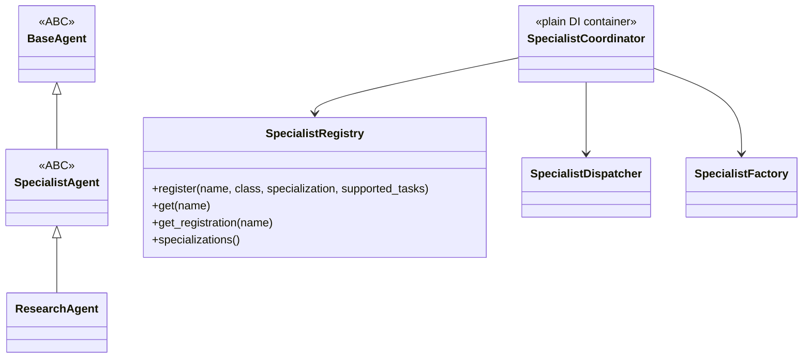

# Specialist Framework

`app/services/ai/agents/specialists/` (M18) is the extension point for adding new specialist agents. It exists specifically so adding "Learning Agent" or "Finance Agent" (see [Roadmap.md](../00_OVERVIEW/Roadmap.md)) is a matter of implementing one class and registering it — not building a new execution engine.

## Purpose

`agents/` (the general Agent Framework) provides `BaseAgent`, a fully abstract, general-purpose contract. Specialists need more than that in common: a standard request/response/result shape, a standard way to reach Memory/Tools/Runtime without depending on their full APIs directly, and a registry that can answer routing questions ("which specialist handles this task type") without instantiating every registered specialist. The Specialist Framework provides exactly that shared layer, once, so `ResearchAgent` (and future specialists) don't each reinvent it.

## Architecture



- `specialist_agent.py` — `SpecialistAgent(BaseAgent)`, an ABC (this file exists specifically to hold it, beyond the shared value objects).
- `shared/` — `SpecialistTask`, `SpecialistRequest`, `SpecialistResponse`, `SpecialistResult`, `SpecialistExecutionPolicy`, `SpecialistContext`, and `aggregate_metrics()`.
- `planner.py` — `SpecialistPlanner`, extending `AgentPlanner`.
- `memory_adapter.py` / `tool_adapter.py` / `runtime_adapter.py` — thin wrappers around `MemoryRetrievalPipeline`, `ToolExecutor`, and `AIRuntime` respectively; each retrieval method body is a direct, one-line delegating call, verified via source inspection in tests. As of M20.6, `MemoryAdapter` also implements `AgentMemory` (`agents/memory.py`) — see [Memory_System.md](Memory_System.md).
- `registry.py` — `SpecialistRegistry`, extending `GenericProviderRegistry[str, SpecialistRegistration]`.
- `dispatcher.py` — `SpecialistDispatcher`.
- `factory.py` — `SpecialistFactory`.
- `coordinator.py` — `SpecialistCoordinator`, a plain dependency-injection container with zero methods of its own (verified by test).

## Registration-Time Metadata (Not Instance Introspection)

`SpecialistRegistry.register()` requires `specialization: str` and `supported_tasks: frozenset[SpecialistTaskType]` as explicit keyword arguments at registration time:

```python
SpecialistRegistry.register(
    "research",
    ResearchAgent,
    specialization="research",
    supported_tasks={SpecialistTaskType.RESEARCH},
)
```

This is a deliberate architectural improvement over the original `AgentRegistry` design (used by `executive/dispatcher.py`), which needed an actual agent *instance* to answer "what can this agent do" (since capability declaration is an instance method on `BaseAgent`). Requiring specialization/supported_tasks once, at registration — exactly when a specialist class already knows its own identity — means `SpecialistDispatcher` can answer routing questions directly from the registry, with no instantiation anywhere in the routing path. `ToolRegistry` uses this identical pattern for tools (category/capabilities/permissions) — see [Shared_Infrastructure.md](../01_ARCHITECTURE/Shared_Infrastructure.md).

## Execution Policy — A Real Wiring Fix

`SpecialistExecutionPolicy` declares `retry_policy: RetryPolicy`, `timeout_seconds: float | None`, and `maximum_depth: int`. During the M18 build, these were declared but never actually consumed by tool execution — a real gap, closed by having `ResearchAgent` build a policy-configured `ToolExecutor` by default rather than an unconfigured one. This is called out here because it's exactly the kind of "policy exists as a value object but nothing reads it" mistake worth watching for when adding a second specialist.

## Adapters: Why They Exist

`MemoryAdapter`, `ToolAdapter`, `RuntimeAdapter` are deliberately thin — each wraps one collaborator (`MemoryRetrievalPipeline`, `ToolExecutor`, `AIRuntime`) with a narrower interface, so a specialist depends on a small, fakeable seam instead of the collaborator's full API and its transitive dependencies (a `ToolExecutor` pulls in the whole Tool Framework; a `MemoryRetrievalPipeline` pulls in the whole retrieval stack including DB access). Test doubles for a specialist's dependencies are therefore small hand-written fakes of the adapter, not of the underlying subsystem.

## Dependencies

`agents/` (`BaseAgent`, `AgentPlanner`), `tools/` (via `ToolAdapter`), `runtime/` (via `RuntimeAdapter`), `retrieval/` (via `MemoryAdapter`), `shared/`, `kernel/` (`RetryPolicy`). Never `agents/executive/` or a specific specialist by name — see [Dependency_Rules.md](../01_ARCHITECTURE/Dependency_Rules.md).

## Extension Points

Adding a new specialist means: implement `SpecialistAgent`, define its own `SpecialistPlanner` if its planning needs differ from the default, and self-register via `SpecialistRegistry.register(...)` with its own `specialization`/`supported_tasks`. See [Adding_Agent.md](../06_DEVELOPMENT/Adding_Agent.md) for the concrete steps, and [Research_Agent.md](../05_AGENTS/Research_Agent.md) for the one worked example that exists today.
