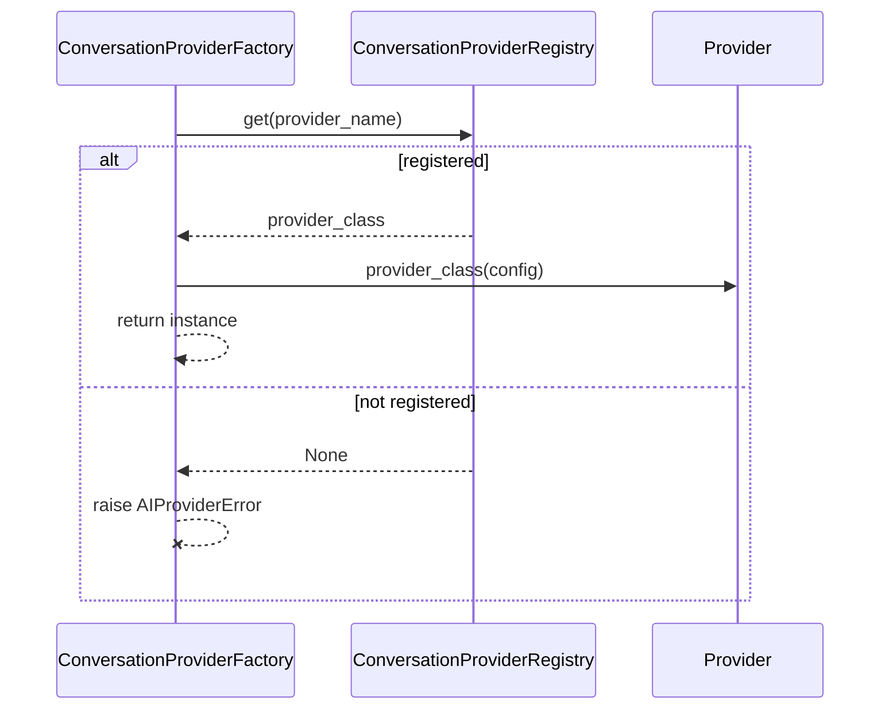

# Conversation Framework

`app/services/ai/conversation/` is the provider contract for the platform's first and most fundamental capability: talking to a language model. It is the template every later capability framework (Vision) explicitly followed.

## Purpose

Give the platform one provider-agnostic way to "generate a response from a prompt," regardless of vendor. No framework code above this layer (`Runtime`, `Agent`, `Executive`) ever references a vendor by name — only `ProviderName` and the `ConversationProvider` contract.

## Architecture

```
Agent → Runtime (AIRuntime/RuntimeExecutor) → ConversationProviderFactory → ConversationProvider (abstract) → vendor implementation
```

This is the shape [Vision_Framework.md](Vision_Framework.md) explicitly mirrors — `Agent → Vision Framework → Vision Provider → implementation` — because it proved out first here.

## `ConversationProvider` — The Contract

```python
class ConversationProvider(ABC):
    contract_version: ClassVar[str] = "1.0"

    @abstractmethod
    def generate(self, prompt_package: PromptPackage) -> ConversationResponse: ...
    @abstractmethod
    def health_check(self) -> bool: ...
    @property
    @abstractmethod
    def provider_name(self) -> ProviderName: ...
    @property
    @abstractmethod
    def model_name(self) -> str: ...

    # Concrete, safe defaults — overridable, not required:
    def initialize(self) -> None: ...          # no-op
    def shutdown(self) -> None: ...             # no-op
    def capabilities(self) -> ProviderCapabilities: ...   # all-conservative default
    def metadata(self) -> ProviderMetadata: ...
    async def stream(self, prompt_package: PromptPackage) -> AsyncIterator[ConversationStreamChunk]:
        raise StreamingError(f"{self.provider_name} does not support streaming")  # default
```

This abstract/concrete split — four required members, four optional-with-safe-defaults members — is the exact template `BaseVisionProvider` copies for Vision. Streaming has a default that explicitly opts a provider *out* until it overrides `stream()`, rather than silently no-op-ing.

## Value Objects

```python
@dataclass(frozen=True)
class ConversationResponse:
    text: str
    response: ProviderResponse   # provider/model/finish_reason/usage/raw_response via delegating properties

@dataclass(frozen=True)
class ConversationStreamChunk:
    delta: str
    provider: ProviderName
    model: str
    finish_reason: FinishReason | None = None
    usage: UsageDetails | None = None
    raw_response: object | None = None
```

`ConversationResponse` deliberately does **not** carry `execution_id`/`correlation_id`/etc. — those belong one layer up, on `RuntimeResponse` (see [Identity_Model.md](../02_KERNEL/Identity_Model.md)). A `ConversationResponse` is what a provider produced; a `RuntimeResponse` is what the platform's execution of that request produced, including everything about *how* it was executed.

## Registry & Factory

```python
class ConversationProviderRegistry(GenericProviderRegistry[ProviderName, type[ConversationProvider]]):
    _registration_error = AIProviderError

class ConversationProviderFactory(BaseProviderFactory[ConversationProvider, ConversationProviderConfig]):
    @staticmethod
    def create(provider_name: ProviderName, config: ConversationProviderConfig | None = None) -> ConversationProvider: ...
```

Both are now built on the platform's shared generics (`GenericProviderRegistry`, `BaseProviderFactory`) — see [Shared_Infrastructure.md](../01_ARCHITECTURE/Shared_Infrastructure.md) and [ADR-0002](../ADR/ADR-0002.md). `create()` raises `AIProviderError` when nothing is registered for `provider_name` — as of M19, **that is every call**, since no concrete conversation provider exists in this codebase yet.

## Lifecycle

Execution lifecycle (retry/timeout/middleware/events) is entirely the Runtime's responsibility, not this package's — see [Runtime.md](../02_KERNEL/Runtime.md). This package's own "lifecycle" is simpler: resolve → construct → call.



## Dependencies

`shared/` (`GenericProviderRegistry`, `BaseProviderFactory`, `AIProviderError`, `ProviderResponse`/`UsageDetails`/`FinishReason`), `providers/` (`ProviderName`), `prompt_builder/` (`PromptPackage`). Never `runtime/` — see [Dependency_Rules.md](../01_ARCHITECTURE/Dependency_Rules.md).

## Extension Points

Adding a real provider (e.g. OpenAI) means: implement `ConversationProvider` in a new module (its own vendor SDK/HTTP calls stay entirely inside that module), then call `ConversationProviderRegistry.register(ProviderName.OPENAI, OpenAIConversationProvider)` — typically at import time. No change to `ConversationProviderFactory`, `AIRuntime`, or `RuntimeExecutor` is ever required. See [Adding_Provider.md](../06_DEVELOPMENT/Adding_Provider.md).
