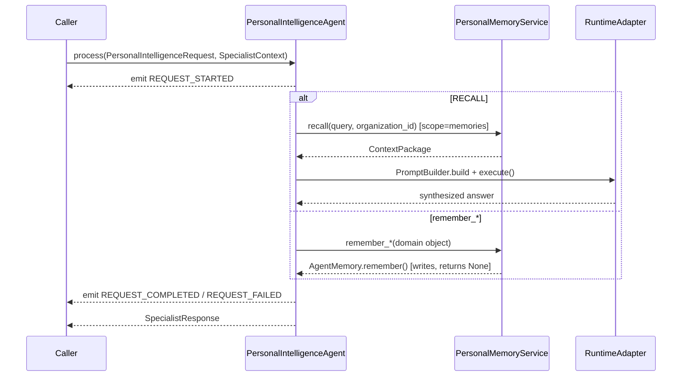
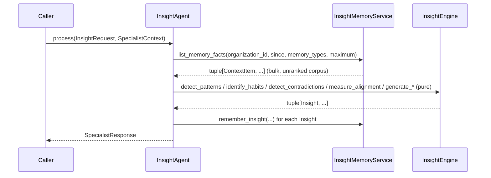

# Personal Intelligence Pack (CP-01)

`app/services/ai/agents/specialists/personal_intelligence/` (CP-01.2 Phase 3 v1, extended by CP-01.3 Phase 4) is the platform's first Capability Pack — two `SpecialistAgent`s built entirely on the frozen AI Operating System (M20.7): `PersonalIntelligenceAgent`, giving each user a durable, retrievable model of who they are (identity, long-term goals, projects, reflections, preferences), and `InsightAgent`, the Executive Cognition & Insight Engine that turns those stored memories into recognized patterns, habits, contradictions, goal alignment, periodic reflections, proactive recommendations, and an evolving profile. See [PRD.md](../08_CAPABILITY_PACKS/CP-01_Personal_Intelligence_Pack/PRD.md), [Architecture.md](../08_CAPABILITY_PACKS/CP-01_Personal_Intelligence_Pack/Architecture.md), [Implementation.md](../08_CAPABILITY_PACKS/CP-01_Personal_Intelligence_Pack/Implementation.md) (Phase 3), and [Implementation_Insight_Engine.md](../08_CAPABILITY_PACKS/CP-01_Personal_Intelligence_Pack/Implementation_Insight_Engine.md) (Phase 4) for the full record.

## Design Philosophy

CP-01 is the reference Capability Pack — the template `Capability_Strategy.md` describes every future pack (Finance, Trading, Marketing, ...) following: one or more `SpecialistAgent`s, registered into the existing registries, reusing `AgentMemory`/`RuntimeAdapter`/`PromptBuilder`/`SharedExecutionContext` without modification. It never introduces a second memory system, a second execution model, or a second identity model — every fact it stores is an ordinary `Memory` row (see [Memory_System.md](../03_INTELLIGENCE/Memory_System.md)), tagged with a pack-namespaced `memory_type` (`personal_identity`, `personal_goal`, `personal_project`, `personal_reflection`, `personal_preference`).

## Package Structure

```
personal_intelligence/
    shared/           types.py, identity.py, goal.py, project.py, reflection.py, preference.py, request.py, insight.py
    memory_service.py PersonalMemoryService — thin AgentMemory wrapper, remember_*()/recall()
    policies.py       PersonalIntelligencePolicy (default_recall_limit, default_max_context_tokens, minimum_confidence)
    state.py          PersonalIntelligenceState, PersonalIntelligenceStateMachine
    events.py         PersonalIntelligenceEventType, PersonalIntelligenceEvent, PersonalIntelligenceEventPublisher
    context.py        build_personal_intelligence_context()
    planner.py        PersonalIntelligencePlanner
    personal_intelligence_agent.py   PersonalIntelligenceAgent(SpecialistAgent)
    insight/          NEW (CP-01.3) - a second, sibling specialist nested in the same pack
        engine.py         InsightEngine — pure, deterministic pattern/habit/contradiction/alignment/synthesis
        memory_service.py InsightMemoryService — AgentMemory (write/recall) + AIMemoryService (bulk corpus read)
        policies.py       InsightPolicy
        state.py          InsightState, InsightStateMachine
        events.py         InsightEventType, InsightEvent, InsightEventPublisher
        context.py        build_insight_context()
        planner.py        InsightPlanner
        request.py        InsightOperation (8 members), InsightRequest
        insight_agent.py  InsightAgent(SpecialistAgent)
```

Structurally identical to `agents/specialists/research/` — same file roles, same "no new context type, no new adapter type" discipline. `insight/` nests inside `personal_intelligence/` rather than becoming a sibling top-level specialist package specifically so it inherits the existing `agents.specialists.personal_intelligence` dependency boundary automatically (longest-prefix match in `app/tests/architecture/dependency_rules.py`) — no new boundary entry was needed for this phase. See [Personal_Intelligence_Agent.md](../05_AGENTS/Personal_Intelligence_Agent.md) and [Insight_Agent.md](../05_AGENTS/Insight_Agent.md) for the two agents themselves.

## Domain Model

Every domain object is a frozen dataclass with a `memory_type` class attribute and a `to_memory_content() -> str` method — the only "structured storage" this pack has, since `Memory` has no metadata column (see [Memory_System.md](../03_INTELLIGENCE/Memory_System.md)):

| Type | Fields | Memory type |
|---|---|---|
| `IdentityFact` | `attribute: IdentityAttribute` (10-member enum: name, preferred_name, timezone, language, location, occupation, interests, communication_style, preferred_ai_personality, preferred_response_style), `value` | `personal_identity` |
| `Goal` | `title, description, category, priority, progress (0-100), status (active/paused/completed/abandoned)` | `personal_goal` |
| `GoalProgressUpdate` | `goal_title, note, new_progress, new_status` — a new, append-only memory, never an edit to the original `Goal` | `personal_goal` |
| `Project` | `name, objective, milestones, progress (0-100), active` | `personal_project` |
| `Reflection` | `content, period (daily/weekly/ad_hoc), lessons` | `personal_reflection` |
| `Preference` | `statement, category` | `personal_preference` |

`PersonalIntelligenceRequest` (`shared/request.py`) — not a duplicate of the shared `SpecialistRequest` — carries the typed hints (`operation`, `title`, `text`, `category`, `priority`, `progress`, `status`, `milestones`, `lessons`) CP-01's write-side operations need, following the same "build a pack-local request type when the shared generic doesn't fit" pattern `VisionRequest` already established.

## Execution Lifecycle



Full flow (including the always-idempotent `PersonalIntelligenceStateMachine` cycle) in [Implementation.md](../08_CAPABILITY_PACKS/CP-01_Personal_Intelligence_Pack/Implementation.md#6-execution-flow).

## Events

`PersonalIntelligenceEventType`: `REQUEST_STARTED`, `CONTEXT_RETRIEVED`, `IDENTITY_REMEMBERED`, `GOAL_REMEMBERED`, `GOAL_PROGRESS_UPDATED`, `PROJECT_REMEMBERED`, `REFLECTION_REMEMBERED`, `PREFERENCE_REMEMBERED`, `RECALL_COMPLETED`, `REQUEST_COMPLETED`, `REQUEST_FAILED`. Built on the shared `GenericEvent`/`EventPublisher` base (`app/services/ai/shared/events.py`) — not a new event mechanism. See [Event_System.md](../02_KERNEL/Event_System.md).

## Executive Integration: Automatic, Not Delegated

CP-01's headline property — the Executive surfaces personal context in ordinary conversation without ever delegating to `PersonalIntelligenceAgent` — is a direct consequence of both agents reading and writing the same `Memory` table, not a new integration mechanism. `PersonalIntelligenceAgent` deliberately does **not** declare `AgentCapability.MEMORY`, so `Dispatcher` never routes `ExecutivePlanner`'s built-in `retrieve_memory` task to it (which would break the Executive's internal flow, since a `SpecialistResponse` doesn't fit where a `ContextPackage` is expected). Full accounting: [Implementation.md §8](../08_CAPABILITY_PACKS/CP-01_Personal_Intelligence_Pack/Implementation.md#8-executive-integration--automatic-zero-executive-change).

## Insight Engine (CP-01.3, Phase 4): Executive Cognition

`InsightAgent` turns the memories `PersonalIntelligenceAgent` (or the user, or ordinary conversation) has already written into durable, explainable understanding, without a new memory store and without changing retrieval behavior. Eight operations (`InsightOperation`): `analyze_patterns`, `identify_habits`, `detect_contradictions`, `measure_alignment`, `generate_periodic_reflection`, `generate_recommendations`, `update_profile`, `recall_insights`.

Detection is **deterministic, never an LLM call** — `InsightEngine` (`insight/engine.py`) is a pure, no-I/O class, the same "same input, same output" discipline `ResearchSynthesizer` established. This is what makes "every generated insight must be traceable back to supporting memories rather than invented" true by construction: a rule-based term-frequency/negation-window heuristic cannot hallucinate a memory that was never there.



Every `Insight` (`shared/insight.py`) carries `basis: OBSERVED | INFERRED` (an `INFERRED` insight structurally requires a `conclusion`, kept visibly separate from `observation`) and `supporting_memory_ids: tuple[int, ...]` — the exact `Memory` row ids it was computed from. `memory_type = "personal_insight"`, deliberately excluded from the corpus a later analysis pass reads, preventing the engine from re-analyzing its own prior output.

`InsightMemoryService` reads two ways: `AgentMemory.retrieve()` (semantic, scoped — for `recall_insights` and every `remember_insight` write, identical mechanism to `PersonalMemoryService`) and `AIMemoryService.list_memories()` (bulk, paginated — for the raw analysis corpus, since pattern/habit/contradiction/alignment detection needs the actual set of a user's memories, not a relevance-ranked slice of one query). The second is an **already-existing, unmodified** `AIMemoryService` method — `MemoryAdapter` already depends on the same collaborator for its write path — reused for a second capability it already had, never a new query parameter or a new store.

Executive integration is the identical mechanism as `PersonalIntelligenceAgent`'s: `InsightAgent` does not declare `AgentCapability.MEMORY`, so a generated recommendation or profile summary surfaces in ordinary Executive conversation automatically, with zero delegation. Proven by `test_insight_executive_integration.py`'s full pipeline test: `PersonalIntelligenceAgent` writes memories → `InsightAgent` (unaware of it) detects a pattern → `ExecutiveAgent` (unaware of either) surfaces the result. Full detail: [Implementation_Insight_Engine.md](../08_CAPABILITY_PACKS/CP-01_Personal_Intelligence_Pack/Implementation_Insight_Engine.md).

## What CP-01 Reuses vs. Introduces

| Reused directly (never duplicated) | Introduced new, CP-01-specific |
|---|---|
| `AgentMemory`/`MemoryAdapter`/`MemoryRetrievalPipeline`/`AIMemoryService` (write path completed CP-01.2; `list_memories()` reused unmodified, CP-01.3) | `PersonalIntelligenceRequest`/`PersonalIntelligenceOperation`, `InsightRequest`/`InsightOperation` (no shared type fit) |
| `RuntimeAdapter`/`AIRuntime`, `PromptBuilder` | Domain value objects (`Goal`, `Project`, `Reflection`, `Preference`, `IdentityFact`, `Insight`) |
| `SpecialistAgent`/`SpecialistCoordinator`/`SpecialistContext`/`SpecialistRegistry`/`AgentRegistry` | `PersonalIntelligencePolicy`/`InsightPolicy`, `PersonalIntelligenceState(Machine)`/`InsightState(Machine)`, `PersonalIntelligenceEvent(Publisher)`/`InsightEvent(Publisher)`, `PersonalIntelligencePlanner`/`InsightPlanner` — all structurally identical to Research's equivalents, narrowed to this pack's domain |
| `SharedExecutionContext`, `GenericEvent`/`EventPublisher` | `memory_type` namespacing convention (`personal_*`, including `personal_insight`) for future-pack collision avoidance |

## Dependencies

`agents/`, `agents/specialists/`, `tools/` (via `ToolAdapter`, unused by any v1 journey), `runtime/`, `kernel/` (`ExecutionMetrics`), `providers/`, `shared/`. Same allowed set as `agents.specialists.research`, enforced by `app/tests/architecture/dependency_rules.py` — `insight/` nests inside the pack's existing boundary, requiring no new entry. Never `vision/`, never another pack's concrete types (see [Capability_Strategy.md](../08_CAPABILITY_PACKS/Capability_Strategy.md)'s Pack Independence rule). See [Dependency_Rules.md](../01_ARCHITECTURE/Dependency_Rules.md).

## Testing

CP-01.2 (Phase 3): 146 tests under `app/tests/personal_intelligence/`, plus 10 in `app/tests/test_memory_adapter.py` for the `remember()`/`forget()` write-path completion that phase required — 156 total. CP-01.3 (Phase 4): 171 more under `app/tests/personal_intelligence/insight/` — domain-model validation/rendering, every `InsightEngine` algorithm (threshold behavior, determinism, exact traceability), `InsightMemoryService` (both read paths), policy/state/event/context/planner behavior, full `InsightAgent` operation dispatch (all 8 operations), and `test_insight_executive_integration.py`, including the full `PersonalIntelligenceAgent → InsightAgent → ExecutiveAgent` pipeline proof. **2368 tests passing platform-wide** after CP-01.3, zero regressions across both phases.

## Known Limitations (v1)

- Only Identity, Goal, Project, Reflection, Preference, and (CP-01.3) pattern/habit/contradiction/alignment/reflection/recommendation/profile Insight intelligence are implemented — Decision, Learning, Communication, Business, Productivity, Relationship, Knowledge, and Life Intelligence (Architecture.md §3) are explicitly out of scope for these phases.
- Neither `PersonalIntelligenceAgent` nor `InsightAgent` is yet wired into a live, request-routing `ExecutiveAgent` deployment for explicit ("remember that...", "give me my weekly reflection") delegation — only the automatic, shared-memory retrieval path is exercised end to end today. See [Implementation.md §10](../08_CAPABILITY_PACKS/CP-01_Personal_Intelligence_Pack/Implementation.md#10-open-items-intentionally-deferred) and [Implementation_Insight_Engine.md §10](../08_CAPABILITY_PACKS/CP-01_Personal_Intelligence_Pack/Implementation_Insight_Engine.md#10-open-items-intentionally-deferred).
- No wall-clock/cron trigger exists for periodic reflections — `InsightAgent` can produce one for a given period on request; nothing schedules that call automatically yet.
- Goal progress history is append-only (no "current progress" query) — matches the platform's semantic-retrieval-only memory model, not a gap.
- Contradiction/pattern detection is intentionally coarse (no stemming, no synonym awareness) — false negatives are expected and documented; the engine never produces a false positive that isn't traceable to an exact term match.
- No concrete `ConversationProvider` exists platform-wide yet; built and tested against fakes, as every specialist in this platform is.
