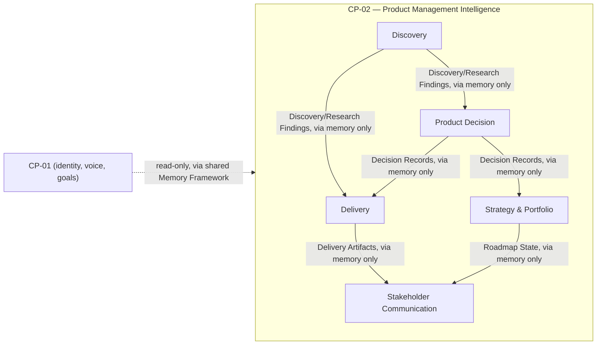
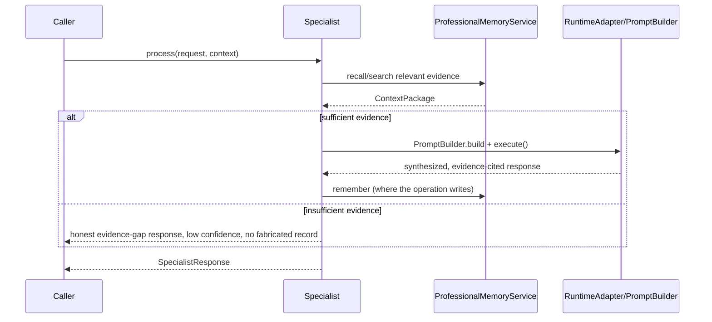

# Product Management Intelligence Pack (CP-02)

`app/services/ai/agents/specialists/product_management/` is the platform's second Capability Pack — five `SpecialistAgent`s built entirely on the frozen AI Operating System (M20.7) and on [CP-01](Personal_Intelligence_Pack.md), the first pack specified to build explicitly on top of another Capability Pack rather than the platform alone. See [PRD.md](../08_CAPABILITY_PACKS/CP-02_Product_Management_Intelligence_Pack/PRD.md), [Architecture.md](../08_CAPABILITY_PACKS/CP-02_Product_Management_Intelligence_Pack/Architecture.md), [ARR.md](../08_CAPABILITY_PACKS/CP-02_Product_Management_Intelligence_Pack/ARR.md), [Implementation_Plan.md](../08_CAPABILITY_PACKS/CP-02_Product_Management_Intelligence_Pack/Implementation_Plan.md), and [Production_Readiness_Report.md](../08_CAPABILITY_PACKS/CP-02_Product_Management_Intelligence_Pack/Production_Readiness_Report.md) for the full record.

This document is written for authors of a *future* Capability Pack (Career Intelligence, Enterprise Intelligence, Startup Intelligence, and others named in [BACKLOG.md](../BACKLOG.md)) who need to know what CP-02 is, what it guarantees, and what it deliberately does not do — without reading its implementation. It contains no code and no implementation detail; for that, see [Adding_Product_Management_Specialists.md](../06_DEVELOPMENT/Adding_Product_Management_Specialists.md) and the five specialists' own source.

## Purpose

CP-02 gives a product manager a durable, evidence-grounded model of their professional practice: what problems are validated, what's been decided and why, what's being delivered, what the roadmap and strategy are, and how that gets communicated to stakeholders. It is the professional analogue of CP-01's personal model — the same relationship "professional intelligence builds on personal intelligence" that Master Blueprint §14 describes.

Every output CP-02 produces is either a durable memory (a finding, a decision, an artifact, a roadmap entry) or an ordinary drafted response — never an autonomous action. Nothing is sent, executed, or applied on the user's behalf. CP-02 reasons and drafts; the user decides and acts.

## Responsibilities

CP-02 owns exactly five professional-practice responsibilities, one per specialist, matching PRD §15–§18 and Architecture §3's Internal Specialist Strategy:

| Responsibility | Owner | What it will never do |
|---|---|---|
| Discovery — is a problem real and worth solving | Discovery Specialist | Never validates a problem without evidence; never recommends a feature with no supporting finding |
| Product Decision — structured, framework-applied decisions with a mandatory counterpoint | Product Decision Specialist | Never decides without a named framework; never omits the counterpoint step |
| Delivery — turning a validated decision into drafted delivery artifacts | Delivery Specialist | Never executes engineering work itself; PM-facing cadence awareness only, never ceremony execution |
| Strategy & Portfolio — roadmap sequencing, prioritization, cross-product awareness | Strategy & Portfolio Specialist | Never presents a partial, single-product view as a complete portfolio analysis |
| Stakeholder Communication — audience-appropriate drafting | Stakeholder Communication Specialist | Never sends anything to a real stakeholder, in any channel |

Two responsibilities named in the PRD — **Portfolio Intelligence** (PRD §19) and **Career Development** (PRD §20) — are deliberately *not* separate specialists. Portfolio Intelligence is a dormant, honestly-scoped extension of Strategy & Portfolio (a per-product inventory, structurally incapable of cross-product comparison — see Limitations, below); Career Development is a byproduct write (the PM Craft Record) from Product Decision, not a sixth agent. This was an explicit Architecture §3 decision, not an oversight — a future pack should not assume every PRD-named capability maps 1:1 to a specialist.

## Specialist Overview

No arrow above is a direct call. Every arrow is evidence flowing through the shared Memory Framework — one specialist writes an ordinary `Memory` row, another later retrieves it by relevance. No specialist imports another's code, and none imports CP-01's code (verified by AST-based test, not convention).

## Memory Model

Every fact CP-02 produces is an ordinary `Memory` row (see [Memory_System.md](../03_INTELLIGENCE/Memory_System.md)), namespaced `product_*`, exactly ten categories, one owner each — no category was ever added beyond the originally-approved catalogue, and no `product_portfolio` category was ever introduced ([ADR-0006](../ADR/ADR-0006.md) held throughout):

| Category | Owner | Update discipline |
|---|---|---|
| Product Context | Product Knowledge (internal) | Append-only |
| Feature / Initiative Record | Delivery | Append-only state transitions |
| Roadmap State | Strategy & Portfolio | Append-only (a revision is a new entry, never an edit) |
| Metric / North Star Record | Strategy & Portfolio | Append-only |
| Discovery Finding / Hypothesis | Discovery | Append-only (a status change is a new entry) |
| Research Finding | Discovery or Strategy & Portfolio | Append-only |
| Decision Record | Product Decision | Append-only (an outcome is a later entry referencing the original) |
| Stakeholder Record | Stakeholder Communication | Append-only |
| Delivery Artifact | Delivery | Append-only (a revision is a new draft entry) |
| PM Craft Record | Product Decision (byproduct) | Append-only by construction — it is a trend, not a snapshot |

Every category follows CP-01's own append-only, explicit-deletion convention (`AgentMemory.remember()`/`forget()`, composite `organization_id:memory_id` addressing) — no new memory mechanism, no in-place edit anywhere in the pack. See [ARR.md §6](../08_CAPABILITY_PACKS/CP-02_Product_Management_Intelligence_Pack/ARR.md) for the full ownership/lifetime table and [Architecture.md §21](../08_CAPABILITY_PACKS/CP-02_Product_Management_Intelligence_Pack/Architecture.md) for the Milestone 9 addendum that folded this back into the canonical document.

## Reasoning Flow

Every specialist follows the identical shape CP-01 already established — automatic recall, structured reasoning, honest failure — never a bespoke per-specialist orchestration mechanism:

Every specialist reuses `ProfessionalMemoryService` (the pack's single memory gateway, mirroring CP-01's `PersonalMemoryService`), `AIRuntime`/`PromptBuilder` via `RuntimeAdapter`, and its own deterministic `SpecialistPlanner`. No specialist ever constructs `AIRuntime` or `AIMemoryService` directly, and no specialist ever generates a response without a real `PromptBuilder`-produced `PromptPackage` — both verified structurally by test, not by convention.

## Evidence Model

CP-02's central discipline, carried unchanged from Architecture §8/§14 through every specialist: **a recommendation is never presented as more certain than its evidence supports, and a fabricated conclusion is structurally impossible to construct, not merely discouraged.**

- `DiscoveryFinding`, `ResearchFinding`, and `DecisionRecord` each raise at construction if built without their required evidence relationship (a `__post_init__`-validated pattern, identical to CP-01.3's `Insight.supporting_memory_ids` precedent) — the chain is structurally enforced, not conventionally assumed.
- When evidence is insufficient, a specialist returns a low-confidence, explicit "evidence gap" response and — for every operation that would otherwise write a durable record — does not write one. No specialist has ever been observed writing a fabricated finding, decision, or artifact when evidence was missing; this is proven by dedicated failure-mode tests per specialist, and pack-wide in Milestone 8's workflow-integration suite (a failed-discovery scenario in which the shared memory store receives zero writes across the whole downstream chain).
- Confidence is required to reflect evidence quality — depressed, not inflated, when evidence is thin — the same discipline `InsightEngine` established for CP-01.
- Decision Support's counterpoint step is mandatory, not optional: a recommendation without a surfaced counterpoint is incomplete by Architecture §8/§14's own definition.

## Executive Integration

CP-02 introduces no new orchestration mechanism. All five specialists integrate through the existing `ExecutiveAgent`, `Dispatcher`, `ExecutivePlanner`, `RuntimeAdapter`, and Memory Framework exactly as CP-01's specialists do:

- Every specialist declares `AgentCapability.REASONING`/`PLANNING` (`COMMUNICATION` additionally for Stakeholder Communication); **none ever declares `AgentCapability.MEMORY`**, so `Dispatcher` never routes the Executive's own internal memory-retrieval tasks to a CP-02 specialist — the identical collision-avoidance rule CP-01's `PersonalIntelligenceAgent` established.
- Dispatch is capability-based only: a task tagged with a specialist's declared capability reaches that specialist and no other; no specialist ever intercepts a task meant for a different one.
- Content any specialist writes is automatically visible to the Executive's own ordinary retrieval the next time the user talks to it — the same "write once, surface everywhere" property CP-01 established, requiring zero delegation for the automatic path.
- Explicit delegation (`ExecutiveAgent.delegate()` → the real `AgentExecutor`) is proven to reach every specialist correctly, including the platform lifecycle requirement that a delegated agent must already be constructed in `READY` state.

Full validation, including the collision-avoidance proof, dispatcher-routing proof, and cross-specialist memory-flow proof: Milestone 8 (`app/tests/product_management/test_product_management_executive_integration.py`, `test_product_management_workflow_integration.py`).

## Boundaries

- **CP-02 never imports CP-01's code.** Every CP-01 fact it reads (identity, voice, goals) comes through the same `MemoryRetrievalPipeline`/`AgentMemory.retrieve()` surface any Memory Framework consumer uses — never `PersonalIntelligenceAgent`, `InsightAgent`, or any `personal_intelligence/shared/` type directly.
- **No CP-02 specialist imports another CP-02 specialist's code.** Cross-specialist handoffs happen exclusively through shared memory. Verified by AST-based test, pack-wide, not per-specialist convention.
- **CP-02 never imports `ResearchAgent`'s implementation.** Discovery frames a research question and emits a delegation-signaling event for the Executive to act on in a later, separate turn — it never reimplements research synthesis itself.
- **A single dependency-boundary entry** (`agents.specialists.product_management`, registered at Milestone 3) covers all five specialists via longest-prefix match — no specialist required, or was given, a more specific boundary.
- **CP-02 never reaches across `organization_id`/`user_id` scope.** `SharedExecutionContext` scoping is unmodified; there is no CP-02-specific cross-tenant mechanism.

## Limitations

Documented honestly, not silently worked around — see [Production_Readiness_Report.md](../08_CAPABILITY_PACKS/CP-02_Product_Management_Intelligence_Pack/Production_Readiness_Report.md) for the full accounting:

- **Portfolio Intelligence is a dormant extension, not working cross-product reasoning.** `ASSESS_PORTFOLIO` gathers each named product's memory independently and reports a per-product inventory only — structurally incapable of cross-product comparison, dependency-conflict detection, or resource-tradeoff scoring. Every result carries a mandatory scope note so a partial view is never presented as complete.
- **(Resolved at Milestone 10.)** Milestone 9's audit had flagged two apparent gaps here — `DeliveryArtifactType.SPEC`/`USER_STORY`/`LAUNCH_READINESS` declared but never constructed, and `RaciRole` declared but seemingly unreferenced. Milestone 10's investigation found the first was real (now fixed: `DECOMPOSE_STORY` writes `USER_STORY`, `BREAKDOWN_EPIC` writes `SPEC`, `CHECK_LAUNCH_READINESS` writes `LAUNCH_READINESS`, each gated on evidence exactly like the pack's other drafting operations) and the second was a false positive — `RaciRole` was already fully wired through `MAP_STAKEHOLDER` (Milestone 7), just missed by an incomplete search pattern. See [CP-02_RELEASE_CANDIDATE.md](../08_CAPABILITY_PACKS/CP-02_Product_Management_Intelligence_Pack/CP-02_RELEASE_CANDIDATE.md) for the full record.
- **No live, request-routing `ExecutiveAgent` deployment yet delegates explicit, rich-payload requests to a CP-02 specialist in production.** The Dispatcher/`AgentExecutor` plumbing is proven end to end; `ExecutivePlanner`'s own deterministic template cannot yet construct a specialist's rich, operation-specific request payload — a platform-level limitation shared with CP-01, not a CP-02 gap.
- **Vision-assisted discovery-artifact capture** (PRD §15) depends on a concrete Vision provider that does not yet exist anywhere on the platform. Explicitly v2 scope.
- **No tool-integrated Delivery journeys** (issue-tracker/project-management read-write) — depends on a concrete Tool provider that does not yet exist platform-wide.
- **Career Development** is the PM Craft Record byproduct write only — no dedicated reasoning or coaching journey beyond what CP-01's own Career Coaching already provides.

## Future Extension Points

Named explicitly so a future pack does not have to rediscover them:

- **Portfolio Intelligence** can graduate from a dormant, per-product inventory to real cross-product reasoning without a new specialist or memory category — the Roadmap State and Metric categories already carry everything a cross-product comparison would need; the work is in `StrategyPortfolioSpecialist`'s own reasoning, not the architecture.
- **A sixth specialist is not the default extension shape.** Before adding one, check whether the new capability is better realized as a new operation on an existing specialist (as Career Development and Portfolio Intelligence both were) — see [Adding_Product_Management_Specialists.md](../06_DEVELOPMENT/Adding_Product_Management_Specialists.md).
- **Single-plan, multi-specialist Research delegation** (Architecture §9, shape 2 — one Executive plan dispatching a CP-02 task and a `ResearchAgent` task as sibling tasks) is a named, opportunistic enhancement to the Executive Framework itself, never a CP-02-private mechanism, and never a CP-02 blocker if it doesn't materialize.
- **A future pack reading CP-02's own facts** (e.g., an Enterprise Intelligence pack reasoning over a PM's decisions and roadmap) should follow the identical pattern CP-02 used for CP-01: read-only, through `MemoryRetrievalPipeline`, scoped by `organization_id`/`user_id`, never importing CP-02's specialist code or domain types directly.

## Testing

760 tests under `app/tests/product_management/`: 136 for Milestones 1–2 (domain models, Professional Memory), 109 for Discovery (Milestone 3), 136 for Product Decision (Milestone 4), 114 for Delivery (Milestone 5), 113 for Strategy & Portfolio (Milestone 6), 98 for Stakeholder Communication (Milestone 7), and 54 for pack-wide Executive integration, cross-specialist workflow, and architecture enforcement (Milestone 8) — all against hand-written fakes, zero mocks. **3,128 tests passing platform-wide, zero regressions.** See [Production_Readiness_Report.md](../08_CAPABILITY_PACKS/CP-02_Product_Management_Intelligence_Pack/Production_Readiness_Report.md) for the full test audit, including documented blind spots.
