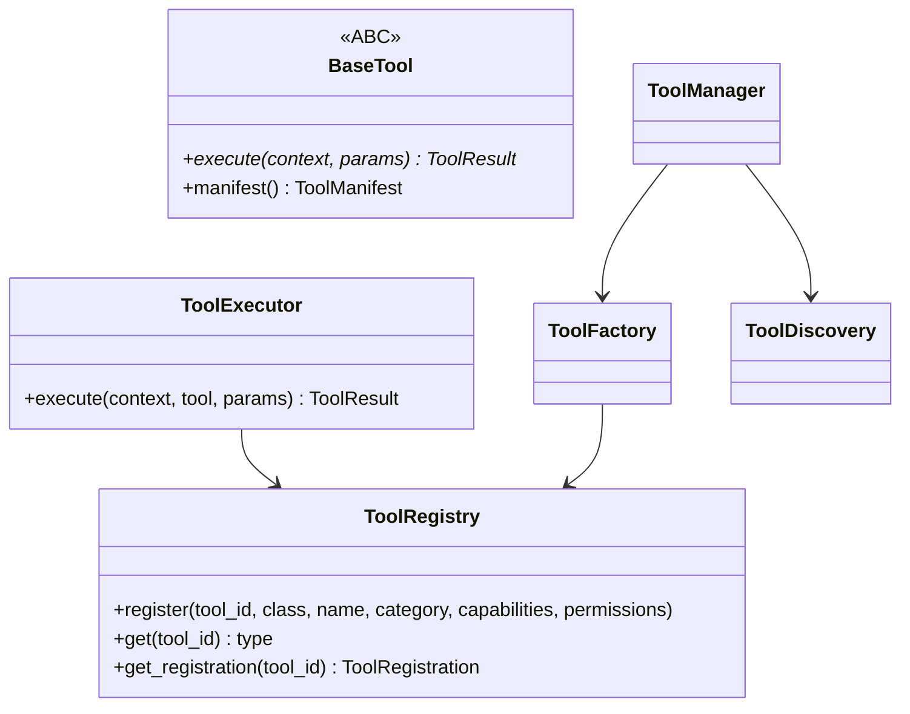

# Tool Framework

`app/services/ai/tools/` (M17) is the universal contract and execution engine for giving agents real-world reach — search, computation, file access, business-system integrations, and whatever tools future specialists need. No concrete tool ships with the platform yet; this framework is the extension point.

## Purpose

Analogous to how Conversation/Vision give agents access to a *model capability* through a provider-agnostic contract, the Tool Framework gives agents access to *actions* through a tool-agnostic contract — one execution engine (permission checks, retry, timeout, cancellation, middleware, events) shared by every tool, so a new tool is a thin, focused addition rather than its own execution engine.

## Architecture



- `base_tool.py` — `BaseTool` ABC: fully abstract execution contract, plus a **concrete** `manifest()` method building a `ToolManifest` from the tool's own declared identity — an enhancement added deliberately during M17 rather than deferred, since every tool needs a self-describing manifest for discovery.
- `context.py` — `ToolContext`, composing `SharedExecutionContext` and holding a `CancellationToken`.
- `result.py` — `ToolResult`, composing `ExecutionMetrics`.
- `registry.py` — `ToolRegistry`, extending `GenericProviderRegistry[str, ToolRegistration]`.
- `factory.py` — `ToolFactory`.
- `manager.py` — `ToolManager`, the higher-level entry point coordinating discovery + factory + execution.
- `execution.py` — `ToolExecutor`: validation → permission check → middleware → retry/timeout/cancellation → events/hooks.
- `middleware.py` / `hooks.py` — `ToolMiddleware`/`ToolMiddlewarePipeline` (built on the shared generics), `ToolHook`.
- `discovery.py` — `ToolDiscovery`.
- `permissions.py` / `policies.py` — `PermissionPolicy`, `ToolExecutionPolicy` (reusing `kernel.RetryPolicy`, never redefining it).
- `validation.py` / `schema.py` — `ToolSchema`/`SchemaField`, a pure-Python schema representation with **no external validation library dependency**.
- `manifest.py` — `ToolManifest`.
- `shared/` — `Metadata` alias, `ToolError`/`ToolNotFoundError`.

## Registration-Time Metadata

`ToolRegistry.register()` requires `name`, `category: ToolCategory`, `capabilities: frozenset[ToolCapability]`, `permissions: frozenset[ToolPermission]` at registration time, stored in a `ToolRegistration` record — not derived by instantiating the tool class. This is the same pattern `SpecialistRegistry` uses (see [Specialist_Framework.md](../03_INTELLIGENCE/Specialist_Framework.md)) and lets `ToolRegistry.categories()`/`.capabilities()` answer discovery questions without constructing a single tool instance.

## Execution Lifecycle

```mermaid
sequenceDiagram
    participant Caller
    participant Exec as ToolExecutor
    participant MW as ToolMiddlewarePipeline
    participant Tool as BaseTool

    Caller->>Exec: execute(context, tool, params)
    Exec->>Exec: validate params against tool's schema
    Exec->>Exec: check PermissionPolicy
    Exec->>MW: run(context, tool, handler)
    MW->>Tool: execute(context, params), wrapped in RuntimeTimeout, checked against CancellationToken
    Tool-->>MW: ToolResult
    Exec-->>Caller: emit tool lifecycle events; ToolResult (never a raised exception)
```

This is the same executor→middleware→timeout/cancellation→structured-result shape as `RuntimeExecutor` and `VisionExecutor` — see [Runtime.md](../02_KERNEL/Runtime.md).

## Dependencies

`shared/` (identity, `GenericProviderRegistry`, `GenericEvent`, `GenericMiddleware`), `runtime/` (`CancellationToken`, `RuntimeTimeout` — reused, never duplicated), `kernel/` (`RetryPolicy`). Never `agents/` in either direction — a tool is invoked by an agent via `ToolAdapter`/`ToolExecutor`, never the reverse. See [Dependency_Rules.md](../01_ARCHITECTURE/Dependency_Rules.md).

## Testing

187 tests, including ABC enforcement (parametrized missing-member dynamic subclass tests), registry Open/Closed compliance, and the full validation → permission → middleware → retry/timeout/cancellation → events chain.

## Extension Points

Adding a new tool: implement `BaseTool`, declare its schema (`ToolSchema`), and register it via `ToolRegistry.register(tool_id, ToolClass, name=..., category=..., capabilities=..., permissions=...)`. No change to `ToolExecutor`, `ToolFactory`, or `ToolManager` is required. See [Adding_Tool.md](../06_DEVELOPMENT/Adding_Tool.md).
