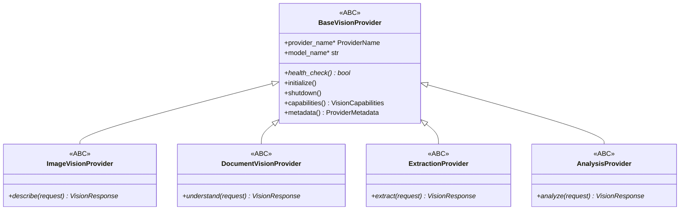
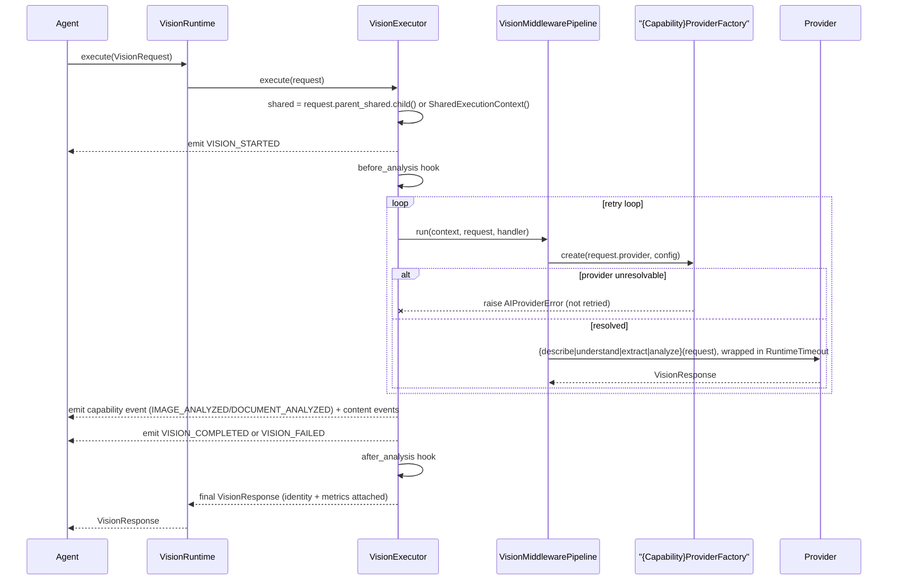

# Vision Framework

`app/services/ai/vision/` (M19) is a shared OS capability — **not an agent** — for understanding screenshots, PDFs, scanned documents, diagrams, charts, tables, receipts, forms, and photos. Any current or future agent can use it. It is completely provider-agnostic: no vendor SDK, OCR engine, image library, or HTTP client exists anywhere in this package.

## Design Philosophy

Vision was built to mirror the Conversation/Runtime relationship exactly:

```
Vision Agent (future) → Vision Framework → Vision Provider (abstract) → Provider implementation (vendor-specific)
```

**never** `Vision Agent → OpenAI` directly. This is the same shape [Conversation_Framework.md](Conversation_Framework.md) established first.

## Package Structure

```
vision/
    shared/          types.py, exceptions.py, base_provider.py
    providers/       enums.py (re-exports platform ProviderName)
    capabilities/    enums.py (VisionCapabilityCategory + 4 per-capability enums)
    image/           base_provider.py, registry.py, provider_factory.py
    document/        base_provider.py, registry.py, provider_factory.py
    extraction/      base_provider.py, registry.py, provider_factory.py
    analysis/        base_provider.py, registry.py, provider_factory.py
    runtime.py       VisionRuntime
    context.py       VisionContext
    request.py       VisionRequest, VisionInput
    response.py      VisionResponse
    events.py        VisionEvent, VisionEventPublisher, VisionEventType
    hooks.py         VisionHook
    middleware.py    VisionMiddleware, VisionMiddlewarePipeline
    execution.py     VisionExecutor
```

The four capability folders (`image/`, `document/`, `extraction/`, `analysis/`) are **independent services** — each has its own provider ABC, registry, and factory; none imports another.

## Capability Hierarchy



`BaseVisionProvider` holds only what's truly common across all four capabilities — deliberately **no** "analyze"-shaped method, since each capability's primary verb differs. Each capability ABC adds exactly one new abstract method with a domain-appropriate verb.

| Category | Verb | Example capabilities (`capabilities/enums.py`) |
|---|---|---|
| Image | `describe()` | describe/identify objects/scene understanding/classification/captioning |
| Document | `understand()` | PDF/scanned/invoices/forms/contracts/reports |
| Extraction | `extract()` | OCR/table extraction/structured data/key-value |
| Analysis | `analyze()` | chart/graph/UI screenshot/architecture diagram/flowchart |

## Value Objects

```python
class VisionInput:            # requires exactly one of: bytes_data, path, url
    kind: VisionInputKind      # IMAGE | DOCUMENT
    bytes_data: bytes | None
    path: str | None
    url: str | None
    metadata: Metadata

class VisionRequest:
    inputs: tuple[VisionInput, ...]   # ALWAYS plural — never a single-image field
    capability_category: VisionCapabilityCategory   # M20.4: was `str`; see Capability_Routing.md
    shared: SharedExecutionContext
    provider: ProviderName = ProviderName.UNKNOWN
    stream: bool = False              # inert — captures future-streaming intent only, no implementation
    cancellation_token: CancellationToken | None
    parent_shared: SharedExecutionContext | None

class VisionResponse:
    success: bool
    extracted_text: tuple[ExtractedText, ...]
    tables: tuple[ExtractedTable, ...]
    objects: tuple[DetectedObject, ...]
    structured_output: Metadata | None
    confidence: float
    provider: ProviderName | None
    model: str | None
    duration_ms: float
    metrics: ExecutionMetrics | None   # composed from kernel, never redefined
    error: str | None
    execution_id, parent_execution_id, correlation_id, causation_id: ...
    vision_metadata: VisionMetadata | None
```

`VisionRequest.inputs` being a tuple from day one (never a single image field) is structural, not incidental — it is what lets multi-image reasoning, document batches, and page-by-page processing be supported later **without a breaking change**. `stream` is present as a flag today with zero behavior behind it, matching the platform rule of never building a placeholder that pretends to do something it doesn't.

## Execution Lifecycle



`VisionExecutor` dispatches to the right provider method via internal lookup tables keyed by `capability_category`: `_CAPABILITY_METHOD` (`VisionCapabilityCategory.IMAGE → "describe"`, etc.), `_CAPABILITY_FACTORY`, `_CAPABILITY_EVENT` — all keyed by the actual `VisionCapabilityCategory` enum as of M20.4, not a raw string (see [Capability_Routing.md](../01_ARCHITECTURE/Capability_Routing.md)). Retry treats `AIProviderError` specially — an unresolvable provider name is never retried, exactly like the Runtime.

## Events

`VisionEventType`: `VISION_STARTED`, `IMAGE_ANALYZED`, `DOCUMENT_ANALYZED`, `TEXT_EXTRACTED`, `TABLE_EXTRACTED`, `OBJECTS_DETECTED`, `VISION_COMPLETED`, `VISION_FAILED`. Content events (`TEXT_EXTRACTED`/`TABLE_EXTRACTED`/`OBJECTS_DETECTED`) are emitted based on what the response actually populated, not purely on which capability ran — this resolves the fact that Extraction and Analysis have no dedicated "started" event of their own. Full detail: [Event_System.md](../02_KERNEL/Event_System.md).

## Provider Architecture

Each capability's `{Capability}ProviderRegistry` extends `GenericProviderRegistry[ProviderName, type[{Capability}Provider]]`; each `{Capability}ProviderFactory` extends `BaseProviderFactory`. Providers are constructed via the existing generic `BaseProviderConfig` — no Vision-specific config type exists, since `BaseProviderConfig`'s fields (api_key/base_url/timeout/max_retries/headers/metadata) are already generic enough. An unregistered provider raises the platform-wide `AIProviderError` (matching `ConversationProviderFactory`'s exact behavior); a duplicate *registration* raises `VisionProviderError` (registry-level only).

## What Vision Reuses vs. Introduces

| Reused directly (never duplicated) | Introduced new, generalized for the whole platform |
|---|---|
| `CancellationToken`, `RuntimeTimeout` (from `runtime/`) | `GenericProviderRegistry`, `GenericEvent`/`EventPublisher`, `GenericMiddleware`/`GenericMiddlewarePipeline` (`shared/`) — Vision was the first consumer; the M19 completion pass then migrated the five pre-existing subsystems onto them too |
| `ExecutionMetrics` (from `kernel/`) | |
| `SharedExecutionContext` (from `shared/`) | |
| `BaseProviderFactory`, `BaseProviderConfig` (from `shared/`) | |

## Dependencies

`shared/`, `runtime/` (`CancellationToken`, `RuntimeTimeout` only), `kernel/` (`ExecutionMetrics`), `providers/`. Never `agents/`, `tools/`, `conversation/`. See [Dependency_Rules.md](../01_ARCHITECTURE/Dependency_Rules.md).

## Testing

232 tests, covering ABC enforcement, registry isolation and Open/Closed compliance, factory resolution, retry (provider-error vs. generic-error distinction), timeout, cancellation (pre-start and mid-retry), middleware onion-order and short-circuit, hook ordering, event ordering, identity/correlation propagation, metrics propagation, determinism, and real registry+factory integration. Zero vendor/HTTP/OCR/image-library imports — verified by grep as part of the milestone's own acceptance criteria.

## Extension Points

Adding a real provider for any of the four capabilities: implement the relevant ABC (`ImageVisionProvider`, etc.) in its own module, register it in the matching registry. Future capability categories (e.g. video-frame understanding) would follow the exact same four-file pattern (`base_provider.py`/`registry.py`/`provider_factory.py`, plus wiring into `VisionExecutor`'s lookup tables) — see [Adding_Framework.md](../06_DEVELOPMENT/Adding_Framework.md) and [Roadmap.md](../00_OVERVIEW/Roadmap.md) (Audio/Speech Frameworks are expected to follow this same shape).
