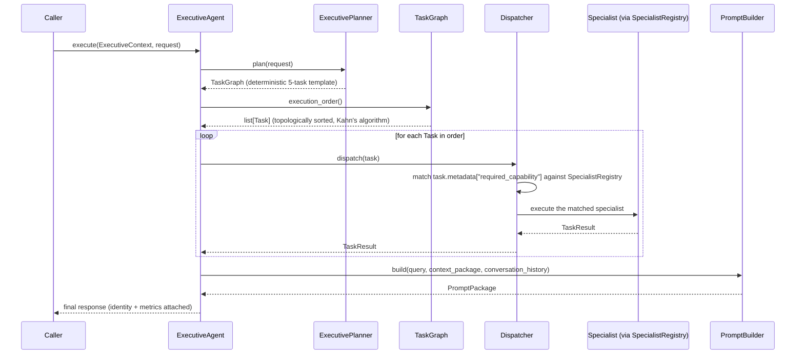

# Executive Agent

`ExecutiveAgent` (`app/services/ai/agents/executive/executive_agent.py`) is the platform's top-level coordinator — informally "PID 1." This document covers its concrete behavior end to end. For the surrounding framework's architecture, see [Executive_Framework.md](../03_INTELLIGENCE/Executive_Framework.md).

## Identity

Self-registers in `AgentRegistry` under the name `"executive"`:

```python
AgentRegistry.register("executive", ExecutiveAgent, overwrite=True)
```

It is a full `BaseAgent` — discoverable and constructible through `AgentFactory`/`AgentRegistry` like any other agent — not a special-cased type the rest of the Agent Framework treats differently.

## Behavior: Plan → Dispatch → Synthesize



`ExecutivePlanner` is **deterministic and template-based** — it produces a fixed 5-task plan shape for every request today, not an adaptive plan whose task count or structure varies with request complexity. This is a real, current limitation worth being explicit about: "the Executive plans" currently means "the Executive fills in a fixed template," not free-form planning.

## Dispatch: Capability Matching, Not Blanket Flags

`Dispatcher` routes each `Task` using `task.metadata["required_capability"]` against what each registered specialist declared as `supported_tasks` at registration time (see [Specialist_Framework.md](../03_INTELLIGENCE/Specialist_Framework.md)) — **not** by inspecting `Decision`'s blanket boolean flags directly. Matching on a flag like `Decision.requires_memory` alone would route every task in a plan to a memory-capable specialist, even ones whose actual work doesn't need memory retrieval; this was a real bug caught during the M17 build.

## State Machine

`ExecutiveState`/`ExecutiveStateMachine` differs from the general `AgentState` machine in one deliberate way: **both `COMPLETED` and `FAILED` transition back to `IDLE`**, not to a terminal state. The Executive is a long-lived coordinator expected to accept a new request immediately after finishing the previous one, successfully or not — unlike a single specialist invocation, which is a one-shot execution.

## Events

`ExecutiveEvent` (`ExecutiveEventType`: `PLAN_CREATED`, `TASK_CREATED`, `TASK_ASSIGNED`, `TASK_COMPLETED`, `TASK_FAILED`, `DELEGATION_STARTED`, `DELEGATION_COMPLETED`, `RESPONSE_GENERATED`) traces the full plan → dispatch → synthesize lifecycle. Every event carries `execution_id`/`correlation_id` — see [Event_System.md](../02_KERNEL/Event_System.md).

## Policy

`ExecutivePolicy` bounds the Executive's own behavior: `maximum_depth` (delegation nesting limit), `maximum_retries`, `maximum_runtime_seconds`, `allow_web`/`allow_tools`/`allow_delegation` (blanket permission gates), `maximum_parallel_tasks`. This is distinct from `SpecialistExecutionPolicy` (which bounds one specialist's own execution) and from Runtime's `RetryPolicy` (which bounds one provider call) — three separate policy layers, each scoped to what it actually governs.

## Identity Propagation

The Executive's own `SharedExecutionContext` is the root of the correlation chain for an entire multi-specialist delegation. Every `Task` dispatched to a specialist propagates it via `.child()` (through the specialist's own request's `parent_shared` field), so every specialist's — and every tool's, and every runtime call's — events and responses share one `correlation_id` back to the originating Executive execution. See [Identity_Model.md](../02_KERNEL/Identity_Model.md) for the full execution-tree diagram.

## Testing

128 tests, covering the planner's deterministic output, the dispatcher's capability-matching (including the specific regression test for the blanket-flag bug), `TaskGraph.execution_order()`'s topological correctness, the `IDLE`-looping state machine, and event ordering.

## Known Limitations

- Planning is template-based, not adaptive — see above.
- No self-correction: if a dispatched task fails, the Executive records `TASK_FAILED` and proceeds according to policy; it does not currently re-plan around a failure.
- Delegation currently reaches only `SpecialistRegistry`-registered specialists — there is no path for the Executive to call a tool directly without going through a specialist, even though `ExecutivePolicy.allow_tools` exists as a flag.
