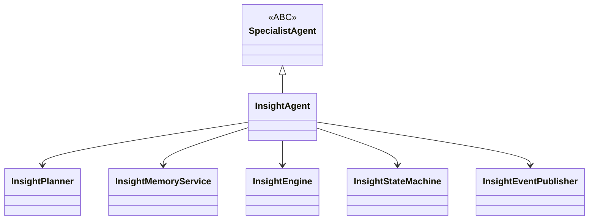
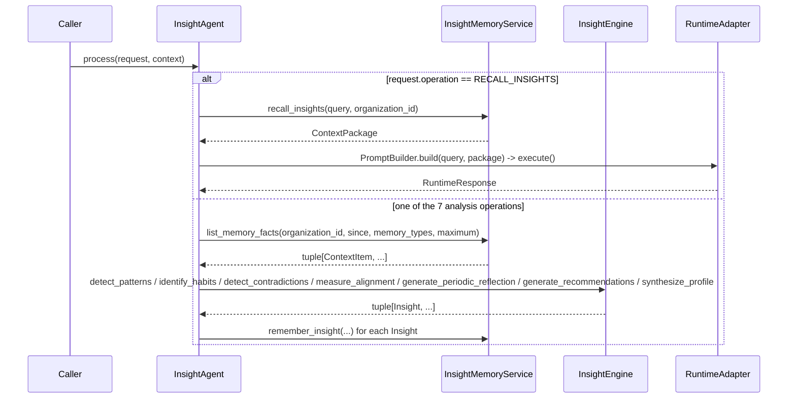

# Insight Agent

`InsightAgent` (`app/services/ai/agents/specialists/personal_intelligence/insight/insight_agent.py`, CP-01.3) is the third concrete specialist built on the [Specialist Framework](../03_INTELLIGENCE/Specialist_Framework.md), and the Personal Intelligence Pack's second - Executive Cognition: it turns memories `PersonalIntelligenceAgent` (or ordinary conversation) has already written into recognized patterns, habits, contradictions, goal alignment, periodic reflections, proactive recommendations, and an evolving profile. See [Personal_Intelligence_Pack.md](../04_CAPABILITIES/Personal_Intelligence_Pack.md#insight-engine-cp-013-phase-4-executive-cognition) and [Implementation_Insight_Engine.md](../08_CAPABILITY_PACKS/CP-01_Personal_Intelligence_Pack/Implementation_Insight_Engine.md).

## Identity

Self-registers in `AgentRegistry` (also discoverable via `SpecialistRegistry`, declaring `specialization="insight"` and `supported_tasks={SpecialistTaskType.ANALYSIS, SpecialistTaskType.SUMMARIZATION}`):

```python
AgentRegistry.register(_INSIGHT_AGENT_NAME, InsightAgent, overwrite=True)
```

Declares `AgentCapability.REASONING`, `AgentCapability.PLANNING` - **deliberately not** `AgentCapability.MEMORY`, for the identical collision-avoidance reason `PersonalIntelligenceAgent` documents (see [Personal_Intelligence_Agent.md](Personal_Intelligence_Agent.md#why-no-agentcapabilitymemory)).

## Architecture



- `insight_agent.py` — `InsightAgent(SpecialistAgent)`.
- `engine.py` — `InsightEngine`, the pure, deterministic detection/synthesis core (see "Why Detection Is Deterministic," below).
- `memory_service.py` — `InsightMemoryService`: `remember_insight()`/`recall_insights()` via `AgentMemory` (same mechanism as `PersonalMemoryService`), plus `list_memory_facts()` via `AIMemoryService.list_memories()` (bulk, unmodified, paginated).
- `planner.py` — `InsightPlanner(SpecialistPlanner)` — a deterministic, fixed three-task plan, typed `ANALYSIS`/`ANALYSIS`/`SUMMARIZATION` (unlike `PersonalIntelligencePlanner`, insight generation genuinely fits the existing `SpecialistTaskType` taxonomy).
- `state.py` — `InsightState`/`InsightStateMachine` (`IDLE → INTERPRETING → {GATHERING →} ANALYZING → COMPLETED/FAILED → IDLE`).
- `events.py` — `InsightEvent`/`InsightEventPublisher`.
- `policies.py` — `InsightPolicy` (`default_lookback_days`, `default_maximum_memories_analyzed`, `default_pattern_minimum_occurrences`, `default_habit_minimum_occurrences`, `default_recall_limit`, `default_max_context_tokens`, `minimum_confidence`).
- `context.py` — `build_insight_context()`, composing `SpecialistContext`.
- `request.py` — `InsightOperation` (8 members), `InsightRequest`.

## Behavior: `process()` — Eight Operations



`InsightOperation`: `analyze_patterns`, `identify_habits`, `detect_contradictions`, `measure_alignment`, `generate_periodic_reflection`, `generate_recommendations`, `update_profile`, `recall_insights`. Every analysis operation gathers its corpus via `list_memory_facts()`, scoped to CP-01's five user-authored memory types (`personal_insight` - the engine's own prior output - is always excluded, preventing self-reinforcement), then splits it by `memory_type` before handing the relevant slices to `InsightEngine`.

## Why Detection Is Deterministic, Not an LLM Call

`InsightEngine` is a pure, no-I/O class - the same "same input always produces the same output" discipline `ResearchSynthesizer` established. This is deliberate: "every generated insight must be traceable back to supporting memories rather than invented" is only guaranteed if the thing producing an `Insight` cannot hallucinate one. Every algorithm is a plain, auditable heuristic:

- **Patterns/habits**: a normalized term recurring across ≥N distinct memories is "observed" as a raw count (habits: the same mechanism, scoped to `personal_reflection`-type memories, labeled a behavioral signal).
- **Contradictions**: a Preference containing a negation marker followed by a term, matched against a Goal/Project/Reflection containing that same term unnegated. Deliberately coarse (no stemming) - confidence fixed low (0.4).
- **Alignment**: for each Goal, the fraction of recent Reflection/Project memories sharing its vocabulary.
- **Recommendations/periodic reflections/profile summary**: template synthesis over already-detected Insights, never a fresh pass over raw text.

`AIRuntime` is used in exactly one place - `RECALL_INSIGHTS` - mirroring exactly how `PersonalIntelligenceAgent` reserves the Runtime for its own `RECALL` operation.

## Observed vs. Inferred

Every `Insight` carries `basis: InsightBasis` (`OBSERVED` | `INFERRED`); an `INFERRED` insight's `__post_init__` requires a non-empty `conclusion`, kept visibly separate from `observation`. `supporting_memory_ids: tuple[int, ...]` is the exact set of `Memory` row ids an Insight was computed from - empty only for the honest "nothing to observe" case (e.g. a periodic reflection over a zero-memory window).

## State Machine

`IDLE → INTERPRETING → {GATHERING →} ANALYZING → COMPLETED/FAILED → IDLE`. `RECALL_INSIGHTS` skips `GATHERING` (nothing to bulk-list for a single relevance query) the same way a `remember_*` operation on `PersonalIntelligenceAgent` skips `RETRIEVING`. The instance attribute is `self.insight_state`, never `self.state` - the same `BaseAgent.state`-property-shadowing rule every specialist in this platform follows.

## Events

`InsightEventType`: `REQUEST_STARTED`, `CORPUS_GATHERED`, `PATTERNS_DETECTED`, `HABITS_IDENTIFIED`, `CONTRADICTIONS_DETECTED`, `ALIGNMENT_MEASURED`, `PERIODIC_REFLECTION_GENERATED`, `RECOMMENDATIONS_GENERATED`, `PROFILE_UPDATED`, `RECALL_COMPLETED`, `REQUEST_COMPLETED`, `REQUEST_FAILED`.

## Dependencies

`agents/` (`AgentMemory`), `agents/specialists/` (`SpecialistAgent`, `ToolAdapter`, `MemoryAdapter`), `tools/` (indirectly, via `ToolAdapter`; unused by any v1 operation), `runtime/`, `kernel/`, `providers/`, `shared/`. Nests inside the existing `agents.specialists.personal_intelligence` dependency boundary (`app/tests/architecture/dependency_rules.py`) - no new boundary entry was needed. See [Dependency_Rules.md](../01_ARCHITECTURE/Dependency_Rules.md).

## Memory: Two Read Paths, One Write Path, Zero New Stores

`InsightMemoryService` (typed against `AgentMemory`, never a concrete adapter, mirroring `PersonalMemoryService`'s precedent) uses `AgentMemory.remember()`/`retrieve()` for writing/recalling Insights themselves - identical to how every other CP-01 domain object is stored - and `AIMemoryService.list_memories()` for the raw analysis corpus, since pattern/habit/contradiction/alignment detection needs the actual set of a user's memories, not a relevance-ranked slice of one query (something `AgentMemory.retrieve()`/`MemoryRetrievalPipeline` were never designed to provide, and were **not modified to provide** - "do not change retrieval behavior" is a hard constraint this phase honored). `AIMemoryService.list_memories()` already existed, unmodified, before this phase; `MemoryAdapter` already depends on the same collaborator for its write path. `InsightAgent.memory()` returns `self.coordinator.memory_adapter`, the same instance `InsightMemoryService`'s `AgentMemory` side wraps.

## Testing

50 tests in `test_insight_agent.py` (ABC conformance, registry/factory integration, all 8 operations, events, state, failures, max-depth policy, execution identity, organization scoping, lookback-window filtering, self-reference exclusion) plus 37 in `test_insight_engine.py` (every detection/synthesis algorithm, pure-function determinism, exact traceability) plus 8 in `test_insight_executive_integration.py` (automatic surfacing, collision avoidance, and the full `PersonalIntelligenceAgent → InsightAgent → ExecutiveAgent` pipeline) - 171 tests total for the Insight Engine, out of 2368 platform-wide.

## Known Limitations

- `InsightPlanner`, like every other deterministic planner in this platform, is template-based, not adaptive.
- No wall-clock/cron trigger exists for periodic reflections - `GENERATE_PERIODIC_REFLECTION` produces one for a given period on request; nothing schedules that call automatically.
- No live, request-routing `ExecutiveAgent` deployment yet delegates explicit ("give me my weekly reflection") requests to this agent - only the automatic, shared-memory retrieval path is exercised end to end today.
- Contradiction/pattern detection uses exact-term matching only (no stemming, no synonym awareness) - false negatives are expected and documented.
- Only Identity/Goal/Project/Reflection/Preference feed analysis; Decision/Learning/Communication/Business/Productivity/Relationship/Knowledge/Life Intelligence (Architecture.md §3) remain out of scope.
