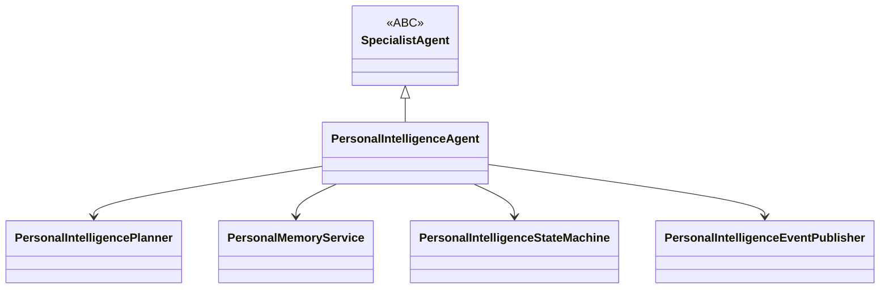
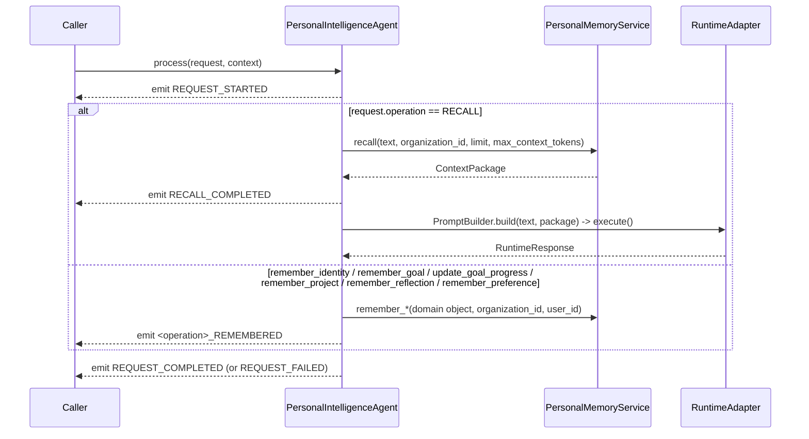

# Personal Intelligence Agent

`PersonalIntelligenceAgent` (`app/services/ai/agents/specialists/personal_intelligence/personal_intelligence_agent.py`) is the second concrete specialist built on the [Specialist Framework](../03_INTELLIGENCE/Specialist_Framework.md), and the first Capability Pack (CP-01) — see [Personal_Intelligence_Pack.md](../04_CAPABILITIES/Personal_Intelligence_Pack.md). It exists both as a working personal-memory agent (identity, goals, projects, reflections, preferences) and as a second worked example, alongside [Research_Agent.md](Research_Agent.md), for [Adding_Agent.md](../06_DEVELOPMENT/Adding_Agent.md).

## Identity

Self-registers in `AgentRegistry` (also discoverable via `SpecialistRegistry`, declaring `specialization="personal_intelligence"` and `supported_tasks={SpecialistTaskType.UNKNOWN}` at registration time):

```python
AgentRegistry.register(_PERSONAL_INTELLIGENCE_AGENT_NAME, PersonalIntelligenceAgent, overwrite=True)
```

Declares `AgentCapability.PLANNING`, `AgentCapability.WORKFLOWS`, `AgentCapability.REASONING` — **deliberately not** `AgentCapability.MEMORY`. See "Why No `AgentCapability.MEMORY`," below.

## Architecture



- `personal_intelligence_agent.py` — `PersonalIntelligenceAgent(SpecialistAgent)`.
- `planner.py` — `PersonalIntelligencePlanner(SpecialistPlanner)` — deterministic, fixed two-task plan.
- `state.py` — `PersonalIntelligenceState`/`PersonalIntelligenceStateMachine` (`IDLE → INTERPRETING → {RETRIEVING →} PROCESSING → COMPLETED/FAILED → IDLE`).
- `events.py` — `PersonalIntelligenceEvent`/`PersonalIntelligenceEventPublisher` (see [Event_System.md](../02_KERNEL/Event_System.md)).
- `policies.py` — `PersonalIntelligencePolicy` (`default_recall_limit`, `default_max_context_tokens`, `minimum_confidence`) — layered on top of, not duplicating, `SpecialistExecutionPolicy`.
- `memory_service.py` — `PersonalMemoryService`, a thin `AgentMemory` wrapper: `remember_identity/goal/goal_progress/project/reflection/preference()` + `recall()`.
- `context.py` — `build_personal_intelligence_context()`, composing `SpecialistContext`.

## Behavior: `process()` — Remember or Recall



`_extract_request()` pulls a `PersonalIntelligenceRequest` from `AgentContext.agent_metadata.extra` (either a fully-built request under `"personal_intelligence_request"`, or individual fields — `operation`, `text`, `title`, `category`, `priority`, `progress`, `status`, `milestones`, `lessons`), mirroring exactly how `ExecutiveAgent.execute()` extracts `user_request` and `ResearchAgent.execute()` extracts its `SpecialistRequest`.

## Why No `AgentCapability.MEMORY`

`ExecutivePlanner._build_graph()`'s built-in `retrieve_memory`/`retrieve_conversations` tasks are tagged `required_capability=AgentCapability.MEMORY`. `Dispatcher.dispatch()` matches purely by capability against `known_agents` (already-constructed instances the `ExecutiveAgent` was composed with) — if `PersonalIntelligenceAgent` declared `MEMORY` too, it would be a candidate for those internal tasks, and its `SpecialistResponse` return shape doesn't fit where `_handle_task()` expects a raw `ContextPackage` back. `PersonalIntelligenceAgent` declares `PLANNING`/`WORKFLOWS`/`REASONING` instead — real, accurate capabilities, none of which the Executive's built-in graph dispatches on. Verified directly by `test_executive_integration.py::test_personal_intelligence_agent_never_intercepts_the_executives_own_memory_retrieval_task`, which registers `PersonalIntelligenceAgent` in `known_agents` and confirms the Executive's internal pipeline call still happens directly.

This is also *why* CP-01's headline UX property — the Executive surfacing personal context automatically — needs no delegation at all: both agents read/write the same `Memory` table via `MemoryAdapter`, so anything `PersonalIntelligenceAgent` remembers is already visible to `ExecutivePlanner`'s own `retrieve_memory` task the next time the user talks to the Executive. See [Implementation.md §8](../08_CAPABILITY_PACKS/CP-01_Personal_Intelligence_Pack/Implementation.md#8-executive-integration--automatic-zero-executive-change).

## State Machine

Narrower than `ResearchState`: `IDLE → INTERPRETING → {RETRIEVING (recall only) →} PROCESSING → COMPLETED/FAILED → IDLE`. A `remember_*` operation skips `RETRIEVING` entirely (`INTERPRETING → PROCESSING` is a valid transition) since writes never need prior context. The instance attribute is named `self.personal_intelligence_state`, never `self.state` — `BaseAgent` already defines `state` as a property delegating to `state_machine.state`, so naming a subclass's own state-machine instance attribute `self.state` would shadow it; `ResearchAgent` avoids the same collision with `self.research_state`.

## Events

`PersonalIntelligenceEventType`: `REQUEST_STARTED`, `CONTEXT_RETRIEVED`, `IDENTITY_REMEMBERED`, `GOAL_REMEMBERED`, `GOAL_PROGRESS_UPDATED`, `PROJECT_REMEMBERED`, `REFLECTION_REMEMBERED`, `PREFERENCE_REMEMBERED`, `RECALL_COMPLETED`, `REQUEST_COMPLETED`, `REQUEST_FAILED`.

## Dependencies

`agents/` (`AgentMemory`), `agents/specialists/` (`SpecialistAgent`, `ToolAdapter`, `MemoryAdapter`), `tools/` (indirectly, via `ToolAdapter`; unused by any v1 journey), `runtime/`, `kernel/`, `providers/`, `shared/`. Same allow-set as `agents.specialists.research` in `app/tests/architecture/dependency_rules.py`. See [Dependency_Rules.md](../01_ARCHITECTURE/Dependency_Rules.md).

## Memory: Depends on `AgentMemory`, Not `MemoryAdapter` Directly

Like `ResearchAgent` (M20.6), `PersonalIntelligenceAgent.__init__`'s `memory_adapter` parameter is typed `AgentMemory | None`, defaulting to constructing a concrete `MemoryAdapter()`. `PersonalMemoryService` (the thin wrapper `PersonalIntelligenceAgent` actually calls) is itself typed against `AgentMemory`, never a concrete adapter — so a fake is trivial to inject in tests, and this pack never depends on `MemoryAdapter`'s concrete shape. `PersonalIntelligenceAgent.memory()` (the `BaseAgent` accessor) returns `self.coordinator.memory_adapter`, the same instance `PersonalMemoryService` wraps.

## Testing

46 tests in `test_personal_intelligence_agent.py` (ABC conformance, registry/factory integration, every `remember_*`/`recall` operation, event ordering, state-machine behavior, failure handling, maximum-depth policy, execution-identity propagation) plus 6 in `test_executive_integration.py` (the Executive-surfacing proof and the capability-collision-avoidance proof) — 52 tests exercising the agent directly, out of 156 total for the whole CP-01 pack. See [Personal_Intelligence_Pack.md](../04_CAPABILITIES/Personal_Intelligence_Pack.md#testing).

## Known Limitations

- `PersonalIntelligencePlanner`, like `ResearchPlanner`/`ExecutivePlanner`, is deterministic/template-based, not adaptive.
- No live, request-routing `ExecutiveAgent` deployment yet delegates explicit ("remember that...") requests to this agent — only the automatic, shared-memory retrieval path is exercised end to end today (registration and constructibility are proven; production wiring is an open item — see [Implementation.md §10](../08_CAPABILITY_PACKS/CP-01_Personal_Intelligence_Pack/Implementation.md#10-open-items-intentionally-deferred)).
- Only Identity/Goal/Project/Reflection/Preference are implemented; Decision/Learning/Communication/Business/Productivity/Relationship/Knowledge/Life Intelligence (Architecture.md §3) are out of scope for this phase.
