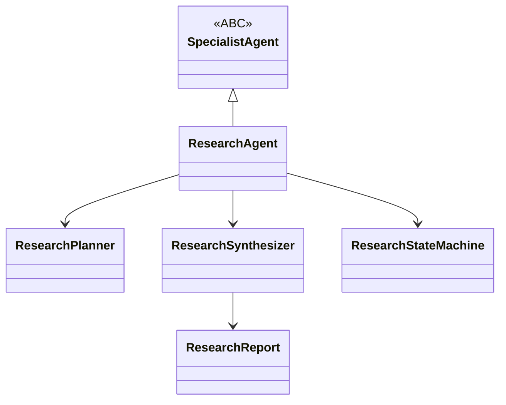
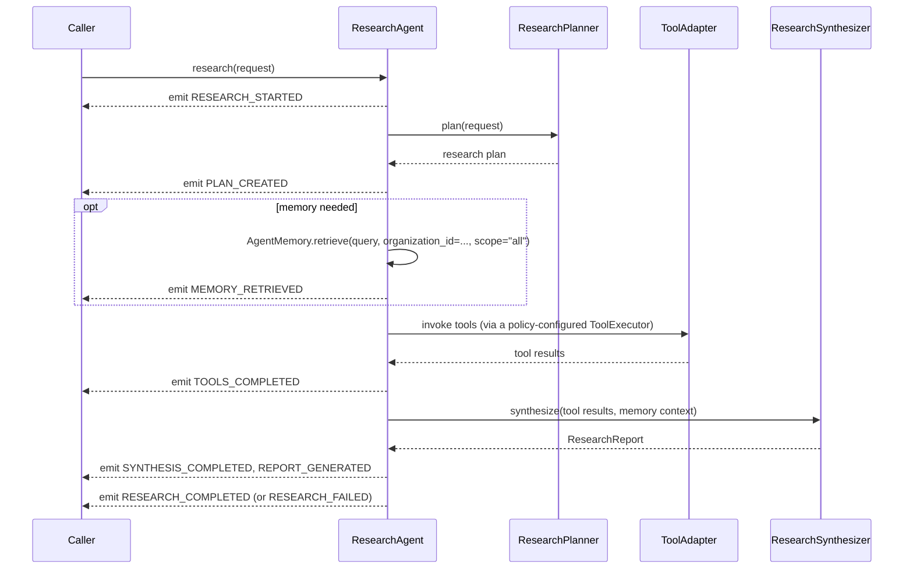

# Research Agent

`ResearchAgent` (`app/services/ai/agents/specialists/research/research_agent.py`) is the first, and as of M19 the only, concrete specialist built on the [Specialist Framework](../03_INTELLIGENCE/Specialist_Framework.md). It exists both as a working research/investigation agent and as the worked example future specialists (Learning, Product, Finance — see [Roadmap.md](../00_OVERVIEW/Roadmap.md)) should pattern-match against.

## Identity

Self-registers in `AgentRegistry` under its own name (also discoverable via `SpecialistRegistry`, declaring `specialization="research"` and its `supported_tasks` at registration time):

```python
AgentRegistry.register(_RESEARCH_AGENT_NAME, ResearchAgent, overwrite=True)
```

## Architecture



- `research_agent.py` — `ResearchAgent(SpecialistAgent)`.
- `planner.py` — `ResearchPlanner(SpecialistPlanner)`.
- `state.py` — `ResearchState`/`ResearchStateMachine`.
- `events.py` — `ResearchEvent`/`ResearchEventPublisher` (see [Event_System.md](../02_KERNEL/Event_System.md)).
- `policies.py` — `ResearchPolicy` (`maximum_sources`, `minimum_confidence`, `require_evidence`) — layered on top of, not duplicating, `SpecialistExecutionPolicy`.
- `synthesizer.py` — `ResearchSynthesizer`.
- `report.py` — `ResearchReport`.
- `context.py` — research-specific context, composing `SpecialistContext`.

## Behavior: Research → Tools → Synthesis



## The Policy-Wiring Fix

`SpecialistExecutionPolicy` (`retry_policy`, `timeout_seconds`, `maximum_depth`) was declared during M18 but initially never actually consumed by tool execution — a real architectural gap. It was closed specifically in `ResearchAgent`: by default, it builds a `ToolExecutor` **configured from its own policy** rather than an unconfigured one, so `retry_policy`/`timeout_seconds` genuinely govern the tools it invokes. Any second specialist should verify it does the same, rather than assuming policy wiring is automatic — it is not; each specialist is responsible for actually applying its own `SpecialistExecutionPolicy` where it builds its tool executor.

## Cancellation

A `CancellationToken` is threaded explicitly through `research()` and its internal `_invoke_tools()` step — cancelling mid-research stops before the next tool invocation, following the same cooperative-cancellation model as the Runtime (see [Runtime.md](../02_KERNEL/Runtime.md)).

## Events

`ResearchEventType`: `RESEARCH_STARTED`, `PLAN_CREATED`, `MEMORY_RETRIEVED`, `TOOLS_COMPLETED`, `SYNTHESIS_COMPLETED`, `REPORT_GENERATED`, `RESEARCH_COMPLETED`, `RESEARCH_FAILED`. `ResearchEvent` is currently the only concrete "specialist event" type in the platform — there is no separate, generic `SpecialistEvent` base, since Research is still the only concrete specialist (see [Event_System.md](../02_KERNEL/Event_System.md)).

## Dependencies

`agents/` (`AgentMemory`), `agents/specialists/` (`SpecialistAgent`, `ToolAdapter`, `MemoryAdapter`), `tools/` (indirectly, via `ToolAdapter`), `shared/`. See [Dependency_Rules.md](../01_ARCHITECTURE/Dependency_Rules.md).

## Memory: Depends on `AgentMemory`, Not `MemoryAdapter` Directly (M20.6)

`ResearchAgent.__init__`'s `memory_adapter` parameter is typed `AgentMemory | None` (still named `memory_adapter` for backward compatibility with existing keyword-argument call sites), defaulting to constructing a concrete `MemoryAdapter()`. Internally, `_retrieve_memory()` calls `self.coordinator.memory_adapter.retrieve(request.objective, organization_id=context.organization_id)` — the abstract `AgentMemory.retrieve()` method — rather than `MemoryAdapter.retrieve_all()` directly, even though a `MemoryAdapter` is what's actually constructed by default. `ResearchAgent.memory()` (the `BaseAgent` accessor) now returns this same instance instead of unconditionally `None`. See [Memory_System.md](../03_INTELLIGENCE/Memory_System.md) for `MemoryAdapter`'s full `AgentMemory` implementation.

## Testing

207 tests from the M18 Specialist Framework + Research Agent milestone, plus 15 more (`test_memory_adapter.py`, M20.6) covering `MemoryAdapter`'s `AgentMemory` conformance — including the policy-wiring regression coverage and cancellation-token propagation through `_invoke_tools()`.

## Known Limitations

- `ResearchPlanner`, like `ExecutivePlanner`, is deterministic/template-based, not adaptive.
- No source-credibility model beyond `ResearchPolicy.minimum_confidence`/`require_evidence` — these are declared thresholds a caller sets, not something the agent independently assesses.
- Depends on `MemoryRetrievalPipeline` via `MemoryAdapter`/`AgentMemory` for memory access, and is therefore subject to the same graceful-degradation caveat as `AIMemoryService` — see [Memory_System.md](../03_INTELLIGENCE/Memory_System.md).
- `ResearchAgent` itself only ever calls `AgentMemory.retrieve()` — it has no write-side operations, so it does not exercise `remember()`/`forget()`, even though `MemoryAdapter` has implemented both since CP-01.2 (see [Memory_System.md](../03_INTELLIGENCE/Memory_System.md) and [Personal_Intelligence_Agent.md](Personal_Intelligence_Agent.md), the first agent to actually use them).
