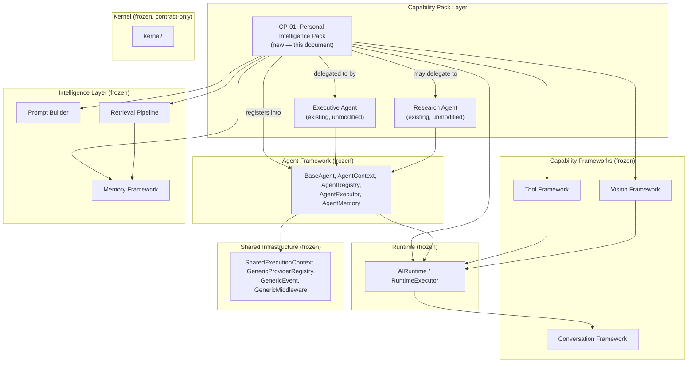
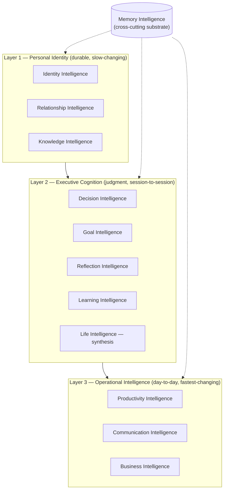
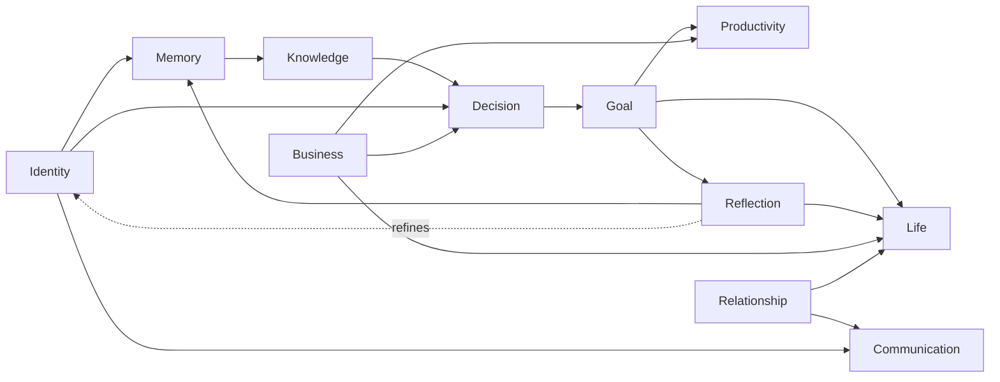
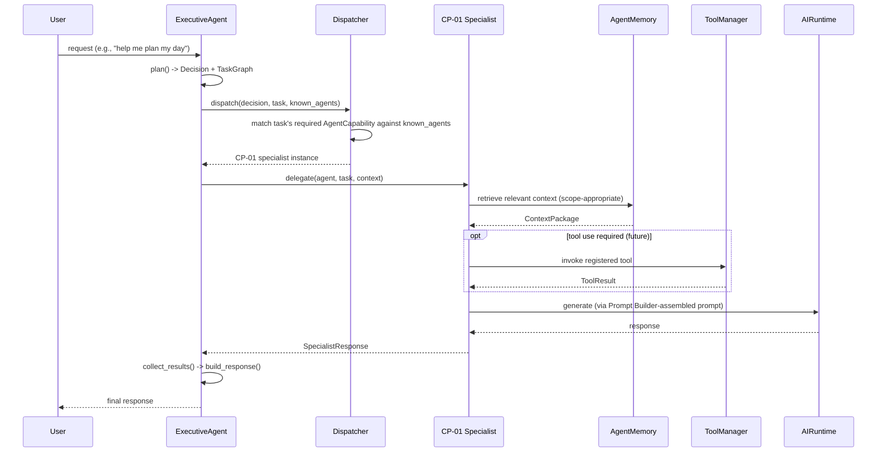
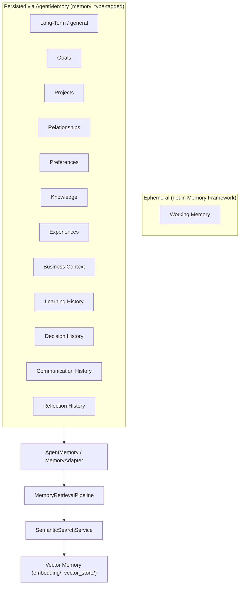
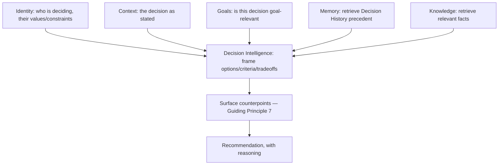
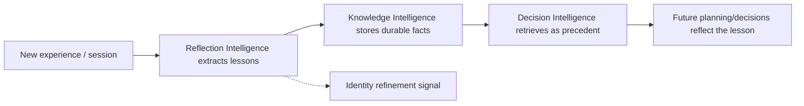
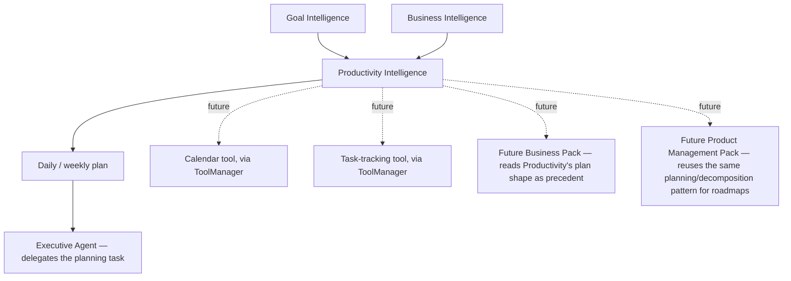

# CP-01.1 — Personal Intelligence Pack
## Engineering Architecture (Phase 2)

| | |
|---|---|
| **Status** | Draft — Phase 2 (Engineering Architecture) |
| **Precedes** | Phase 3 — Implementation Plan (not started) |
| **Built from** | [PRD.md](PRD.md) (Phase 1, complete) |
| **Built on** | AI Operating System v1.0, frozen ([ARCHITECTURE_FREEZE_v1.md](../../ARCHITECTURE_FREEZE_v1.md)) |
| **Frozen frameworks this document must not redesign** | Kernel, Runtime, Shared Execution Context, Event System, Middleware, Conversation Framework, Memory Framework, Prompt Builder, Retrieval Pipeline, Tool Framework, Vision Framework, Specialist Framework, Executive Framework, Agent Framework |

This document contains no Python, no package structure, and no pseudocode. Every mechanism described below already exists on the frozen platform; this document's only job is to say precisely how CP-01's twelve intelligence domains are organized, layered, bounded, and wired onto that existing mechanism — not to invent new mechanism. Where a genuine platform gap blocks a design decision (there are two — see §18, §20), it is named explicitly rather than worked around with a parallel, CP-01-private mechanism.

---

## 1. Architectural Purpose

CP-01 exists to solve a problem the frozen platform is capable of solving but does not yet solve for anyone: turning a general-purpose Memory Framework, Executive, and Specialist Framework into a **specific, continuous model of one person**. The Memory Framework can already store and semantically retrieve content; the Executive can already plan and delegate; the Specialist Framework can already extend the platform with new domain logic. None of that, by itself, constitutes "the system knows who I am, what I'm working on, and what I decided last time." CP-01 is the architecture that closes that gap — not by adding platform mechanism, but by disciplined, conventional use of the mechanism that already exists.

It is the **foundational** Capability Pack for two structural reasons, not just a chronological one:

1. **Every later pack needs an identity to attach to.** A Finance Pack's advice, a Health Pack's tracking, a Trading Pack's risk posture — all of these are meaningless without a durable notion of *whose* finances, *whose* health, *whose* risk tolerance. CP-01 is where that notion lives.
2. **Every later pack needs a memory convention to follow.** CP-01 is the first sustained, high-volume, long-lived consumer of the Memory Framework's write path. The categorization, retention, and retrieval conventions it establishes (§9) are what CP-02 onward inherit rather than each reinventing.

CP-01 is therefore best understood not as "a feature" but as **the platform's first tenant of its own extension points, at full depth** — the proof that the frozen architecture actually supports what it was built to support.

## 2. Position Inside the AI Operating System

CP-01 introduces no new layer. It occupies the **Agents (Capability Pack) layer** exactly as defined in [ARCHITECTURE_FREEZE_v1.md](../../ARCHITECTURE_FREEZE_v1.md)'s Frozen Dependency Graph — the same layer `agents/executive/` and `agents/specialists/research/` already occupy.

CP-01 sits **beside** `agents/executive/` and `agents/specialists/research/`, not above or below either. It is discovered by the Executive the same way Research is: as a set of `SpecialistAgent` instances the Executive's `Dispatcher` can capability-match against. It does not sit between the Executive and any frozen framework, and no frozen framework is aware CP-01 exists — the awareness runs one direction only, from CP-01 outward to the platform.

## 3. Internal Capability Architecture

Each of the twelve capabilities from the PRD is described here at the domain level: what it does, what it needs, and what it produces — independent of whether it is realized as a dedicated Specialist Agent or an internal service (that decision is §8's, made only after every capability's actual shape is established here).

### 3.1 Identity Intelligence
- **Purpose**: Maintain the durable model of who the user is — roles, context, preferences, communication style, values, constraints — that every other domain interprets through.
- **Responsibilities**: Capture explicit identity statements; refine the model from observed patterns across other domains; expose the current identity model as context to every other domain.
- **Inputs**: Explicit user statements ("I prefer direct feedback"); inferred signals surfaced by other domains (e.g., Reflection noting a recurring value).
- **Outputs**: An identity context object consumed by every other domain and by Prompt Builder assembly.
- **Dependencies**: Memory Framework (`AgentMemory`) for persistence.
- **Consumers**: Every other CP-01 domain; indirectly, every future pack that reads identity through CP-01.

### 3.2 Memory Intelligence
- **Purpose**: The pack's disciplined, conventional use of the platform's Memory Framework — not a separate store, a usage pattern.
- **Responsibilities**: Categorize what gets written (§9's memory types); retrieve what's relevant to the current request; keep write/read conventions consistent across every other domain so they don't each invent their own.
- **Inputs**: Content from every other domain that needs to persist.
- **Outputs**: `ContextPackage`s (via `MemoryRetrievalPipeline`) handed to whichever domain requested retrieval.
- **Dependencies**: `AgentMemory`/`MemoryAdapter`, `MemoryRetrievalPipeline`.
- **Consumers**: Every other CP-01 domain. This is the one domain every other domain depends on, and it depends on none of them.

### 3.3 Goal Intelligence
- **Purpose**: Track goals across timeframes, decompose them into steps, monitor progress, prompt course-correction.
- **Responsibilities**: Structure a stated goal into a trackable form; surface active goals during planning; record progress during reflection.
- **Inputs**: User-stated goals/intentions; progress signals from Reflection Intelligence.
- **Outputs**: Active-goal context for Productivity and Planning; goal-progress summaries for Reflection.
- **Dependencies**: Memory Intelligence.
- **Consumers**: Productivity Intelligence, Reflection Intelligence, Life Intelligence.

### 3.4 Decision Intelligence
- **Purpose**: Structure a decision, surface relevant precedent, produce a grounded recommendation — never execute it.
- **Responsibilities**: Frame options/criteria/tradeoffs; retrieve comparable past decisions and their outcomes; deliberately surface counterpoints (Guiding Principle 7 of the PRD) before recommending.
- **Inputs**: The decision as stated by the user; Identity context; Decision History (§9).
- **Outputs**: A structured recommendation with reasoning and named tradeoffs — never an executed action.
- **Dependencies**: Memory Intelligence, Identity Intelligence, Runtime (via Prompt Builder), optionally Research Agent (delegated, via the Executive).
- **Consumers**: The user directly; Business Intelligence (for business-scoped decisions); Life Intelligence (as an input to periodic review).

### 3.5 Learning Intelligence
- **Purpose**: Structure learning sessions and reinforce retention across sessions.
- **Responsibilities**: Retrieve what's already known on a topic before a session; structure the session; record progress and new durable facts after.
- **Inputs**: The learning topic/goal; existing Learning History.
- **Outputs**: Session structure; updated Learning History; new Knowledge entries.
- **Dependencies**: Memory Intelligence, Knowledge Intelligence.
- **Consumers**: Knowledge Intelligence (receives new facts); Life Intelligence.

### 3.6 Reflection Intelligence
- **Purpose**: Structured reflection (evening, weekly) that summarizes what happened, extracts lessons, and writes them back.
- **Responsibilities**: Summarize the period against whatever was planned; extract durable lessons; update Goal progress.
- **Inputs**: The period's activity (from Productivity/Goal state); the user's own reflective input.
- **Outputs**: Reflection History entries; Goal progress updates; occasionally new Identity signals.
- **Dependencies**: Goal Intelligence, Memory Intelligence, Productivity Intelligence (for what was planned).
- **Consumers**: Goal Intelligence, Identity Intelligence, Life Intelligence.

### 3.7 Communication Intelligence
- **Purpose**: Draft and review communication in the user's own voice. Never sends.
- **Responsibilities**: Produce drafts (email, message, notes, meeting talking points) informed by Identity's voice/tone and Relationship's context for the recipient.
- **Inputs**: The communication's purpose/audience; Identity (voice); Relationship (recipient context).
- **Outputs**: A draft, returned to the user for review — never transmitted autonomously.
- **Dependencies**: Identity Intelligence, Relationship Intelligence, Runtime.
- **Consumers**: The user directly.

### 3.8 Business Intelligence
- **Purpose**: Track lightweight context on businesses/projects the user is involved in — the seed a future Business/Finance/Trading pack extends.
- **Responsibilities**: Record what the business is, its stage, key facts, key decisions. Deliberately shallow — no financial modeling, no operational depth.
- **Inputs**: User-stated business facts and decisions.
- **Outputs**: Business context for Decision Intelligence and Productivity Intelligence; a defined hand-off surface for future packs (§16).
- **Dependencies**: Memory Intelligence.
- **Consumers**: Decision Intelligence, Productivity Intelligence, future Finance/Trading/Business packs (read-only, via Memory, never directly).

### 3.9 Productivity Intelligence
- **Purpose**: Daily/weekly planning, task prioritization, time-awareness.
- **Responsibilities**: Assemble a plan from active goals and known commitments; integrate with external calendar/task tools once such tools exist on the platform.
- **Inputs**: Active goals (Goal Intelligence); business context (Business Intelligence); prior reflection.
- **Outputs**: A daily/weekly plan.
- **Dependencies**: Goal Intelligence, Business Intelligence, Memory Intelligence, Tool Framework (future, for calendar/task tools).
- **Consumers**: The user directly; Reflection Intelligence (plans are what reflection is measured against).

### 3.10 Relationship Intelligence
- **Purpose**: Track relationships relevant to the user's goals/decisions, as the user's own record.
- **Responsibilities**: Capture who someone is, context, and interaction history *from the user's point of view only*.
- **Inputs**: User-stated relationship facts and interaction notes.
- **Outputs**: Relationship context for Communication Intelligence and meeting-preparation-style work.
- **Dependencies**: Memory Intelligence.
- **Consumers**: Communication Intelligence, Decision Intelligence (when a decision involves a relationship).

### 3.11 Knowledge Intelligence
- **Purpose**: Capture and organize knowledge the user wants retained; feed the Retrieval Pipeline for later recall.
- **Responsibilities**: Store notes/insights/references; (future) accept Vision-captured content once a Vision provider exists.
- **Inputs**: User-provided notes/references; Learning Intelligence's session output; (future) Vision-processed documents.
- **Outputs**: Retrievable knowledge entries.
- **Dependencies**: Memory Intelligence, Retrieval Pipeline, Vision Framework (future).
- **Consumers**: Every domain that needs grounding facts — most heavily Decision and Learning Intelligence.

### 3.12 Life Intelligence
- **Purpose**: A holistic, synthesized view across every other domain, for periodic high-level check-ins.
- **Responsibilities**: Aggregate signal from Goal, Reflection, Business, Relationship, and Identity into one coherent picture.
- **Inputs**: The output of every other domain.
- **Outputs**: A synthesized personal-review summary.
- **Dependencies**: All eleven other domains, transitively.
- **Consumers**: The user directly.
- **Architectural note**: unlike the other eleven, Life Intelligence is not a domain with its own inputs distinct from the others — it is a *synthesis pattern* applied across them. §8 revisits this: Life Intelligence does not need a dedicated component because the Executive Framework already has a synthesis role (`ExecutiveAgent.build_response()`) that this pattern maps onto directly.

## 4. Capability Layering

The twelve domains organize into three layers, ordered by **rate of change** and **level of abstraction** — the same organizing principle the platform itself uses (Kernel: stable/slow; Runtime: working/concrete; Agents: fastest-changing/most concrete).

**Why this ordering**: Layer 1 answers "who is this person, durably" — it changes slowly (identity, key relationships, accumulated knowledge don't shift session to session) and everything above depends on it. Layer 2 answers "given who they are, what should they think/decide/learn/conclude" — it operates at the pace of individual sessions and decisions. Layer 3 answers "given what they've decided, what do they actually do today" — the fastest-moving, most concrete layer, closest to daily action. Memory Intelligence is not itself a layer; it is the substrate every layer reads and writes through, exactly as `SharedExecutionContext` and the generic registries underlie every layer of the platform itself (§2's diagram) rather than belonging to one of them.

This layering directly informs §8's Specialist Strategy: Layer 2 (judgment) is where distinct, delegatable units of work live, which is why the dedicated Specialist Agents in §8 map onto Layer 2 capabilities, with Layer 1 and Layer 3 domains serving them as internal services.

## 5. Ownership Boundaries

| Capability | Owns | Reads | Never owns | Never modifies |
|---|---|---|---|---|
| Identity | The identity model itself | Signals surfaced by Reflection | Any other domain's data | Goals, Business context, Relationship records |
| Memory | Nothing domain-specific — owns the *access pattern* to the Memory Framework | N/A (it *is* the read/write mechanism) | Any domain's content — it stores what other domains hand it, it does not decide content | The Memory Framework's schema/storage (frozen, platform-owned) |
| Goal | Goal definitions and progress state | Reflection outputs, Business context | Task/calendar data (Productivity's) | Business Intelligence's records |
| Decision | Decision records and their stated rationale | Identity, Memory, Business, (delegated) Research output | The outcome of the decision itself (the user's, not the pack's) | Goal state directly (it may *inform* a goal change, never silently apply one) |
| Learning | Learning History and progress state | Knowledge Intelligence | Knowledge content itself (owned by Knowledge) | Goal state |
| Reflection | Reflection History | Goal state, Productivity's plan record | Goal definitions (it updates *progress*, not the goal's definition) | Identity directly (it may *surface* a signal; Identity decides whether to incorporate it) |
| Communication | Draft content it produces | Identity (voice), Relationship (context) | Any external system it drafts for (email, chat) | Relationship records (it reads context, doesn't rewrite history) |
| Business | Lightweight business context (name, stage, key facts, key decisions) | Decision History (business-scoped) | Financial data, operational data, trade data (future packs') | Any future pack's domain data |
| Productivity | The daily/weekly plan | Goal state, Business context | Goal definitions, calendar/task systems themselves (owned by the external tool, once one exists) | Goal or Business records |
| Relationship | Relationship records (the user's own notes) | Nothing from other domains directly | Any independent profile of the other person | The other person's own data (there is none — this is explicitly not a shared record) |
| Knowledge | Captured notes/insights/references | Learning output, (future) Vision output | Conversation/message history (owned by the platform's existing Conversation Memory layer) | Any other domain's records |
| Life | Nothing — it synthesizes, it does not persist its own state distinct from what the other eleven already own | All eleven other domains | Anything (by design — it is a read-only synthesis view) | Nothing (by design) |

No two domains claim the same data. Where two domains both need the same fact (e.g., both Decision and Productivity need Business context), exactly one owns it (Business) and the other reads it through Memory Intelligence — never a direct, domain-to-domain reference.

## 6. Capability Collaboration

Information flows through the layers defined in §4, not arbitrarily between domains. The canonical flow:

**Reading this diagram**: solid arrows are the dominant, expected direction of information flow for a given journey (e.g., Morning Planning walks `Identity → Memory → Goal → Productivity`; Decision Support walks `Identity → Memory → Knowledge → Decision`). The one dashed arrow (`Reflection -.refines.-> Identity`) is deliberate: Reflection is the one domain permitted to *propose* an Identity refinement (e.g., a recurring pattern suggests a value the user hasn't stated explicitly) — but per §5, Reflection never modifies Identity directly; it surfaces a signal Identity Intelligence itself decides whether to incorporate. This is the only cycle in an otherwise acyclic flow, and it is intentional, not an oversight.

No domain communicates with another through a direct call — every arrow above is realized as a **Memory Framework read/write** (a domain writes a categorized memory; a later domain retrieves it via `MemoryRetrievalPipeline`), the same pattern the platform already uses for Reflection Intelligence feeding written lessons back for Goal Intelligence to read later. This keeps every domain decoupled from every other domain's internal representation — the only shared contract is the Memory Framework's existing `ContextPackage` shape.

## 7. Executive Integration

CP-01 integrates with the Executive Agent exactly as Research does — through the frozen `ExecutiveAgent`/`Dispatcher` mechanism, unmodified.

- **Planning**: unchanged — `ExecutivePlanner` produces the Decision/TaskGraph exactly as it does today. CP-01 does not influence how the Executive plans; it is a *destination* the plan can route to.
- **Delegation**: unchanged — the Executive's `Dispatcher` matches a task's declared `AgentCapability` (e.g., `MEMORY`, `PLANNING`, `REASONING`, `COMMUNICATION`) against the `capabilities()` each candidate agent instance declares. CP-01's specialists declare their capabilities the same way `ExecutiveAgent`'s own identity or `ResearchAgent`'s identity already does.
- **A precise, load-bearing fact about the frozen dispatch mechanism**: `Dispatcher.dispatch()` matches against `known_agents` — a mapping of already-constructed agent *instances* the Executive was composed with at construction time, not a live lookup against `AgentRegistry`/`SpecialistRegistry`. CP-01's specialists must self-register in `AgentRegistry`/`SpecialistRegistry` at import time (the existing convention every agent follows, for discovery and construction via `AgentFactory`/`SpecialistFactory`), **and** whatever composes a running `ExecutiveAgent` for real use must include CP-01's constructed instance(s) in `known_agents` — exactly the same two-step requirement `ResearchAgent` already has today. This is existing platform behavior CP-01 must account for, not something CP-01 changes.
- **Memory retrieval**: CP-01 retrieves via `AgentMemory`/`MemoryRetrievalPipeline`, the same interface documented in §9 — never a parallel mechanism.
- **Tool usage**: CP-01 specialists hold a `ToolAdapter` (the same adapter `ResearchAgent` uses) for any future registered tool; in v1, no CP-01 journey requires a tool that doesn't yet exist on the platform (see PRD §18).
- **Runtime generation**: all synthesis (plans, reflections, recommendations, drafts) goes through `AIRuntime` via a `RuntimeAdapter`, the same adapter pattern `ResearchAgent` uses — never a direct `ConversationProvider` call.
- **Response synthesis**: CP-01 returns a `SpecialistResponse`; the Executive's own `build_response()` (unmodified) is what turns one or more specialist results into the final response the user sees. CP-01 does not synthesize a "final" response on the Executive's behalf.

## 8. Specialist Strategy

### The Governing Principle

Not every capability domain needs to be an independently Executive-dispatchable `SpecialistAgent`. `ResearchAgent` establishes the precedent: **one** `SpecialistAgent` internally orchestrates multiple concerns (memory retrieval, tool invocation, synthesis) as *steps*, not as separately dispatched sub-agents. CP-01 follows the same precedent: a small number of Specialist Agents, each representing a genuinely distinct, Executive-delegatable **unit of work**, each internally drawing on several of the twelve domains as internal services.

### Decision Table

| Capability | Dedicated Specialist? | Justification |
|---|---|---|
| Identity | No — internal service | Cross-cutting; consumed by every specialist as context, never itself the *subject* of a delegated task in the normal case |
| Memory | No — internal service | It is the access pattern every domain and specialist uses, not a task the Executive delegates to |
| Goal | No — internal service (used by Planning Specialist, below) | Tightly coupled to planning/reflection cadence; not independently triggered often enough to warrant its own dispatch entry |
| Decision | **Yes — Decision Specialist** | A genuinely distinct, event-triggered (not calendar-triggered) unit of work: "help me decide X" is a complete, self-contained request the Executive can delegate wholesale |
| Learning | **Yes — Learning Specialist (v2)** | Same reasoning as Decision: "help me learn X" is a complete, self-contained delegated request |
| Reflection | No — internal service (used by Planning Specialist, below) | A ritual tied to Productivity/Goal's cadence, not an independently triggered request type of its own |
| Communication | **Yes — Communication Specialist (v2)** | Distinct request type ("draft this"), with its own dependency shape (Relationship + Identity) different from planning or decision work |
| Business | No — internal service | Lightweight context, consumed by Decision and Productivity; not itself a request type ("just tell me about my business" is not a real v1 journey) |
| Productivity | No — internal service (used by Planning Specialist, below) | Naturally paired with Goal and Reflection in the same daily/weekly cadence |
| Relationship | No — internal service (used by Communication Specialist, v2) | Exists to serve Communication's context needs; not independently triggered |
| Knowledge | No — internal service | Consumed by multiple domains (Learning, Decision); capture is a supporting action within other journeys, not its own delegated request type in v1 |
| Life | No — not a service at all, an Executive-level synthesis pattern | See §3.12 and below |

### Resulting Specialist Set

| Specialist | Journeys it owns | Internal domains it orchestrates | Phase |
|---|---|---|---|
| **Planning & Reflection Specialist** | Morning Planning, Evening Reflection, Weekly Review, Project Planning | Identity, Memory, Goal, Productivity, Reflection, Business (read-only) | v1 |
| **Decision Specialist** | Decision Support, Career Coaching, Business Strategy | Identity, Memory, Knowledge, Decision, Business; may delegate research-shaped sub-questions to `ResearchAgent` via the Executive | v1 |
| **Learning Specialist** | Learning Session | Memory, Knowledge, Learning | v2 |
| **Communication Specialist** | Meeting Preparation, drafting requests | Identity, Relationship, Memory, Communication | v2 |

### Why Life Intelligence Gets No Specialist

Personal Review (the journey Life Intelligence powers) is architecturally a case of the Executive synthesizing across **multiple specialist results in one delegation cycle** — precisely what `ExecutiveAgent.collect_results()`/`build_response()` already exist to do. Building a dedicated "Life Specialist" would mean duplicating synthesis logic the Executive Framework already owns. Personal Review is realized as the Executive dispatching sub-tasks to the Planning & Reflection Specialist and the Decision Specialist (and, later, others) within one plan, then synthesizing their results — not as a fifth specialist.

## 9. Memory Architecture

### The Governing Constraint

The Memory Framework is frozen. CP-01 introduces **no new storage, no new schema, no new table**. Every memory type below is a **categorization convention** — realized through the existing `Memory` entity's `memory_type` field (already present, already a plain string, already defaulting to `"general"`) — not a new platform construct. "Twelve memory types" means twelve *values that convention assigns to that existing field*, not twelve new stores.

**A precise, honest constraint this implies**: the existing `MemoryRetrievalPipeline`/`SemanticSearchService` retrieve by *semantic similarity*, not by a `memory_type` filter — there is no platform-level "give me only Goal-type memories" query today. Retrieval remains semantic across everything the organization has stored; `memory_type` is a write-time and audit-time categorization, not a retrieval-time filter, unless and until a future, additive change to the Memory Framework adds type-filtered retrieval (which would be a MINOR, additive platform change, not something CP-01 can add itself).

### The Thirteen Entries (Working Memory + Twelve Persisted Types)

| Memory type | Purpose | Retention | Retrieval | Ownership | Consumers | Lifecycle |
|---|---|---|---|---|---|---|
| **Working Memory** | In-flight context for one execution (the current `ContextPackage`, task outputs within one Executive delegation cycle) | Not persisted — scoped to one `SharedExecutionContext`'s lifetime | N/A — held in-process for the duration of one request | The executing specialist | The specialist itself, within one request | Created at request start, discarded at request end |
| Long-Term (general) | Catch-all durable facts not yet categorized more specifically | Indefinite, user-deletable | Semantic, via `MemoryRetrievalPipeline` | Identity Intelligence (default owner for uncategorized facts) | All domains | Write on capture; delete on explicit user request |
| Goals | Active and past goal definitions + progress | Indefinite while active; archived (not deleted) on completion unless user deletes | Semantic + read by Goal Intelligence at planning/reflection time | Goal Intelligence | Productivity, Reflection, Life | Created on goal statement; updated on progress; archived on completion |
| Projects | Project-scoped context (a specialization of Business/Goal context) | Indefinite while active | Semantic | Business Intelligence (project-shaped Business context) | Productivity, Decision | Created on project start; archived on completion |
| Relationships | The user's own notes on people relevant to their goals/decisions | Indefinite, user-deletable | Semantic | Relationship Intelligence | Communication, Decision | Created/updated on interaction notes; deleted on explicit request |
| Preferences | Communication style, working style, stated preferences | Indefinite, low churn | Semantic + directly consulted for Identity context assembly | Identity Intelligence | All domains | Rarely deleted; refined over time |
| Knowledge | Captured notes/insights/references | Indefinite, user-deletable | Semantic, primary Retrieval Pipeline consumer | Knowledge Intelligence | Learning, Decision | Created on capture; refined as related knowledge accumulates |
| Experiences | Notable episodic events (not routine daily activity) | Indefinite, user-deletable | Semantic | Reflection Intelligence (captures) | Life, Decision (precedent) | Created during reflection; rarely modified after |
| Business Context | Lightweight facts about businesses/projects the user is involved in | Indefinite while relevant | Semantic | Business Intelligence | Decision, Productivity, future Business/Finance packs | Created/updated as facts change |
| Learning History | What's been studied, progress, retention state | Indefinite | Semantic + directly consulted at learning-session start | Learning Intelligence | Knowledge Intelligence | Created per session; accumulates |
| Decision History | Past decisions, their reasoning, and (when known) outcomes | Indefinite, user-deletable | Semantic, primary precedent source for Decision Intelligence | Decision Intelligence | Life, future Business/Finance packs (read-only) | Created at decision time; outcome may be added later |
| Communication History | Records of drafts produced (not sent messages, which belong to the platform's Conversation Memory layer) | Shorter default retention than identity-shaped types (draft artifacts, not durable facts) | Semantic | Communication Intelligence | None beyond audit/reference | Created on draft; low long-term retrieval value |
| Reflection History | Past reflections and extracted lessons | Indefinite, user-deletable | Semantic + directly consulted for continuity (yesterday's reflection informs today's plan) | Reflection Intelligence | Goal, Identity (via the refinement signal in §6), Life | Created per reflection session |

### How This Reuses the Existing Memory Framework

Every write goes through `AgentMemory.remember()` (once implemented — see §18/§20) tagged with the appropriate `memory_type`; every read goes through `AgentMemory.retrieve()`/`.search()`, which already routes to `MemoryRetrievalPipeline.search_memories()`/`search_conversation_messages()`/`search_all()` by scope. CP-01 adds a **categorization convention on top of an existing field**, and nothing else — no new repository, no new model, no new vector index, no new retrieval code path.

## 10. Decision Flow

The Decision Specialist (§8) executes this pipeline internally, using Memory Intelligence for the Memory/Knowledge steps and `AIRuntime` (via Prompt Builder) for the framing/counterpoint/recommendation steps. The **counterpoint step is not optional** — it is the architectural answer to the echo-chamber risk named in the PRD's Guiding Principle 7, and it must run before a recommendation is produced, not as an afterthought appended to it.

## 11. Learning Flow

New experiences become knowledge through Reflection Intelligence's extraction step (evening/weekly reflection is where raw activity becomes a durable, retrievable lesson — not at the moment the activity happens). That knowledge then influences future decisions purely through Memory Intelligence's normal retrieval path: Decision Intelligence does not have a special "lessons" channel — a well-formed lesson retrieved semantically is functionally identical to any other piece of retrieved Knowledge. This is deliberate: it means the learning loop requires no new mechanism, only disciplined writing (Reflection categorizes what it writes as Knowledge/Experience/Reflection History correctly) and disciplined reading (Decision Intelligence always retrieves before recommending, per §10).

## 12. Productivity Architecture

In v1, Productivity Intelligence operates purely on internally-tracked Goal and Business context — no calendar or task tool exists on the platform yet (Tool Framework has zero concrete tools, per the freeze), so "integrates with Calendar/Tasks" is a **defined, ready interface** (via `ToolManager`, the same interface every future tool integration uses), not a v1 capability. The Executive Agent is Productivity's only consumer in v1 — it is delegated a planning task and returns a plan, exactly like any other specialist response. Future Business and Product Management packs are expected to *read* Productivity's planning pattern as a precedent for their own domain-specific planning (project plans, roadmaps) rather than calling into CP-01's Productivity domain directly — consistent with Pack Independence (§16).

## 13. Business Intelligence

| Belongs in CP-01 (v1) | Waits for Business Pack |
|---|---|
| What the business/project is (name, description, stage) | Financial statements, ledgers, transactions |
| Key facts the user states about it | Operational metrics, KPIs, headcount |
| Key decisions made about it (linked to Decision History) | Legal/contractual structure (Legal Pack) |
| High-level state ("active," "paused," "sold") | Market/competitive analysis depth (Research Pack territory, delegated, not owned) |
| A hand-off surface future packs can read from | Trading positions, market data (Trading Pack) |

**What CP-01 owns**: the *existence* and *lightweight narrative* of a business/project, and its link to the user's own decisions and goals.
**What CP-01 never owns**: any data a future vertical pack is specifically chartered to own. If a future Finance Pack needs deep transaction data, that data lives in the Finance Pack's own domain, read by Business Intelligence (if at all) only through the same Memory Framework retrieval path every other cross-pack read uses — never a direct dependency on the Finance Pack's internals.

## 14. Communication Architecture

Communication Intelligence supports email, meetings, chat, documents, and presentation drafting through **one architectural pattern**, not five channel-specific ones: `Identity (voice/tone) + Relationship (recipient context) + the stated purpose → Prompt Builder assembly → AIRuntime generation → a draft`. The channel (email vs. meeting notes vs. presentation outline) is a **template/format choice at prompt-assembly time**, not a different code path or a different domain.

This is precisely why Communication Intelligence does not become its own Capability Pack: every one of these surfaces is the same underlying operation — draft something, in the user's voice, informed by who it's for — applied to a different output shape. A dedicated Communication Pack would only be justified if communication needed genuinely new platform mechanism (e.g., an actual sending capability, or a real-time voice/Speech Framework integration) — and both of those are explicitly out of scope for v1 (no autonomous sending, per PRD §4/§13) or not yet available on the platform (no Speech Framework exists yet, per the Roadmap). "Voice" in this document's v1/v2 scope means *drafting spoken content* (a script, talking points) — not speech synthesis, which remains a future, platform-level capability this pack does not attempt to substitute for.

## 15. Integration Matrix

✓ = direct integration in the described architecture · (✓) = future/indirect · — = no integration

| Capability | Executive | Research | Memory | Prompt Builder | Runtime | Vision | Conversation | Tools |
|---|---|---|---|---|---|---|---|---|
| Identity | ✓ (context on every delegation) | — | ✓ | ✓ | — | — | — | — |
| Memory | (✓ via specialists) | — | ✓ (is the access pattern) | — | — | — | — | — |
| Goal | (✓ via Planning Specialist) | — | ✓ | ✓ | — | — | — | — |
| Decision | ✓ (own specialist) | (✓ delegated sub-questions) | ✓ | ✓ | ✓ | — | (✓ indirectly, via Runtime) | — |
| Learning | ✓ (own specialist, v2) | — | ✓ | ✓ | ✓ | — | (✓ indirectly) | — |
| Reflection | (✓ via Planning Specialist) | — | ✓ | ✓ | ✓ | — | (✓ indirectly) | — |
| Communication | ✓ (own specialist, v2) | — | ✓ | ✓ | ✓ | — | (✓ indirectly) | — |
| Business | (✓ via specialists) | — | ✓ | — | — | — | — | — |
| Productivity | (✓ via Planning Specialist) | — | ✓ | ✓ | — | — | — | (✓ future calendar/task tools) |
| Relationship | (✓ via Communication Specialist) | — | ✓ | — | — | — | — | — |
| Knowledge | (✓ via multiple specialists) | — | ✓ | — | — | (✓ future capture) | — | — |
| Life | ✓ (Executive-level synthesis, no dedicated component) | — | (✓ transitively) | — | — | — | — | — |

Reading note: "Conversation" is marked indirect everywhere it appears because CP-01 never talks to `ConversationProvider` directly — every path to it runs through `AIRuntime`, which is the actual direct dependency (already marked ✓). This is deliberate and matches the platform-wide rule that no capability framework consumer bypasses the Runtime to reach a provider.

## 16. Extension Strategy

Future packs consume CP-01 exclusively through the Memory Framework's standard retrieval path and the Executive's capability-based dispatch — never by importing CP-01's internal types, matching the Pack Independence principle in [Capability_Strategy.md](../Capability_Strategy.md).

| Future pack | Exactly which CP-01 services it consumes |
|---|---|
| **Finance** | Identity (financial values/risk tolerance), Business Context (as a seed for its own deeper financial model), Goal Intelligence's tracking pattern (reused, not shared state) |
| **Trading** | Identity (risk tolerance, values), Decision Intelligence's precedent-surfacing *pattern* (Trading builds its own Decision-shaped flow, informed by how CP-01 structured its) |
| **Marketing** | Business Context, Communication Intelligence's voice/tone modeling pattern |
| **Coding** | Identity (working style/preferences), Goal/Productivity's planning pattern (reused for project tracking) |
| **Legal** | Business Context, Knowledge Intelligence's document-capture pattern (extended with Legal-specific structuring) |
| **Health** | Identity, Goal Intelligence's tracking mechanics — and the **strictest** application of CP-01's §13(PRD)/§9(here) sensitivity and retention conventions, since Health data is the platform's most sensitive category |
| **Vision** (pack) | Knowledge Intelligence is the first real consumer of a concrete Vision provider once one is registered — proving the integration `VisionRuntime` was built for before the Vision Pack builds further capability on it |
| **Research** | Already shipped; CP-01 is a *consumer* of Research (Decision Specialist may delegate sub-questions to it via the Executive), not the reverse |
| **Business** | Business Context is the direct seed — the Business Pack is, architecturally, "Business Intelligence, matured, with its own specialists and deeper data ownership" |
| **Product Management** | Productivity's planning/decomposition pattern, reused for roadmap-shaped planning rather than personal-day-shaped planning |
| **Enterprise** | Composes multiple users' Personal Intelligence Packs at an organizational layer — out of scope for CP-01 itself, but CP-01's single-user identity model is exactly the unit that composition would operate over |

No future pack reads CP-01's Memory entries by reaching into CP-01's code — every read is a standard `MemoryRetrievalPipeline` query scoped by the platform's existing `organization_id`/`user_id`, the same access path CP-01 itself uses. This is what keeps packs independent: the *data* CP-01 writes is available platform-wide through the standard Memory interface; the *code* that writes it is not something any other pack ever imports.

## 17. Architectural Constraints

CP-01 must never:

- Redesign the Runtime, Agent Framework, Vision Framework, Tool Framework, Specialist Framework, Executive Framework, `SharedExecutionContext`, `ExecutionMetrics`, `RetryPolicy`, `GenericProviderRegistry`, `GenericEvent`, or `GenericMiddleware` — per [ARCHITECTURE_FREEZE_v1.md](../../ARCHITECTURE_FREEZE_v1.md)'s Future Development Rules, without exception.
- Duplicate the Memory Framework — no parallel storage, no CP-01-private database table, no bypass of `AgentMemory`.
- Bypass the Executive — CP-01 specialists are reached through the Executive's existing `Dispatcher`, never invoked as a side channel a caller reaches directly instead of going through the Executive (aside from direct testing).
- Own Finance, Trading, Health, Legal, or any other future vertical pack's domain data, even loosely — Business Intelligence stays deliberately shallow (§13).
- Call a vendor SDK directly, for any reason — all generation goes through `AIRuntime`/`ConversationProvider`; all future visual understanding goes through `VisionRuntime`/`BaseVisionProvider`.
- Assume a specific model or vendor is available — CP-01's prompts and flows must degrade gracefully to "no provider registered yet" exactly as the rest of the platform currently does (zero concrete providers exist platform-wide as of the freeze).
- Take autonomous, consequential action on the user's behalf (send a message, modify an external calendar, execute a decision) without explicit review — per PRD §4/§13.
- Read or write another Capability Pack's internal types directly — only through the Memory Framework or Executive dispatch (§16).
- Introduce a new capability enum, registry, or event type outside the existing generics (`GenericEvent`, etc.) — any CP-01-specific event type must subclass `GenericEvent`, following `ResearchEvent`'s exact precedent, not invent a new event mechanism.

## 18. Risks

| Category | Risk | Notes |
|---|---|---|
| **Architectural** | The Life Intelligence "no dedicated component" decision (§8) proves insufficient once real usage shows synthesis needs specific to CP-01 that the Executive's generic `build_response()` can't express | Mitigated by keeping the decision explicitly revisitable — see §19 |
| **Scaling** | Memory volume grows unboundedly over years of daily use; semantic retrieval latency/quality may degrade as one user's memory corpus grows large | Inherited from the Memory Framework's current implementation (`PgVectorStore`, no type-filtered retrieval) — not something CP-01's architecture can fix, only be aware of |
| **Performance** | Specialists that internally orchestrate many domains (e.g., Planning & Reflection touching five domains) may accumulate latency across multiple sequential Memory retrievals within one delegation | Should be measured in Phase 3; may argue for batching retrieval calls where the existing `MemoryRetrievalPipeline` API allows it, not a new mechanism |
| **Memory** | `memory_type` is an unenforced string convention, not a schema constraint — nothing prevents a typo'd or inconsistent tag from silently fragmenting a memory type | Acceptable v1 debt (§19) — a validation convention belongs at the pack level, not a platform schema change |
| **Knowledge** | Long-lived personal knowledge can become stale or self-contradictory (a stated preference from two years ago vs. a recent one) with no automatic reconciliation mechanism | No platform mechanism resolves this today; Reflection Intelligence's refinement signal to Identity (§6) is a partial mitigation, not a solution |
| **Dependency** | `AgentMemory.remember()`/`forget()` are not implemented on the frozen platform today | Blocking for full v1 scope — see §20 |
| **Dependency** | No concrete `ConversationProvider`, `VisionProvider`, or Tool exists anywhere on the platform yet | Not blocking for architecture or even initial implementation (the whole platform shipped through the freeze on fakes alone), but blocking for a *real* end-to-end user-facing deployment |

## 19. Technical Debt

### Acceptable (v1, revisit later, does not compromise the architecture)
- `memory_type` as an unenforced string convention rather than a validated/closed taxonomy.
- Only two of four planned specialists shipping in v1 (Learning and Communication deferred to v2, per the PRD's own phasing).
- Life Intelligence realized as an Executive-level synthesis pattern rather than a dedicated component — explicitly revisitable if usage proves it insufficient.
- No calendar/task tool integration in v1 (the interface — `ToolManager` — is ready; no concrete tool exists platform-wide yet).
- Retrieval remaining purely semantic (no `memory_type`-filtered query) until/unless the platform adds one.

### Unacceptable (would compromise the frozen architecture — must never happen, in any phase)
- A CP-01-private storage mechanism that bypasses `AgentMemory` "temporarily" to work around the `remember()`/`forget()` gap.
- A CP-01 specialist calling a vendor SDK directly "just for now."
- A future pack importing CP-01's internal domain logic directly instead of reading through Memory/Executive dispatch.
- Any modification to `ExecutiveAgent`, `Dispatcher`, `SharedExecutionContext`, or any other frozen interface to make CP-01's integration marginally more convenient.

The distinction is intentional: the first list is ordinary product-phasing debt every real system carries. The second list is architectural debt that would quietly break the freeze — Phase 3 must treat the second list as non-negotiable, not as a backlog.

## 20. Readiness Assessment

**Update (Phase 3 v1 complete):** Both prerequisites below were satisfied and Phase 3 v1 shipped — see [Implementation.md](Implementation.md). Prerequisite 1 (`AgentMemory.remember()`/`forget()`) was implemented as Phase 3's own first task, exactly as this section's Recommendation anticipated. Prerequisite 2 (the §8 Specialist Strategy) was **narrowed, not followed as originally written**: Phase 3's actual brief scoped v1 down to Identity/Goal/Project/Reflection/Preference only, realized as one `PersonalIntelligenceAgent` rather than the Planning & Reflection / Decision two-specialist split this section anticipated — see [Implementation.md §1](Implementation.md#1-scope-what-shipped-vs-what-architecture-md-envisioned) for the full accounting. This section is left below in its original, pre-implementation form as the historical record of the Phase 2 readiness call.

**Update (Phase 4, Executive Cognition & Insight Engine, complete):** A second specialist, `InsightAgent`, was added — nested inside the same `personal_intelligence/` package rather than as an independently-dispatchable top-level specialist from the §8 Decision Table (none of Decision/Learning/Communication's reasoning in §8 quite fits "detect patterns across what's already been remembered," which is a cognition layer over the existing five domains rather than a sixth domain of its own). See [Implementation_Insight_Engine.md](Implementation_Insight_Engine.md) for the full design and the Companion Readiness Level (CRL) framework this phase introduces.

**CP-01's architecture is ready for Phase 3, conditional on one platform prerequisite.**

### Prerequisites before Phase 3 begins
1. **`AgentMemory.remember()`/`forget()` must be implemented** (currently `NotImplementedError`, per [Memory_System.md](../../03_INTELLIGENCE/Memory_System.md)). This is CP-01's single hard blocking dependency — nearly every domain in §3 has a write path, and none of them can function against a memory interface that cannot write or delete. Implementing this is additive work against an already-declared, frozen contract (`AgentMemory`'s four methods already exist) — it does not require redesigning anything, and per the Compatibility Policy in [ARCHITECTURE_FREEZE_v1.md](../../ARCHITECTURE_FREEZE_v1.md), completing a declared-but-unimplemented method is not a redesign.
2. **The Specialist Strategy in §8 should be treated as locked before Phase 3 implementation planning starts** — the count and boundaries of CP-01's specialists (Planning & Reflection, Decision, and the v2 Learning/Communication pair) should not be re-litigated mid-implementation.

### Not blocking, but relevant to sequencing
- No concrete `ConversationProvider` exists platform-wide. Phase 3 can and should proceed the same way the rest of the platform did through the freeze: architected and tested against fakes, with real provider registration as a separate, later concern.
- No concrete Tool or Vision provider exists platform-wide. Neither blocks v1 scope (§18 of the PRD), since v1's journeys don't require either.

### Recommendation
Proceed to Phase 3 (Implementation Plan) once prerequisite 1 is scheduled — either immediately before CP-01 implementation begins, or as CP-01's own first implementation task (since it touches only `MemoryAdapter`, not a frozen interface's contract, this is consistent with treating it as part of CP-01's delivery rather than a separate platform milestone). No other architectural gap blocks progress. This document is otherwise complete and internally consistent with the frozen platform, the PRD, and itself.
