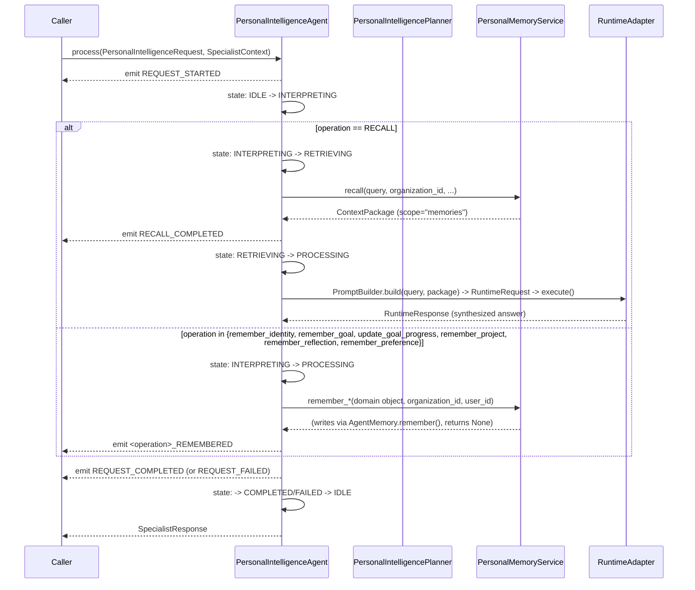
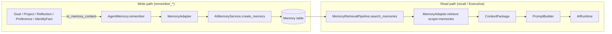
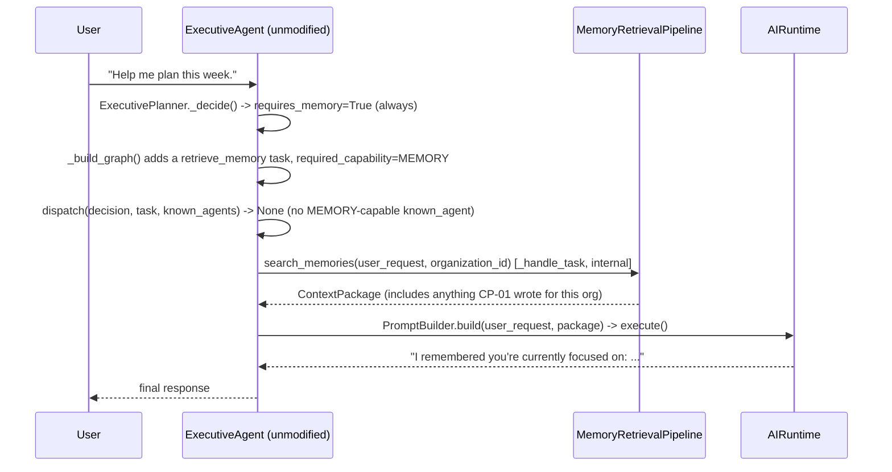
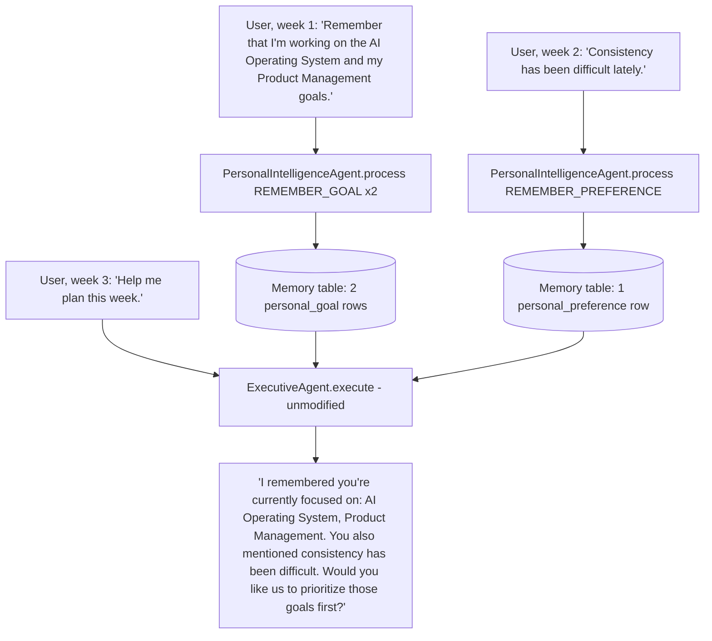

# CP-01.2 — Personal Intelligence Pack
## Implementation (Phase 3, v1)

Phase 1 ([PRD.md](PRD.md)) defined the product. Phase 2 ([Architecture.md](Architecture.md)) defined the full, twelve-domain engineering architecture and a multi-specialist strategy (§8) for CP-01's eventual complete scope. This document describes what Phase 3 actually shipped: a deliberately narrower, foundational **v1** — Identity, Goals, Projects, Reflections, Preferences, and natural Executive retrieval — realized as **one** `PersonalIntelligenceAgent`, built entirely on the frozen AI Operating System architecture (M20.7) with zero modification to any frozen interface.

## 1. Scope: What Shipped vs. What Architecture.md Envisioned

Architecture.md §3 describes twelve intelligence domains and §8 proposes a **Planning & Reflection Specialist** plus a **Decision Specialist** (v1), with Learning and Communication specialists deferred to v2. The Phase 3 brief given to this implementation explicitly narrowed that scope to a smaller, product-validated slice:

| Shipped in this phase | Deferred (not built) |
|---|---|
| Personal Identity | Decision Intelligence |
| Long-Term Goals | Learning Intelligence |
| Projects | Communication Intelligence (as a specialist) |
| Reflections | Business Intelligence |
| Preferences | Productivity Intelligence (as a specialist) |
| Executive Integration (automatic, via shared memory) | Relationship Intelligence |
| Memory Writing (`AgentMemory.remember()`/`forget()`) | Knowledge Intelligence |
| Conversation Intelligence (via retrieval, not hardcoded logic) | Life Intelligence / Personal Review synthesis |
| — | The Planning & Reflection / Decision specialist split from Architecture.md §8 |

One `PersonalIntelligenceAgent` covers every shipped capability internally (mirroring exactly how `ResearchAgent` internally orchestrates multiple concerns as steps, not as separately dispatched sub-agents — Architecture.md §8's own "Governing Principle"). The Decision/Learning/Communication/Business/Productivity/Relationship/Knowledge/Life domains, and the resulting multi-specialist split, remain open items for a later CP-01 phase — see §10 below.

"Projects" was not one of Architecture.md's original twelve domains; it was added in the Phase 3 brief as its own top-level capability and is treated here as a sibling of Goal Intelligence (§3.3), not a new architectural layer.

## 2. Prerequisite Closed: `AgentMemory.remember()`/`forget()`

Architecture.md §20 named this as CP-01's one hard blocker. It is now implemented in `MemoryAdapter` (`app/services/ai/agents/specialists/memory_adapter.py`), backed by the existing `AIMemoryService` (write path) alongside the already-working `MemoryRetrievalPipeline` (read path) — no parallel storage mechanism, no change to `AgentMemory`'s frozen four-method signature.

- `remember(item, **kwargs)` → `AIMemoryService.create_memory(organization_id, content, user_id=None, memory_type="general", title=None)`. Returns `None`, exactly matching the frozen signature — a caller that needs to later `forget()` what it just remembered finds it again via `retrieve()`/`search()` (whose `ContextItem.resource_id` is that same id), consistent with this being a semantic-retrieval memory system, not an addressable CRUD store.
- `forget(item_id: str)` — the frozen signature carries no `organization_id`, so `item_id` is the composite string `"{organization_id}:{memory_id}"`, reconstructed by a caller from a prior `retrieve()`/`search()` result plus the organization id it already has.

## 3. Modified Files

| File | Change |
|---|---|
| `app/services/ai/agents/specialists/memory_adapter.py` | `remember()`/`forget()` implemented for real (were `NotImplementedError`) |
| `app/tests/test_memory_adapter.py` | 2 stale `NotImplementedError`-expecting tests replaced; 10 new tests for `remember()`/`forget()` |
| `app/tests/architecture/dependency_rules.py` | New boundary `agents.specialists.personal_intelligence`, same allow-set as `agents.specialists.research` |

## 4. New Files

```
app/services/ai/agents/specialists/personal_intelligence/
    __init__.py
    shared/
        __init__.py
        types.py                  Metadata alias, memory_type constants (personal_identity/goal/project/reflection/preference)
        identity.py                IdentityAttribute (10 members), IdentityFact
        goal.py                    GoalCategory, GoalStatus, Goal, GoalProgressUpdate
        project.py                 Project
        reflection.py              ReflectionPeriod, Reflection
        preference.py              Preference
        request.py                 PersonalIntelligenceOperation (7 members), PersonalIntelligenceRequest
    memory_service.py             PersonalMemoryService — thin AgentMemory wrapper
    policies.py                   PersonalIntelligencePolicy
    state.py                      PersonalIntelligenceState, PersonalIntelligenceStateMachine
    events.py                     PersonalIntelligenceEventType, PersonalIntelligenceEvent, PersonalIntelligenceEventPublisher
    context.py                    build_personal_intelligence_context()
    planner.py                    PersonalIntelligencePlanner
    personal_intelligence_agent.py  PersonalIntelligenceAgent(SpecialistAgent) — the specialist itself

app/tests/personal_intelligence/
    test_domain_models.py          41 tests
    test_memory_service.py         13 tests
    test_policies.py               4 tests
    test_state.py                  10 tests
    test_events.py                 8 tests
    test_context.py                5 tests
    test_planner.py                9 tests
    test_personal_intelligence_agent.py   46 tests
    test_executive_integration.py  6 tests

docs/08_CAPABILITY_PACKS/CP-01_Personal_Intelligence_Pack/Implementation.md   this document
docs/04_CAPABILITIES/Personal_Intelligence_Pack.md                            capability reference
docs/05_AGENTS/Personal_Intelligence_Agent.md                                 agent reference
```

## 5. Why the Memory Model Stores Prose, Not Structured Fields

`app/models/memory.py`'s `Memory` row has exactly `id, organization_id, user_id, memory_type (str), title, content (Text), created_at, updated_at` — no metadata/JSON column (confirmed unmodified; adding one would be a frozen-schema change this phase deliberately avoids). Every CP-01 domain object (`Goal`, `Project`, `Reflection`, `Preference`, `IdentityFact`) therefore has a `to_memory_content() -> str` method rendering itself as natural-language prose — good for embeddings, and consistent with this being a semantic-retrieval memory system, not a structured query store. `memory_type` (`personal_identity`, `personal_goal`, `personal_project`, `personal_reflection`, `personal_preference` — all namespaced with a `personal_` prefix so a future pack's own "goal"/"project" notion never collides) is the only categorization tag; nothing else about a CP-01 fact is queryable except by semantic relevance.

Example — a `Goal`:

```python
Goal(title="AI Operating System", category=GoalCategory.CAREER, priority=1, progress=40.0).to_memory_content()
# "Goal (career): AI Operating System. Status: active. Priority: 1. Progress: 40%."
```

## 6. Execution Flow



`PersonalIntelligencePlanner` produces a fixed, two-task, observability-only plan (`SpecialistTaskType.UNKNOWN` — none of the closed taxonomy's members fit; `UNKNOWN` exists exactly "for tasks that don't fit yet"), the same "plan is an artifact, not a step-by-step driver" role `ResearchPlanner`'s plan already plays.

## 7. Memory Flow (Write and Read Are Symmetric, Never a New Store)



Both `PersonalIntelligenceAgent` (write + explicit recall) and `ExecutiveAgent` (automatic retrieval during ordinary conversation) go through the same `MemoryAdapter` / `Memory` table — there is exactly one memory store in this platform, and CP-01 introduces no second one.

## 8. Executive Integration — Automatic, Zero Executive Change

This is the mechanism that makes "the user should begin to feel that they are talking to THEIR AI" true without touching `ExecutiveAgent`, `Dispatcher`, or `ExecutivePlanner`:



**`PersonalIntelligenceAgent` deliberately does not declare `AgentCapability.MEMORY`.** `ExecutivePlanner`'s built-in `retrieve_memory`/`retrieve_conversations` tasks are tagged `required_capability=AgentCapability.MEMORY`; if CP-01 declared that capability too, `Dispatcher.dispatch()` — which matches by capability against `known_agents`, an instance map the Executive was constructed with — would route the Executive's own internal memory-retrieval steps to `PersonalIntelligenceAgent` instead of letting `_handle_task()` handle them internally. `PersonalIntelligenceAgent`'s `SpecialistResponse` return shape is incompatible with what those internal steps expect back (a raw `ContextPackage`), so this collision would silently break the Executive's own generic chat flow. `PersonalIntelligenceAgent` declares `PLANNING`/`WORKFLOWS`/`REASONING` instead — real capabilities of what it does, none of which the Executive's built-in graph ever dispatches on.

This was verified directly, not just reasoned about: `app/tests/personal_intelligence/test_executive_integration.py::test_personal_intelligence_agent_never_intercepts_the_executives_own_memory_retrieval_task` constructs an `ExecutiveAgent` **with `PersonalIntelligenceAgent` present in `known_agents`** and confirms the built-in pipeline call still happens directly and `PersonalIntelligenceAgent`'s own state machine never moves — proof it was never invoked.

A second path exists for explicit operations ("remember that I prefer concise answers") — those are delegated to `PersonalIntelligenceAgent` the same way a Research task is delegated to `ResearchAgent`, via `AgentExecutor.execute()`, once a real caller wires `PersonalIntelligenceAgent`'s instance into a request-scoped delegation table (not `known_agents`, since it isn't `AgentCapability`-dispatched — see Open Items, §10).

## 9. Conversation Flow (End-to-End, the PRD's Own Example)



No step in this flow is a hardcoded conversational branch — every "I noticed .../You've mentioned .../Last week you said ..." moment is retrieval surfacing prior content through the existing Prompt Builder + Runtime, exactly as the Phase 3 brief required ("This should happen through retrieval. Not hardcoded conversation logic").

## 10. Open Items Intentionally Deferred

- **Decision, Learning, Communication, Business, Productivity, Relationship, Knowledge, Life Intelligence** (Architecture.md §3) — none implemented; only Identity, Goal, Project, Reflection, Preference shipped, per the Phase 3 brief's explicit scope.
- **The Planning & Reflection / Decision specialist split** (Architecture.md §8) — v1 shipped as one `PersonalIntelligenceAgent`, not the two-specialist decomposition Architecture.md's fuller scope anticipated. Revisit once Decision Intelligence is in scope.
- **Explicit-delegation wiring** — `PersonalIntelligenceAgent` is registered in `AgentRegistry`/`SpecialistRegistry` and constructible via `AgentFactory`/`SpecialistFactory`, but no production code path yet constructs a live `ExecutiveAgent` with a request-scoped mechanism for routing "remember X" utterances to it (today's `Dispatcher` is purely `AgentCapability`-based, and CP-01 deliberately avoids `AgentCapability.MEMORY` — see §8). A capability-independent routing mechanism (e.g., intent classification feeding a dedicated dispatch path) is future work, out of this phase's scope.
- **`GoalProgressUpdate`/reflection history are append-only** — there is no "current progress" query; a caller (or a future Goal-summarization step) must fold a goal's progress-update stream itself. Matches the platform's semantic-retrieval-only memory model (Architecture.md §9); not a gap introduced by this phase.
- **No concrete `ConversationProvider`** exists platform-wide yet — CP-01, like every other specialist, is built and tested against fakes; real provider registration is a separate, later concern (unchanged from Architecture.md §20's own note).
