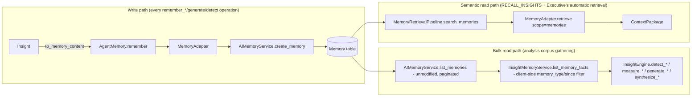
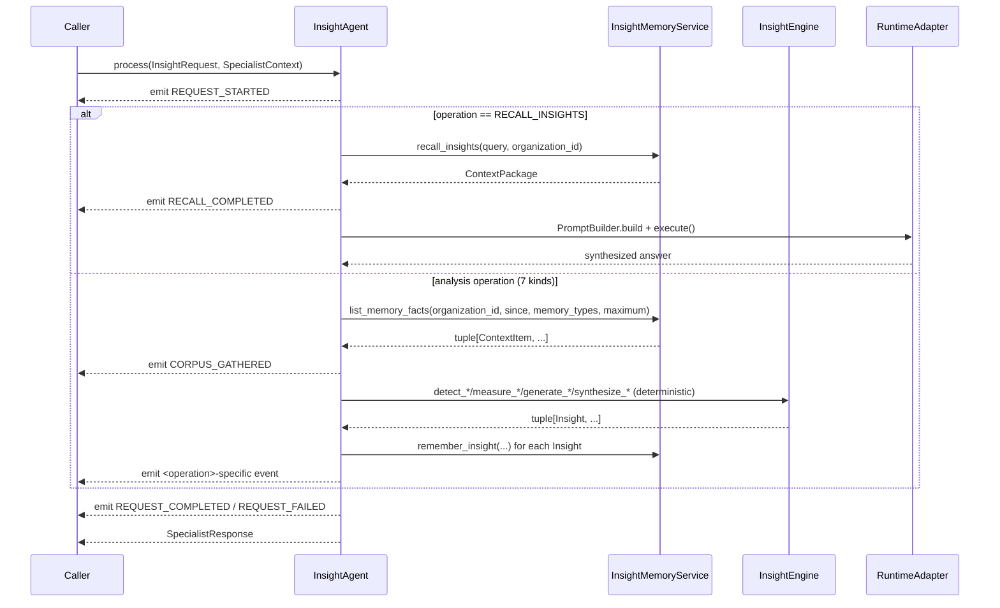

# CP-01.3 — Personal Intelligence Pack
## Implementation (Phase 4): Executive Cognition & Insight Engine

Phase 3 ([Implementation.md](Implementation.md), CP-01.2) gave the platform its first personal AI companion capable of remembering and retrieving identity, goals, projects, reflections, and preferences - a purely **reactive** capability: the companion knows what it was told, and surfaces it when asked or when the Executive's own retrieval happens to match. This phase adds the **Insight Engine** - the first capability that turns those stored memories into durable, connected, proactive understanding, without a new memory store, without changing retrieval behavior, and without modifying any frozen interface.

## 1. Companion Readiness Level: CRL-2 → CRL-3

This phase introduces the Companion Readiness Level (CRL) scale, a way to describe how far an AI companion has progressed from a stateless assistant toward genuine personal understanding:

| Level | Capability | Status |
|---|---|---|
| CRL-1 | Stateless - no memory across sessions, a generic LLM | Superseded (pre-CP-01) |
| CRL-2 | Remembers and retrieves - stores personal facts, recalls them on request or via the Executive's own automatic retrieval | **Achieved, CP-01.2** |
| CRL-3 | Recognizes, connects, and acts on patterns - detects recurring themes/habits/contradictions, measures goal alignment, produces periodic reflections and *proactive* recommendations without being asked, and maintains an evolving, explainable profile | **Achieved this phase, CP-01.3** |
| CRL-4+ | Not yet defined - a natural next direction is closing the loop from insight to *autonomous action* (not just recommending, but doing, within explicit permission boundaries), and cross-pack understanding (a Finance pack's data informing a Personal Intelligence insight, and vice versa) | Future, out of scope |

CRL-3 is "achieved" in the sense that the *capability* exists, is tested, and is proven to integrate automatically with the Executive - not in the sense that it has been exercised against a real user's actual data over real time. See §9 (Readiness Assessment) for the honest accounting of what remains before this is a lived experience rather than a working mechanism.

## 2. What Was Added

One new specialist, **`InsightAgent`**, nested inside the existing Personal Intelligence Pack package (`app/services/ai/agents/specialists/personal_intelligence/insight/`) - not a new top-level pack, not a new dependency-boundary entry (it inherits `agents.specialists.personal_intelligence`'s existing boundary by nesting under it), and not a modification to `PersonalIntelligenceAgent` itself. The two specialists are siblings: `PersonalIntelligenceAgent` is the *write/recall* surface (what CP-01.2 built), `InsightAgent` is the *cognition* surface built on top of what the first one (or the user, or ordinary conversation) has already written.

```
personal_intelligence/
    shared/
        insight.py              NEW: InsightType, InsightBasis, InsightPeriod, Insight
        types.py                 MODIFIED: + MEMORY_TYPE_INSIGHT ("personal_insight")
    insight/                     NEW package
        engine.py                InsightEngine - pure, deterministic detection/synthesis
        memory_service.py        InsightMemoryService - AgentMemory (write/recall) + AIMemoryService (bulk corpus read)
        policies.py               InsightPolicy
        state.py                  InsightState, InsightStateMachine
        events.py                 InsightEventType, InsightEvent, InsightEventPublisher
        context.py                build_insight_context()
        planner.py                InsightPlanner
        request.py                InsightOperation (8 members), InsightRequest
        insight_agent.py          InsightAgent(SpecialistAgent)
```

## 3. Why Detection Is Deterministic, Not an LLM Call

The brief's hardest constraint - "every generated insight must be traceable back to supporting memories rather than invented" - is only true *by construction*, not by prompt engineering, if the thing producing an Insight cannot hallucinate one. `InsightEngine` (`insight/engine.py`) is therefore a pure, no-I/O class, mirroring `ResearchSynthesizer`'s own precedent exactly: the same input always produces the same output, and every algorithm is a plain, auditable heuristic over the literal text of retrieved memories:

- **Pattern/habit detection**: a normalized term (stopword- and CP-01-template-word-filtered) recurring across ≥N distinct memories is "observed" as a plain count. Habits are the identical mechanism, scoped to `personal_reflection`-type memories only, labeled as a behavioral signal rather than a topical one.
- **Contradiction detection**: a Preference containing a negation marker ("don't", "not", "avoid", ...) followed by a term, matched against a Goal/Project/Reflection containing the same term *without* a nearby negation. Deliberately coarse (no stemming, no real NLU) - confidence is fixed low (0.4) to make that honest.
- **Alignment measurement**: for each Goal, the fraction of "recent activity" memories (Reflections + Projects) that share vocabulary with that Goal's own content. A goal that never recurs scores "not appearing," independent of how important the user considers it.
- **Recommendations, periodic reflections, and the profile summary** are template-based synthesis *over already-detected Insights* - never a fresh pass over raw text - so a recommendation is always traceable to the specific Insight (and therefore memories) that produced it.

`AIRuntime` is used in exactly **one** place - `RECALL_INSIGHTS`, rendering a natural-language answer over already-generated, already-traceable Insights via `PromptBuilder` + `RuntimeAdapter` - mirroring exactly how `PersonalIntelligenceAgent` reserves the Runtime for its own `RECALL` operation and nowhere else. Every other operation's stored content is deterministic template prose, guaranteeing traceability regardless of whether a Runtime call happens to be involved in presenting it.

## 4. Observed vs. Inferred

Every `Insight` (`shared/insight.py`) carries `basis: InsightBasis` (`OBSERVED` | `INFERRED`), enforced structurally: an `INFERRED` insight's `__post_init__` *requires* a non-empty `conclusion`, kept visibly separate from `observation` (the mechanical fact). `to_memory_content()` renders both clauses explicitly - `"Observed: ... Inferred: ..."` - so the distinction survives into the stored memory row itself, not just the in-process object. `supporting_memory_ids: tuple[int, ...]` is the exact set of `Memory` row ids (`ContextItem.resource_id`) an Insight was computed from; it is empty only for the honest "nothing to observe" case (e.g. a periodic reflection over a zero-memory window), never because evidence was omitted for a claim that needed it.

## 5. Memory Flow: One Store, Two Read Paths



The bulk-read path exists because pattern/habit/contradiction/alignment detection needs the actual corpus (which memories exist, of which type, from when), not a relevance-ranked slice of it for one query - something `AgentMemory.retrieve()`/`MemoryRetrievalPipeline` were never designed to provide and were **not modified to provide** (the brief's explicit "do not change retrieval behavior" constraint). `AIMemoryService.list_memories(organization_id, skip, limit)` already existed, unmodified, before this phase - `MemoryAdapter` already depended on `AIMemoryService` for its write path (`create_memory`); `InsightMemoryService` reuses the *same* collaborator for a second, already-existing capability of its own (`list_memories`), filtering by `memory_type`/`created_at` client-side over already-public `Memory` fields. This is not a new query parameter on any existing service and not a new repository method - see `insight/memory_service.py`'s own docstring for the full accounting.

`InsightEngine`'s corpus is always CP-01's five user-authored memory types (`ALL_MEMORY_TYPES`) - `personal_insight` (the engine's own prior output) is deliberately excluded, preventing unbounded self-reinforcement (an insight about an insight about an insight...).

## 6. Execution Flow



`InsightState` mirrors `PersonalIntelligenceState`'s shape (`IDLE → INTERPRETING → {GATHERING →} ANALYZING → COMPLETED/FAILED → IDLE`) - write-only PersonalIntelligenceAgent operations skip `RETRIEVING`; here, `RECALL_INSIGHTS` skips `GATHERING` (there is nothing to bulk-list for a single relevance query).

## 7. Executive Integration: The Same Mechanism, One Layer Up

`InsightAgent` deliberately does **not** declare `AgentCapability.MEMORY`, for the identical collision-avoidance reason `PersonalIntelligenceAgent` already documents (Architecture.md §7): `ExecutivePlanner`'s built-in `retrieve_memory` task is tagged `required_capability=AgentCapability.MEMORY`, and `InsightAgent`'s `SpecialistResponse` return shape does not fit where that internal step expects a raw `ContextPackage`. `InsightAgent` declares `REASONING`/`PLANNING` instead.

This means an Insight (a recommendation, a profile summary, a periodic reflection) surfaces in ordinary Executive conversation exactly the way a CP-01.2 fact does - automatically, via the shared `Memory` table, with zero delegation and zero Executive-side awareness that `InsightAgent` exists. Proven directly by `test_insight_executive_integration.py`, including the collision-avoidance case (`InsightAgent` present in `known_agents`, built-in retrieval still handled internally) and, most importantly, the **full cross-agent pipeline test**: `PersonalIntelligenceAgent` writes raw reflections → `InsightAgent` (with zero awareness `PersonalIntelligenceAgent` exists) detects the recurring theme and writes a recommendation → `ExecutiveAgent` (with zero awareness either agent exists) surfaces it in a later, unrelated conversation.

## 8. Test Summary

**171 new tests**, all passing (2368 total platform-wide, up from 2197 at the end of CP-01.2 - zero regressions):

| File | Tests | Covers |
|---|---|---|
| `test_insight_domain_model.py` | 22 | `Insight`/`InsightType`/`InsightBasis`/`InsightPeriod` validation, coercion, `to_memory_content()` rendering |
| `test_insight_engine.py` | 37 | Every detection/synthesis algorithm: threshold behavior, empty-input handling, determinism, exact supporting-id traceability |
| `test_insight_memory_service.py` | 17 | `remember_insight`/`recall_insights` (AgentMemory), `list_memory_facts` pagination/filtering (AIMemoryService, unmodified) |
| `test_insight_policies.py` | 4 | `InsightPolicy` defaults, no duplication of `SpecialistExecutionPolicy` fields |
| `test_insight_state.py` | 10 | `InsightStateMachine` transition table |
| `test_insight_events.py` | 8 | `InsightEvent`/`InsightEventPublisher` |
| `test_insight_context.py` | 5 | `build_insight_context()` |
| `test_insight_planner.py` | 10 | `InsightPlanner`'s fixed, ANALYSIS/SUMMARIZATION-typed plan |
| `test_insight_agent.py` | 50 | ABC conformance, registry/Open-Closed, all 8 operations, events, state, failures, max-depth policy, execution identity, org-scoping, lookback-window filtering, self-reference exclusion |
| `test_insight_executive_integration.py` | 8 | Automatic surfacing, collision avoidance, org scoping, **and the full PersonalIntelligenceAgent → InsightAgent → ExecutiveAgent pipeline** |

## 9. Readiness Assessment

The mechanism is real, tested, and proven to integrate automatically - this is a genuine CRL-3 *capability*. What is intentionally **not** claimed:

- **No wall-clock scheduling exists.** "Periodic reflections (daily, weekly, monthly)" means `InsightAgent` can *produce* a reflection for a given period on request (`GENERATE_PERIODIC_REFLECTION`, parameterized by `InsightPeriod` and a lookback window) - nothing in this platform triggers that call automatically on a calendar. The AI Operating System's Kernel has no working scheduler (`Kernel.md`: "most of the Kernel is a declared contract, not yet a working engine") and adding one is out of this phase's scope; a caller (a cron job, a request handler, a future scheduling capability) must invoke the operation.
- **No production `ExecutiveAgent` deployment yet constructs `known_agents` with either `PersonalIntelligenceAgent` or `InsightAgent`** for *explicit* delegation - both are registered and constructible (`AgentFactory`/`SpecialistFactory`), and the automatic/passive integration path is fully proven, but active delegation ("give me my weekly reflection" routed *to* `InsightAgent` by the Executive) needs a routing mechanism the platform doesn't have yet (see CP-01.2's own Implementation.md §10 - unchanged by this phase).
- **The detection heuristics are intentionally coarse.** No stemming, no synonym awareness, no real NLU for contradiction detection. False negatives are expected and documented; false positives are bounded by requiring exact term matches, never invented ones.
- **No concrete `ConversationProvider` exists platform-wide** - built and tested against fakes, like every specialist in this platform.

## 10. Open Items Intentionally Deferred

- Wall-clock/cron-driven periodic reflection triggering.
- Active Executive delegation wiring for both CP-01 specialists.
- Cross-pack insight correlation (a future pack's data informing a Personal Intelligence insight, or vice versa) - explicitly a CRL-4+ concern, not attempted here.
- Stemming/synonym-aware term matching for pattern/contradiction detection.
- A "current progress" query for goals (still append-only, per Architecture.md §9 - unchanged).
