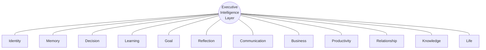
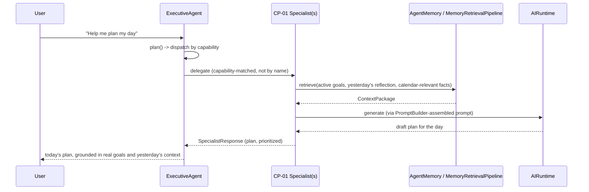

# CP-01 — Personal Intelligence Pack
## Product Requirements Document (Phase 1)

| | |
|---|---|
| **Status** | Draft — Phase 1 (Product Requirements) |
| **Owner** | Product / AI Systems Architecture |
| **Built on** | AI Operating System v1.0 (frozen, [ARCHITECTURE_FREEZE_v1.md](../../ARCHITECTURE_FREEZE_v1.md)) |
| **Pack ID** | CP-01 |
| **Depends on (platform, unchanged)** | Kernel, Runtime, Shared Execution Context, Identity Model, Event System, Middleware Framework, Conversation Framework, Tool Framework, Vision Framework, Specialist Framework, Executive Framework, Agent Framework, Memory Framework, Prompt Builder, Retrieval Pipeline |
| **Next phases** | Phase 2 — Engineering Architecture: **complete**, see [Architecture.md](Architecture.md). Phase 3 — Implementation Plan: not started. |

This document is a product specification. It contains no Python, no package layout, and no class design — those are Phase 2 and Phase 3 deliverables that must conform to this PRD, not the other way around. Every platform capability referenced below (Specialist Framework, `AgentMemory`, `ToolManager`, `PromptBuilder`, `VisionRuntime`, `ConversationProvider`, the Executive's capability-based `Dispatcher`) already exists, is frozen, and is referenced here only to establish *what CP-01 integrates with*, never *how it is coded*.

---

## 1. Vision

The Personal Intelligence Pack is the first Capability Pack built on the frozen AI Operating System. It turns the platform from a capable-but-empty execution substrate into a persistent, individually-scoped executive intelligence: a system that plans with one person, remembers for them, learns about them, and helps them decide, communicate, produce, and grow — compounding in value the longer it is used, because unlike a stateless assistant, what it learns never resets.

CP-01 is not just a product. It is the **reference implementation and foundation** every subsequent Capability Pack (Finance, Trading, Business, Coding, Marketing, Legal, Health, a dedicated Vision pack) is built to extend. Decisions made here about identity modeling, memory categorization, goal tracking, and privacy set the pattern the rest of the platform's product surface will follow.

## 2. Problem Statement

The AI Operating System already has the execution substrate required for persistent, personalized intelligence — a Memory Framework, an Executive that can plan and delegate, a Specialist Framework built for exactly this kind of extension, a Prompt Builder that assembles context, a Retrieval Pipeline that recalls it. What is missing is a product that actually *uses* that substrate to build and sustain a continuous model of one individual.

Today's AI assistants — including what the platform could trivially expose without CP-01 — are functionally stateless from the user's point of view: each session starts near zero, prior context has to be re-explained, and nothing compounds. The problem CP-01 solves is not "can the platform remember things" (the Memory Framework already can) — it is "does anything on the platform actually turn that capability into a coherent, trustworthy, continuously-improving understanding of one person's life and work." Nothing does, yet.

## 3. Goals

1. Establish continuous, compounding understanding of one individual — identity, goals, preferences, projects, decisions, relationships, knowledge — across sessions, domains, and time.
2. Ship the first Capability Pack as a genuinely useful, end-to-end product: daily planning, reflection, decision support, goal tracking, and knowledge capture that a real person would use daily.
3. Prove out the platform's full extension surface (Specialist Framework, `AgentMemory`, `ToolManager`, `PromptBuilder`, `VisionRuntime`, `ConversationProvider`) under sustained, real product use — the first genuine stress test of the frozen architecture.
4. Establish the data-ownership, memory-categorization, and privacy patterns every subsequent pack (especially Finance and Health, the most sensitive future packs) will inherit rather than reinvent.
5. Become the Executive's durable notion of "this specific person" — not a bolt-on feature, but the thing that makes `ExecutiveAgent` an executive *for someone*, rather than a stateless coordinator.

## 4. Non-Goals

- **Not a multi-user or enterprise product.** CP-01 is single-user, personally scoped. Team/organizational features belong to a future Enterprise Operating System pack that *composes* multiple personal/domain packs — CP-01 must not preclude that composition, but does not build it.
- **Not a general-purpose chatbot.** Every interaction is scoped to the user's own life/work context. Open-domain question answering with no personal grounding is explicitly not this pack's job.
- **Not a replacement for domain-specialist packs.** CP-01's Business Intelligence tracks lightweight business context; it does not do deep financial modeling (Finance Pack), trade execution (Trading Pack), or medical assessment (Health Pack). CP-01 is the backbone those packs plug into.
- **Does not introduce new platform primitives.** No new registries, execution engines, or changes to Kernel/Runtime/Shared Execution Context/any frozen interface. Every capability below is realized through existing extension points.
- **Does not take autonomous action on sensitive systems** in v1 — no autonomous sending of communications, no autonomous purchases, no autonomous execution of any real-world consequence. Decision support and drafting, always reviewed by the user before anything leaves the system.
- **Not a relationship-graph product for other people.** Relationship Intelligence (§9.10) is the user's own record of *their* relationships, not an independent model of another person's identity, and never a mechanism for one user's pack to model or contact another user.

## 5. Target Users

| Persona | Description | Primary need |
|---|---|---|
| **Primary: The Individual Operator** | A founder, executive, knowledge worker, or professional managing multiple projects, decisions, and relationships across work and life. | A single intelligence layer that remembers everything relevant and helps them think, plan, and decide better over time. |
| **Secondary (future, not v1): Teams/Organizations** | Consumed only via a future Enterprise Operating System pack that composes multiple individual Personal Intelligence Packs. | Out of scope for CP-01 itself; the architecture must not block it. |
| **Internal: Platform Engineering** | The team building CP-02 onward. | CP-01 as the reference pattern for pack anatomy, memory use, and privacy handling. |

## 6. Core Value Proposition

> An executive intelligence that actually remembers, actually knows you, and actually helps you decide — and gets more valuable every time you use it, because everything it learns persists into the next conversation instead of vanishing when the session ends.

## 7. Success Metrics

| Metric | What it measures | Target signal for v1 |
|---|---|---|
| **Context continuity rate** | % of sessions where a prior fact/goal/preference is correctly recalled and used without the user re-stating it | Directionally increasing session over session for a given user |
| **Daily/weekly journey engagement** | Usage of Morning Planning, Evening Reflection, Weekly Review journeys | Sustained use across at least 4 consecutive weeks in dogfooding |
| **Goal follow-through rate** | % of tracked goals with at least one recorded progress update within their review cadence | Non-zero and improving — proves Goal + Reflection Intelligence are functioning together, not just capturing and forgetting |
| **Decision-support trust** | Qualitative user feedback on whether recommendations felt grounded in real context vs. generic | Positive in structured user feedback |
| **Re-explanation burden** | Frequency of the user needing to restate context the pack should already know | Decreasing over time per user |
| **Architectural integrity** | Zero modifications to any frozen interface; full pass of `app/tests/architecture/` | 100% — this is a hard gate, not a target |
| **Test coverage parity** | New pack code tested to the same standard as existing frameworks (hand-written fakes, ABC-enforcement-style tests, no mocks) | Matches the bar set by `ResearchAgent`'s own test suite |

## 8. Guiding Principles

1. **Reuse, never fork.** Every capability is built through existing extension points. If a capability seems to need a platform change, that is a signal to reconsider the capability's design, not the platform's.
2. **Compounding memory over one-shot context.** Every interaction should leave the pack's understanding of the user measurably better than before it.
3. **Executive-first.** CP-01 is how `ExecutiveAgent` gains a durable notion of *this specific person* — it is delegated to and coordinated by the Executive like any other specialist work, not a parallel system the Executive is unaware of.
4. **Privacy and user control are foundational.** This pack will accumulate the most sensitive data of any Capability Pack that will ever exist on this platform. Every design decision defaults to user control, not platform convenience.
5. **Deterministic where it matters, intelligent where it helps.** Planning and dispatch stay predictable (matching the Executive's own `ExecutivePlanner` philosophy — deterministic, not adaptive); synthesis, reflection, and drafting lean on the Runtime's conversational capability.
6. **Extensible by design.** Every future domain pack should be able to read from CP-01's identity/goal/memory model through defined interfaces rather than re-deriving its own notion of who the user is.
7. **Surface counterpoints, not just confirmations.** A system built entirely from one person's own past decisions and preferences risks becoming an echo chamber. Decision Intelligence and Reflection Intelligence must be designed to surface tensions and blind spots, not only validate prior thinking.

## 9. Functional Requirements

Twelve intelligence capabilities make up CP-01. Each is described by purpose, what it captures/produces, and which platform components it is expected to lean on — not by internal design. Phase 2 will determine how many concrete Specialist Agents realize these twelve capabilities (one, several, or a coordinated set) — this document deliberately does not decide that.

| # | Capability | Purpose | Primary platform hooks |
|---|---|---|---|
| 9.1 | Identity Intelligence | Maintains a durable, continuously refined model of who the user is: roles, context, preferences, communication style, values, constraints. Everything else is interpreted through it. | `AgentMemory` (durable facts), `SharedExecutionContext` (user/organization scoping) |
| 9.2 | Memory Intelligence | The pack's disciplined use of the platform's Memory Framework: categorized durable facts, episodic history, and semantic retrieval of whatever is relevant to the current request. | `AgentMemory`/`MemoryAdapter`, `MemoryRetrievalPipeline`, Retrieval Pipeline |
| 9.3 | Decision Intelligence | Structures a decision (options, tradeoffs, criteria), surfaces relevant past decisions and their outcomes, and produces a reasoned recommendation. Never executes the decision. | `MemoryRetrievalPipeline` (precedent), `AIRuntime`/`PromptBuilder` (reasoning), optionally `ResearchAgent` (delegated research) |
| 9.4 | Learning Intelligence | Structures learning sessions, tracks what has been learned and how well, and reinforces retention across sessions. | `AgentMemory` (progress state), `AIRuntime` (explanation/quizzing) |
| 9.5 | Goal Intelligence | Tracks goals across timeframes (daily/weekly/quarterly/life horizon), decomposes them into actionable steps, monitors progress, prompts course-correction. | `AgentMemory` (goal state), Executive dispatch (for goal-linked task delegation) |
| 9.6 | Reflection Intelligence | Structured reflection (evening, weekly): summarizes what happened, extracts lessons, feeds realizations back into Memory and Goal Intelligence. | `AgentMemory` (write path), `PromptBuilder`/`AIRuntime` (synthesis) |
| 9.7 | Communication Intelligence | Assists drafting and reviewing communication (messages, notes, emails) in the user's own voice, informed by Identity Intelligence. Never sends autonomously. | `AIRuntime`/`PromptBuilder`, Identity Intelligence (voice/tone) |
| 9.8 | Business Intelligence | Tracks businesses/projects the user is involved in — state, key facts, decisions — as the seed future Finance/Trading/Business packs extend. Does not itself model financials in depth. | `AgentMemory`, Executive dispatch (hand-off point for future packs) |
| 9.9 | Productivity Intelligence | Daily/weekly planning, task prioritization, time-awareness; integrates with external calendar/task tools once such tools are registered on the platform. | `ToolManager` (future concrete tools), `AgentMemory` (plan state) |
| 9.10 | Relationship Intelligence | Tracks key relationships relevant to the user's goals/decisions — who they are, context, interaction history — strictly as the user's own record, never an independent model of the other person. | `AgentMemory` |
| 9.11 | Knowledge Intelligence | Captures and organizes knowledge the user wants retained (notes, insights, references); feeds the Retrieval Pipeline for later recall; future Vision-assisted capture (photographed notes/documents) once a Vision provider exists. | `MemoryRetrievalPipeline`, `VisionRuntime` (future) |
| 9.12 | Life Intelligence | The synthesizing layer: a holistic view across every other capability, used for high-level check-ins. The most "executive summary"-shaped capability, most directly exercising the Executive Framework's synthesis role. | Executive Framework, all of the above |

## 10. User Journeys

### 10.1 Morning Planning (representative journey — full detail)

**Trigger**: User starts their day and opens the pack.
**Capabilities exercised**: Productivity, Goal, Identity, Memory Intelligence.

**Outcome**: a prioritized plan for the day, grounded in the user's actual active goals and the prior evening's reflection — not a generic to-do list.

### 10.2 Evening Reflection

**Trigger**: End of day. **Capabilities**: Reflection, Memory, Goal.
User is prompted (or initiates) a short structured reflection: what happened, what went well, what didn't, what was learned. The pack summarizes the day against the morning's plan, writes durable facts/lessons back to Memory, and updates goal progress.

### 10.3 Learning Session

**Trigger**: User wants to study/learn something. **Capabilities**: Learning, Memory, Knowledge.
The pack retrieves what's already known/previously covered on the topic, structures the session, and after it, records progress and any new durable facts for future reinforcement.

### 10.4 Project Planning

**Trigger**: User starts or revisits a project. **Capabilities**: Goal, Business, Productivity, Memory.
The pack retrieves everything known about the project, helps decompose it into goals/tasks, and links those tasks back into Goal Intelligence's tracking.

### 10.5 Decision Support

**Trigger**: User faces a decision. **Capabilities**: Decision, Memory, Identity.
The pack structures the decision (options/criteria/tradeoffs), retrieves relevant precedent from Memory (similar past decisions and their outcomes), and — per Guiding Principle 7 — explicitly surfaces counterarguments or risks the user's own history suggests they might underweight, before producing a recommendation.

### 10.6 Career Coaching

**Trigger**: User seeks career guidance. **Capabilities**: Identity, Goal, Reflection, Business.
Combines the user's stated values/goals (Identity, Goal) with reflection history to ground coaching conversations in the user's actual trajectory, not generic advice.

### 10.7 Business Strategy

**Trigger**: User wants to think through business strategy. **Capabilities**: Business, Decision, Memory.
Retrieves tracked business context and prior related decisions; may delegate research-shaped sub-questions to the existing `ResearchAgent` rather than re-implementing research inside CP-01.

### 10.8 Personal Review

**Trigger**: Periodic (e.g., monthly). **Capabilities**: Life Intelligence (primary), all others (inputs).
A synthesized, holistic check-in across goals, business, relationships, learning, and reflection — the clearest exercise of Life Intelligence's synthesizing role.

### 10.9 Meeting Preparation

**Trigger**: User has an upcoming meeting. **Capabilities**: Relationship, Business, Memory, Communication.
Retrieves relevant relationship history and business context for the people/topic involved, and can help draft talking points or an agenda.

### 10.10 Weekly Review

**Trigger**: End of week. **Capabilities**: Reflection, Goal, Productivity, Life.
A heavier version of Evening Reflection scoped to the week — aggregates the week's reflections, updates goal progress at a coarser grain, and sets the frame for the next week's Morning Planning.

## 11. Data Ownership

| Data | Owned by | Notes |
|---|---|---|
| Durable personal facts (identity, preferences, goals, business context, relationship notes, learning progress) | **CP-01** | The pack's primary data product — written and read via `AgentMemory`, scoped to one user via `SharedExecutionContext` |
| Raw conversation/message history | **Platform's existing Conversation Memory layer** (`Conversation`/`ConversationMessage`, outside this pack) | CP-01 reads from it via the Retrieval Pipeline when relevant; it does not re-own or duplicate it |
| Embeddings / vector storage | **Platform's Vector Memory layer** (`embedding/`, `vector_store/`) | CP-01 never talks to these directly — only through `AgentMemory`/`MemoryRetrievalPipeline` |
| Deep financial transaction data | **Future Finance Pack** | CP-01's Business Intelligence tracks lightweight context (what the business is, key facts, decisions) — not ledgers, statements, or transactions |
| Trade/position data | **Future Trading Pack** | Not CP-01's concern at all |
| Medical/health records | **Future Health Pack** | Not CP-01's concern at all |
| Legal documents/contracts | **Future Legal Pack** | Not CP-01's concern at all |
| Source code / engineering artifacts | **Future Coding Pack** | Not CP-01's concern at all |

**Principle**: CP-01 owns the *person* — identity, goals, preferences, relationships, reflections, and lightweight cross-domain context. It does not own *domain depth* in any vertical a future pack is meant to own. Where a future pack needs to know something about the user, it reads through CP-01's identity/goal model rather than each pack maintaining its own copy.

## 12. Integration Points

| Platform component | How CP-01 integrates |
|---|---|
| **Executive Agent** | CP-01's specialist(s) register into `SpecialistRegistry` with accurate capability metadata; `ExecutiveAgent`'s `Dispatcher` reaches them by capability match, never by name. CP-01 does not modify `ExecutiveAgent`, `ExecutivePlanner`, or `Dispatcher`. |
| **Research Agent** | For research-shaped sub-questions (e.g., inside Business Strategy or Decision Support), CP-01 delegates to the existing `ResearchAgent` via the Executive rather than re-implementing research. |
| **Memory** | `AgentMemory`/`MemoryAdapter` is CP-01's primary read/write interface; `MemoryRetrievalPipeline` is how it recalls relevant context. CP-01 is the platform's first sustained, high-volume consumer of the Memory Framework's write path — see §16, Risks, on the `remember()`/`forget()` dependency. |
| **Runtime** | All conversational synthesis (planning language, reflection summaries, decision recommendations, drafted communication) goes through `AIRuntime`, never a vendor SDK directly. |
| **Vision** | Once a concrete Vision provider is registered, Knowledge Intelligence uses `VisionRuntime` for capturing photographed notes, documents, or whiteboards. Not blocking for v1 (no provider exists yet). |
| **Tools** | Productivity Intelligence integrates with external calendar/task systems once corresponding tools are registered in `ToolRegistry`; CP-01 calls them only through `ToolManager`. |
| **Conversation** | CP-01 never depends on a specific vendor — every LLM-backed capability goes through the `ConversationProvider` abstraction via the Runtime. |
| **Prompt Builder** | Every synthesized response is assembled via `PromptBuilder`, combining retrieved memory context with the current request — CP-01 does not hand-roll prompt assembly. |
| **Retrieval Pipeline** | The mechanism by which CP-01's Memory and Knowledge Intelligence recall relevant history; CP-01 never queries embeddings or the vector store directly. |
| **Future Capability Packs** | CP-01 is the backbone other packs read from (identity, goals, business context). Per the Pack Independence principle ([Capability_Strategy.md](../Capability_Strategy.md)), no future pack imports CP-01's concrete types directly — cross-pack needs are expressed through the Executive's capability-based dispatch, the same way CP-01 itself never imports another pack by name. |

## 13. Security, Privacy, and User Control

| Area | Requirement |
|---|---|
| **Tenant/user scoping** | All CP-01 data is scoped via the platform's existing `organization_id`/`user_id` identity fields (`SharedExecutionContext`) — no parallel scoping mechanism is introduced. |
| **Permission model** | CP-01's specialists and any tools it uses declare least-privilege permissions at registration time, following the platform's existing `ToolPermission`/capability-declaration pattern — never broad, undeclared access. |
| **Sensitive information classification** | Memory categories with elevated sensitivity (financial-adjacent, health-adjacent, relationship data about third parties) must be distinguishable at the product level so future retention/access policy can treat them differently from routine planning notes. |
| **Memory retention** | Default retention behavior must be explicit and user-visible per category (e.g., "reflections retained indefinitely unless deleted" vs. "transient planning notes retained N days") — not implicit, not silent. |
| **Deletion / the right to be forgotten** | The user must be able to request deletion of specific facts, categories, or their entire CP-01 memory. **This is a hard product requirement that depends on closing the platform's current `AgentMemory.forget()` gap** (today `NotImplementedError` — see [Memory_System.md](../../03_INTELLIGENCE/Memory_System.md)). CP-01 cannot ship its full v1 scope without this; see Risks (§16) and Acceptance Criteria (§15). |
| **User control** | The user can view what the pack has remembered about them, correct inaccuracies, and export their own data. Nothing is remembered silently in a way the user cannot inspect. |
| **No autonomous external action** | Communication Intelligence drafts; it does not send. Productivity Intelligence plans; it does not autonomously modify external calendars/systems without explicit user confirmation, even once tools exist for it. |
| **No cross-user data sharing** | Relationship Intelligence records are the user's own notes about their relationships — never shared with, or matched against, another user's pack. |
| **Third-party data about non-users** | Information CP-01 holds about people who are not themselves platform users (contacts, colleagues, family) is held as the user's own record for the user's own benefit, not as an independent profile of that third party, and is subject to the same deletion controls as any other CP-01 data. |

## 14. Future Expansion

CP-01 is designed so every subsequent Capability Pack inherits from it rather than duplicating it:

| Future pack | What it inherits from CP-01 |
|---|---|
| **Finance Pack** | Identity (financial goals/values already captured), Business Intelligence's lightweight business context as a seed, Goal Intelligence's tracking mechanics |
| **Trading Pack** | Identity (risk tolerance, values), Decision Intelligence's precedent-surfacing pattern |
| **Business Pack** | Business Intelligence directly extended into deeper operational tracking |
| **Coding Pack** | Productivity/Goal Intelligence for project tracking; Identity for working style/preferences |
| **Marketing Pack** | Business Intelligence context; Communication Intelligence's voice/tone modeling |
| **Legal Pack** | Business Intelligence context; Knowledge Intelligence's document capture pattern (via Vision, once available) |
| **Health Pack** | Identity and Goal Intelligence's tracking mechanics; strictest application of the sensitivity/retention requirements CP-01 establishes in §13 |
| **Vision Pack** | CP-01's Knowledge Intelligence is the first real consumer once `VisionRuntime` has a concrete provider — proving the integration before Vision Pack builds further on it |

No future pack modifies CP-01's data model directly. Each reads through CP-01's identity/goal/memory surface and extends with its own domain-specific specialists and tools, per [Capability_Strategy.md](../Capability_Strategy.md)'s Pack Independence principle.

## 15. Acceptance Criteria (v1 "Done")

CP-01 v1 is complete when **all** of the following hold:

1. All of Identity, Memory, Goal, Reflection, and Productivity Intelligence (the v1 scope — see §18) are implemented and demonstrable through at least one working user journey each (Morning Planning, Evening Reflection, Weekly Review, at minimum).
2. CP-01 registers at least one Specialist Agent, discoverable by `ExecutiveAgent`'s `Dispatcher` via capability matching — never by hardcoded name.
3. Memory categorization and retrieval demonstrably compound across sessions: a fact captured in one session is correctly retrieved and used in a later, unrelated session.
4. `AgentMemory.remember()`/`forget()` are implemented and CP-01 uses them for its write path (no bypass, no parallel storage mechanism).
5. The user can view, correct, and delete what CP-01 has remembered about them.
6. Zero modifications to any frozen platform interface — verified by a full, unmodified pass of `app/tests/architecture/`.
7. Full test coverage of CP-01's own code, to the standard already set by `ResearchAgent` (hand-written fakes, ABC-conformance tests where applicable, no mocks).
8. Documentation for CP-01 exists at the same standard as the rest of `docs/` — architecture (Phase 2), and updated `Capability_Strategy.md`/`Roadmap.md` entries marking CP-01 as shipped.
9. The full platform test suite continues to pass with zero regressions.

## 16. Risks

| Risk | Impact | Notes |
|---|---|---|
| **`AgentMemory.remember()`/`forget()` are not implemented today** | High — blocking | CP-01 cannot function without a write path or honor deletion requirements. Closing this is additive work against an already-declared contract (`AgentMemory`), not a redesign, but it is a hard dependency that must be sequenced before or alongside CP-01's build. |
| **No concrete Tool Framework tools, Vision providers, or Conversation providers exist yet** | Medium | Journeys needing external calendar/task integration, photographed-document capture, or a real LLM vendor are blocked until at least one concrete implementation is registered. This affects v2/v3 scope more than v1's core text-based journeys. |
| **Privacy/sensitivity mishandling** | High | This pack accumulates the most sensitive personal data of any pack planned. A misstep here damages trust in every future pack that inherits its patterns. |
| **Scope creep across twelve intelligence capabilities** | Medium | Mitigated by explicit v1/v2/v3 phasing (§18) — not all twelve ship at once. |
| **Retrieval quality is inherited, not controlled** | Medium | Memory recall quality depends on the existing `RankingEngine`/embedding pipeline; CP-01 cannot fix retrieval-quality issues that originate below it, only work within them. |
| **Echo-chamber effect** | Medium | A system built entirely from one person's own history can reinforce blind spots rather than challenge them. Mitigated by Guiding Principle 7 (surface counterpoints), which must be carried into Phase 2's design of Decision and Reflection Intelligence specifically. |
| **Over-personalization creating lock-in without portability** | Low–Medium | The user-control and export requirements in §13 exist specifically to keep this from becoming a trust liability. |

## 17. Out of Scope

- Multi-user, team, or organizational features (deferred to a future Enterprise Operating System pack).
- Autonomous execution of real-world consequential actions (sending communications, purchases, trades) without explicit user review.
- Deep domain expertise belonging to a future vertical pack (financial modeling, medical assessment, legal advice, trade execution, source-code generation).
- Any new platform primitive, registry, execution engine, or modification to a frozen interface.
- Client/delivery surfaces (mobile app, desktop app, browser extension) — this PRD specifies the intelligence layer, not a UI.
- Real-time/streaming interaction beyond what `AIRuntime.execute_stream()` already provides.
- Modeling another platform user's identity or relationships from CP-01 (see §13).

## 18. Roadmap

| Version | Scope |
|---|---|
| **v1** | Identity, Memory, Goal, Reflection, and Productivity Intelligence. Journeys: Morning Planning, Evening Reflection, Weekly Review, Project Planning. Text/Conversation-based only (no Vision, no external tools required). Requires `AgentMemory.remember()`/`forget()` closed out. One or more Specialist Agents registered and capability-dispatchable. |
| **v2** | Decision Intelligence, Learning Intelligence, Communication Intelligence (drafting), Knowledge Intelligence (including Vision-assisted capture, once a Vision provider exists), Relationship Intelligence. Journeys added: Learning Session, Decision Support, Meeting Preparation, Career Coaching. Richer tool integrations (calendar/task tools) as they become available on the platform. |
| **v3** | Business Intelligence matured into a real hand-off surface for Finance/Trading/Business packs. Life Intelligence as a synthesized, holistic check-in journey (Personal Review). Proactive (not purely reactive) prompts — e.g., the pack initiating a check-in rather than only responding. Formal extension interfaces documented for CP-02 onward to build against CP-01's identity/goal model directly. |

---

**This document is the canonical specification for CP-01.** Phase 2 (Architecture Specification) must satisfy every functional requirement, user journey, data-ownership boundary, and security requirement above without modifying any frozen platform interface. Any conflict discovered during Phase 2 between this PRD and the frozen architecture is resolved by revising this PRD, not by touching the platform.
