# CP-02 — Product Management Intelligence Pack
## Engineering Architecture (Phase 2)

| | |
|---|---|
| **Status** | Draft — Phase 2 (Engineering Architecture) |
| **Precedes** | Phase 3 — Implementation Plan (not started) |
| **Built from** | [PRD.md](PRD.md) (Phase 1, complete) |
| **Built on** | AI Operating System v1.0, frozen ([ARCHITECTURE_FREEZE_v1.md](../../ARCHITECTURE_FREEZE_v1.md)) |
| **Built on (pack)** | CP-01 — Personal Intelligence Pack, Phases 1–4 complete ([Architecture.md](../CP-01_Personal_Intelligence_Pack/Architecture.md), [Implementation.md](../CP-01_Personal_Intelligence_Pack/Implementation.md), [Implementation_Insight_Engine.md](../CP-01_Personal_Intelligence_Pack/Implementation_Insight_Engine.md)) |
| **Frozen frameworks this document must not redesign** | Kernel, Runtime, Shared Execution Context, Event System, Middleware, Conversation Framework, Memory Framework, Prompt Builder, Retrieval Pipeline, Tool Framework, Vision Framework, Specialist Framework, Executive Framework, Agent Framework |
| **Shipped pack this document must not redesign or modify** | CP-01 — `PersonalIntelligenceAgent`, `InsightAgent`, and every memory/state/event/policy type under `personal_intelligence/` |

This document contains no Python, no package structure, and no pseudocode. Every mechanism described below already exists on the frozen platform or in the completed CP-01 pack; this document's only job is to say precisely how CP-02's professional product-management capabilities are organized, layered, bounded, and wired onto that existing mechanism — not to invent new mechanism. Where a genuine open question remains (there is one — see §9, revisited in §20), it is named explicitly rather than worked around with a private, CP-02-specific mechanism.

---

## 1. Overall Architecture

CP-02 exists to answer a question CP-01's architecture deliberately does not: not "who is this person" (CP-01), but "what does this person manage, professionally, as a product manager, and what does good product judgment look like applied to it." CP-02 is a **second Capability Pack layered onto the first** — the platform's first proof that a pack can specialize another pack's output into a professional domain without touching either the platform or the pack beneath it.

Architecturally, CP-02 is built from three kinds of material, none of it new mechanism:

1. **Platform mechanism, reused directly** — the same Executive Framework, Specialist Framework, Memory Framework, Prompt Builder, Runtime, Tool Framework, and Vision Framework CP-01 already builds on, used exactly the same way.
2. **CP-01 output, read through the existing Memory Framework** — identity, goals, reflections, and (per CP-01.3) insights are memories CP-01 already writes; CP-02 is simply another disciplined reader of them, via the same `AgentMemory`/`MemoryRetrievalPipeline` surface every consumer uses.
3. **New, CP-02-owned professional content** — product artifacts, decisions, discovery evidence, roadmaps, stakeholder records — categorized and stored through the identical Memory Framework mechanism CP-01 established the convention for, under CP-02's own namespace.

Nothing in this document proposes a fourth kind of material. Every capability below is one of these three, composed.

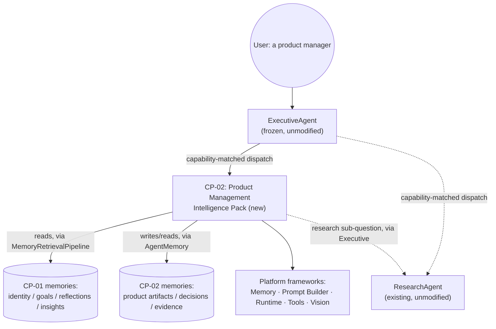

## 2. Layered Design

CP-02's nine PRD capabilities (PRD §8) organize into three layers, using the identical organizing principle CP-01's own architecture used: **rate of change and level of abstraction**, not subject-matter grouping.

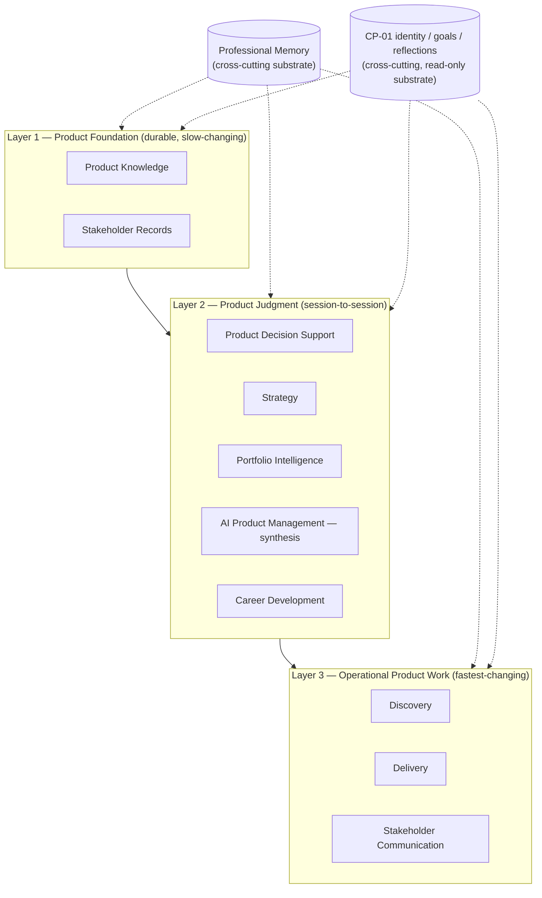

**Why this ordering**: Layer 1 answers "what exists" — the products, features, and stakeholders that don't change session to session. Layer 2 answers "given what exists, what should be done about it" — decisions, strategy, portfolio tradeoffs, and the synthesized product-health view, all operating at the pace of individual reasoning sessions. Layer 3 answers "given what's been decided, what gets produced today" — discovery artifacts, specs, and stakeholder drafts, the fastest-moving and most concrete layer.

**The one structural difference from CP-01's layering**: CP-02 has **two** cross-cutting substrates, not one. Professional Memory (CP-02's own disciplined use of the Memory Framework, §5–§6) plays the same role CP-01's Memory Intelligence played for CP-01. But CP-02 additionally depends on a **second, external substrate it does not own**: CP-01's own identity/goal/reflection memory, read through the same Memory Framework rather than owned or re-derived. This second substrate is why CP-02's dependency graph (§18) has a pack-to-pack edge CP-01's never needed.

Research (PRD §14) is deliberately absent from this diagram — it is not a layer or a domain CP-02 owns, it is a **delegation relationship** to an existing, external specialist, detailed in §9.

## 3. Internal Specialist Strategy

### The Governing Principle (unchanged from CP-01)

`ResearchAgent` and CP-01's own `PersonalIntelligenceAgent`/`InsightAgent` establish the precedent CP-02 follows without modification: a small number of Specialist Agents, each a genuinely distinct, Executive-delegatable **unit of work**, each internally orchestrating several PRD capabilities as steps or internal services — never one specialist per capability.

### Decision Table

| Capability | Dedicated Specialist? | Justification |
|---|---|---|
| Product Knowledge | No — internal service | Cross-cutting context (products, features, stakeholders as durable entities), consumed by every specialist, never itself the subject of a delegated task |
| Professional Memory | No — internal service | The access pattern every CP-02 capability uses, not a task the Executive delegates to — identical reasoning to CP-01's Memory Intelligence |
| Product Decision Support | **Yes — Product Decision Specialist** | A genuinely distinct, self-contained delegatable request ("help me decide build-vs-buy") — direct product-domain analogue of CP-01's own (unshipped) Decision Specialist |
| Discovery | **Yes — Discovery Specialist** | "Help me validate this problem" is a complete request with its own dependency shape (evidence, hypotheses), distinct from deciding or delivering |
| Delivery | **Yes — Delivery Specialist** | "Draft this spec" / "is this ready to launch" is a complete, self-contained request distinct from discovery or strategy |
| Strategy | **Yes — Strategy & Portfolio Specialist** | Roadmap/prioritization/OKR work shares cadence and reasoning shape with cross-product portfolio work (below) — consolidated, not split, mirroring how CP-01 consolidated Goal+Productivity+Reflection into one Planning & Reflection Specialist |
| Portfolio Intelligence | No separate specialist — folded into Strategy & Portfolio Specialist | Portfolio Intelligence is Strategy's own reasoning applied across products instead of within one — a grain difference, not a different capability |
| Stakeholder Communication | **Yes — Stakeholder Communication Specialist (v2)** | Distinct request shape ("draft this update"), its own dependency shape (stakeholder record + CP-01 identity voice) — direct analogue of CP-01's own (unshipped) Communication Specialist |
| AI Product Management (synthesis) | No — Executive-level synthesis pattern, no dedicated component | Synthesizes across the other specialists' own output — see "Why AI Product Management Gets No Specialist," below, direct analogue of CP-01's Life Intelligence reasoning |
| Research | No — pure delegation, no CP-02 specialist of its own | CP-02 frames the question; the Executive dispatches the actual work to the existing `ResearchAgent` — see §9 |
| Career Development | No — internal reasoning mode within the Product Decision Specialist | Not independently triggered often enough in v1/v2 to warrant its own dispatch entry — mirrors CP-01's own treatment of Goal/Reflection as internal services, and CP-01's Career Coaching being a journey, not a dedicated specialist |

### Resulting Specialist Set

| Specialist | Journeys it owns | Internal capabilities it orchestrates | Phase |
|---|---|---|---|
| **Discovery Specialist** | Product Discovery Session | Discovery, Product Knowledge (read), Professional Memory; may participate in Executive-level delegation to `ResearchAgent` (§9) | v1 |
| **Delivery Specialist** | PRD/Spec Drafting, Launch Readiness Review | Delivery, Product Knowledge (read/write), Professional Memory | v1 |
| **Product Decision Specialist** | Product Decision Support, Prioritization Review, Career Development Check-in | Product Decision Support, Strategy (framework application), Career Development (internal mode), Professional Memory; reads CP-01 Identity/Goal/Reflection | v1 (Decision Support, Prioritization), v3 (Career Development maturity) |
| **Strategy & Portfolio Specialist** | Roadmap Planning, Portfolio Prioritization Review | Strategy, Portfolio Intelligence, Product Knowledge | v1 (single-product Strategy), v3 (full Portfolio Intelligence maturity) |
| **Stakeholder Communication Specialist** | Stakeholder Status Update | Stakeholder Communication, Product Knowledge (read); reads CP-01 Identity (voice) | v2 |

### Why AI Product Management Gets No Specialist

Directly mirroring CP-01 Architecture §8's treatment of Life Intelligence: a product-health synthesis spanning Discovery, Strategy, Delivery, and Stakeholder state in one view is architecturally a case of the Executive synthesizing across **multiple specialist results in one delegation cycle** — precisely what `ExecutiveAgent.collect_results()`/`build_response()` already exist to do. A dedicated "AI Product Management Specialist" would duplicate synthesis logic the Executive Framework already owns. The capability is realized as the Executive dispatching sub-tasks to two or more of the specialists above within one plan, then synthesizing their results — never a sixth specialist.

## 4. Executive Integration

CP-02 integrates with the Executive Agent exactly as CP-01 and `ResearchAgent` do — through the frozen `ExecutiveAgent`/`Dispatcher` mechanism, unmodified.

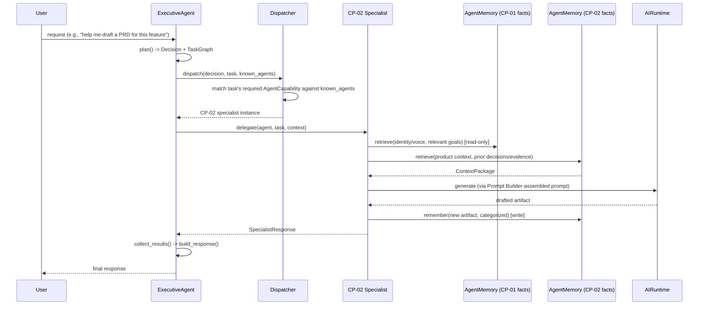

- **Planning**: unchanged — `ExecutivePlanner` produces the Decision/TaskGraph exactly as it does today. CP-02 does not influence how the Executive plans; it is a *destination* the plan can route to, exactly as CP-01 and `ResearchAgent` already are.
- **Delegation**: unchanged — `Dispatcher` matches a task's declared `AgentCapability` against the `capabilities()` each candidate instance declares. CP-02's specialists declare capabilities the same way CP-01's do — see §19 for the specific, deliberate exclusion this requires.
- **The same load-bearing fact CP-01's architecture already named**: `Dispatcher.dispatch()` matches against `known_agents` — already-constructed instances the Executive was composed with, not a live `AgentRegistry`/`SpecialistRegistry` lookup. CP-02's specialists must self-register in both registries at import time (the existing convention every agent follows) **and** whatever composes a running `ExecutiveAgent` for real use must include CP-02's constructed instance(s) in `known_agents` — the same two-step requirement CP-01 and `ResearchAgent` already have. This is existing platform behavior CP-02 must account for, not something CP-02 changes.
- **Memory retrieval**: CP-02 retrieves via `AgentMemory`/`MemoryRetrievalPipeline` for both its own facts and CP-01's — never a parallel mechanism, never a direct import of CP-01's types (§19).
- **Runtime generation**: all synthesis (specs, drafts, recommendations, narratives) goes through `AIRuntime` via a `RuntimeAdapter`, the identical adapter pattern `ResearchAgent`/CP-01 use.
- **Response synthesis**: CP-02 returns a `SpecialistResponse`; the Executive's own `build_response()` (unmodified) turns one or more specialist results into the final response. CP-02 does not synthesize a "final" response on the Executive's behalf.

## 5. Memory Architecture

### The Governing Constraint (unchanged from CP-01, restated because it binds CP-02 identically)

The Memory Framework is frozen. CP-02 introduces **no new storage, no new schema, no new table**, and modifies nothing about how `AgentMemory`/`MemoryAdapter`/`MemoryRetrievalPipeline` work — all four `AgentMemory` methods (`remember`/`retrieve`/`forget`/`search`) are already fully implemented (CP-01.2), so unlike CP-01's own Phase 2, **CP-02 has no analogous blocking platform-memory prerequisite** (see §20).

Every CP-02 memory category is a **categorization convention** realized through the existing `Memory` entity's `memory_type` field — exactly CP-01's own pattern, under a distinct namespace so CP-02's categories can never collide with CP-01's `personal_*` convention or any future pack's.

**The same honest retrieval constraint CP-01 named applies unchanged**: retrieval is semantic-similarity-based, not `memory_type`-filtered, at the platform level. CP-02, like CP-01, cannot ask the Memory Framework for "only Decision Records" — it retrieves by relevance and narrows/filters client-side where an operation genuinely needs a bulk, type-scoped view, following the exact precedent CP-01.3's Insight Engine already established (its bulk corpus-gathering path reuses `AIMemoryService.list_memories()`, unmodified, filtering by `memory_type` client-side, rather than asking the platform for a filtered query it doesn't support).

### Two Memory Surfaces, One Mechanism

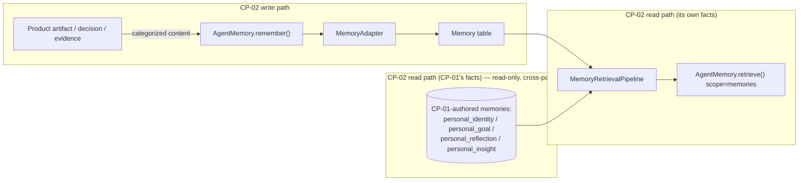

CP-02 never writes to CP-01's memory categories and never asks CP-01's specialists for identity/goal/reflection facts directly — it retrieves them the same way `ExecutiveAgent`'s own built-in retrieval already does (and the same way CP-01.3's `InsightAgent` reads CP-01-authored memories with zero awareness `PersonalIntelligenceAgent` exists): a `MemoryRetrievalPipeline` query scoped by the platform's existing `organization_id`/`user_id`. This is the entire mechanism §19 elaborates — nothing more is needed, and nothing more is proposed.

## 6. Professional Memory Model

Following CP-01's `personal_*` convention, every CP-02 memory category is namespaced `product_*`, described here as categories (not code):

| Memory category | Purpose | Retention | Ownership | Consumers |
|---|---|---|---|---|
| Product Context | What a product is: name, segment, value proposition, lifecycle stage | Indefinite while active | Product Knowledge (internal service) | Every CP-02 specialist |
| Feature / Initiative Record | A candidate or in-flight unit of product work and its current stage | Indefinite while active; archived on ship/sunset | Delivery Specialist (writes), Strategy & Portfolio (reads) | Delivery, Strategy, Decision |
| Roadmap State | Sequenced roadmap items and their horizon/status | Indefinite, revised in place via new entries (append-only, per §7 and the ARR's §6 clarification) | Strategy & Portfolio Specialist | Portfolio, Stakeholder Communication |
| Metric / North Star Record | A tracked product metric and the target/trend the user has stated | Indefinite | Strategy & Portfolio Specialist | Decision, AI Product Management synthesis |
| Discovery Finding / Hypothesis | Structured evidence and its validation status | Indefinite, user-deletable | Discovery Specialist | Delivery (traceable requirements), Decision (precedent) |
| Research Finding | Synthesized output of a delegated `ResearchAgent` question (§9) | Indefinite, user-deletable | Discovery or Strategy & Portfolio Specialist (whichever delegated) | Decision, Strategy |
| Decision Record | A structured product decision, its rationale, and (when known) its outcome | Indefinite, user-deletable | Product Decision Specialist | Strategy, Portfolio, Career Development (craft record) |
| Stakeholder Record | A professional role/interest relevant to a product's decisions (never a personal relationship — see §19) | Indefinite, user-deletable | Stakeholder Communication Specialist | Delivery (RACI), AI Product Management synthesis |
| Delivery Artifact | Drafted specs, stories, acceptance criteria, launch-readiness state | Indefinite, lower priority for long-term retrieval than Decision/Discovery records | Delivery Specialist | Stakeholder Communication (status drafting) |
| PM Craft Record | Which frameworks were applied, discovery/decision rigor over time — feeds Career Development | Indefinite | Product Decision Specialist (as a byproduct of Decision Support) | Career Development (internal mode) |

Every write goes through `AgentMemory.remember()` tagged with the appropriate `product_*` category; every read goes through `AgentMemory.retrieve()`/`.search()`, identical to CP-01's own mechanism (§9 of CP-01's Architecture). CP-02 adds a categorization convention on top of an existing field — no new repository, model, index, or retrieval code path, exactly as CP-01 required of itself.

## 7. Product Artifact Model

Where §6 describes the memory *categories* (the write/retrieve discipline), this section describes the conceptual *entities* — what a product manager would recognize as their own mental model — and how they relate to each other. This is a conceptual model, not a schema: no field types, no classes, no database design (Phase 2/3 concerns).

| Entity | Represents | Relates to |
|---|---|---|
| **Product** | Something the user is responsible for delivering value through | Owns Features/Initiatives, Roadmap Items, Metrics; is the subject of a Portfolio |
| **Feature / Initiative** | A discrete unit of product work under consideration or in flight | Belongs to a Product; grounded by Discovery Findings; sequenced onto a Roadmap Item; may produce a Decision Record |
| **Roadmap Item** | A sequenced commitment or intention | Belongs to a Product; may depend on or block another Roadmap Item (possibly in a different Product — the Portfolio-level relationship) |
| **Metric** | A quantitative signal, including a North Star Metric | Belongs to a Product; referenced by Decision Records as evidence |
| **Discovery Finding / Hypothesis** | Evidence gathered from users, market, or competitors | Supports or challenges a Feature/Initiative; may originate from a delegated Research Finding |
| **Research Finding** | Synthesized output of a delegated research question | Feeds Discovery Findings and Decision Records; never exists without a recorded source question |
| **Stakeholder** | A person or role relevant to a product's decisions or communication | Relevant to specific Decision Records and Delivery efforts (RACI); explicitly not a CP-01 personal relationship (§19) |
| **Decision Record** | A structured product decision and its outcome | References the Feature/Initiative or Roadmap Item it concerns; references supporting Discovery/Research Findings; the backbone of precedent-surfacing (§8) |
| **Portfolio** | The PM's own set of Products considered together | Composed of Products; the frame Strategy & Portfolio's cross-product reasoning (§12) operates over |

Every entity is realized as one or more categorized memories (§6) — a Feature/Initiative, for instance, is not "a row in a table" but a durable memory (its current state) plus, over time, an append-only history of related memories (discovery findings, decision records, delivery artifacts) that a retrieval query assembles into a coherent picture at read time — the identical pattern CP-01 already uses for a Goal's append-only `GoalProgressUpdate` history (CP-01 Implementation.md §5).

## 8. Decision Support Architecture

The direct product-domain specialization of CP-01's own (unshipped) Decision Intelligence pattern, reusing its precedent-surfacing and counterpoint-surfacing discipline rather than reimplementing decision support from first principles.

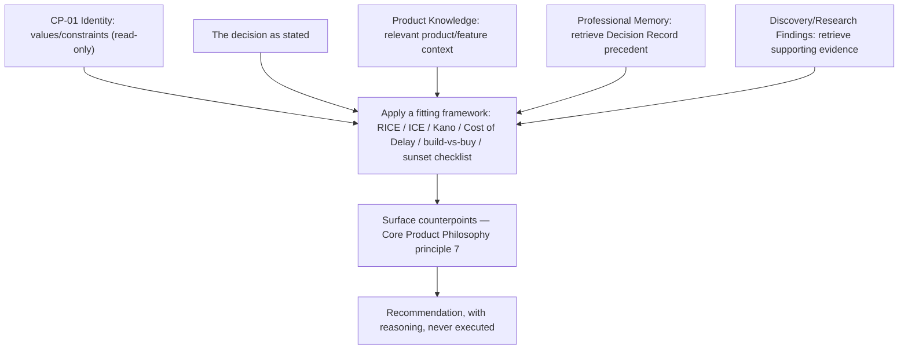

**Framework selection is structural, not incidental**: the Product Decision Specialist selects the fitting framework based on the decision's shape (a backlog-ranking decision reaches for RICE/ICE/Kano; a sourcing decision reaches for a build-vs-buy comparison; a sequencing decision reaches for Cost of Delay) — the framework structures the reasoning and the eventual `SpecialistResponse`, it is not vocabulary layered onto otherwise-generic text (PRD §6, principle 2).

**The counterpoint step is not optional** — identical in architectural weight to CP-01's own Decision Flow (CP-01 Architecture §10): it must run before a recommendation is produced, never appended after. This is the direct mitigation for the echo-chamber risk both PRDs name.

**Never executes**: exactly like CP-01, the Product Decision Specialist produces a structured recommendation for the user to act on — it never autonomously ships a feature, changes a roadmap commitment, or communicates a decision to a stakeholder (that remains the Stakeholder Communication Specialist's *drafting*, always user-reviewed, per §11).

## 9. Product Research Integration (Delegating to the Existing Research Agent)

CP-02 does not reimplement research. This section is deliberately precise about *how* delegation actually happens mechanically, because it is the one place this document depends on Executive Framework behavior that is real but only lightly exercised today.

**What CP-02 owns**: framing a research question in product terms (what's being asked, and which Decision Record or Feature/Initiative it will inform), and — once findings come back, by whatever path — synthesizing them into a Research Finding (§6, §7) for future retrieval and precedent-surfacing in Decision Support (§8).

**What CP-02 never owns**: research execution, source retrieval, or evidence-gathering mechanics. That remains `ResearchAgent`'s job (`agents/specialists/research/`), reused, never duplicated, never imported directly (Pack Independence, [Capability_Strategy.md](../Capability_Strategy.md)).

**The delegation mechanism, precisely**: `ResearchAgent` already declares `AgentCapability.RESEARCH` in its identity. `Dispatcher.dispatch()` already matches a task tagged `required_capability=AgentCapability.RESEARCH` to `ResearchAgent` if it is present in the Executive's `known_agents` — exactly the same capability-matched routing every other delegation in this document uses. Two delegation shapes are architecturally available, and CP-02 does not need to choose between them at the architecture level:

1. **Sequential delegation (the v1/v2-implementable shape)**: the user's research need is framed and dispatched as its own top-level request, wholly handled by `ResearchAgent` in one Executive turn. The resulting findings (surfaced to the user in that turn's response) are then explicitly given back to a CP-02 specialist in a subsequent request, which records them as a Research Finding. This requires nothing beyond mechanism already proven in this platform's own history (research-as-a-standalone-turn is exactly how `ResearchAgent` is used today) plus a CP-02-side "record this finding" write operation — an ordinary application of §6's Professional Memory Model.
2. **Single-plan, multi-specialist delegation (architecturally possible, not yet exercised)**: one Executive plan contains both a CP-02 task and a sibling research-shaped task, each independently capability-matched and dispatched within the same `TaskGraph` — the same mechanism that already lets `retrieve_memory` and `generate_response` be different tasks in one plan. Whether `ExecutivePlanner`'s current deterministic template produces a multi-specialist plan shape like this is a question about the **Executive Framework's own planning template**, not something CP-02 controls, extends, or should work around privately if the answer is "not yet." CP-02's architecture depends on this being *possible* in principle (per the Dispatcher's per-task, capability-based matching, which places no limit on how many tasks in one plan get delegated to different specialists) without requiring CP-02 to build it.

**This document takes no position on which shape Phase 3 implements first** — shape 1 is sufficient for every v1/v2 journey in the PRD (Competitive Research Briefing, §9.6 of the PRD, is explicitly framed as a two-step "delegate, then synthesize" journey) and requires zero Executive Framework changes to prove out. Shape 2 is a strict enhancement, not a prerequisite. This is revisited honestly in §20.

## 10. AI Product Management Architecture

The direct specialization of CP-01's Life Intelligence pattern (CP-01 Architecture §3.12, §8) to product-management context — a holistic, cross-cutting view assembled from multiple specialists' own output, at either single-product or whole-portfolio grain, rather than a domain with inputs of its own.

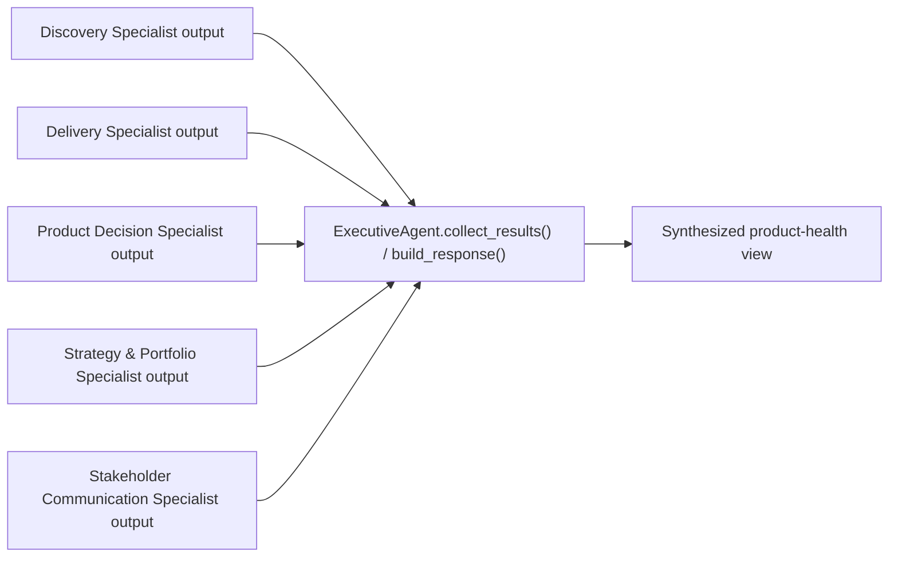

**Proactive posture**: consistent with CP-01.3's Insight Engine precedent (proactive recommendations surfaced without being explicitly asked), this capability is designed to surface gaps the PM hasn't asked about — a roadmap commitment with no linked Discovery Finding, a stakeholder critical to a launch who hasn't been updated recently — while remaining bound by the identical "recommend, never act" posture every CP-02 capability shares.

**Why this reuses the Insight Engine's *pattern*, not its code**: CP-01.3's `InsightEngine` performs deterministic, traceable pattern/contradiction/alignment detection over CP-01's own memory categories. AI Product Management applies the same discipline — every synthesized observation traceable to the specialist outputs and memories that produced it, never invented — to CP-02's product categories. It is not built by extending or calling `InsightEngine`, which is CP-01's own component; it is a **separate, CP-02-owned application of the same proven architectural discipline**, exactly the way CP-02's Decision Support (§8) reuses CP-01's Decision Intelligence *pattern* rather than its (unshipped) code.

## 11. Stakeholder Communication Architecture

The specialization of CP-01's Communication Intelligence pattern (CP-01 Architecture §14) into professional, product-context communication — drafting only, never sending, identical posture.

**One architectural pattern, not one per channel**: `Stakeholder Record (§7) + CP-01 Identity (voice/tone, read-only) + Product Knowledge (actual roadmap/delivery/decision state) → Prompt Builder assembly → AIRuntime generation → a draft`. An executive summary versus an engineering-facing status note is a **template/format choice at prompt-assembly time**, not a different code path — the identical reasoning CP-01 Architecture §14 gives for why Communication Intelligence never became five channel-specific components.

**Stakeholder mapping (RACI)** is Product Knowledge/Professional Memory content (§6, §7), not a separate mechanism — a Stakeholder Record's relevance to a specific Decision Record or Delivery effort is exactly the kind of relationship §7's entity model already describes.

**Hard constraint, inherited unchanged from CP-01**: nothing is sent autonomously. Every draft is reviewed by the user before reaching a real stakeholder, in any channel, in v1 and for the foreseeable future (PRD §4).

## 12. Portfolio Intelligence Architecture

Portfolio Intelligence is Strategy's own reasoning (§3's Strategy & Portfolio Specialist) applied across every Product in the user's Portfolio (§7) rather than within one — a grain difference in the same specialist, not a separate architecture.

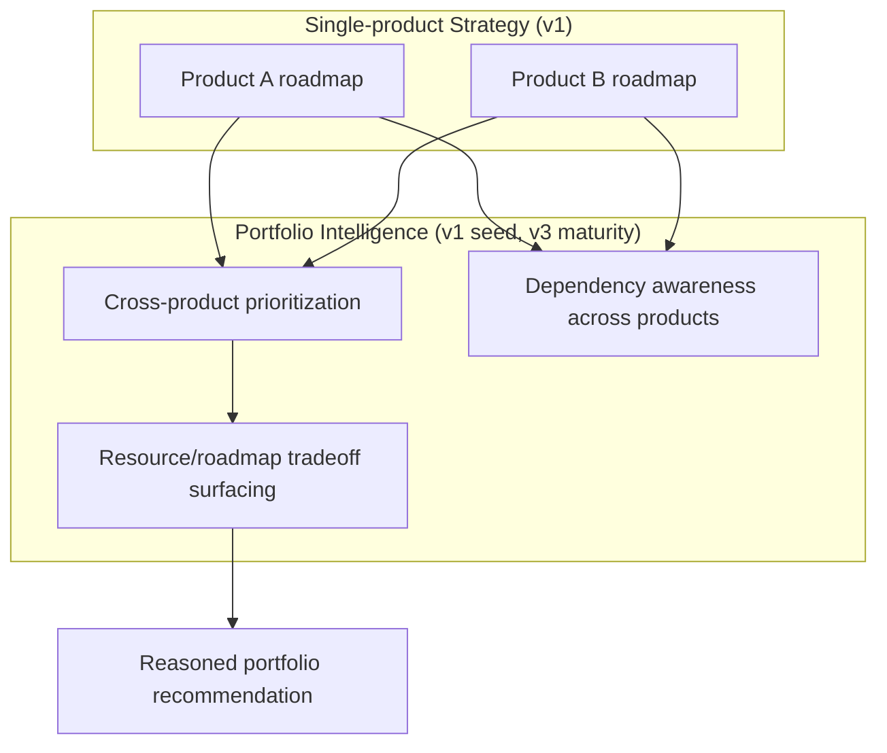

**Relationship to Decision Support (§8)**: a portfolio-level prioritization call is itself a product decision — Portfolio Intelligence supplies the cross-product evidence (which roadmap items exist, where they conflict or depend on each other); the Product Decision Specialist's framework-application and counterpoint discipline (§8) still governs how that evidence becomes a recommendation. Neither duplicates the other; Portfolio Intelligence is an evidence-gathering extension of Strategy, not a parallel decision mechanism.

**v1 vs. v3 (per PRD §25)**: v1 ships single-product Strategy only — the Strategy & Portfolio Specialist exists, but its cross-product reasoning is a defined, ready extension of the same specialist rather than v1 functionality. Full dependency/resourcing tradeoff maturity is v3 scope, consistent with the PRD's own phasing.

## 13. Career Development Architecture

The direct specialization of CP-01's Career Coaching *journey* (CP-01 PRD §10.6) for the product-management profession — realized as an **internal reasoning mode of the Product Decision Specialist**, not a dedicated component, mirroring exactly how CP-01 itself treats Career Coaching as a journey rather than a capability with its own specialist.

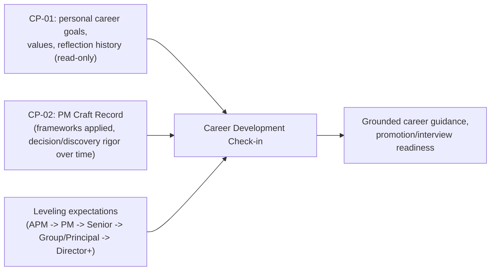

**What CP-02 adds that CP-01 structurally cannot**: CP-01 has no basis to assess PM craft — it has never seen a Decision Record, a Discovery Finding, or a framework application. The PM Craft Record (§6) is a byproduct CP-02 already produces as part of ordinary Decision Support and Discovery work (§8, §15-equivalent capabilities) — Career Development does not require new capture, only new *reasoning* over what's already captured.

**What stays with CP-01**: personal career goals, values, and general reflection history remain exclusively CP-01's — Career Development reads them through the same Memory Framework mechanism every other cross-pack read in this document uses (§5, §19), never a CP-02 copy.

## 14. Professional Standards Framework

This is CP-02's answer to "how does the pack know what good product management looks like" — the architecture-level home for frameworks, heuristics, quality rubrics, anti-patterns, and self-evaluation, so that "frameworks as structure, not decoration" (PRD §6, principle 2) is an architectural commitment, not just a stated value.

**Frameworks** (applied, never merely named): RICE, ICE, Kano, Cost of Delay/WSJF for prioritization and sequencing (§8, §12); Jobs-to-be-Done and Opportunity Assessment for discovery framing (Discovery Specialist); Now-Next-Later for roadmap sequencing; OKRs and North Star Metric structuring for strategy (Strategy & Portfolio Specialist); RACI for stakeholder mapping (§11). Each framework is a **structuring template applied at prompt-assembly time** — the same architectural role a channel-format choice plays in §11 — never a new execution mechanism.

**Heuristics** (judgment shortcuts the pack applies, not facts it stores): prefer a validated hypothesis over an assumed one when framing a recommendation; prefer recent evidence over stale evidence of equal relevance; treat an unlinked roadmap commitment (no Discovery Finding, no Decision Record) as a flagged gap in AI Product Management synthesis (§10), not a silent pass.

**Quality rubrics** (what "good output" means, checked before a `SpecialistResponse` is considered complete): a Decision Support recommendation is incomplete without a named framework and at least one surfaced counterpoint (§8); a drafted PRD is incomplete without traceable evidence links (§7, §15 of the PRD); a stakeholder update is incomplete if its claims aren't grounded in actual Product Knowledge state (§11).

**Anti-patterns** (what the pack must actively avoid, architecturally enforced by the discipline above, not by a separate check): recommending a feature with no supporting Discovery Finding (an invented user need, explicitly forbidden by PRD §6 principle 3); applying a prioritization framework as vocabulary without actually scoring against it; treating a Stakeholder Record as a personal relationship (§19); autonomously sending or publishing anything (§11).

**Self-evaluation**: every specialist's `evaluate(response)` method (the same `SpecialistAgent` contract method `ResearchAgent`/CP-01's specialists already implement, checking `response.success` against a policy-declared `minimum_confidence`) is where a CP-02 specialist's own policy encodes its confidence floor — identical mechanism, no new evaluation pathway. Confidence itself should be depressed, not inflated, when a recommendation's evidence is thin (mirroring CP-01.3's `InsightEngine` setting deliberately low confidence — 0.4 — on its coarsest heuristic, contradiction detection) rather than presenting a low-evidence recommendation with false confidence.

## 15. Event Flow

CP-02 introduces no new event mechanism — every specialist publishes through the same `GenericEvent`/`EventPublisher` base (`app/services/ai/shared/events.py`) CP-01's `PersonalIntelligenceEvent`/`InsightEvent` and `ResearchEvent` already subclass, following the identical "restate `__hash__ = hash_event`" discipline required of any `GenericEvent` subclass.

**Event categories** (conceptual — exact member names are a Phase 3 concern), consistent across every CP-02 specialist:

1. **Request lifecycle** (every specialist, identical shape to CP-01's `REQUEST_STARTED`/`REQUEST_COMPLETED`/`REQUEST_FAILED`): request received, request completed, request failed.
2. **Context-gathering milestones**: product context retrieved, CP-01 identity/goal context retrieved (read-only), precedent/evidence retrieved.
3. **Capability-specific milestones**, one family per specialist: Discovery (finding recorded, hypothesis status changed), Delivery (artifact drafted, launch-readiness checked), Product Decision (framework applied, counterpoint surfaced, decision recorded), Strategy & Portfolio (roadmap revised, cross-product conflict surfaced), Stakeholder Communication (update drafted).
4. **Delegation events**: a research question framed and handed to the Executive (§9), distinguished from a locally-completed capability so downstream consumers (e.g., an AI Product Management synthesis, §10) can tell "this is waiting on external research" from "this is done."

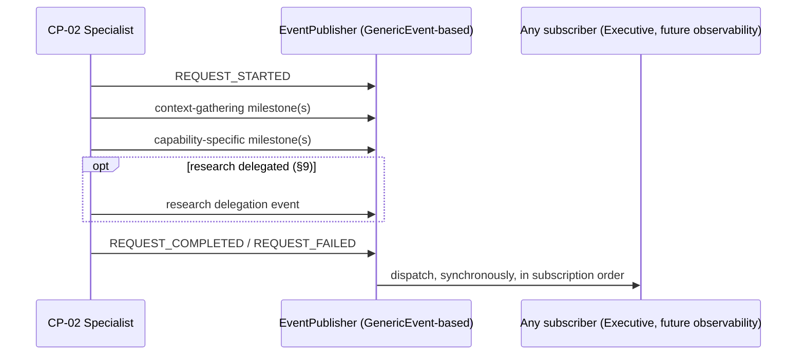

## 16. State Model

Every CP-02 specialist reuses the identical state-machine *pattern* CP-01's `PersonalIntelligenceStateMachine`/`InsightStateMachine` already prove out — a small, closed set of states with a validated transition table, always returning to `IDLE`, never a new state-machine mechanism.

**Conceptual state topology**, shared across every CP-02 specialist (naming is illustrative, a Phase 3 concern):

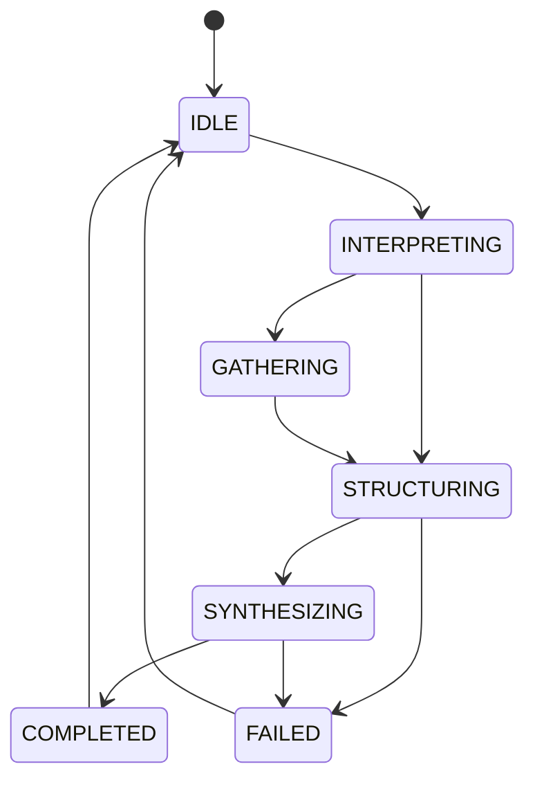

- **INTERPRETING**: identical role to CP-01's own state — determine which operation is requested.
- **GATHERING**: retrieve Product Knowledge/Professional Memory and (read-only) CP-01 context — analogous to `InsightState.GATHERING`. Skipped for operations that don't need bulk context, the same way CP-01's `RECALL`-shaped operations skip retrieval-heavy states.
- **STRUCTURING**: apply a Professional Standards Framework (§14) framework/rubric — the state genuinely new to CP-02 relative to CP-01's own topology, because CP-01's domains never had an equivalent "apply RICE/ICE/Kano" step.
- **SYNTHESIZING**: Runtime-backed generation (a draft, a recommendation, a synthesized view) — analogous to CP-01's `PROCESSING`/`ANALYZING`.
- **COMPLETED / FAILED → IDLE**: identical to every existing specialist state machine on the platform.

Instance attributes must never be named `self.state` for the same reason CP-01's own specialists avoid it — `BaseAgent` already defines `state` as a property delegating to `state_machine.state`; every CP-02 specialist's own state-machine attribute needs its own specialist-scoped name, following `self.research_state`/`self.personal_intelligence_state`/`self.insight_state`'s exact precedent.

## 17. Execution Lifecycle

The end-to-end path from a user's request to a stored, retrievable product artifact — generalizing §4's sequence diagram across every CP-02 specialist and making the memory-write step explicit, since CP-02, unlike a purely retrieval-shaped consumer, is constantly producing new durable content.

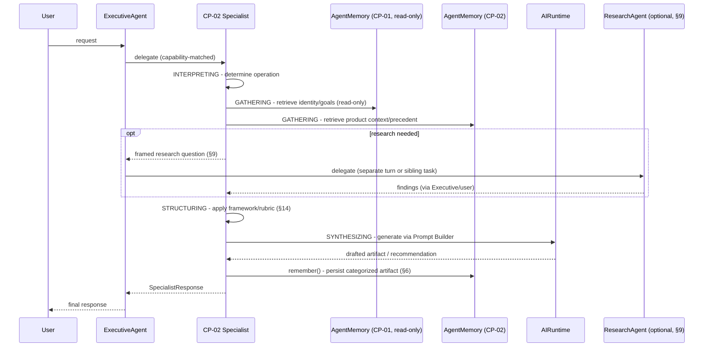

Every step above is an existing platform or CP-01 mechanism, composed — no step introduces new execution machinery.

## 18. Dependency Diagram

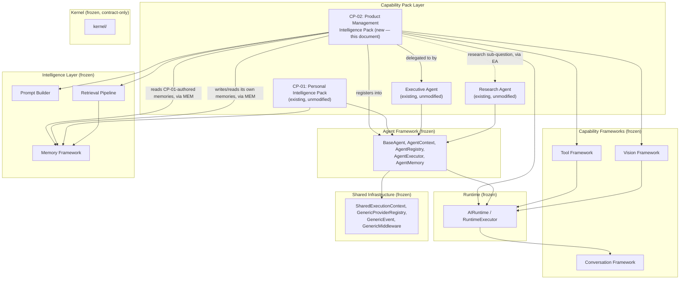

**The one new edge relative to CP-01's own dependency diagram (CP-01 Architecture §2)**: CP-02 → CP-01, drawn only as a memory-read relationship (dotted, via the Memory Framework, never a direct code arrow) — CP-01's own diagram had no pack-to-pack edges at all, since it was the first pack. Every other edge in this diagram is structurally identical to CP-01's, because CP-02 is built from the same platform layers CP-01 was.

## 19. Integration with Personal Intelligence

This section makes precise what §7.1 of the PRD stated as product intent: exactly how CP-02 reads CP-01 without importing, duplicating, or modifying it.

**Mechanism**: every CP-01 fact CP-02 needs (identity/voice for drafting, §11; personal goals relevant to Career Development, §13; reflection history for context) is retrieved through the same `MemoryRetrievalPipeline`/`AgentMemory.retrieve()` surface every consumer of the Memory Framework uses, scoped by the same `organization_id`/`user_id` `SharedExecutionContext` fields CP-01 itself is scoped by. There is no second scoping mechanism, no cross-pack identifier, and no CP-02-specific accessor into CP-01's data.

**What this rules out, explicitly**: CP-02 code never imports `PersonalIntelligenceAgent`, `InsightAgent`, or any type from `personal_intelligence/shared/` — not `Goal`, not `IdentityFact`, not `Insight`. If Phase 3 finds itself wanting to import one of these, that is a signal the design has drifted from this document, not a shortcut to take.

**The identical `AgentCapability.MEMORY` collision-avoidance rule CP-01 and `InsightAgent` already established applies to every CP-02 specialist without exception**: `ExecutivePlanner`'s built-in `retrieve_memory`/`retrieve_conversations` tasks are tagged `required_capability=AgentCapability.MEMORY`. If any CP-02 specialist declared that capability, `Dispatcher` could route the Executive's own internal memory-retrieval steps to it instead of letting `_handle_task()` handle them internally — breaking the Executive's generic flow, because a `SpecialistResponse` does not fit where those internal steps expect a raw `ContextPackage`. Every CP-02 specialist declares only the `AgentCapability` values it genuinely has — `REASONING` and `PLANNING` across the board, `COMMUNICATION` for the Stakeholder Communication Specialist — never `MEMORY`. Separately, each specialist's declared `SpecialistTaskType` set (the existing closed taxonomy `RESEARCH`/`ANALYSIS`/`SUMMARIZATION`/`COMPARISON`/`VERIFICATION`/`INVESTIGATION`/`UNKNOWN`) is chosen per specialist by fit — `INVESTIGATION` suits Discovery, `COMPARISON` suits the Product Decision Specialist's tradeoff work, `SUMMARIZATION` suits Delivery and Stakeholder Communication drafting, `ANALYSIS` suits Strategy & Portfolio's prioritization work — the same existing enum CP-01's own specialists already declare against, never a new member.

**What CP-01 gains from CP-02's existence — nothing, by design**: CP-01 is not modified to know CP-02 exists, does not import anything from CP-02, and its own behavior (including `InsightAgent`'s pattern/habit/contradiction detection) is entirely unaffected by whether CP-02 is installed. The dependency in this document runs one direction only.

**What happens if CP-01's own memories change shape**: since CP-02 reads CP-01's facts only through the stable `ContextItem`/`ContextPackage` retrieval shape (never CP-01's internal domain types), CP-02 is insulated from internal changes to CP-01's own domain objects as long as CP-01 continues writing retrievable, semantically-meaningful `Memory` content — the same insulation every Memory Framework consumer already has from every writer.

## 20. Readiness Assessment

**Unlike CP-01's own Phase 2, CP-02 has no blocking platform-memory prerequisite.** `AgentMemory.remember()`/`forget()` — the single hard blocker CP-01's Architecture §20 identified — has been fully implemented since CP-01.2, and CP-01 itself (identity/goal/reflection/insight facts) already exists as a stable read surface. CP-02's readiness picture is materially simpler than CP-01's was.

### Prerequisites before Phase 3 begins

1. **The Specialist Strategy in §3 should be treated as locked before Phase 3 implementation planning starts** — the five-specialist set (Discovery, Delivery, Product Decision, Strategy & Portfolio, Stakeholder Communication) and the decision to fold Career Development and AI Product Management into internal reasoning modes rather than dedicated specialists should not be re-litigated mid-implementation, mirroring CP-01 Architecture §20's identical requirement for its own Specialist Strategy.
2. **CP-01 Phases 1–4 must remain the version of CP-01 this document was written against.** If CP-01 gains new memory categories or a new specialist before CP-02's Phase 3 begins, §19's read-through mechanism does not need to change (it depends only on the stable `MemoryRetrievalPipeline` surface), but §6's list of which CP-01 categories CP-02 reads should be re-verified.

### Not blocking, but relevant to sequencing

- **§9's open question** (whether a single Executive plan can delegate to a CP-02 specialist and `ResearchAgent` as sibling tasks) does not block Phase 3. The sequential-delegation shape (§9, shape 1) is fully sufficient for every v1/v2 journey in the PRD and requires no Executive Framework change. Phase 3 should build against shape 1 and treat shape 2 as a strict, optional enhancement — never a reason to invent a CP-02-private delegation mechanism if shape 2 turns out not to be readily available.
- No concrete `ConversationProvider`, `VisionProvider`, or Tool exists platform-wide, identical to CP-01's own situation at this phase. Not blocking — Phase 3 proceeds architected and tested against fakes, exactly as the rest of the platform did through the freeze and as CP-01.2/CP-01.3 already did.
- Vision-assisted discovery-artifact capture (PRD §15) is v2 scope and explicitly depends on a concrete Vision provider that does not yet exist anywhere on the platform — not blocking for v1.

### Recommendation

Proceed directly to Phase 3 (Implementation Plan). There is no analogue to CP-01's own blocking dependency to sequence first — CP-02 can begin implementation against a fully capable Memory Framework and a proven, working CP-01 to read from. This document is otherwise complete and internally consistent with the frozen platform, CP-01's own architecture and implementation, and the CP-02 PRD.

---

## 21. Documentation Addendum (Milestone 9)

This section resolves ARR §15 condition 1 — folding the Architecture Readiness Review's own corrections back into this canonical document, per Implementation_Plan.md §15, now that Milestones 1–8 have shipped and this document is being brought current with what was actually built.

**§6 citation correction.** The Roadmap State row's original text cited "(append-only, per §16)" for its update strategy. §16 is the State Model, which has no bearing on memory update mechanics. §6's table above now cites §7 (this document's own statement that an entity is realized as a durable memory plus an append-only history of related memories) and the ARR's own §6, which additionally traced the correct precedent: CP-01's `GoalProgressUpdate` pattern (a new memory entry supersedes by recency; never an in-place edit). This is the same append-only discipline every other row in §6's table already stated correctly — only the Roadmap State row's citation was wrong, and only the citation, never the underlying rule.

**§7 structural traceability, confirmed shipped.** The ARR (§7, Decision Traceability Review) found a specificity gap between this document's prose description of evidence-required reasoning and a structurally-enforced guarantee of the kind CP-01.3's `Insight` type already proved (a `supporting_memory_ids` field required at construction, not merely recommended by convention). Milestone 1 closed this gap at the earliest possible point, before any specialist was built: `DiscoveryFinding`, `ResearchFinding`, and `DecisionRecord` (`app/services/ai/agents/specialists/product_management/shared/`) each raise in `__post_init__` if constructed without their required evidence relationship — citing ARR §7 directly in their own module docstrings. A fabricated finding, research result, or decision record is structurally impossible to construct, not merely discouraged by convention. This is the identical `__post_init__`-validation pattern every CP-01 domain object already uses; no new mechanism was introduced to close it.

**No other correction was required.** This review (Milestone 9) re-verified every other claim in this document against the actual, shipped Milestones 1–8 code and found the architecture as originally specified — the five-specialist strategy (§3), the Executive integration mechanism (§4, §19), the memory model (§5, §6), and the dependency boundary (§18) were all built exactly as this document specified, with zero silent redesign.

---

**This document is the canonical engineering specification for CP-02.** Phase 3 (Implementation Plan) must satisfy every functional requirement, capability architecture, memory model, and integration boundary above — including, non-negotiably, §19's zero-duplication and zero-direct-coupling boundary with CP-01 — without modifying any frozen platform interface or any part of CP-01 itself. Any conflict discovered during Phase 3 between this document and the frozen architecture, CP-01's own specification, or the CP-02 PRD is resolved by revising this document, not by touching the platform or CP-01.
