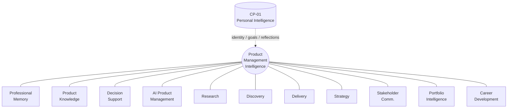
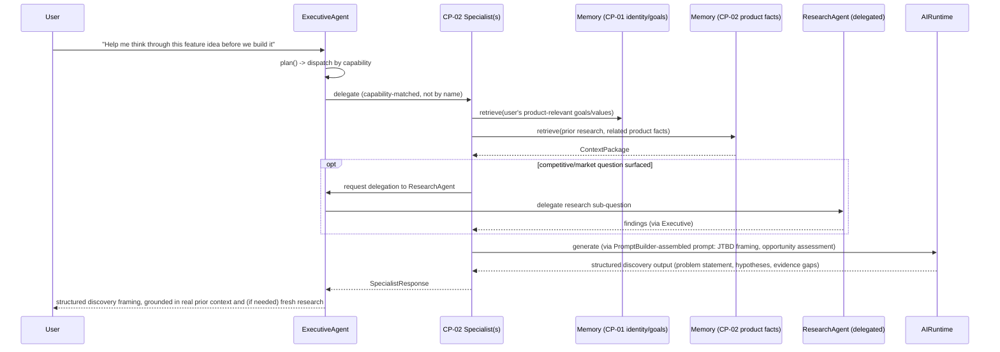

# CP-02 — Product Management Intelligence Pack
## Product Requirements Document (Phase 1)

| | |
|---|---|
| **Status** | Draft — Phase 1 (Product Requirements) |
| **Owner** | Product / AI Systems Architecture |
| **Built on** | AI Operating System v1.0 (frozen, [ARCHITECTURE_FREEZE_v1.md](../../ARCHITECTURE_FREEZE_v1.md)) |
| **Pack ID** | CP-02 |
| **Depends on (platform, unchanged)** | Kernel, Runtime, Shared Execution Context, Identity Model, Event System, Middleware Framework, Conversation Framework, Tool Framework, Vision Framework, Specialist Framework, Executive Framework, Agent Framework, Memory Framework, Prompt Builder, Retrieval Pipeline |
| **Depends on (pack, unchanged)** | CP-01 — Personal Intelligence Pack (Phases 1–4 complete: Identity, Goal, Project, Reflection, Preference Intelligence, and the Insight Engine — see [CP-01 PRD](../CP-01_Personal_Intelligence_Pack/PRD.md)) |
| **Next phases** | Phase 2 — Engineering Architecture: not started. Phase 3 — Implementation Plan: not started. |

This document is a product specification. It contains no Python, no package layout, no class design, and no API design — those are Phase 2 and Phase 3 deliverables that must conform to this PRD, not the other way around. Every platform and CP-01 capability referenced below (Specialist Framework, `AgentMemory`, `MemoryRetrievalPipeline`, `PromptBuilder`, `AIRuntime`, `ToolManager`, `VisionRuntime`, `SharedExecutionContext`, CP-01's Identity/Goal/Reflection/Insight capabilities) already exists, is frozen or already-shipped, and is referenced here only to establish *what CP-02 integrates with*, never *how it is coded*.

---

## 1. Vision

The Product Management Intelligence Pack turns the platform's Personal Intelligence foundation into a genuine product-management thinking partner: an AI that doesn't just know who the user is and what they've decided about their life (CP-01) — it becomes fluent in the actual discipline of building products, grounded in the same durable identity and goal model, and specialized with the artifacts, frameworks, and judgment of professional product management.

> An AI product management partner that thinks like a sharp, experienced PM — skeptical of unvalidated ideas, rigorous about tradeoffs, allergic to scope creep, and always tracking whether what's being built still serves the people it's for — grounded in who you are and what you've decided (via CP-01), and fluent in discovery, strategy, delivery, and stakeholder communication. It gets sharper the longer you use it, because it remembers every product decision, every piece of user feedback, and every roadmap tradeoff you've ever made.

CP-02 is the first Capability Pack built explicitly **on top of another Capability Pack**, not only the platform. It establishes the pattern every future professional-domain pack (Engineering, Design, Sales, Marketing, Legal, and beyond) follows to specialize Personal Intelligence into a professional practice, rather than re-deriving identity, goal, and memory handling from scratch. Decisions made here about extending — never duplicating — a lower-numbered pack set the precedent CP-03 onward will be evaluated against.

## 2. Problem Statement

Product managers operate across an unusually wide surface: discovery (talking to users, validating problems before building), strategy (vision, roadmap, prioritization), delivery (specs, cross-functional execution, launch readiness), and near-constant stakeholder communication (up to leadership, across to engineering and design, out to customers) — while accumulating an enormous amount of context that today's tools scatter across a dozen disconnected systems (docs, spreadsheets, chat, issue trackers, personal notes) and that generic AI assistants have zero persistent grounding in.

CP-01 already solves the general version of this problem — a durable, compounding model of one person's identity, goals, projects, and reflections — but it is deliberately domain-generic: it does not know what a RICE score is, does not distinguish a discovery risk from a delivery risk, does not track a product roadmap or a competitor, and has no notion of a stakeholder distinct from a personal relationship. Nothing on the platform today turns the existing execution substrate — Executive dispatch, Specialist Framework, Memory Framework, Retrieval Pipeline, Prompt Builder, Runtime, Tools, Vision — into genuine product-management expertise. CP-02 is that specialization: a pack whose entire job is to make an AI Operating System think like a product manager, using the identity and goal model CP-01 already built rather than re-deriving it.

## 3. Goals

1. Specialize Personal Intelligence into professional product-management practice — discovery, strategy, delivery, stakeholder communication, portfolio management, and PM career growth — without re-deriving identity, goal, memory, or reflection handling CP-01 already owns.
2. Give a PM (or a founder/generalist acting as one) a durable, compounding model of every product they manage: what it is, who it's for, what's been tried, what's shipped, what's been decided and why.
3. Encode real product-management craft — prioritization frameworks (RICE, ICE, Kano, Cost of Delay), discovery rigor (Jobs-to-be-Done, opportunity assessment), delivery discipline (specs, RACI, launch readiness), and OKR/North-Star-Metric thinking — as structuring tools the pack applies, not generic text generation with PM vocabulary sprinkled in.
4. Prove the "pack built on a pack" extension pattern: CP-02 reads CP-01's identity/goal/reflection facts through the platform's existing Memory Framework and Executive capability-based dispatch — **never** by importing CP-01's concrete types — establishing exactly how every future professional-domain pack is expected to extend Personal Intelligence.
5. Support a PM managing more than one product or initiative at once (Portfolio Intelligence, §19) without weakening CP-01's principle of one continuously-refined understanding of the person doing the managing.
6. Support the user's own growth as a product manager (Career Development, §20) — the professional specialization of CP-01's Career Coaching journey, grounded in PM-specific craft, leveling expectations, and promotion/interview readiness.
7. Establish product-domain memory and knowledge conventions (Professional Memory Model §10, Product Knowledge Model §11) that CP-03 onward (Finance, Trading, Engineering, Marketing) can pattern-match, the same way CP-01's memory-categorization conventions became the platform's reference.

## 4. Non-Goals

- **Not a project-management or ticketing system.** CP-02 does not replace Jira, Linear, or a roadmap tool; it reasons about and drafts product artifacts, and — once relevant tools are registered on the platform — can integrate with such systems through the Tool Framework. It does not become one itself.
- **Not an engineering-execution pack.** Sprint estimation from the engineering side, code review, and technical architecture decisions belong to a future Engineering/Coding pack. CP-02's Delivery capabilities (§16) are the *PM's* side of delivery — specs, coordination, readiness, launch — never the engineering team's own execution.
- **Not a market-research or analytics platform.** CP-02 structures and reasons about research and metrics the user brings to it, or that a delegated `ResearchAgent` surfaces (§14) — it does not build dashboards, run experiments, or replace analytics tooling.
- **Not a re-implementation of Personal Intelligence.** Identity, personal goals unrelated to product work, personal reflections, and personal preferences remain exclusively CP-01's. CP-02 never duplicates them — it specializes over the professional subset relevant to product work, and reads the rest through CP-01 unchanged.
- **Does not introduce new platform primitives**, and **does not modify CP-01**. No new registries, execution engines, memory stores, or changes to any frozen interface or to CP-01's own data model, specialists, or code.
- **Does not take autonomous action toward stakeholders or external systems in v1.** No autonomous sending of stakeholder updates, no autonomous roadmap publishing, no autonomous ticket creation. Drafting and recommendation only, always reviewed by the user before anything leaves the system — the identical posture CP-01's Communication Intelligence already established.
- **Not a multi-tenant "product team" product in v1.** CP-02 is scoped to one individual PM's own view of their products, exactly as CP-01 is scoped to one individual. Shared, team-wide product intelligence is future Enterprise Operating System territory — the same deferral CP-01 already made for itself.

## 5. Target Users

| Persona | Description | Primary need |
|---|---|---|
| **Primary: The Product Manager** | An individual PM at any level (APM through VP/CPO) responsible for one or more products, features, or initiatives, operating across discovery, strategy, delivery, and stakeholder communication. | A thinking partner that remembers every product decision, piece of feedback, and roadmap tradeoff, and applies real PM frameworks rather than generic advice. |
| **Secondary: The Founder/Generalist Operator** | A founder or generalist — already a CP-01 user — acting as their own product manager without formal PM background. | PM craft made accessible: structured discovery, prioritization, and roadmap thinking, without first needing to know the frameworks by name. |
| **Secondary: The PM-in-Training** | An APM or aspiring PM building product judgment. | A partner that models PM craft in the course of using it, and tracks skill growth and promotion readiness (§20). |
| **Internal: Platform Engineering** | The team building CP-03 onward. | CP-02 as the reference pattern for a *pack built on a pack* — extending Personal Intelligence into a professional domain without duplicating or modifying it. |

## 6. Core Product Philosophy

Product management is a discipline of judgment applied under uncertainty — CP-02's philosophy is that an AI product partner earns trust by being **grounded and structured**, not by sounding fluent. Seven principles govern every capability below:

1. **Specialize, never duplicate.** Every CP-02 capability is Personal Intelligence's existing primitives — memory, goals, reflection, decision support — applied to product-management artifacts and frameworks, never a parallel identity, goal, or memory system.
2. **Frameworks as structure, not decoration.** RICE, ICE, Kano, Cost of Delay, Jobs-to-be-Done, OKRs, and North Star Metric thinking *structure* the pack's reasoning and output — they are not vocabulary dropped into otherwise-generic text.
3. **Evidence-grounded, discovery-first.** Recommendations trace back to captured research, user feedback, or metrics the user actually has — never an invented user need. This specializes the traceability discipline CP-01.3's Insight Engine established (every insight traceable to supporting memories) into the product domain: every strategic or delivery recommendation traceable to supporting evidence.
4. **Executive-first, Personal-Intelligence-grounded.** CP-02 is delegated to and coordinated by the Executive like any other specialist; its understanding of the *person* behind the products — their values, personal goals, and communication style — always comes from CP-01, and is never redefined locally.
5. **Deterministic where structure matters, intelligent where judgment matters.** Prioritization scoring, roadmap sequencing rules, and RACI structuring stay predictable and inspectable, matching the Executive's and Specialist Framework's own deterministic-planning philosophy; synthesis of research, drafting of specs and updates, and strategic narrative lean on the Runtime's conversational capability.
6. **Portfolio-aware, not portfolio-blind.** A PM rarely manages exactly one thing. Portfolio Intelligence (§19) is a first-class capability from v1's design, not an afterthought bolted onto a single-product model.
7. **Surface counterpoints, not just confirmations.** Carried forward directly from CP-01's own Guiding Principle 7: a system built entirely from one PM's own past decisions and stated priorities risks becoming an echo chamber that only validates what they already believe. Product Decision Support (§12) and Strategy capabilities (§17) must be designed to surface risks, underweighted customer segments, and disconfirming evidence — not only validate prior thinking.

## 7. Product Scope

CP-02's scope is bounded to the **product manager's own reasoning and artifacts** across the product lifecycle — it does not extend into the underlying engineering, design, or analytics work itself.

**Lifecycle coverage**: Discovery → Strategy → Delivery → Launch → Post-launch iteration, plus the cross-cutting concerns every stage touches — stakeholder communication, portfolio tradeoffs, and the PM's own professional growth.

**Professional entities CP-02 reasons about** (detailed in §11): Products, Features/Initiatives, Roadmap Items, Metrics (including North Star Metrics), Research Findings and Customer Feedback, Competitors, Stakeholders, Decision Records, and the PM's own Portfolio and career-development record.

### 7.1 Scope Boundary: Personal Intelligence vs. Product Management Intelligence

This boundary is the single most important scope decision in this document, and every capability section below restates it where relevant.

| Belongs to CP-01 (Personal Intelligence) — reused, never duplicated | Belongs to CP-02 (Product Management Intelligence) — new, professional-domain specific |
|---|---|
| Who the user is: identity, communication style, values, preferences | How the user practices product management: frameworks applied, PM voice within professional artifacts |
| Personal goals (life, financial, relationship, learning, career-in-general) | Product-specific goals and roadmap commitments (a feature ships by Q3, a metric target) |
| General reflections ("today went well," personal lessons learned) | Product-specific retrospectives (a launch retro, a discovery-sprint retro) |
| General decision support (any life/business decision) | Product decision support specifically: build-vs-buy, prioritization tradeoffs, sunset calls, framework-structured (§12) |
| General preferences ("I prefer concise answers") | Product-communication preferences that are themselves professional artifacts (e.g., a PM's preferred stakeholder-update format) — captured as CP-02 memory, never as a parallel "preference" system |
| Business Intelligence's lightweight business context (what a business is, key facts) | Deep product context: roadmap, metrics, competitors, discovery findings, delivery artifacts |
| Relationship Intelligence (personal relationships, any context) | Stakeholder Intelligence (§18): a stakeholder is a professional role in a product's decision-making, tracked for RACI/communication purposes, not a personal relationship |
| The Insight Engine's cross-domain pattern/habit/contradiction detection over personal memory | Portfolio Intelligence's (§19) cross-*product* prioritization and dependency reasoning — a specialized, product-scoped analogue, never a modification of CP-01's Insight Engine |

**Principle**: CP-02 owns *product-professional context* — never the person underneath it. Where CP-02 needs to know something about the user themselves (their values, their working style, a personal goal that happens to intersect with a product decision), it reads through CP-01's existing identity/goal/reflection model rather than maintaining its own copy — the same "read through the lower pack, don't re-derive" discipline CP-01 itself declared for the packs above it (CP-01 PRD §14).

## 8. Functional Requirements

Nine capability groups make up CP-02, detailed in §§10–20. Each is described here by purpose and primary platform/pack hooks — not by internal design. Phase 2 will determine how many concrete Specialist Agents realize these capabilities (mirroring how CP-01 Phase 2 resolved its own twelve capabilities into a smaller specialist set) — this document deliberately does not decide that.

| # | Capability | Purpose | Primary platform/pack hooks | Detail |
|---|---|---|---|---|
| 8.1 | Professional Memory | Disciplined, product-namespaced use of the existing Memory Framework: durable product facts, decisions, and evidence, retrieved semantically like every other memory on the platform. | `AgentMemory`/`MemoryAdapter`, `MemoryRetrievalPipeline` | §10 |
| 8.2 | Product Knowledge | The conceptual model of what CP-02 knows about — products, features, roadmap items, metrics, research, competitors, stakeholders, decisions. | `AgentMemory` (storage), Retrieval Pipeline (recall) | §11 |
| 8.3 | Product Decision Support | Structures product decisions (build-vs-buy, prioritization, sunset calls), surfaces precedent and counterpoints, produces a reasoned recommendation. Never executes the decision. | `MemoryRetrievalPipeline` (precedent), `AIRuntime`/`PromptBuilder` (reasoning), CP-01 Decision-support pattern | §12 |
| 8.4 | AI Product Management (synthesizing layer) | Holistic, cross-cutting product-health reasoning tying discovery, strategy, delivery, and stakeholder state together; proactive surfacing of risks/opportunities. Specializes CP-01's Life Intelligence pattern to one product or the whole portfolio. | Executive Framework, all capabilities below | §13 |
| 8.5 | Research | Structures and synthesizes competitive and market research; delegates deep external research to the existing `ResearchAgent` rather than re-implementing it. | Executive delegation to `ResearchAgent`, `AgentMemory` (findings) | §14 |
| 8.6 | Discovery | Problem validation, customer-interview synthesis, Jobs-to-be-Done framing, opportunity assessment, hypothesis tracking. | `AgentMemory` (findings/hypotheses), `AIRuntime` (synthesis), `VisionRuntime` (future — captured research artifacts) | §15 |
| 8.7 | Delivery | PRD/spec drafting, user-story structuring, acceptance criteria, launch readiness, cross-functional coordination artifacts. | `PromptBuilder`/`AIRuntime` (drafting), `ToolManager` (future — issue-tracker integration) | §16 |
| 8.8 | Strategy | Vision/positioning, roadmap construction and sequencing, prioritization frameworks, OKR and North Star Metric structuring. | `AgentMemory` (roadmap/metric state), `AIRuntime` (narrative synthesis) | §17 |
| 8.9 | Stakeholder Communication | Status updates, executive summaries, stakeholder mapping (RACI), drafted alignment narratives. Never sends autonomously. | `AIRuntime`/`PromptBuilder`, CP-01 Identity Intelligence (voice/tone) | §18 |
| 8.10 | Portfolio Intelligence | Cross-product/initiative prioritization, dependency awareness, resource and roadmap tradeoffs across a PM's whole portfolio. | `AgentMemory` (portfolio state), Executive dispatch | §19 |
| 8.11 | Career Development | PM-specific skill growth, leveling/promotion readiness, interview preparation, craft feedback — specializes CP-01's Career Coaching journey. | CP-01 Identity/Goal/Reflection Intelligence (read-through), `AgentMemory` (PM-specific record) | §20 |

## 9. User Journeys

### 9.1 Product Discovery Session (representative journey — full detail)

**Trigger**: PM wants to validate a problem or opportunity before committing engineering effort.
**Capabilities exercised**: Discovery, Research (delegated), Professional Memory, Product Knowledge.

**Outcome**: a structured problem statement, explicit hypotheses, and a clear list of evidence gaps — grounded in the user's actual product context and goals, not a generic brainstorm.

### 9.2 Roadmap Planning

**Trigger**: PM is building or revising a roadmap. **Capabilities**: Strategy, Portfolio Intelligence, Professional Memory.
Retrieves current roadmap state, active goals (via CP-01), and portfolio constraints; applies a sequencing framework (e.g., Now-Next-Later) and surfaces tradeoffs across competing initiatives before producing a draft sequence.

### 9.3 PRD / Spec Drafting

**Trigger**: A prioritized initiative needs a written spec. **Capabilities**: Delivery, Product Knowledge, Discovery (evidence).
Drafts a structured PRD grounded in the discovery evidence and decision record already captured — never invents requirements not traceable to prior context.

### 9.4 Prioritization Review

**Trigger**: PM has a backlog of candidate initiatives to rank. **Capabilities**: Strategy, Product Decision Support, Portfolio Intelligence.
Structures each candidate through a chosen framework (RICE/ICE/Kano/Cost of Delay), surfaces precedent from similar past prioritization decisions, and produces a ranked, reasoned list — not a bare score.

### 9.5 Stakeholder Status Update

**Trigger**: Recurring or ad hoc need to update stakeholders. **Capabilities**: Stakeholder Communication, Product Knowledge.
Drafts an audience-appropriate update (executive summary vs. engineering-facing detail) grounded in actual roadmap/delivery state — always reviewed before it leaves the system.

### 9.6 Competitive Research Briefing

**Trigger**: PM needs a competitive or market picture. **Capabilities**: Research (delegated), Strategy.
CP-02 structures the research question and delegates it to the existing `ResearchAgent` via the Executive rather than re-implementing research, then synthesizes the findings into product-relevant implications.

### 9.7 Launch Readiness Review

**Trigger**: A product/feature is approaching launch. **Capabilities**: Delivery, Stakeholder Communication, Product Decision Support.
Checks delivery artifacts, stakeholder alignment (RACI), and outstanding decisions against a launch-readiness structure, and surfaces gaps before recommending go/no-go.

### 9.8 Portfolio Prioritization Review

**Trigger**: PM manages multiple products/initiatives and needs to reallocate focus. **Capabilities**: Portfolio Intelligence (primary), Strategy, Product Decision Support.
The clearest exercise of Portfolio Intelligence's cross-product reasoning — surfaces dependencies and resource conflicts across the whole portfolio, not just within one product.

### 9.9 Product Decision Support (Build vs. Buy / Sunset)

**Trigger**: PM faces a structural product decision. **Capabilities**: Product Decision Support, Professional Memory, Research (optionally delegated).
Structures the decision (options, criteria, tradeoffs), retrieves relevant precedent (similar past product decisions and their outcomes), and — per Core Product Philosophy principle 7 — explicitly surfaces risks or underweighted evidence before producing a recommendation.

### 9.10 Career Development Check-in

**Trigger**: Periodic, or ahead of a review/promotion cycle. **Capabilities**: Career Development (primary), reads CP-01 Identity/Goal/Reflection.
Combines the user's CP-01-tracked career goals and reflection history with PM-specific leveling expectations and the pack's own record of the user's product craft (frameworks applied, decisions made, discovery rigor shown) to ground the conversation in the user's actual trajectory, not generic career advice.

## 10. Professional Memory Model

CP-02's Professional Memory Model is the disciplined application of the platform's existing Memory Framework to product-management facts — it is **not** a new memory store, retrieval mechanism, or schema. Every professional fact CP-02 remembers is an ordinary memory row, written and read through the same `AgentMemory`/`MemoryRetrievalPipeline` surface CP-01 and CP-01.3's Insight Engine already use, and — following CP-01's own namespacing convention (`personal_*`) — categorized under a distinct, product-scoped naming convention (conceptually: `product_*`) so CP-02's categories can never collide with CP-01's or any future pack's.

**What CP-02 remembers** (elaborated as entities in §11): product decisions and their rationale, discovery findings and hypotheses, competitive/market research summaries, roadmap changes, stakeholder interactions relevant to a product, delivery milestones, launch retrospectives, and the PM's own applied-craft record (which frameworks were used, how discovery/decision rigor trended over time — feeding Career Development, §20).

**What CP-02 explicitly does not re-remember**: anything CP-01 already owns (identity, personal goals, general reflections, general preferences, general relationships). CP-02 capabilities that need those facts *retrieve* them through the existing Memory Framework — the same mechanism proven by CP-01.3's Insight Engine reading CP-01-authored memories with zero awareness of `PersonalIntelligenceAgent`'s existence — never by importing CP-01's types or re-capturing the same fact under a CP-02 category.

**Retrieval discipline**: product-professional recall (e.g., "what did we decide about pricing tiers") and personal recall (e.g., "what are my career goals") both flow through the same Retrieval Pipeline; CP-02 is simply a more disciplined, professionally-namespaced *consumer* of it, exactly as every other pack is expected to be.

## 11. Product Knowledge Model

Where §10 describes the memory *discipline*, this section describes the conceptual *entities* a product manager would recognize as their own mental model of their product world — described in product terms, not as a technical schema, database table, or class hierarchy (that is a Phase 2 concern).

| Entity | What it represents | Example facts held about it |
|---|---|---|
| **Product** | Something the user is responsible for delivering value through. | Name, target customer segment, core value proposition, current lifecycle stage, owning PM |
| **Feature / Initiative** | A discrete unit of product work under consideration or in flight. | Problem it addresses, current stage (discovery/delivery/shipped/sunset), linked evidence, priority score |
| **Roadmap Item** | A sequenced commitment or intention on a product's roadmap. | Target horizon (now/next/later or a quarter), status, dependencies |
| **Metric** | A quantitative signal the PM tracks, including a product's North Star Metric where defined. | What it measures, target/trend the user has stated, why it matters to the product's goals |
| **Research Finding / Customer Feedback** | Evidence gathered from users, market, or competitors. | Source, summary, what hypothesis it supports or challenges |
| **Competitor** | Another product or company relevant to the user's strategic thinking. | What's known about their positioning, moves, and relevance to the user's own product |
| **Stakeholder** | A person or role relevant to a product's decisions or communication (distinct from a CP-01 personal relationship — see §7.1 and §18). | Role/interest in the product, communication preferences, RACI relevance to specific decisions |
| **Decision Record** | A structured product decision and its outcome. | Options considered, framework applied, rationale, outcome (once known) — the backbone of Product Decision Support's precedent-surfacing (§12) |
| **Portfolio** | The PM's own set of products/initiatives considered together. | Relative priority, cross-product dependencies, resourcing tension |

Every entity above is realized as ordinary, categorized Memory Framework content (§10) — this table describes what a PM would recognize as "what the pack understands," not a storage design.

## 12. Product Decision Support

The direct product-domain specialization of CP-01's Decision Intelligence, reusing its precedent-surfacing and counterpoint-surfacing pattern rather than reimplementing decision support from scratch.

**Structures**: the decision as options, criteria, and tradeoffs — applying whichever prioritization framework fits the decision shape (RICE or ICE for feature prioritization, Kano for feature-value classification, Cost of Delay/WSJF for sequencing urgency, a simple build-vs-buy-vs-partner comparison for sourcing decisions, a sunset checklist for deprecation calls).

**Grounds**: retrieves relevant precedent — similar past product decisions and their recorded outcomes (§11, Decision Record) — via the Memory Retrieval Pipeline, and, where the decision hinges on external facts the user doesn't already have, the Executive can delegate a research sub-question to `ResearchAgent` (§14) rather than CP-02 guessing.

**Challenges**: per Core Product Philosophy principle 7, explicitly surfaces risk, disconfirming evidence, or an underweighted customer segment before finalizing a recommendation — never only validates the PM's initial instinct. This is the product-domain application of the same echo-chamber mitigation CP-01's own PRD required of its Decision and Reflection Intelligence.

**Never executes**: exactly like CP-01's Decision Intelligence, Product Decision Support produces a structured recommendation for the user to act on — it never autonomously ships a feature, changes a roadmap commitment, or communicates a decision to a stakeholder.

## 13. AI Product Management Capabilities

This is CP-02's synthesizing layer — the direct specialization of CP-01's Life Intelligence pattern (a holistic, cross-cutting view assembled from every other capability) to product-management context, at either the single-product or whole-portfolio grain.

**Purpose**: answer "how is this product (or my whole portfolio) actually doing" by drawing on Discovery, Strategy, Delivery, Stakeholder Communication, and Decision Support together, rather than requiring the user to separately ask about each. Examples: a product-health check-in surfacing that a roadmap commitment has no linked discovery evidence, or that a stakeholder critical to an upcoming launch hasn't been updated in weeks.

**Proactive posture**: consistent with the Insight Engine's (CP-01.3) proactive-recommendation pattern, this capability is designed to surface risks and opportunities the PM hasn't explicitly asked about — not purely reactive question-answering — while remaining bound by the same "recommend, never act" posture as every other CP-02 capability.

**Executive relationship**: this is the capability most directly exercising the Executive Framework's own synthesis role; it is delegated to and coordinated by `ExecutiveAgent` exactly as every other CP-02 capability is, never a parallel orchestration layer.

## 14. Research Capabilities

CP-02 does not reimplement research. Competitive and market research needs are structured by CP-02 (what question, why it matters to which product decision) and, for anything requiring genuine investigation, delegated to the platform's existing `ResearchAgent` (M18/CP-01.2 precedent: research-shaped sub-questions inside Business Strategy were already delegated the same way) via the Executive's capability-based dispatch — never invoked by CP-02 importing `ResearchAgent`'s concrete type directly.

**What CP-02 owns**: framing the research question in product terms, synthesizing returned findings into product-relevant implications, and recording the synthesized finding as a Research Finding (§11) for future retrieval and precedent-surfacing in Product Decision Support (§12).

**What CP-02 does not own**: the actual research execution, source retrieval, or evidence-gathering mechanics — that remains `ResearchAgent`'s job, reused, not duplicated.

## 15. Discovery Capabilities

Structures the earliest, most uncertain stage of product work: is this problem real, and worth solving.

- **Problem validation**: frames a candidate problem clearly enough to be tested, distinguishing an assumption from a validated fact.
- **Jobs-to-be-Done framing**: structures user needs as the job the customer is "hiring" the product to do, rather than a feature request taken at face value.
- **Customer-interview / feedback synthesis**: turns raw user research (interview notes, support feedback, survey responses the user provides) into structured findings, linked to the hypothesis they support or challenge.
- **Opportunity assessment**: sizes and prioritizes candidate opportunities before they become roadmap commitments, feeding directly into Strategy's prioritization frameworks (§17).
- **Hypothesis tracking**: maintains the state of what's been validated, invalidated, or still unknown for a given product area — the evidence backbone Product Decision Support (§12) draws on.

Vision Framework integration (future, once a concrete provider exists): captured research artifacts — photographed whiteboards from a discovery workshop, screenshots of user feedback — processed via `VisionRuntime`, the same forward-looking pattern CP-01's Knowledge Intelligence already established for personal notes. Not required for v1.

## 16. Delivery Capabilities

The PM's own side of turning a validated, prioritized initiative into something shipped — never the engineering team's execution itself.

- **PRD / spec drafting**: structured specification grounded in the discovery evidence and decision record already captured (§11, §15) — never invents requirements without traceable evidence.
- **User story structuring**: turns a spec into user-facing stories, in the user's own voice/format preference (read from CP-01 Identity Intelligence).
- **Acceptance criteria**: drafts clear, testable criteria tied to the original problem statement, so "done" is defined against the discovery evidence, not just the spec text.
- **Cross-functional coordination artifacts**: RACI structuring for a delivery effort (who's responsible/accountable/consulted/informed), status framing for engineering/design-facing communication (distinct in tone/detail from stakeholder-facing communication, §18).
- **Launch readiness**: checks delivery artifacts, stakeholder alignment, and outstanding decisions against a launch-readiness structure before a go/no-go recommendation (Journey §9.7).

Future tool integration: once issue-tracker/project-management tools are registered on the platform's Tool Framework, Delivery capabilities can read/write through them via `ToolManager` — CP-02 never talks to such a system directly, matching CP-01's own "Productivity Intelligence integrates via `ToolManager`, once tools exist" posture.

## 17. Strategy Capabilities

The PM's forward-looking, prioritization-and-sequencing work.

- **Vision and positioning**: articulates what a product is and isn't, and for whom, grounded in captured discovery evidence and the user's own stated values (via CP-01 Identity).
- **Roadmap construction and sequencing**: builds and revises a roadmap using a sequencing framework (e.g., Now-Next-Later), surfacing dependency and resourcing tradeoffs — feeding directly into Portfolio Intelligence (§19) when more than one product/initiative is in play.
- **Prioritization frameworks**: RICE (Reach, Impact, Confidence, Effort), ICE (Impact, Confidence, Ease), Kano (must-have/performance/delighter classification), and Cost of Delay/WSJF (urgency-weighted sequencing) are applied as structuring tools over candidate initiatives — never a single hardcoded framework; the framework fits the decision (see §12's same principle for one-off decisions vs. this section's backlog-wide application).
- **OKRs and North Star Metric structuring**: helps define and track objectives/key results and a product's North Star Metric, grounded in the product's actual goal state (§11, Metric entity) rather than generic goal-setting advice.

## 18. Stakeholder Communication Capabilities

The specialization of CP-01's Communication Intelligence into professional, product-context communication — drafting only, never sending.

- **Stakeholder mapping**: maintains a RACI-style view of who is responsible/accountable/consulted/informed for a given product decision or delivery effort (§11, Stakeholder entity) — explicitly distinct from CP-01's Relationship Intelligence, which records personal relationships; a CP-02 stakeholder record exists only in the context of a product's decision-making, never as an independent personal profile of that person.
- **Status updates and executive summaries**: drafts audience-appropriate communication — an executive-facing summary is structurally different from an engineering-facing status note — grounded in actual roadmap/delivery/decision state, never invented progress.
- **Alignment narratives**: drafts the "why" behind a roadmap or prioritization call for stakeholders who need to be brought along, not just informed of the outcome.
- **Voice and tone**: every draft is informed by the user's own communication style and preferences, read through CP-01 Identity Intelligence — CP-02 never maintains its own, separate notion of the user's voice.

**Hard constraint, inherited from CP-01's own posture**: nothing is sent autonomously. Every draft is reviewed by the user before it reaches a real stakeholder, in any channel, in v1 and for the foreseeable future (see Non-Goals, §4).

## 19. Portfolio Intelligence

A PM rarely manages exactly one product. Portfolio Intelligence is CP-02's cross-product reasoning layer — the product-domain analogue of a holistic view, scoped to *what the user manages professionally*, never to be confused with CP-01's Insight Engine (which reasons across a user's *whole personal memory*, not specifically their product portfolio).

**Capabilities**:
- **Cross-product prioritization**: ranks candidate work across every product/initiative the user owns, not just within one — surfacing when a "high priority" item in Product A is actually lower-value than a deprioritized item in Product B once compared on the same footing.
- **Dependency awareness**: tracks when one product's roadmap item depends on, blocks, or conflicts with another's.
- **Resource and roadmap tradeoffs**: surfaces when the portfolio's collective roadmap commitments exceed what's realistically deliverable, grounded in the roadmap state already captured (§11), not a generic capacity-planning model.

**Relationship to Product Decision Support (§12)**: a portfolio-level prioritization call is itself a product decision — Portfolio Intelligence supplies the cross-product evidence; Product Decision Support supplies the structuring and counterpoint discipline. Neither duplicates the other.

## 20. Career Development

The direct specialization of CP-01's Career Coaching journey (CP-01 PRD §10.6) for the product-management profession specifically — reusing CP-01's Identity, Goal, and Reflection Intelligence for the person, and adding only what's genuinely PM-specific.

**What CP-02 adds, specifically**:
- **PM craft record**: which frameworks the user has applied, how discovery rigor and decision quality have trended over time (drawn from CP-02's own Decision Record and Discovery evidence history, §11) — a professional growth signal CP-01 has no basis to produce on its own.
- **Leveling and promotion readiness**: structures the user's demonstrated craft against typical PM leveling expectations (e.g., APM → PM → Senior PM → Group/Principal PM → Director+), grounded in the user's own recorded product work, not generic career-ladder text.
- **Interview preparation**: for PMs seeking a new role, structures practice around the same craft — discovery framing, prioritization reasoning, strategic narrative — the pack already helps the user exercise day to day.

**What stays with CP-01**: the user's personal career goals, values, and general reflection history remain CP-01's — Career Development *reads* them (via the existing Memory Framework, never a CP-02 copy) and adds the product-craft layer CP-01 has no domain basis to produce.

## 21. Success Metrics

| Metric | What it measures | Target signal for v1 |
|---|---|---|
| **Product-context continuity rate** | % of sessions where a prior product fact/decision/roadmap item is correctly recalled and used without the user re-stating it | Directionally increasing session over session for a given product |
| **Discovery-to-delivery evidence rate** | % of delivered features with at least one linked discovery finding or decision record | Non-zero and improving — proves Discovery and Delivery are functioning together, not capturing evidence and then ignoring it |
| **Framework application rate** | % of prioritization/decision-support interactions that apply a named framework (RICE/ICE/Kano/Cost of Delay) rather than unstructured text | Consistently high — proves "frameworks as structure, not decoration" (Core Product Philosophy §6) |
| **Decision-support trust** | Qualitative user feedback on whether recommendations felt grounded in real product context vs. generic PM advice | Positive in structured user feedback |
| **Re-explanation burden** | Frequency of the user needing to restate product context the pack should already know | Decreasing over time per product |
| **Cross-pack integrity** | Zero direct imports of CP-01's concrete types by CP-02, and zero modifications to CP-01 itself | 100% — a hard gate, verified the same way `app/tests/architecture/` gates frozen-interface compliance |
| **Architectural integrity** | Zero modifications to any frozen platform interface; full pass of `app/tests/architecture/` | 100% — a hard gate, not a target |
| **Test coverage parity** | New pack code tested to the same standard as CP-01 and `ResearchAgent` (hand-written fakes, ABC-enforcement-style tests, no mocks) | Matches the bar CP-01.2/CP-01.3 already set |

## 22. Security & Privacy

| Area | Requirement |
|---|---|
| **Tenant/user scoping** | All CP-02 data is scoped via the platform's existing `organization_id`/`user_id` identity fields (`SharedExecutionContext`) — no parallel scoping mechanism, identical to CP-01. |
| **Permission model** | CP-02's specialists and any tools it uses declare least-privilege permissions at registration time, following the platform's existing capability-declaration pattern. |
| **Sensitive information classification** | Product data routinely includes unreleased roadmaps, unannounced launches, competitive intelligence, and confidential stakeholder feedback — high business sensitivity even where no personal data is involved. These categories must be distinguishable at the product level so future retention/access policy can treat them with appropriate confidentiality, separate from routine planning notes. |
| **Memory retention** | Default retention behavior must be explicit and user-visible per category (e.g., "decision records retained indefinitely unless deleted" vs. "transient research notes retained N days"), matching CP-01's own retention-transparency requirement. |
| **Deletion / the right to be forgotten** | The user must be able to request deletion of specific product facts, categories, or their entire CP-02 memory. Unlike CP-01, which required `AgentMemory.remember()`/`forget()` to be implemented as a hard, blocking prerequisite (CP-01 PRD §16), **CP-02 inherits this capability already closed** — `MemoryAdapter` has implemented both since CP-01.2 — so this requirement is a direct reuse, not a new dependency to sequence. |
| **User control** | The user can view what CP-02 has remembered about their products, correct inaccuracies, and export their own data — nothing is remembered silently in a way the user cannot inspect. |
| **No autonomous external action** | Stakeholder Communication drafts; it does not send. Delivery capabilities plan and structure; they do not autonomously create tickets, publish roadmaps, or modify external systems without explicit user confirmation, even once tools exist for it. |
| **No cross-user or cross-tenant product data sharing** | Stakeholder records, competitive intelligence, and roadmap data are scoped to the owning user/organization exactly as every other CP-02 fact is — never matched against or shared with another user's pack instance. |
| **Third-party data about non-users (stakeholders, competitors)** | Information CP-02 holds about people or companies who are not themselves platform users is held as the user's own professional record for the user's own benefit — not an independent profile of that third party — and is subject to the same deletion controls as any other CP-02 data, mirroring CP-01's treatment of third-party relationship data. |

## 23. Risks

| Risk | Impact | Notes |
|---|---|---|
| **CP-02 could accidentally duplicate CP-01 functionality** | High | Mitigated structurally by §7.1's explicit boundary table and by requiring every future capability to name which CP-01 primitive it reads through rather than reimplements — this must be a Phase 2 design-review gate, not just a PRD statement. |
| **Cross-pack coupling risk** (CP-02 importing CP-01's concrete types) | High | Would violate the Pack Independence principle ([Capability_Strategy.md](../Capability_Strategy.md)) the platform already enforces for CP-01 relative to the core frameworks. Phase 2 must specify the exact read-through mechanism (shared Memory Framework facts, Executive capability-based dispatch) with the same rigor CP-01.3's Insight Engine already demonstrated is possible with zero direct coupling. |
| **Framework misapplication** | Medium | Applying the wrong prioritization/discovery framework to a decision shape it doesn't fit would undermine the "frameworks as structure" principle. Needs explicit framework-selection guidance in Phase 2, not left to Runtime judgment alone. |
| **No concrete Tool Framework tools, Vision providers, or Conversation providers exist yet** | Medium | Journeys needing issue-tracker integration, photographed-whiteboard capture, or a real LLM vendor are blocked until at least one concrete implementation is registered — affects v2/v3 scope more than v1's core text-based journeys, matching CP-01's own equivalent risk. |
| **Confidentiality of product data** | High | Unreleased roadmaps and competitive intelligence carry real business risk if mishandled — a stricter bar than most of CP-01's own data, which is why §22 calls it out explicitly rather than inheriting CP-01's classification silently. |
| **Scope creep across nine capability groups** | Medium | Mitigated by explicit v1/v2/v3 phasing (§25) — not all nine ship at once. |
| **Echo-chamber effect on product decisions** | Medium | A system built entirely from one PM's own product history can reinforce their existing biases (favorite features, familiar customer segments) rather than challenge them. Mitigated by Core Product Philosophy principle 7, which must be carried into Phase 2's design of Product Decision Support and Strategy specifically. |
| **Portfolio Intelligence complexity** | Medium | Cross-product reasoning is inherently more complex than single-product reasoning; v1 scope (§25) deliberately limits Portfolio Intelligence to prioritization/dependency awareness, not full resource-planning optimization. |

## 24. Acceptance Criteria

CP-02 v1 is complete when **all** of the following hold:

1. Professional Memory, Product Knowledge, Product Decision Support, Discovery, Strategy, and Delivery capabilities (the v1 scope — see §25) are implemented and demonstrable through at least one working user journey each (Product Discovery Session, Roadmap Planning, PRD Drafting, Prioritization Review, at minimum).
2. CP-02 registers at least one Specialist Agent, discoverable by `ExecutiveAgent`'s `Dispatcher` via capability matching — never by hardcoded name, matching CP-01's own precedent.
3. CP-02 reads CP-01's identity/goal/reflection facts exclusively through the existing Memory Framework and/or Executive capability-based dispatch — verified by an architecture-level check that CP-02 code never imports CP-01's concrete specialist or domain types directly.
4. Product memory categorization and retrieval demonstrably compound across sessions: a product fact captured in one session is correctly retrieved and used in a later, unrelated session.
5. The user can view, correct, and delete what CP-02 has remembered about their products.
6. Zero modifications to any frozen platform interface and zero modifications to CP-01 itself — verified by a full, unmodified pass of `app/tests/architecture/`.
7. Full test coverage of CP-02's own code, to the standard already set by CP-01.2/CP-01.3 (hand-written fakes, ABC-conformance tests where applicable, no mocks).
8. Documentation for CP-02 exists at the same standard as CP-01's — architecture (Phase 2), and updated `Capability_Strategy.md`/`Roadmap.md` entries marking CP-02 Phase 1 as shipped.
9. The full platform test suite, including CP-01's own suite, continues to pass with zero regressions.

## 25. Future Roadmap (v1, v2, v3)

| Version | Scope |
|---|---|
| **v1** | Professional Memory, Product Knowledge, Product Decision Support, Discovery, Strategy, and Delivery capabilities. Journeys: Product Discovery Session, Roadmap Planning, PRD/Spec Drafting, Prioritization Review, Product Decision Support. Text/conversation-based only (no Vision, no external tools required). Reads CP-01 identity/goal/reflection facts through the existing Memory Framework. One or more Specialist Agents registered and capability-dispatchable. |
| **v2** | Stakeholder Communication (drafting), AI Product Management (synthesizing/proactive layer), Research (delegated to `ResearchAgent`). Journeys added: Stakeholder Status Update, Competitive Research Briefing, Launch Readiness Review. Vision-assisted discovery-artifact capture once a Vision provider exists; richer tool integrations (issue trackers, roadmap tools) as they become available on the platform. |
| **v3** | Portfolio Intelligence matured into full cross-product dependency and resourcing tradeoff support. Career Development as a sustained, longitudinal capability (craft trend tracking, leveling/promotion readiness, interview preparation). Proactive (not purely reactive) product-health check-ins — the pack initiating a portfolio review rather than only responding, mirroring CP-01 v3's own proactive-prompt ambition. Formal extension interfaces documented for CP-03 onward to build further professional-domain packs on top of CP-02's product knowledge model, the same way CP-02 itself was required to build on CP-01's. |

---

**This document is the canonical specification for CP-02.** Phase 2 (Architecture Specification) must satisfy every functional requirement, user journey, data-ownership boundary, and security requirement above — including, non-negotiably, the zero-duplication and zero-direct-coupling boundary with CP-01 established in §7.1 — without modifying any frozen platform interface or any part of CP-01 itself. Any conflict discovered during Phase 2 between this PRD and the frozen architecture, or between this PRD and CP-01's own specification, is resolved by revising this PRD, not by touching the platform or CP-01.
