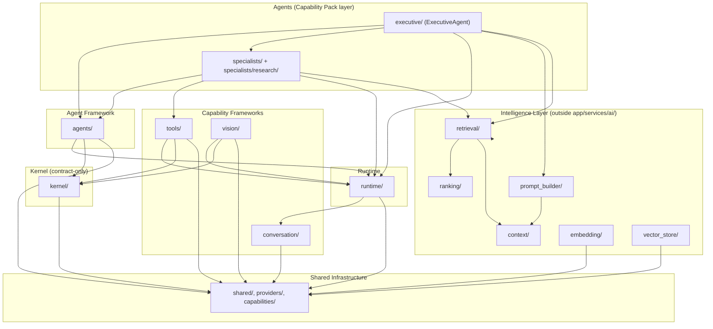

# AI Operating System — Architecture Freeze v1.0

**Platform Version**: 1.0.0
**Freeze Date**: 2026-07-31
**Milestone**: M20.7 — AI Operating System Architecture Freeze
**Status**: Architecture Complete. Stable. Ready for Capability Pack development.
**Authority**: Third of the repository's four highest-authority documents — see [MASTER_BLUEPRINT.md](MASTER_BLUEPRINT.md) (1st), [PRODUCT_PHILOSOPHY_FREEZE_v1.md](PRODUCT_PHILOSOPHY_FREEZE_v1.md) (2nd), and [VERSION_1.0_MILESTONE_ZERO.md](VERSION_1.0_MILESTONE_ZERO.md) (4th, the historical record of this freeze taking effect)

## What This Document Is

This is not a new milestone's feature documentation — it is a declaration. M1 through M20.6 built, documented, enforced, and verified the AI Operating System. This document certifies that the architecture is internally consistent, that its extension points are real and Open/Closed, and that it is now **frozen**: every future addition builds *on top of* what exists here, through the extension points this document names, rather than by modifying the frameworks themselves. See [Capability_Strategy.md](08_CAPABILITY_PACKS/Capability_Strategy.md) for what building on top of it looks like going forward. This document governs *what is technically frozen*; [PRODUCT_PHILOSOPHY_FREEZE_v1.md](PRODUCT_PHILOSOPHY_FREEZE_v1.md) governs *why any of it exists* and is not superseded by anything in this document.

This document does not repeat every fact already established in `docs/00_OVERVIEW/` through `docs/07_ENTERPRISE/` and `docs/ADR/` — it references them, and its job is to state, in one place, what is now locked.

## Supported Architecture

The AI Operating System is a layered platform (`app/services/ai/`, plus the closely-coupled intelligence-layer packages under `app/services/`) providing: a shared identity/registry/event/middleware substrate; a foundational-but-largely-declarative Kernel; a fully working Runtime for the Conversation capability; a general Agent Framework with one top-level coordinator (Executive) and an extensible Specialist layer (one concrete specialist, Research); a Universal Tool Framework (contract complete, zero concrete tools); a Universal Vision Framework (contract complete, zero concrete providers); and an Intelligence layer (Prompt Builder, Context Builder, Ranking, Semantic Search, Retrieval, Embedding, Vector Store, and two distinct Memory layers) feeding all of the above. Full architecture: [System_Architecture.md](01_ARCHITECTURE/System_Architecture.md).

## Stable Packages

Every package below is frozen at the API/contract level (see Compatibility Policy). "Frozen" does not mean "finished" — several are intentionally architecture-only (Kernel) or have zero concrete implementations yet (Vision/Tool providers) by original design, and that is exactly the stable state being frozen, not a gap this freeze is deferring.

| Package | Role | Freeze note |
|---|---|---|
| `app/services/ai/shared/` | Identity, generic registry/event/middleware, provider config/factory, exceptions | Fully stable — the platform's one universal dependency |
| `app/services/ai/kernel/` | Foundational, capability-agnostic execution contracts | Stable *as a contract*; `KernelRuntime.execute()` intentionally still raises `NotImplementedError` — see [Kernel.md](02_KERNEL/Kernel.md) |
| `app/services/ai/runtime/` | The working Conversation execution engine | Fully stable |
| `app/services/ai/conversation/` | Conversation provider contract + registry/factory | Fully stable; zero concrete providers (by design) |
| `app/services/ai/providers/` | Platform-wide `ProviderName` | Fully stable |
| `app/services/ai/capabilities/` | Platform-wide `Capability` taxonomy | Stable; still unused by any dispatch mechanism — see [Capability_Routing.md](01_ARCHITECTURE/Capability_Routing.md) |
| `app/services/ai/agents/` | `BaseAgent`, `AgentContext`, `AgentRegistry`/`Factory`/`Executor`, `AgentMemory`, `AgentPlanner` | Fully stable |
| `app/services/ai/agents/executive/` | `ExecutiveAgent` ("PID 1") | Fully stable |
| `app/services/ai/agents/specialists/` | `SpecialistAgent`, registry/dispatcher/factory/coordinator, adapters | Fully stable — the primary Capability Pack extension point |
| `app/services/ai/agents/specialists/research/` | `ResearchAgent` — the first concrete specialist | Stable as the reference implementation new specialists pattern-match against |
| `app/services/ai/tools/` | `BaseTool`, `ToolRegistry`/`Factory`/`Manager`/`Executor` | Fully stable; zero concrete tools (by design) |
| `app/services/ai/vision/` | `BaseVisionProvider` + four capability services, `VisionRuntime`/`Executor` | Fully stable; zero concrete providers (by design) |
| `app/services/prompt_builder/` | `PromptBuilder`, `PromptPackage` | Fully stable |
| `app/services/context/` | `ContextBuilder` pipeline | Fully stable |
| `app/services/ranking/` | `RankingEngine`, `RankingStrategy` | Fully stable |
| `app/services/retrieval/` | `MemoryRetrievalPipeline` | Fully stable |
| `app/services/embedding/` | `EmbeddingProvider`, `EmbeddingProviderRegistry`/`Factory` | Fully stable (registry migrated onto `GenericProviderRegistry` in M20.5) |
| `app/services/vector_store/` | `VectorStore`, `VectorStoreRegistry`/`Factory` | Fully stable (registry migrated onto `GenericProviderRegistry` in M20.5) |
| **Memory** (not a single package — see [Memory_Layer_Rationalization.md](03_INTELLIGENCE/Memory_Layer_Rationalization.md)) | `AgentMemory` (`agents/memory.py`) + `MemoryAdapter` (`agents/specialists/memory_adapter.py`), `AIMemoryService`/`MemoryService`, `MemoryRetrievalPipeline` | Stable at freeze time; `AgentMemory.remember()`/`forget()` intentionally raised `NotImplementedError` — a named, tracked gap, not a hidden one. Closed post-freeze by CP-01.2 (see Remaining Technical Debt, item 2) without modifying the frozen `AgentMemory` interface |

The user-facing example list (`shared/`, `kernel/`, `runtime/`, `conversation/`, `memory/`, `agents/`, `tools/`, `vision/`, `prompt_builder/`, `capabilities/`, `retrieval/`, `embedding/`, `vector_store/`) is fully covered above — `memory/` is not a literal directory in this codebase (memory is a cross-cutting concern spanning `agents/memory.py`, `agents/specialists/memory_adapter.py`, `retrieval/`, `embedding/`, `vector_store/`, and two services outside `app/services/ai/` entirely), and this freeze document states that explicitly rather than implying a package that doesn't exist.

## Stable Public Interfaces

Each of the following is frozen: its constructor signature, its public method signatures, and its behavioral contract (what it returns, what it raises, what it never does) **may be extended, but may not be broken**, without a major version bump (see Compatibility Policy).

| Interface | Package | What's frozen |
|---|---|---|
| `SharedExecutionContext` | `shared/execution_context.py` | Fields (`execution_id`, `parent_execution_id`, `correlation_id`, `causation_id`, `session_id`, `request_id`, `organization_id`, `user_id`, `conversation_id`, `created_at`, `metadata`), `.child()`, `.identity_fields()`, hash-on-`execution_id` |
| `ExecutionMetrics` | `kernel/metrics.py` | Composed, never redefined, by every execution artifact platform-wide |
| `RetryPolicy` | `kernel/retry.py` | Composed, never redefined, by every retryable execution engine |
| `GenericProviderRegistry[TKey, TValue]` | `shared/provider_registry.py` | `register`/`unregister`/`clear`/`get`/`is_registered`/`all_registered`, `_registration_error` override point |
| `GenericEvent` / `EventPublisher[TEvent]` | `shared/events.py` | Field shape, `kw_only=True`, `hash_event()`, sync pub/sub semantics |
| `GenericMiddleware` / `GenericMiddlewarePipeline` | `shared/middleware.py` | `__call__(context, subject, call_next)`, outside-in composition |
| `AIRuntime` | `runtime/runtime.py` | `execute()`, `execute_stream()`, `health()`, `capabilities()`, `providers()` |
| `ConversationProvider` | `conversation/base_provider.py` | Abstract `generate`/`health_check`/`provider_name`/`model_name`; concrete `initialize`/`shutdown`/`capabilities`/`metadata`/`stream` |
| `BaseAgent` | `agents/base_agent.py` | Full lifecycle contract (`initialize`/`execute`/`pause`/`resume`/`cancel`/`shutdown`/`health`/`capabilities`/`permissions`/`memory`/`planner`/`runtime`) |
| `SpecialistAgent` | `agents/specialists/specialist_agent.py` | `BaseAgent` + `specialization`/`supported_tasks`/`plan`/`evaluate`/`self_check` |
| `ExecutiveAgent` | `agents/executive/executive_agent.py` | Public surface: `plan`/`dispatch`/`delegate`/`collect_results`/`build_response`, plus the full `BaseAgent` contract |
| `AgentMemory` | `agents/memory.py` | `remember`/`retrieve`/`forget`/`search` |
| `BaseTool` | `tools/base_tool.py` | Abstract execution contract + concrete `manifest()` |
| `ToolManager` | `tools/manager.py` | `invoke(tool_id, parameters, ...)` |
| `BaseVisionProvider` | `vision/shared/base_provider.py` | Abstract `health_check`/`provider_name`/`model_name`; concrete `initialize`/`shutdown`/`capabilities`/`metadata` |
| `VisionRuntime` | `vision/runtime.py` | `execute()`, `health()`, `capabilities()`, `providers()` |
| `MemoryRetrievalPipeline` | `retrieval/memory_retrieval_pipeline.py` | `search_memories`/`search_conversation_messages`/`search_all` |
| `PromptBuilder` | `prompt_builder/builder.py` | `build(query, context_package, conversation_history, system_prompt, additional_instructions)` |

**Rule**: a future change may add an optional parameter, a new method, a new subclass, or a new enum member. A future change may **not** remove a method, change a required parameter's meaning, change a returned type's shape in an incompatible way, or make a previously-optional behavior mandatory — without a major version bump.

## Stable Extension Points

Every extension point below is documented in detail in `docs/06_DEVELOPMENT/`; this section is the authoritative index of *which* extension point to use for *which* kind of new work, going forward.

| To add... | Extension point | Guide |
|---|---|---|
| A new top-level agent (rare) | Implement `BaseAgent`, register in `AgentRegistry` | [Adding_Agent.md](06_DEVELOPMENT/Adding_Agent.md) |
| A new specialist | Implement `SpecialistAgent`, register in `SpecialistRegistry` + `AgentRegistry` | [Adding_Agent.md](06_DEVELOPMENT/Adding_Agent.md) |
| A new tool | Implement `BaseTool`, register in `ToolRegistry` | [Adding_Tool.md](06_DEVELOPMENT/Adding_Tool.md) |
| A new Conversation provider | Implement `ConversationProvider`, register in `ConversationProviderRegistry` | [Adding_Provider.md](06_DEVELOPMENT/Adding_Provider.md) |
| A new Vision provider | Implement the relevant capability ABC (`ImageVisionProvider`/etc.), register in its registry | [Adding_Provider.md](06_DEVELOPMENT/Adding_Provider.md) |
| A new memory provider (backing store) | Implement `VectorStore` or `EmbeddingProvider`, register in `VectorStoreRegistry`/`EmbeddingProviderRegistry` | [Shared_Infrastructure.md](01_ARCHITECTURE/Shared_Infrastructure.md) (dedicated guide is a documentation gap — see Remaining Technical Debt) |
| A new capability framework (rare — a new "Vision"-shaped thing) | Mirror Vision's package skeleton exactly | [Adding_Framework.md](06_DEVELOPMENT/Adding_Framework.md) |
| A new Capability Pack | Compose specialists + tools + providers already extensible above; never modify core frameworks | [Capability_Strategy.md](08_CAPABILITY_PACKS/Capability_Strategy.md) |

**The rule going forward, stated plainly**: future work **subclasses** `BaseAgent`/`SpecialistAgent`/`BaseTool`/`ConversationProvider`/`BaseVisionProvider`, and **registers** into the corresponding registry. Future work does not add a new parameter to `AgentExecutor.execute()`, does not add a branch to `Dispatcher`, and does not touch `GenericProviderRegistry`/`GenericEvent`/`GenericMiddleware`. If a genuine need to change one of those is ever found, that is a major-version decision (see Compatibility Policy), not a Capability Pack's concern.

## Frozen Dependency Graph

### Allowed / Forbidden, Boundary by Boundary

This table is the definitive, frozen version of [Dependency_Rules.md](01_ARCHITECTURE/Dependency_Rules.md) — enforced automatically by `app/tests/architecture/` on every test run, not just documented.

| Boundary | Allowed | Forbidden |
|---|---|---|
| `shared/` | `providers/` only | Everything else |
| `providers/`, `capabilities/` | Nothing | Everything |
| `kernel/` | `shared/` — only via `kernel/context.py` | `runtime/`, `agents/`, `tools/`, `vision/`, `conversation/`, and every other kernel module reaching outside itself |
| `runtime/` | `shared/`, `conversation/`, `providers/` | `kernel/`, `agents/`, `tools/`, `vision/` |
| `conversation/` | `shared/`, `providers/` | `runtime/` (dependency runs the other way) |
| `agents/` (framework) | `shared/`, `kernel/`, `runtime/` | `tools/`, `vision/`, `agents/executive/`, `agents/specialists/` |
| `agents/executive/` | `agents/`, `agents/specialists/`, `shared/`, `kernel/`, `runtime/`, `providers/` | `agents/specialists/research/` (a specific specialist) |
| `agents/specialists/` | `agents/`, `tools/`, `runtime/`, `shared/`, `kernel/` | `agents/executive/`, `agents/specialists/research/` |
| `agents/specialists/research/` | `agents/specialists/`, `agents/`, `tools/`, `shared/`, `runtime/`, `kernel/`, `providers/` | `agents/executive/`, any other specialist |
| `tools/` | `shared/`, `runtime/`, `kernel/` | `agents/` (either direction), `vision/` |
| `vision/` | `shared/`, `runtime/`, `kernel/`, `providers/` | `agents/`, `tools/`, `conversation/` |
| `embedding/`, `vector_store/` | `shared/` (`GenericProviderRegistry`, since M20.5) | Nothing else in `app/services/ai/` |

**Kernel boundary**: the platform's most isolated package — one sanctioned exception (`kernel/context.py` → `shared.execution_context`), enforced by its own dedicated test (`test_kernel_context_is_the_only_kernel_module_allowed_to_import_outside_the_kernel`).
**Runtime boundary**: does not compose the Kernel (a known, documented, intentional gap — see [Kernel.md](02_KERNEL/Kernel.md)); it is a separate, fully-working engine.
**Agent boundary**: the Agent Framework itself never knows about `executive/`, `specialists/`, `tools/`, or `vision/` — only concrete agents built on top of it do.
**Capability boundary**: Conversation, Tools, and Vision never depend on each other or on Agents — every capability is reachable by any agent without one capability needing another.

## Stability Guarantees

| Guarantee | Where it's evidenced |
|---|---|
| **Open/Closed Principle** | Every registry (`GenericProviderRegistry` and its 7 subclasses) — a new provider/agent/tool/specialist is a registration, never a code change to the registry, factory, executor, or dispatcher. Verified by explicit `test_adding_a_new_provider_requires_no_factory_modification`-shaped tests throughout the suite. |
| **Single Responsibility** | Each capability framework owns exactly one concern (Conversation: talk to an LLM; Vision: understand visual input; Tools: perform actions) — none contains another's logic. `SpecialistCoordinator` is a plain DI container with zero methods of its own (verified by test). |
| **Dependency Inversion** | Every framework depends on abstractions (`ConversationProvider`, `BaseVisionProvider`, `BaseTool`) it declares, never on a concrete vendor implementation — zero vendor SDK imports exist anywhere in `app/services/ai/`, verified by `test_no_vendor_http_or_ocr_imports_anywhere_in_the_ai_operating_system`. |
| **Execution Identity** | `SharedExecutionContext` is composed (never redefined) by every execution artifact platform-wide; `.child()`/`.identity_fields()` make a full Executive → Specialist → Tool → Runtime execution tree reconstructable from any one piece of it — see [Identity_Model.md](02_KERNEL/Identity_Model.md). |
| **Provider Independence** | `Agent → Framework → Provider (abstract) → Implementation` is the same shape for Conversation and Vision; zero concrete providers exist for either, and every test exercises the frameworks via hand-written fakes — proof by construction, not convention. |
| **Model Independence** | `ModelIdentity` (Kernel) and `ProviderCapabilities` describe a model/provider's capabilities generically; no framework branches on a specific model name. |
| **Vendor Independence** | See Dependency Inversion above — the same fact, stated from the vendor-coupling angle. |
| **Thread Safety** | Every registry guards its `_providers` dict with a `threading.RLock`, verified by concurrent-registration tests (`test_concurrent_registrations_of_distinct_tool_ids_all_succeed` and equivalents). |
| **Immutability** | Every request/response/context/event/policy value object is a frozen `@dataclass`; mutable-mapping fields are coerced to `MappingProxyType` in `__post_init__`. Verified by `FrozenInstanceError`/`TypeError`-raising tests throughout. |
| **Deterministic Planning** | `ExecutivePlanner` and `ResearchPlanner`/`SpecialistPlanner` are template-based, not adaptive — identical input produces identical output, by design (no LLM reasoning in planning, an explicit and current architectural choice, not a limitation to silently outgrow). |
| **Framework Isolation** | `Dependency_Rules.md`'s boundary table, enforced automatically — no capability framework imports another; no agent framework imports a concrete agent. |

## Compatibility Policy (Semantic Versioning)

The AI Operating System adopts semantic versioning (`MAJOR.MINOR.PATCH`) starting at **1.0.0**, effective this freeze.

### MAJOR (breaking)
Incremented when: a frozen interface's method is removed or renamed; a required parameter's meaning changes; a registry/event/middleware generic (`GenericProviderRegistry`, `GenericEvent`, `GenericMiddleware`) is redesigned; a dependency-boundary rule is loosened in a way that changes which packages may import which; `SharedExecutionContext`, `ExecutionMetrics`, or `RetryPolicy` gain a required field or lose a field consumers rely on. **Requires an ADR** and an update to this document.

### MINOR (additive, safe)
Incremented when: a new Capability Pack ships; a new agent/specialist/tool/provider is registered; a new optional parameter or method is added to a stable interface; a new capability enum member is added; a new capability framework is added following [Adding_Framework.md](06_DEVELOPMENT/Adding_Framework.md). Never requires modifying an existing frozen interface's existing signature.

### PATCH (fixes)
Incremented when: a bug is fixed without changing any public interface's contract; documentation is corrected to match actual (unchanged) behavior; a test is added or corrected; performance is improved with no observable behavior change.

### What's Considered Safe
Adding: a provider, a tool, a specialist, an agent, a capability enum member, an optional constructor parameter, a new event type, a new hook method with a no-op default. All of these are additive and require no version bump beyond MINOR.

### What's a Breaking Change
Removing or renaming a public method; changing what a method returns; changing a registry's duplicate-registration behavior; changing an event's required fields; changing `SharedExecutionContext.child()`'s propagation defaults; changing which packages a boundary may depend on.

### How Capability Packs Should Evolve
A Capability Pack version is independent of the platform's version — a pack can ship MINOR/PATCH releases of its own specialists/tools without the platform changing at all, since packs only ever consume frozen interfaces. A pack requiring the platform to change its frozen interfaces is a signal the pack has outgrown "extension" and needs a platform MAJOR-version conversation — see [Capability_Strategy.md](08_CAPABILITY_PACKS/Capability_Strategy.md).

## Future Development Rules

**After M20.7, no future milestone or Capability Pack may:**

- Redesign `Runtime` (`AIRuntime`/`RuntimeExecutor`)
- Redesign the Agent Framework (`BaseAgent`/`AgentExecutor`/`AgentRegistry`)
- Redesign the Vision Framework (`VisionRuntime`/`VisionExecutor`/`BaseVisionProvider`)
- Redesign the Tool Framework (`ToolManager`/`ToolExecutor`/`BaseTool`)
- Redesign the Specialist Framework (`SpecialistAgent`/`SpecialistCoordinator`/`SpecialistDispatcher`)
- Redesign `SharedExecutionContext`
- Redesign `ExecutionMetrics`
- Redesign `RetryPolicy`
- Redesign `GenericProviderRegistry`
- Redesign `GenericEvent` / `EventPublisher`
- Redesign `GenericMiddleware` / `GenericMiddlewarePipeline`

**...unless a future MAJOR version explicitly replaces them**, with an ADR justifying the replacement, a migration note, and this document re-issued as a new frozen version. Everything else — every Capability Pack, every new agent, tool, specialist, or provider — is additive, built through the extension points named above.

## Freeze Verification (M20.7)

Run against the full repository at freeze time:

| Check | Result |
|---|---|
| Full backend test suite (`pytest -q`) | **2044 passed**, 0 failed |
| Architecture enforcement suite (`app/tests/architecture/`) | **13 passed** — package boundaries, vendor-import ban, Kernel isolation |
| `ruff check app scripts settings.py` | **All checks passed** |
| Documentation link integrity (38 files, all cross-references) | **0 broken links** |
| Duplicated registry/factory/event/middleware abstractions | **None found** — every registry (8 total) extends `GenericProviderRegistry`; the one exception (`kernel.registry.RuntimeRegistry`) is a verified, documented, different concept (instance-level, not class-level state) |
| Hidden coupling (a framework importing another capability framework, or an agent-layer package reaching into a concrete agent by name) | **None found** — verified by the architecture test suite's forbidden-dependency checks per boundary |
| One framework duplicating another | **None found** — Kernel and Runtime are the one pair that looks like duplication and is explicitly documented as intentionally separate, not accidental |
| Extension points remain Open/Closed | **Confirmed** — every registry-based extension point has a dedicated "adding a new X requires no factory modification" test |

## Remaining Technical Debt

Named explicitly so the freeze does not imply these are resolved:

1. **Kernel/Runtime duality**: `KernelRuntime.execute()` still raises `NotImplementedError`; `AIRuntime` does not compose the Kernel. This is a real, intentional, long-standing architectural gap (see [Kernel.md](02_KERNEL/Kernel.md)), not something this freeze silently closes.
2. **`AgentMemory.remember()`/`forget()`**: implemented but raise `NotImplementedError` (M20.6) — no write-path adapter exists yet. *(Resolved post-freeze, CP-01.2: `MemoryAdapter` now delegates both to `AIMemoryService`. Closing a named, already-declared gap like this is compatible with the freeze's own Compatibility Policy — see [Memory_System.md](03_INTELLIGENCE/Memory_System.md) — this snapshot is left as-is for historical accuracy as of the freeze itself.)*
3. **The platform-wide `Capability` enum** (`ai/capabilities/enums.py`): still unused by any dispatch mechanism.
4. **`SpecialistDispatcher.dispatch_by_specialization()`**: a name-based lookup method with no production caller, kept for its own tests only.
5. **Embedding-persistence boilerplate duplication** (Memory_Layer_Rationalization.md, Finding A): `AIMemoryService` and `ConversationMessageService` each independently implement the same graceful-degradation wrapper around `EmbeddingPersistenceService`. Recommended for extraction; not yet done.
6. **`MemoryRecord` vs. `Memory` naming collision**: both read as "memory" despite being unrelated tables. A future renaming pass is recommended, not yet scheduled.
7. **No dedicated "Adding a Memory/Embedding Provider" guide**: `Adding_Provider.md` covers Conversation and Vision providers; embedding/vector-store providers are documented in `Shared_Infrastructure.md` and `Memory_Layer_Rationalization.md` but lack a dedicated how-to.
8. **No automated import-linter/CI enforcement beyond pytest**: `app/tests/architecture/` runs as part of the normal test suite; there is no separate, faster pre-commit or CI-only static check.
9. **No Audio/Speech Framework, no second concrete specialist beyond Research, no concrete vendor providers anywhere**: all named, all intentional, all roadmap items — not gaps introduced by this freeze.

None of these block Capability Pack development — each is either a documented, load-bearing design choice (1) or an independently-schedulable improvement (2–8) that doesn't require touching a frozen interface.

## Readiness Recommendation

**The platform is ready for Capability Pack development.** Every extension point a Capability Pack needs (new specialists, new tools, new providers) is implemented, tested, documented, and automatically enforced. The one concrete specialist (Research) and the fully-architected-but-provider-less Tool and Vision Frameworks are sufficient reference implementations for CP-01 onward to pattern-match against. The remaining technical debt above is real but orthogonal to Capability Pack work — none of it sits on the path a new pack would need to walk.

See [Capability_Strategy.md](08_CAPABILITY_PACKS/Capability_Strategy.md) for the next phase. See [VERSION_1.0_MILESTONE_ZERO.md](VERSION_1.0_MILESTONE_ZERO.md) for the permanent historical record confirming this readiness recommendation held, proven by CP-01's full implementation and CP-02's Architecture Readiness Review.
