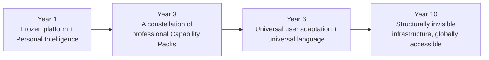
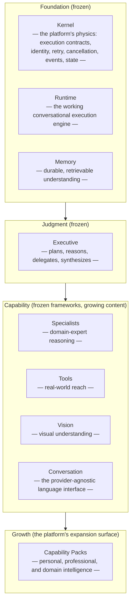
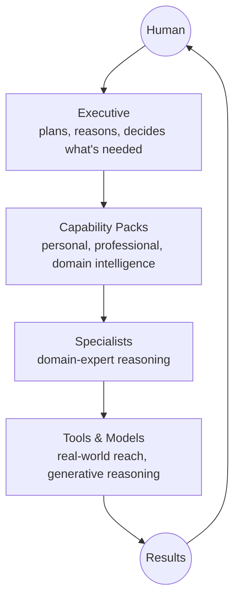
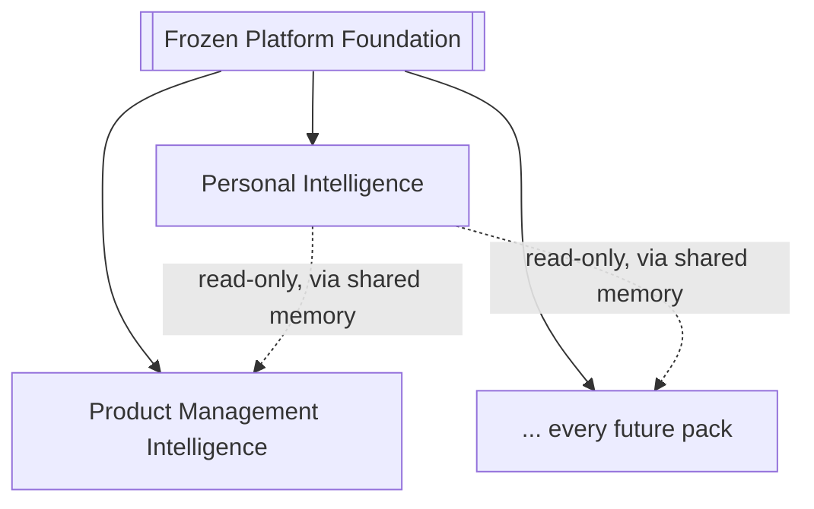

# AI Operating System — Master Platform Blueprint

**Version 1.0 — Canonical**

| | |
|---|---|
| **Status** | Canonical — the founding blueprint of the platform |
| **Scope** | The entire AI Operating System, its philosophy, and its long-term direction |
| **Built on** | Architecture Freeze v1.0 ([ARCHITECTURE_FREEZE_v1.md](ARCHITECTURE_FREEZE_v1.md)), the Architecture Documentation Sprint, the [ADR](ADR/) record, [Capability_Strategy.md](08_CAPABILITY_PACKS/Capability_Strategy.md), CP-01 Personal Intelligence Pack (through implementation and the Insight Engine), CP-02 Product Management Intelligence Pack (through Architecture Readiness Review) |
| **Relationship to existing overview documents** | This document sits above [Vision.md](00_OVERVIEW/Vision.md) and [Philosophy.md](00_OVERVIEW/Philosophy.md), not in place of them. Where those documents explain the platform's *engineering* rationale and *code-level* conventions, this document explains what the platform *is*, *why it exists*, and *where it is going* — for every audience, not only engineers. It does not repeat their content; it references it. |
| **Audience** | Every engineer, executive, investor, partner, researcher, and future AI agent who will read, extend, fund, evaluate, or reason about this platform. |
| **The four highest-authority documents** | This document is first of four: **(1)** this Blueprint, **(2)** [PRODUCT_PHILOSOPHY_FREEZE_v1.md](PRODUCT_PHILOSOPHY_FREEZE_v1.md) — the permanent, binding beliefs distilled from it, **(3)** [ARCHITECTURE_FREEZE_v1.md](ARCHITECTURE_FREEZE_v1.md) — the permanent technical record of what is frozen, **(4)** [VERSION_1.0_MILESTONE_ZERO.md](VERSION_1.0_MILESTONE_ZERO.md) — the historical record confirming all three took effect. No other document in the repository outranks these four. |

This document is deliberately free of code, package structures, APIs, and implementation detail. Those belong to the architecture and engineering documents this blueprint sits above and points to. What belongs here is judgment: what this system is, why it was built this way, what it must never become, and what it is trying to become over the next decade. Everything in this document is meant to outlive any single release.

---

## 1. Executive Summary

The AI Operating System is a platform for building durable, reasoning, memory-native intelligence — not a chatbot, not a feature, and not a wrapper around a language model. It is infrastructure: a substrate on which specialized, professional-grade artificial intelligence capabilities are built, the way applications are built on an operating system rather than on bare hardware.

It exists because the AI industry has, so far, mostly shipped **appliances** — a chat window here, a copilot there, a summarization feature somewhere else — each one stateless between sessions, each one coupled to a single vendor, each one incapable of compounding what it learns about the person or organization it serves. That pattern works for a demo. It does not work for a lifetime of use, and it does not work for the kind of judgment a real advisor, a real specialist, or a real institution requires. The problem this platform solves is structural: how do you give software the ability to reason, remember, specialize, and act on someone's behalf — safely, traceably, and indefinitely — without every new capability becoming a one-off integration and without every conversation starting from zero.

It serves, in order of what has been built so far, an individual seeking a continuous personal intelligence (CP-01), a professional seeking domain expertise built on top of that personal foundation (CP-02, product management, the first of many), and — by explicit, permanent design intent — every kind of human being who will ever need help thinking, deciding, remembering, or growing: a farmer, a student, a trader, a founder, a teacher, a government. This matters because the alternative future — a small number of vendors renting out disconnected, forgetful AI features — concentrates capability rather than distributing it. This platform's founding bet is the opposite: that AI should become a durable, personal capability multiplier for everyone, not a subscription to a smarter autocomplete.

## 2. Vision

**Ten years from now, the AI Operating System should be running, structurally invisible, underneath the important decisions of the people and institutions that use it — the way an operating system runs underneath every application on a computer without most people ever thinking about it.**

That is the long-term vision, stated plainly: not a product people talk about using, but infrastructure people simply rely on, the same way electricity, search, and cloud computing became infrastructure. Success is not "more people opened the app this week." Success is that the people and organizations who have used this platform for years are measurably more capable, better informed, and further along toward their own goals than they would have been without it — because nothing they ever told it was forgotten, because every specialized capability it applied on their behalf was held to the same rigor a genuine domain expert would apply, and because it never once pretended to know something it hadn't actually been given evidence for.

Three commitments define what "success" means over that horizon, and none of them is a usage metric:

1. **Compounding understanding.** The system should know the people and organizations it serves better with every year of use — not through surveillance, but through the same disciplined, consent-governed memory it already practices today (§10). A ten-year relationship with this platform should feel categorically different from a ten-year relationship with a search engine.
2. **Professional-grade judgment, universally available.** The rigor a senior product manager, a licensed financial advisor, a trained physician, or an experienced educator brings to their work should not be a privilege of who can afford to hire one. Capability Packs (§12, §15) are how that rigor is encoded and distributed without diluting it.
3. **A companion, not a replacement.** At every point on this ten-year horizon, the system's purpose is to make the humans who use it more capable — never to make itself the decision-maker in their place. §23 makes this a permanent commitment, not an aspiration.

## 3. Mission

Where the vision is a horizon, the mission is what the platform is for **today**, in every single interaction:

> Every time someone brings this platform a question, a decision, or a piece of work, it should respond with the accumulated context of everything relevant it has ever been told, the structured judgment of a genuine domain professional where one applies, and complete honesty about what it does and does not actually know — and it should leave that person more capable of handling the next one themselves.

This is a daily, operational standard, not a slogan. It is checked, in this platform's own engineering practice, at the level of a single response: does this answer use what was actually remembered, or does it ignore context that was available? Does it apply real professional structure, or does it produce fluent-sounding but ungrounded text? Does it say "I don't have enough evidence for that" when it doesn't, rather than filling the gap with a plausible guess? The mission is met or missed one interaction at a time.

## 4. Philosophy

These are the beliefs that shape every design decision on this platform. They are stated here in the order they tend to resolve disagreements, from the most fundamental to the most tactical.

**Human first, AI second.** Every capability on this platform exists to serve a human's judgment, not to substitute for it. When a design choice would make the system more capable at the cost of the human's own agency or understanding — an autonomous action taken without review, a recommendation delivered without its reasoning — the human's agency wins. This is not a constraint bolted onto an otherwise autonomous system; it is the starting premise every capability is designed from.

**Explainability.** A capability that cannot explain why it concluded what it concluded is not trustworthy, regardless of how often it happens to be right. Every specialized reasoning capability on this platform is built to show its work — which evidence it used, which framework or precedent it applied, what it is and is not confident about — because a black-box recommendation, however fluent, is not something a person can build durable trust in.

**Traceability.** Every conclusion this platform reaches should be traceable back to the specific facts, memories, or evidence that produced it. This is not a nice-to-have layered on top of the reasoning; it is architecturally required, proven in practice by the Insight Engine's discipline of tracing every observation back to the exact memories it was derived from (§10, §13). A platform this deeply involved in a person's decisions cannot afford conclusions with untraceable origins.

**Composability.** Capabilities on this platform are built to combine, not to collide. A personal capability, a professional capability, and a tool integration should be able to work together in a single request without any of them needing to know the internal details of the others. This is what allows the platform to keep growing without any given addition becoming riskier than the last.

**Memory over prompts.** A system that only knows what fits in the current conversation is not intelligent about a person — it is momentarily fluent about a paragraph. This platform treats memory as durable, structural, and central (§10), not as a context-window trick. Everything the platform learns about a person or an organization is meant to persist and compound, not evaporate at the end of a session.

**Reuse before invention.** The most dangerous sentence in this platform's engineering history is "we'll just build our own version, just this once." Every capability is required to first ask whether an existing mechanism already does the job — a registry, a memory pattern, an existing specialist's precedent — before writing something new. This is why the platform, after years of growth, still has exactly one memory system, one execution model, and one way to add a new capability, not several competing ones.

**Framework before feature.** A capability is not built as a one-off; it is built as an instance of a general pattern the platform already has, or, if none exists yet, as a new general pattern deliberately designed to be reused by whatever comes next. This is the difference between adding a feature and extending a platform.

**Deterministic where possible.** Wherever a task has a genuinely correct, inspectable, repeatable structure — how a decision gets framed, how a plan gets built, how a request gets routed — this platform uses deterministic logic, not a language model's best guess. Predictability is a feature, not a limitation, whenever the underlying task actually has a right shape.

**LLM only when reasoning is required.** Generative reasoning is reserved for what genuinely requires judgment under uncertainty — synthesizing evidence into a narrative, drafting communication in someone's voice, weighing a tradeoff that has no single correct formula. Using a language model where a deterministic rule would do is not more intelligent; it is less reliable for no benefit. This principle, paired with the one above, is why this platform's specialized capabilities read as disciplined rather than merely articulate.

## 5. Design Principles

The principles in §4 explain the platform's beliefs. The principles below are the permanent, non-negotiable rules every future feature — regardless of who builds it, when, or under what pressure — must obey. These are platform law, not guidance.

1. **No capability may modify a frozen interface.** The platform's core (§8) is frozen at version 1.0. Every new capability is built through existing extension points, never by editing what already works. See [ARCHITECTURE_FREEZE_v1.md](ARCHITECTURE_FREEZE_v1.md).
2. **No capability may duplicate what the platform already provides.** If memory, execution, retry, identity, or event handling already exists, a new capability uses it. It does not build a private version "temporarily."
3. **Every conclusion must be traceable to evidence, never invented.** A capability that cannot show its reasoning's origin has not met the bar for shipping, regardless of how convincing its output reads.
4. **Every capability must degrade honestly, never silently.** In the absence of a vendor, a tool, or sufficient evidence, the platform says so. It does not fabricate a plausible-sounding answer to avoid an awkward gap.
5. **No capability may take an autonomous, irreversible, consequential action without explicit human review.** Drafting, recommending, and structuring are the platform's default posture. Sending, publishing, executing, and committing require a human's deliberate approval, every time, without exception.
6. **Every capability is reachable through the same orchestration path.** A request reasons through the Executive and reaches a specialist through declared capability, never through a private side-channel that bypasses the platform's own judgment layer.
7. **Every capability must be independent and composable.** A new capability must not require another capability's internal cooperation to exist, and must never import another capability's private internals — only its openly retrievable, structured output.
8. **Memory is a right the user controls.** What the platform remembers about a person must be visible to them, correctable by them, and deletable by them, without exception, in every capability that touches personal or professional data.
9. **Determinism governs structure; generation governs judgment.** Anything with one correct, inspectable shape is handled deterministically. Anything that genuinely requires weighing evidence or producing language is handled generatively — and never the reverse.
10. **The platform never assumes a single vendor.** No capability may hard-couple itself to one AI provider, one model, or one vendor's API shape. Providers are swappable by design, always.
11. **Every new capability must extend, not fork, the platform's identity, execution, and event model.** There is one way an execution is identified, one way a failure is represented, and one way an event is published — for every capability that will ever exist on this platform.
12. **Documentation precedes implementation.** A capability's product intent, architecture, and readiness are written and reviewed before its code is, every time, without exception — the discipline this entire platform's own history, from CP-01 through CP-02's Architecture Readiness Review, has practiced consistently.

## 6. The Big Idea

In plain terms: **most of what the public calls "AI" today is a chat window in front of a language model.** Ask it something, it answers, the conversation ends, and the next conversation starts from nothing. That is a genuinely useful pattern for a huge number of tasks — and it is also, structurally, a dead end for anything that requires continuity, specialization, or trust built up over time.

The AI Operating System is not that. It is the layer *underneath* that kind of experience — the substrate a chat interface, a voice assistant, a professional tool, or an autonomous workflow could all be built on top of, the same way a word processor, a spreadsheet, and a web browser are all built on top of the same operating system rather than each reinventing memory management and process scheduling from scratch. A conversational interface is one possible *application* of this platform. It is not what this platform *is*.

**Why it is not ChatGPT, Claude, Gemini, or Copilot**: those are products — extraordinary ones, and this platform is a grateful, provider-agnostic consumer of the models behind several of them (§8) — but they are, by design, general-purpose conversational surfaces. They do not maintain a durable, structured, categorized model of who you are and what you have decided across years of use. They do not natively specialize into a licensed professional's actual methodology — a real RICE-scored product decision, a real evidentiary chain behind a financial recommendation — as opposed to fluent, generically-informed text about that methodology. They do not compose multiple domain specialists behind one coherent orchestrating judgment, with each specialist's work traceable and independently reviewable. And critically, they are the destination — the product a person opens. This platform is the foundation something like that gets built *from*.

The fundamental difference is not "this is a smarter model." Model quality is a rented, swappable ingredient here, deliberately (§8's provider-agnostic design). The fundamental difference is **architecture**: memory that compounds instead of resets, reasoning that specializes instead of staying generic, orchestration that is auditable instead of opaque, and growth that happens through composable capability rather than through one team trying to make one product do everything.

## 7. Platform Identity

The AI Operating System is, by design and by name, **an operating system for artificial intelligence capability** — infrastructure that schedules reasoning, mediates access to memory and tools, and gives every capability built on it a shared identity, a shared execution model, and a shared standard of evidence. It is deliberately not several other things it might be mistaken for:

**It is not an AI chatbot.** A chatbot's unit of work is a conversation turn. This platform's unit of work is a durable relationship — a chatbot forgets when the tab closes; this platform's entire memory architecture (§10) exists specifically so that nothing relevant is ever lost between sessions.

**It is not an assistant.** An assistant helps you get through a task. This platform is built to construct continuity of understanding across a lifetime of tasks — the difference between someone who helps you draft one email and someone who has read every email you've ever needed help with and knows exactly how you write.

**It is not an automation tool.** Automation executes a fixed script faster than a human could. This platform reasons under genuine uncertainty, applies professional judgment, weighs tradeoffs, and — per Design Principle 5 — deliberately stops short of autonomous action specifically because judgment, unlike a script, needs a human to remain accountable for what happens next.

The distinction matters because each of those three categories optimizes for something this platform explicitly does not: a chatbot optimizes for breadth of topic and immediacy of response; an assistant optimizes for task completion; an automation tool optimizes for unattended execution. This platform optimizes for something none of them are built to hold: a trustworthy, evidence-grounded, continuously deepening understanding of the people and organizations it serves, expressed through specialized professional judgment, always under human control.

## 8. Core Architecture

At the highest level of description — with every implementation detail deliberately left to the architecture documents this section points to — the AI Operating System is organized as a small number of layers, each one a genuine platform service rather than a feature bolted onto the last.

**Kernel** is the deepest layer: the platform's own physics — how an execution is identified, how a retry behaves, how a timeout fires, how an event is published, how state transitions are validated. Nothing above it is allowed to reinvent these; everything above it composes them.

**Runtime** is the working engine that actually carries out a conversational exchange with a language model — provider-agnostic, retried, timed out, and observed the same way regardless of which vendor is behind it.

**Memory** is the platform's durable understanding of the people and organizations it serves — not a chat log, a structured, retrievable, categorized substrate every other layer reads from and writes to. §10 is dedicated entirely to why this layer is treated as central rather than incidental.

**Executive** is the platform's judgment layer — the "PID 1" every request enters through. It plans before it acts, decides what the request actually needs, and delegates to the right specialized capability rather than attempting every kind of reasoning itself. §11 explains this philosophy in full.

**Specialists** are domain-expert reasoning units — a research specialist, a personal-intelligence specialist, a product-management specialist, and, over time, a growing roster of professional specialists (§15) — each one an expert in one thing, never a generalist trying to be everything.

**Tools** give the platform real-world reach — search, retrieval, and, over time, the ability to interact with the external systems a person's or organization's work actually depends on.

**Vision** gives the platform the ability to understand what it is shown, not only what it is told — documents, images, diagrams, and, eventually, the visual world a person's work happens in.

**Conversation** is the provider-agnostic language interface every generative capability on the platform is built through — the reason a vendor can be added or swapped without touching the capabilities built on top of it.

**Capability Packs** are how the platform grows. They are not a layer in the execution sense — they are the platform's expansion surface, where personal, professional, and domain-specific intelligence is added over time without ever requiring the foundation beneath them to change. §12 is dedicated to why this is the platform's central growth mechanism.

For the precise technical architecture behind every layer above, see [System_Architecture.md](01_ARCHITECTURE/System_Architecture.md) and the frameworks documented under each numbered section of `docs/`. This section deliberately stops at the boundary where architecture becomes implementation.

## 9. Intelligence Layers

A single request moves through the platform in one direction, through a fixed sequence of layers — never sideways, never through a shortcut that skips the judgment layer:

**Human**: every request begins with a person — never a machine acting on its own initiative to originate consequential work (Design Principle 5).

**Executive**: the request enters the platform's judgment layer first, always. Before anything specialized happens, the Executive determines what kind of request this actually is and what capability it needs — this is the layer that keeps the platform coherent rather than a grab-bag of specialists each guessing whether they're relevant.

**Capability Packs**: the Executive routes into whichever capability domain the request actually belongs to — personal (§13), professional (§14), or, over time, one of the domain packs described in §15. This is where the platform's growing breadth lives, cleanly separated from its unchanging judgment core.

**Specialists**: within a capability pack, a specific domain-expert reasoning unit does the actual work — applying the professional structure, precedent, and standards that domain requires (§12, §14).

**Tools & Models**: where a specialist needs real-world reach or generative reasoning, it draws on the platform's tool and model layer — search, retrieval, generation — always through the same provider-agnostic interface, never coupled to one vendor.

**Results**: the outcome flows back up through every layer it came down through, carrying the same identity and traceability the whole way, until it reaches the human who asked — with its reasoning, evidence, and confidence intact, never flattened into an unexplained answer along the way.

## 10. Memory Philosophy

Memory is not a feature of this platform. It is the platform's central organizing idea — the reason everything described in §6 through §9 is even worth building. A system that reasons brilliantly for the duration of one conversation and then forgets everything is not intelligent about the person it just talked to; it is momentarily articulate. The AI Operating System exists specifically to be the opposite of that.

This is why memory is architected as an **OS-level service** — durable, categorized, retrievable by every capability that needs it — rather than as a chatbot feature bolted onto a context window. The distinction is not cosmetic. A context-window "memory" evaporates at a size limit and a session boundary. A platform-level memory compounds indefinitely, is deliberately categorized so different kinds of understanding can be reasoned about differently, and is something the person it concerns can see, correct, and delete — a right, not a convenience (Design Principle 8).

The categories of memory that exist or are becoming visible on this platform today, and the general pattern future ones will follow:

- **Episodic memory** — what happened: specific events, sessions, and reflections, tied to a moment in time.
- **Semantic memory** — durable facts: what is true, independent of when it was learned.
- **Identity memory** — who someone is: values, communication style, roles, constraints — the lens every other memory is interpreted through.
- **Goal memory** — what someone is working toward, across timeframes, tracked and revisited rather than stated once and forgotten.
- **Project memory** — the durable state of something someone is building or managing.
- **Preference memory** — how someone wants to be worked with, respected consistently rather than re-asked every session.
- **Reflection memory** — what someone has learned from their own experience, captured deliberately rather than lost to the moment.
- **Personal memory** — the whole of the above, composed: the durable model of one individual (§13).
- **Professional memory** — the specialized, domain-namespaced record a professional capability builds on top of personal memory: decisions, evidence, artifacts, and the standards applied to produce them (§14).
- **Insight memory** — not a fact someone stated, but a pattern, habit, contradiction, or alignment the platform itself has responsibly derived from everything above, always traceable back to the exact memories that produced it — never invented, never presented as more certain than its evidence supports.
- **Future memories** — as new capability packs are built (§15), each will define its own namespaced category, following the identical discipline every category above already follows: durable, retrievable, owned, and never duplicating what a memory category elsewhere already represents.

This is why "memory over prompts" (§4) is not a technical preference but a philosophical commitment: a prompt is a question asked once. Memory is understanding that survives being asked twice, a hundred times, and ten years apart.

## 11. Executive Philosophy

Every request on this platform begins with reasoning, not with action — the Executive exists specifically to make that non-negotiable. Before any specialized capability is invoked, the platform first asks what is actually being requested, what it will take to answer it well, and who — which specialist, which tool, which combination — is genuinely suited to the work. This is the opposite of a system that reflexively pattern-matches a request to the nearest available capability and hopes for the best.

**Specialists never compete for a request.** There is no auction, no voting, no race between candidate specialists to see which one answers first or loudest. A request reaches exactly the specialist whose declared expertise genuinely matches what is needed, determined once, by the Executive's own judgment — not by specialists jostling for relevance. This is a deliberate design choice: competition between specialists would optimize for whichever one is most eager to answer, not whichever one is actually right for the job.

**The Executive orchestrates; it does not perform the specialized work itself.** This separation — judgment in one place, expertise distributed everywhere else — is what allows the platform's breadth of capability to grow indefinitely (§12) without its core reasoning layer becoming an unmanageable monolith trying to be an expert in everything at once. The Executive's competence is knowing what a request needs and who should handle it, and synthesizing the results afterward — not trying to be a product manager, a financial analyst, and a physician all at once.

This philosophy is why the platform can add its hundredth capability pack with the same confidence it added its first: the Executive's job never changes. Only the roster of who it can call on grows.

## 12. Capability Pack Philosophy

The AI Operating System grows exclusively through **Capability Packs** — self-contained bundles of specialized intelligence, each built entirely on the frozen foundation (§8), never by modifying it. This is the platform's entire theory of how it scales from one capability to a hundred without accumulating risk in proportion to its growth.

**Why packs, not a monolith**: a platform that adds every new capability by editing a single, ever-growing codebase eventually becomes a place where nothing can be changed with confidence, because everything might affect everything else. A platform that adds every new capability as an independent pack, built on a foundation that never changes underneath it, can add its next hundred capabilities with the same confidence — and the same blast radius — as its first.

**Why packs are independent**: a Finance pack's failure, redesign, or removal should never be able to affect a Legal pack's correctness. Independence is what makes it safe for many teams, over many years, to build on this platform simultaneously without a coordination bottleneck and without one team's mistake becoming everyone's incident.

**Why packs never import each other**: when one pack's capability genuinely needs another's — the way Product Management Intelligence (CP-02) needs Personal Intelligence's (CP-01) understanding of who the person is — that need is expressed through the platform's own shared memory and orchestration mechanism, never by one pack's code reaching directly into another's internals. CP-02 is the platform's own proof that this works: a professional capability built entirely on top of a personal one, reading its output through the same memory retrieval every other consumer uses, without ever once importing its code. This is what "built on top of" is permitted to mean on this platform — a product dependency, never a code dependency.

**Why this makes the platform scalable**: independence and composability compound. A hundred independent, composable capability packs are not a hundred times riskier than one — they are, if anything, safer, because no single pack's internal complexity can leak into another's. This is the structural reason this platform can credibly aim at the breadth described in §15 without that breadth ever becoming its liability.

## 13. Personal Intelligence

Personal Intelligence (CP-01) is the platform's first Capability Pack, and its foundation. It gives the platform a continuous, compounding understanding of one individual: who they are, what they are working on, what they have decided, what they have reflected on, and — through its Insight Engine — the patterns, habits, and contradictions that emerge from all of that over time, always traceable back to the specific memories that produced them.

It is the foundation of everything else for a simple, load-bearing reason: **every other kind of intelligence this platform will ever build is exercised by a person, on behalf of a person, or in service of a person's goals — and a capability that doesn't know that person produces generic output, not genuine partnership.** A product-management recommendation, a financial plan, a piece of legal guidance, a lesson plan — every one of them is better, more relevant, and more trustworthy when it is grounded in an actual understanding of the human it is for, rather than delivered as if to nobody in particular. Personal Intelligence is what makes "for nobody in particular" architecturally impossible to default to.

This is also why Personal Intelligence deliberately does not try to be everything — it does not do deep financial modeling, professional research methodology, or clinical assessment. It builds the durable model of the *person*, and hands off domain depth to the specialized packs built on top of it, exactly as §14 describes.

## 14. Product Management Intelligence

Product Management Intelligence (CP-02) is the platform's first professional Capability Pack, and the first built explicitly on top of another Capability Pack rather than the platform alone. It specializes Personal Intelligence's foundation into the actual discipline of product management: validating problems before committing to build them, applying real prioritization and sequencing frameworks, drafting the artifacts delivery requires, reasoning across a whole portfolio of products rather than one in isolation, and supporting a person's growth in the craft itself.

**Why professional intelligence builds on personal intelligence, and not the other way around**: professional judgment is never exercised in a vacuum — it is exercised by a specific person, with specific values, a specific working style, and specific goals that a truly useful professional recommendation has to be grounded in. A product recommendation that doesn't know the product manager's own priorities and voice is textbook advice, not a thinking partner. CP-02 reads that grounding from CP-01 — never re-deriving identity or goals of its own, never importing CP-01's code, only reading what CP-01 already remembers through the platform's shared memory. This is the exact pattern §12 describes, proven in practice, and it is the pattern every future professional pack (§15) is expected to follow: build the *professional* layer on the *personal* one, never the reverse, and never by duplicating what the personal layer already owns.

## 15. Future Capability Packs

The packs below are the platform's envisioned direction — not a committed schedule, and not a final numbering. Each is described here at the level of what it would mean for that domain, consistent with and building on the direction already recorded in [Capability_Strategy.md](08_CAPABILITY_PACKS/Capability_Strategy.md), never contradicting it.

**Finance.** A Finance Intelligence pack specializes Personal Intelligence's lightweight business context into real financial judgment: budgeting grounded in a person's actual goals and risk tolerance (read from Personal Intelligence, never re-derived), investment and savings reasoning held to the same evidence-traceability standard every other pack is held to, and — for a business — the deeper operational financial tracking Personal Intelligence's own Business Intelligence deliberately stays shallow on. Its defining discipline is the same one every regulated financial practice depends on: a recommendation is only as good as the evidence and disclosed assumptions behind it, and this pack would be built to make both explicit, always.

**Trading.** A Trading Intelligence pack specializes decision support into the specific discipline of position and risk reasoning: structuring a trade thesis, surfacing precedent from past trading decisions and their actual outcomes, and — consistent with Design Principle 5 — never executing a trade autonomously. Its central architectural commitment is that risk tolerance and values are read from Personal Intelligence, not assumed, because the same trade looks entirely different to two people with different risk postures.

**Legal.** A Legal Intelligence pack specializes document and precedent reasoning into contract review, legal research synthesis, and citation-grounded analysis — always as support for a human's judgment, never as a substitute for licensed legal advice. Traceability is not a nice property here; it is close to the entire point — a legal capability that cannot show precisely which clause, precedent, or statute it is reasoning from has no place in this domain.

**Marketing.** A Marketing Intelligence pack specializes Business Intelligence's context and Product Management Intelligence's roadmap awareness into campaign strategy, positioning, and audience-aware copywriting — grounded in real product and business context rather than generic marketing-speak, and in a person's or organization's actual voice, read from Personal Intelligence exactly the way CP-02's own Stakeholder Communication capability already does.

**Coding.** A Coding/Engineering Intelligence pack specializes technical judgment into the engineering side of what Product Management Intelligence deliberately stays out of: code review, architecture reasoning, and technical delivery support — built with the same reuse-before-invention, framework-before-feature discipline (§4) this platform itself was built with, so that the pack helping engineers build software practices the same engineering culture (§20) it is embedded in.

**Research.** A Research Intelligence pack matures the platform's existing research specialist — already a proven, working part of the platform — into a full professional capability: systematic literature synthesis, rigorous evidentiary standards, and research methodology applied at the level a trained analyst or academic would hold themselves to, rather than a single-turn lookup. Every other pack that needs deep investigation, from Finance to Legal to Healthcare, is expected to delegate to this capability rather than reimplementing research judgment of its own — the same delegation discipline CP-02 already established with the platform's existing research specialist.

**Healthcare.** A Healthcare Intelligence pack applies the platform's memory and decision-support discipline to health tracking, wellness planning, and health-literacy support — always in a clearly supportive, non-diagnostic role, and held to the strictest application of the platform's privacy, sensitivity, and retention principles of any pack that will ever exist (§10, Design Principle 8), because health data carries a duty of care no other data category on this platform matches.

**Education.** An Education Intelligence pack specializes teaching itself: adaptive tutoring grounded in what a specific learner already knows and how they learn best (read from Personal Intelligence's identity and preference memory), structured curricula, and patient, judgment-free pedagogical support — the platform's clearest expression of the Human Companion Philosophy (§18) applied to a student's actual growth over time rather than a single homework answer.

**Enterprise.** An Enterprise Operating System pack composes multiple individual Personal and professional Capability Packs at an organizational layer — coordinated, specialist-driven business workflows (CRM, sales operations, procurement, reporting) run by a coordinated set of specialist agents rather than a single monolithic assistant, extending the direction already recorded in [Future_Enterprise_Architecture.md](07_ENTERPRISE/Future_Enterprise_Architecture.md). It is the platform's proof that the same architecture serving one person scales to an organization without becoming a different architecture.

**Sales.** A Sales Intelligence pack specializes stakeholder and relationship reasoning into lead qualification, outreach drafting grounded in a real prospect and product context, and pipeline judgment — always drafting, never autonomously contacting anyone, in the exact same posture Stakeholder Communication (CP-02) already established for professional communication generally.

**Real Estate.** A Real Estate Intelligence pack applies decision-support and portfolio reasoning to property evaluation, market context, and investment tradeoffs — a domain where the platform's precedent-surfacing discipline (comparable past decisions and their actual outcomes) is especially valuable, because real estate judgment is built almost entirely on comparables and local context.

**Relationship.** Beyond Personal Intelligence's lightweight tracking of who matters to someone, a dedicated Relationship Intelligence pack would specialize into the deeper dynamics professional and personal relationships actually require over time — mentorship management, professional network strategy, and relationship-health reflection — always as the user's own record, never an independent profile of another person, exactly as Personal Intelligence's own relationship boundary already requires.

**Language.** A dedicated Language Intelligence pack is the concrete product home for language learning and practice specifically — structured lessons, conversation practice, and progress tracking treated with the same rigor as any other professional teaching discipline. It is the applied product; §17 describes the broader, permanent, platform-wide commitment to language that every pack, not only this one, is expected to honor.

**Creative.** A Creative Intelligence pack supports writing, design ideation, and creative production — a partner for a first draft, a structural critique, or a creative block, never a replacement for the human creative act itself, consistent with this platform's foundational commitment that it exists to make people more capable, never to originate the work in their place (§23).

**Operations.** An Operations Intelligence pack specializes process design, workflow optimization, and cross-functional coordination judgment — the connective-tissue capability that lets an organization's other capability packs (Sales, Marketing, Finance, Product) operate as one coherent system rather than independently optimized silos, mirroring at the operational layer the same orchestration role the Executive plays at the platform layer (§11).

## 16. Universal User Philosophy

This platform must eventually be usable, without compromise, by a child learning to read, a farmer with no formal digital literacy, a market trader making rapid decisions on a feature phone, a small-business owner running every function of their company alone, a teacher managing thirty students, a senior executive weighing a strategic bet, and a government agency accountable to an entire population. No other design commitment in this document is harder, and none is more important.

**The resolution is architectural, not aspirational: the platform adapts itself to the person, rather than requiring the person to adapt to the platform.** This is possible for a structural reason already present in the foundation described in §8 and §13: Personal Intelligence's identity model already captures not just facts about a person but *how they want to be communicated with* — their preferred complexity, their communication style, their context. The same underlying reasoning capability, held to the same evidentiary and professional standards, can present itself in radically different ways depending on who is actually being served, because the adaptation happens at the identity and communication layer, not by building a different, lesser product for different kinds of people.

Concretely: a farmer asking for planting guidance should not need to know what a "prompt" is, should not be expected to type fluently, and should receive an answer in the register of practical, local, immediately actionable advice — not an academic essay on agronomy. A child asking a question should receive patience, simplicity, and safety boundaries appropriate to a child, automatically, because the platform knows it is talking to a child. A government analyst asking the same category of question should receive institutional rigor, complete evidentiary trails, and formal language, because the platform knows the standard that context requires. None of these are different products. They are the same intelligence, the same evidentiary discipline, the same underlying architecture — presented through a lens shaped by who is actually there.

This is why Universal User Philosophy is not a UI feature or a localization checklist — it is a permanent characteristic the platform must be judged against at every future capability decision: **does this new capability assume a literate, technically fluent, English-speaking professional user by default, or does it genuinely adapt?** Every capability pack in §15, every future product surface, must answer that question honestly before it ships.

## 17. Universal Language Philosophy

Multilingual intelligence is not a translation feature this platform intends to add. It is a permanent commitment that the platform should eventually **understand a person's language, think in that language, speak it naturally, teach it, practice it, switch between languages as fluidly as the person it serves does, and do all of this with genuine respect for the culture and local context that language carries with it.**

The distinction between language as an *intelligence capability* and language as *translation* is the entire point of this section. Translation takes text in one language and produces equivalent text in another, with no memory of who is speaking, no adaptation to how that person actually communicates, and no awareness of the cultural weight particular words and phrasings carry. A platform that only translates is still, underneath, thinking in one language and wearing a costume for every other. A platform with genuine language intelligence reasons *in* the person's own language, grounded in their own cultural and local context, informed by everything Personal Intelligence already knows about how they communicate (§10, §16) — and the difference is felt immediately by the person on the other end.

Consider what this actually means for real people:

**A Yoruba trader** in a Lagos market does not need a literal English-to-Yoruba translation of generic business advice. They need a companion that reasons in Yoruba, understands the rhythms and idiom of how business is actually discussed in that context, and can move fluidly into English or Pidgin the moment a conversation calls for it — the way a genuinely bilingual business partner would, not the way a phrasebook would.

**A Hausa farmer** needs agricultural guidance that respects the language they think in, the seasonal and cultural context of farming in their region, and a conversational register that doesn't assume a formal education — delivered as naturally as a knowledgeable neighbor would deliver it, not as a machine-translated pamphlet.

**An Igbo business owner** managing a growing enterprise needs the platform's professional capabilities — the same decision support, the same evidentiary discipline described everywhere else in this document — expressed in Igbo when that is the language of their thinking, without any loss of the rigor those capabilities carry in English.

**A French learner** and **a Spanish learner** need more than a translator; they need a patient conversation partner who can hold a real exchange in the language they're learning, correct them without embarrassment, and adjust its own complexity to exactly where they are — the Language Intelligence pack described in §15, but grounded in the same identity-aware adaptation §16 describes.

**A child learning English** needs simplicity, warmth, and safety layered on top of genuine pedagogical structure — language learning treated as a developmental relationship, not a vocabulary drill.

In every one of these examples, the defining shift is the same: **the AI becomes a companion in that person's own language and context, not a service that processes their words into a foreign one and back.** This is why language is treated here as a first-class intelligence capability, on the same permanent-commitment footing as memory (§10) and universal user adaptation (§16) — not a checkbox feature to be added once, but a standing obligation every future capability is expected to eventually meet.

## 18. Human Companion Philosophy

The AI Operating System is designed to occupy roles today's AI products largely do not attempt, because those products are not built for continuity: **mentor, coach, teacher, planner, advisor, partner, accountability companion, and reflection partner.**

As a **mentor**, it draws on a longitudinal understanding of someone's goals and growth (§10, §13) that a single conversation could never hold. As a **coach**, it holds someone accountable to commitments it actually remembers them making, rather than needing to be reminded of them. As a **teacher**, it adapts its pedagogy to how a specific person actually learns (§16), not a generic explanation. As a **planner**, it grounds every plan in real, remembered context rather than a blank page each time. As an **advisor**, it brings the structured judgment of a genuine domain professional (§12, §14, §15) to a decision, with its reasoning visible. As a **partner**, it works alongside someone's own thinking rather than replacing it. As an **accountability companion**, it is the one relationship in someone's life that never forgets what they said they were going to do. As a **reflection partner**, it helps someone learn from their own experience by remembering that experience well enough to reflect on it honestly with them.

**This differs from today's assistants in one structural way that produces every other difference**: today's assistants are transactional and session-bound — helpful in the moment, then gone. Every role described above requires the opposite: a relationship that persists, deepens, and compounds. None of these roles are achievable without the memory architecture in §10, the personal foundation in §13, and the professional specialization in §14 and §15 working together. This is not a list of features to build; it is what the rest of this document, taken together, is already building toward.

## 19. Evolution Strategy

The platform is designed to grow indefinitely without ever needing to redesign what already works — a deliberate, structural answer to the failure mode most software eventually suffers, where growth requires periodic, disruptive rewrites.

**Architecture Freeze.** The platform's foundation — Kernel, Runtime, Memory, Executive, and the frameworks described in §8 — is frozen at version 1.0 ([ARCHITECTURE_FREEZE_v1.md](ARCHITECTURE_FREEZE_v1.md)). Freezing the foundation is what makes everything built on top of it stable to build against; a foundation that keeps shifting cannot be reliably built upon.

**Capability Packs.** All growth beyond the frozen foundation happens through Capability Packs (§12, §15) — additive, independent, composable. This is the mechanism that lets the platform's *breadth* grow without its *core* ever needing to change, and it is why the platform can credibly commit to the horizon described in §2 without that commitment implying an eventual rewrite.

**Versioning.** The frozen foundation is versioned deliberately: a genuinely breaking change to a frozen interface would require a new major version of the platform itself, not a quiet edit — and the platform's own history, through CP-01 and CP-02, has not required one, because every real need so far has been met by extension, not modification.

**Backward compatibility.** A frozen interface's contract does not change underneath the capabilities built against it. Extension is always additive — a new capability, a new memory category, a new specialist — never a change to what already exists and already works.

**The ADR process.** Significant, precedent-setting architectural decisions are recorded permanently as Architecture Decision Records ([ADR/](ADR/)), so the reasoning behind a structural choice survives the people who made it and is available to everyone who builds on the platform afterward.

**Testing.** The platform treats its test suites as part of its specification, not an afterthought — every framework and every capability pack has been built with its own tests as a co-deliverable, which is what has made every refactor and every new pack, from the M19 completion pass through CP-02's Architecture Readiness Review, possible with confidence rather than hope.

**Documentation.** Every capability on this platform is required to exist as a product specification and an architecture specification before it exists as code — the sequence this platform's own recent history (PRD, then Architecture, then Architecture Readiness Review, for both CP-01 and CP-02) demonstrates in practice, not merely in policy.

## 20. Engineering Culture

**Documentation before implementation.** No capability is coded before its product intent and its architecture are written down and reviewed. This is not bureaucracy; it is how the platform has avoided building the wrong thing well.

**Tests before merge.** Nothing is considered complete without tests that prove it — built from hand-written fakes against real contracts, never mocks papering over an interface no one actually verified.

**Architecture before code.** Every capability pack this platform has shipped has an architecture document that precedes and constrains its implementation, not one written after the fact to describe what happened to get built.

**Reuse before duplication.** The engineering team's default instinct, at every decision point, is to ask what already exists before writing something new — the same discipline as Design Principle 2, practiced daily.

**Simple over clever.** A solution that is easy to understand a year later is worth more than one that is impressive today and inscrutable tomorrow. This platform is built to be extended by people — and, per its own stated audience, by future AI agents — who were not in the room when a decision was made, and clarity is what makes that possible.

**Truth over assumptions.** Every claim about what the platform does is checked against what it actually does, not what it was intended to do or once did. This document itself was built the same way its architecture documents were: verified against the real system, not written from memory of an intention.

**Evidence over opinions.** Disagreements about design are resolved by pointing at what the code, the tests, or the documented precedent actually shows — not by seniority, confidence, or eloquence. This is the same evidentiary discipline the platform holds its own reasoning capabilities to (§4, "Traceability"), applied to how the platform itself is built.

## 21. Product Culture

**Human-centered.** Every product decision starts from a real person's actual need, not from what a capability happens to make easy to build. The Universal User Philosophy (§16) is this principle's most demanding expression.

**Outcome-driven.** Success is measured by what changes for the person using the platform — a better decision made, an hour saved, something learned — never by engagement for its own sake. §22 makes this explicit and permanent.

**Accessible.** A capability that only works for a technically fluent, literate, English-speaking professional is not finished — it has only been built for the easiest audience first. Accessibility is a completion criterion, not a stretch goal, consistent with §16.

**Inclusive.** The platform is designed for the full breadth of humanity described in §16 and §17, not a narrow, convenient slice of it. Every capability pack in §15 is expected to ask who it might be leaving out before it ships.

**Explainability.** Every product surface built on this platform inherits the same commitment as its underlying reasoning (§4): a person using this platform should always be able to understand why it said what it said.

## 22. Success Metrics

This platform explicitly does not define success as user count, session frequency, or engagement time. Those numbers describe attention, not benefit — and a platform whose stated purpose is to make people more capable (§3, §23) should be judged by whether that purpose is actually being met, not by how much attention it captured while trying.

Success is instead defined by:

- **How much better people become** — measured longitudinally, in the professional and personal capability of the people who use this platform over months and years, not in a single session's satisfaction.
- **How much time they save** — time returned to the parts of a person's work or life that genuinely need their own judgment, not consumed by a platform that demands more attention than it returns.
- **How much they learn** — whether someone using this platform for a year is more capable of handling the next version of the same problem themselves, not more dependent on asking again.
- **How many better decisions they make** — decisions grounded in real evidence, real precedent, and real counterpoint (§4, §11), rather than decisions merely made faster.
- **How much they grow** — the compounding, longitudinal outcome every capability pack in §13 through §15 and every companion role in §18 ultimately exists to produce.

Every capability pack defines its own operational metrics appropriate to its domain — CP-01's and CP-02's own PRDs and Architecture Readiness Reviews already do this in detail, and this document does not repeat them. What this section establishes is the standard every one of those domain-specific metrics must ultimately ladder up to: not usage, but genuine human capability gained.

## 23. The AI Operating System Manifesto

We build this platform because intelligence, once it becomes powerful enough to matter, should not be something people rent in disconnected fragments from a handful of companies — it should be something that belongs, structurally and durably, to the person and the organization it serves.

We believe memory is not a convenience but a foundation: that a system which forgets everything between conversations cannot, by definition, become a trusted advisor, no matter how capable it sounds in any single moment. We believe judgment matters more than fluency: that a confident, well-written answer with no evidence behind it is worse than an honest admission of uncertainty, every time. We believe capability should specialize, the way real expertise does, rather than staying generic in the name of being everything to everyone. And we believe the measure of this platform's worth is not how impressive it is to watch, but how much more capable the people who use it become, year after year, of doing the things that matter to them without it.

The responsibility of building artificial intelligence at this level is not abstract. Every design decision recorded in this document — every principle in §4 and §5, every boundary in §11 and §12, every commitment in §16 through §18 — is an answer to the same underlying question: what kind of relationship should a person have with a system this capable? Our answer is that it should be a relationship of partnership, never dependency; of transparency, never opacity; of respect for a person's own agency, never a quiet erosion of it.

This platform exists to help a farmer plan a season with the same rigor a trained agronomist would bring, to help a first-time founder make decisions with the discipline of a seasoned operator, to help a child learn to read with the patience of the best teacher they will ever have, to help a government reason about policy with the same evidentiary standard it would demand of its own analysts — not by replacing the farmer, the founder, the child, or the analyst, but by making each of them more capable than they were before this platform existed.

That is the whole of it. Not a smarter machine for its own sake, but a more capable humanity — one person, one decision, one remembered conversation at a time.

---

**This document is the highest-level document in this repository.** Every architecture decision, every capability pack, and every future direction described elsewhere in `docs/` must be consistent with the philosophy, principles, and commitments recorded here. Where a future decision appears to conflict with this document, the conflict is resolved by revisiting the decision — not by quietly revising this blueprint to fit it. Together with [PRODUCT_PHILOSOPHY_FREEZE_v1.md](PRODUCT_PHILOSOPHY_FREEZE_v1.md), [ARCHITECTURE_FREEZE_v1.md](ARCHITECTURE_FREEZE_v1.md), and [VERSION_1.0_MILESTONE_ZERO.md](VERSION_1.0_MILESTONE_ZERO.md), this document forms the complete governing record of the platform's foundation. No other document holds equal or higher authority than these four.
