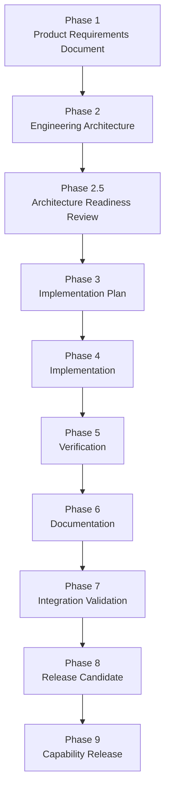

# AI Operating System — Version 1 Development Guide

| | |
|---|---|
| **Status** | Canonical — the standard operating procedure for Version 1 Capability Pack development |
| **Scope** | Every Capability Pack conceived, designed, implemented, tested, documented, verified, and released during Version 1 |
| **Governed by, never in conflict with** | [MASTER_BLUEPRINT.md](MASTER_BLUEPRINT.md), [PRODUCT_PHILOSOPHY_FREEZE_v1.md](PRODUCT_PHILOSOPHY_FREEZE_v1.md), [ARCHITECTURE_FREEZE_v1.md](ARCHITECTURE_FREEZE_v1.md), [VERSION_1.0_MILESTONE_ZERO.md](VERSION_1.0_MILESTONE_ZERO.md) |
| **Authority** | Subordinate to the four documents above on questions of vision, belief, and frozen architecture. Within its own domain — the engineering **process** — it is the sole authority: no Capability Pack may substitute a different lifecycle, and no future document may define a competing one without formally superseding this one by name. |
| **Precedent** | Distilled from the platform's own real history: CP-01 (Personal Intelligence), carried through full implementation across four phases, and CP-02 (Product Management Intelligence), carried through Product Requirements, Engineering Architecture, and Architecture Readiness Review. This guide formalizes what that history already proved works, with more precision than either pack was held to at the time. |

This is not a PRD, an architecture document, a roadmap, or an implementation. It contains no code, no package structure, and no architectural redesign. It is a **process document** — the permanent engineering procedure every Capability Pack built during Version 1 must follow, from its first sentence of product intent to its formal release.

---

## 1. Purpose

This guide exists because a platform that will host dozens of Capability Packs, built over years by different contributors — human and, per the Master Blueprint's own stated audience, AI — cannot afford to let each pack invent its own process. Two Capability Packs already exist as this guide is written: CP-01, built end to end, and CP-02, built through documentation and independent review. Both were built well, and both were built by feel — a disciplined feel, informed by real precedent as it accumulated, but not yet a written standard anyone could be held to in advance. This guide is what changes that.

**Every future Capability Pack must follow the same engineering process.** Not a similar process, not a process inspired by this one — the same nine-phase lifecycle (§4), the same required deliverables (§5), the same checklists (§10–§12), applied without exception. A pack that skips a phase because it seemed unnecessary this time is not a faster pack; it is an inconsistent one, and inconsistency is what this guide exists to prevent.

**Consistency is more valuable than speed.** A platform where every Capability Pack was built through a different process — one with tests, one without; one with an independent architecture review, one without; one with its documentation kept current, one left to drift — is a platform where trusting any given pack requires re-auditing it from scratch, because nothing about how it was built can be assumed. A platform where every pack was built through the *same* process is a platform where trust transfers: once this guide's process is understood once, every pack built under it is understood in outline, before a single one of its specifics has been read. That transferable trust is worth more, over the life of this platform, than any individual pack shipping a few weeks sooner by cutting a corner no one was watching.

## 2. Relationship to Existing Governance

Four documents already govern this platform, and this guide changes none of them:

- **[MASTER_BLUEPRINT.md](MASTER_BLUEPRINT.md)** governs *why the platform exists and what it is trying to become.* This guide never redefines that; it exists to make sure every Capability Pack actually serves it.
- **[PRODUCT_PHILOSOPHY_FREEZE_v1.md](PRODUCT_PHILOSOPHY_FREEZE_v1.md)** governs the platform's *permanent beliefs* — evidence before inference, human-first design, memory treated responsibly, and the rest. This guide's phases and checklists are, in large part, how those beliefs get checked at each concrete step of building something, rather than remaining aspirations.
- **[ARCHITECTURE_FREEZE_v1.md](ARCHITECTURE_FREEZE_v1.md)** governs *what is technically frozen* and how it may be extended. This guide never authorizes touching it; every phase below exists partly to guarantee it never is, by whoever is building the next pack.
- **[VERSION_1.0_MILESTONE_ZERO.md](VERSION_1.0_MILESTONE_ZERO.md)** is the historical record confirming the above three took effect, and that the platform was proven ready for exactly the work this guide now standardizes.

**The distinction that matters**: those four documents govern *why* Capability Packs exist and *what* must never change while they are built. This document governs *how* they get built — the sequence, the deliverables, the review gates, and the standards a pack is held to at every step between an idea and a release. A Capability Pack that perfectly honors the platform's philosophy and architecture but was built through an inconsistent, undocumented process has still failed this guide, even if it has failed nothing else.

Two further kinds of document sit alongside, not above, these five: the **[ADR](ADR/)** directory records individual, permanent architectural decisions as they are discovered (e.g. [ADR-0006](ADR/ADR-0006.md), which formalizes when a Capability Pack may introduce a new `memory_type` — see §6, below); and two living operational trackers, **[CAPABILITY_READINESS.md](CAPABILITY_READINESS.md)** (per-capability build maturity) and **[BACKLOG.md](BACKLOG.md)** (vision-stage ideas not yet scoped into any pack), report on the state this guide's lifecycle produces without setting any standard of their own. Neither tracker outranks, restates, or may contradict the four documents above; where a conflict would arise, the tracker is corrected.

## 3. Version 1 Engineering Principles

These are the permanent engineering principles the lifecycle in §4 exists to enforce. Each is a consequence of the Product Philosophy Freeze, made concrete for engineering practice.

**Architecture before implementation.** No Capability Pack is coded before its architecture is written and reviewed. This is not sequencing for its own sake — CP-02's own Architecture Readiness Review caught a real citation error and an under-specified traceability requirement before a single line of its code existed, evidence that this ordering catches what a code review alone would not.

**Documentation before coding.** A pack's product intent (Phase 1) and its architecture (Phase 2) are not retrospective descriptions written after the fact — they are written first, and the implementation that follows is required to conform to them, not the reverse.

**Reuse before invention.** Before any new mechanism is proposed, the question is always whether the platform, or the pack being built upon, already provides it. CP-01.3's Insight Engine and the whole of CP-02's architecture exist as proof this is possible even across pack boundaries, not only within one framework.

**Composition over duplication.** A capability is built by composing what already exists — memory, the Executive, the Specialist Framework, another pack's read-only output — never by copying and adapting an existing mechanism into a second, parallel one.

**Evidence before assumptions.** Every architectural claim, every "this integrates cleanly," every "this pattern fits," is verified against the actual platform and actual precedent before it is written down — not asserted from memory of how something was intended to work.

**Human-first design.** Every phase below ultimately answers to the Product Philosophy Freeze's Human First Principle: a pack that is easier to build but harder for a person to actually use and trust has optimized for the wrong side of that principle.

**Tests are mandatory.** No phase in this lifecycle is complete without its own test coverage, built from hand-written fakes against real contracts — never mocks standing in for a contract nobody verified. This is not a Phase 5 concern alone; it is checked at every review gate from Phase 2.5 onward.

**Backward compatibility.** A Capability Pack's own public surface — its memory categories, its specialist behavior, its documented guarantees — does not change in a way that breaks what other packs or users have come to rely on, without the same deliberation a platform-level breaking change would require.

**No silent redesigns.** A pack's architecture, once through Phase 2.5, is not quietly reshaped during implementation because a different approach seemed easier once coding started. A genuine need to deviate returns to Phase 2, reviewed again — it does not proceed unreviewed.

**Platform before features.** A Capability Pack's job is never to demonstrate a new technique; it is to extend the platform in a way every future pack can build on the same way. A clever, one-off implementation that doesn't generalize has served the feature, not the platform.

**Simple over clever.** The engineer most likely to maintain a pack a year from now is someone who was not in the room when it was built — the same standard the Master Blueprint's own Engineering Culture already sets. This guide holds every phase to it.

**Deterministic where possible.** Wherever a Capability Pack's task has one correct, inspectable structure, it is handled deterministically — the same discipline every specialist's planner on the platform already practices.

**LLMs where reasoning adds value.** Generative reasoning is reserved for genuine judgment under uncertainty — synthesis, drafting, weighing a tradeoff — never used in place of a deterministic rule that would do the job more reliably.

## 4. Capability Pack Lifecycle

Every Capability Pack proceeds through the same nine phases, in order, without skipping one. This lifecycle formalizes, with more granularity than either pack was held to at the time, the process CP-01 and CP-02 already followed in substance — CP-01's own Phase 3 ("Implementation v1") corresponds to what is now formally separated into Phases 3 through 6 below, and CP-02's own halt after its Architecture Readiness Review corresponds to a deliberate stop at the end of Phase 2.5.

**Phase 1 — Product Requirements Document.** Defines the capability at the product level: vision, problem statement, goals, non-goals, target users, functional requirements, user journeys, success metrics, risks, and acceptance criteria — with no code, no package structure, and no class design. This is the document that establishes *what the pack is for*, and every later phase is required to conform to it, not the reverse.

**Phase 2 — Engineering Architecture.** Translates the approved PRD into a technical design: layering, specialist strategy, memory model, integration points, dependency boundaries — still with no code. This is where the PRD's requirements are shown to be genuinely buildable on the frozen platform, through named, real extension points, never a proposed new one.

**Phase 2.5 — Architecture Readiness Review.** An independent audit of the approved architecture against the approved PRD, before any implementation begins. It verifies scope coverage, ownership boundaries, traceability, failure-mode handling, and architectural compliance, and concludes with a formal verdict — READY, READY WITH CONDITIONS, or NOT READY. This phase exists specifically to catch what neither the PRD's nor the architecture's own author is well positioned to catch in their own work, and CP-02's own review is the platform's proof that it finds real issues, not merely a rubber stamp.

**Phase 3 — Implementation Plan.** Converts the reviewed architecture into a concrete, sequenced plan for building it: the order specialists will be built in, the test strategy each will follow, which dependency-boundary entries will need to be added, and how the pack's rollout is sequenced. Still no code — this phase plans the code, in enough detail that Phase 4 is execution, not further design.

**Phase 4 — Implementation.** The pack is built, following the Implementation Plan and the reviewed Architecture exactly, in the platform's own established conventions. Every reuse point named in Phase 2 is exercised as named; no frozen interface is touched; tests are written as a co-deliverable of the code, not appended afterward.

**Phase 5 — Verification.** The full platform test suite is run, including the platform's own architecture-enforcement suite, confirming the new pack introduces zero regressions anywhere else on the platform — the exact discipline already demonstrated across CP-01's own phases, where the platform's test count grew from 2,051 to 2,368 without a single prior test ever failing along the way.

**Phase 6 — Documentation.** The pack's capability documentation, agent-level documentation, and cross-references are written or updated, and `Roadmap.md` and `Capability_Strategy.md` are updated to reflect the pack's real, current state — never left describing an earlier phase after a later one is complete.

**Phase 7 — Integration Validation.** The pack is proven to integrate correctly with the Executive (capability-based dispatch, no collision with the Executive's own internal tasks), with the Memory Framework (writes and reads behave exactly as the architecture specified), and with any other Capability Pack it depends on — through real, executable integration tests, not a description of how integration is expected to work.

**Phase 8 — Release Candidate.** Every deliverable in §5 is assembled, every checklist in §10 through §12 is passed, and the pack is frozen as a candidate for release — a final, complete snapshot awaiting only formal sign-off, with nothing further to design, build, or document before it ships.

**Phase 9 — Capability Release.** The pack is formally declared released. `Roadmap.md` and `Capability_Strategy.md` are updated to record it, release notes are published, and the pack takes its place as precedent for whichever Capability Pack is built next — exactly as CP-01 became CP-02's own precedent.

No phase may be skipped, reordered, or merged into another to save time. A pack that has not passed Phase 2.5 does not begin Phase 3. A pack that has not passed Phase 5 does not begin Phase 6. The lifecycle is sequential because each phase's review gate exists specifically to catch what the previous phase's own author cannot reliably catch alone.

## 5. Required Deliverables

Every Capability Pack must produce all eleven of the following. None is optional, and none may be substituted with a lighter-weight equivalent.

| Deliverable | What it is |
|---|---|
| **PRD** | The Phase 1 product specification — vision, scope, requirements, journeys, acceptance criteria. |
| **Engineering Architecture** | The Phase 2 technical design — layering, specialist strategy, memory model, integration points. |
| **Architecture Readiness Review** | The Phase 2.5 independent audit and formal readiness verdict. |
| **Implementation Plan** | The Phase 3 concrete build sequence, test strategy, and dependency-boundary plan. |
| **Production Code** | The Phase 4 implementation itself, built exactly to the reviewed architecture and plan. |
| **Test Suite** | Unit, integration, architecture, regression, and integration-validation tests, co-delivered with the code, never appended afterward. |
| **Documentation** | Capability-level and agent-level documentation, current as of the pack's actual, shipped state. |
| **Roadmap Update** | `Roadmap.md` updated to reflect the pack's real phase status at every phase transition, not only at release. |
| **Capability Strategy Update** | `Capability_Strategy.md` updated to reflect the pack's status and its relationship to any pack it builds on. |
| **Release Notes** | A record, written at Phase 9, of what the pack delivers, for anyone evaluating whether and how to rely on it. |
| **Completion Summary** | A closing record — mirroring, at the pack level, what [VERSION_1.0_MILESTONE_ZERO.md](VERSION_1.0_MILESTONE_ZERO.md) is at the platform level — stating plainly what was built, what was deliberately deferred, and what remains as tracked technical debt. |

## 6. Architecture Rules

These rules are not restated in detail here — they are governed in full by [ARCHITECTURE_FREEZE_v1.md](ARCHITECTURE_FREEZE_v1.md) and [Capability_Strategy.md](08_CAPABILITY_PACKS/Capability_Strategy.md). This guide restates them only as the non-negotiable gate every phase above is checked against:

- **Frozen interfaces cannot change.** No Capability Pack modifies a frozen interface's contract, under any justification.
- **Capability Packs never import each other directly.** A pack that needs another pack's output reads it through shared memory or Executive dispatch — never through a direct code import, per the Pack Independence principle.
- **Reuse existing infrastructure.** Memory, execution, identity, retry, and event handling are used as they already exist, never reimplemented privately.
- **Respect dependency boundaries.** Every new module's classification and allowed dependencies are declared consistently with the platform's existing boundary conventions.
- **Respect architecture enforcement tests.** The platform's own AST-based dependency validator is run, and passes, before any phase is considered complete.
- **Use existing extension points.** Registries, `GenericEvent`, `SpecialistTaskType`, `AgentCapability` — every extension a pack needs already exists as a named, documented point of extension. A pack proposing a new one has misdiagnosed the problem.
- **A business concept does not automatically warrant its own `memory_type`.** A new memory-type category is introduced only when a concept needs to be retrieved, owned, retained, or reasoned about differently from an already-approved category — never merely because it has its own name in a Product Artifact Model. This is now a binding, platform-wide precedent; see [ADR-0006](ADR/ADR-0006.md) for the full reasoning and worked example, and confirm it during every Architecture Readiness Review that introduces a new type.

## 7. Documentation Standards

Every Capability Pack's documentation — across its PRD, Architecture, ARR, and capability-level documents combined — must cover the following, without exception:

**Purpose** — why the capability exists. **Vision** — what it is ultimately trying to become. **Architecture** — how it is technically organized. **Boundaries** — what it owns and, as importantly, what it explicitly does not. **Dependencies** — what platform mechanism and which other packs it relies on. **Integration** — how it connects to the Executive, to memory, and to any pack it builds on. **Risks** — what could go wrong, and how it is mitigated. **Acceptance criteria** — what "done" objectively means. **Future work** — what is deliberately deferred, and why that is not the same as missing. **Cross references** — links to every governing and related document, kept accurate as those documents change.

**Documentation is part of the product, not a description of it written afterward.** A Capability Pack whose documentation is thin, stale, or reconstructed from memory after the code was written has not merely under-documented — it has produced a pack no one downstream can safely build on, because nothing about its actual boundaries, guarantees, or integration surface can be trusted. CP-02's own Architecture Readiness Review is the platform's direct evidence for this: a defect caught in review is materially cheaper than the same defect caught in production, and the review is only possible because the documentation existed to review in the first place.

## 8. Implementation Standards

- **Reuse platform infrastructure.** Every mechanism the platform or a lower pack already provides is used as-is.
- **Avoid duplicate logic.** If two Capability Packs would need to write the same helper, that helper belongs in shared infrastructure, not copied twice.
- **Prefer composition.** A pack extends by composing existing types and services, not by subclassing or wrapping them in ways that obscure what is actually happening underneath.
- **Avoid framework drift.** A pack's implementation matches the patterns already established by prior packs — naming, structure, and idiom — so that reading one pack teaches an engineer how to read the next.
- **No temporary hacks.** A workaround adopted "to unblock this pack" that bypasses an established convention is not temporary in practice; it is the first instance of a pattern the next pack will copy. It is not permitted at all.
- **No "just for now" architectural changes.** Any change that touches a frozen interface or a platform-level convention, however small or well-intentioned, is a Phase 2 (or platform-level ADR) decision — never something introduced quietly during Phase 4 under time pressure.

## 9. Testing Standards

Every Capability Pack must include: unit tests for every domain object and service; integration tests for every specialist's end-to-end operation; architecture tests where the pack introduces a new boundary; regression tests proving the full platform suite still passes; explicit edge-case coverage; explicit failure-scenario coverage (informed by the pack's own Phase 2.5 failure-mode analysis, where one exists); Executive integration tests proving correct, collision-free dispatch; memory integration tests proving reads and writes behave exactly as documented; and tool integration tests wherever the pack uses the Tool Framework.

**Expected quality**: every test is built from a hand-written fake against a real, enforced contract — this platform has never used mocks, and this guide does not introduce an exception. Tests are a co-deliverable of the implementation, not a follow-up task, and a pack is not considered to have reached Phase 5 until its own suite, and the full platform suite around it, both pass with zero regressions.

## 10. Documentation Review Checklist

Before implementation (Phase 3) begins:

- [ ] PRD complete and approved
- [ ] Architecture complete and approved
- [ ] Architecture Readiness Review complete, with a verdict of READY or READY WITH CONDITIONS
- [ ] Cross-references across PRD, Architecture, and ARR verified accurate
- [ ] Dependencies on platform mechanism and on other packs reviewed and named explicitly
- [ ] Ownership and ARR-identified boundaries verified with no unresolved ambiguity

## 11. Code Review Checklist

Before any merge:

- [ ] No frozen platform interface has been modified
- [ ] No frozen interface's contract has been touched, extended in a breaking way, or worked around
- [ ] Full platform test suite passes, including the new pack's own tests
- [ ] Architecture-enforcement suite passes with zero violations
- [ ] Lint is clean
- [ ] Documentation has been updated to match what was actually built, not what was originally planned
- [ ] Backward compatibility is preserved for every pack and platform consumer that already exists

## 12. Capability Release Checklist

Before a Capability Pack is considered complete:

- [ ] All nine lifecycle phases (§4) are complete
- [ ] All tests are green, platform-wide, with zero regressions
- [ ] Documentation is published and cross-referenced correctly
- [ ] `Roadmap.md` is updated to reflect the pack's release
- [ ] `Capability_Strategy.md` is updated to reflect the pack's release
- [ ] Release notes are written
- [ ] Executive integration is verified, with real tests, not description
- [ ] Memory integration is verified, with real tests, not description
- [ ] Architecture validation (the platform's own enforcement suite) has passed

## 13. Version 1 Success Criteria

Version 1's success as a whole is not measured by how many Capability Packs it accumulates. A platform with twenty shallow, inconsistent packs is not more successful than one with three genuinely excellent ones — the Product Philosophy Freeze's own rejection of usage-count metrics (Master Blueprint §22) applies here at the platform level exactly as it applies to any single interaction. Version 1 is measured instead by:

**Platform maturity** — whether the foundation continues to absorb new Capability Packs without needing to bend, exactly as it was designed to.

**User value** — whether the people and organizations using the packs built during Version 1 are demonstrably more capable because of them, not merely more frequent users of them.

**Reliability** — whether the platform's test suite, architecture enforcement, and zero-regression discipline hold as true at the tenth Capability Pack as they did at the first.

**Documentation quality** — whether a new engineer, or a future AI agent, can still trust the documentation to describe the platform as it actually is, at any point in Version 1's life.

**Engineering consistency** — whether every Capability Pack, regardless of who built it or when, was built through exactly this guide's process, with no quiet exceptions accumulating over time.

**Extensibility** — whether adding the next Capability Pack remains as safe and as well-understood an operation as adding the first one was.

**Intelligence growth** — whether the platform's actual, demonstrated intelligence — what it remembers, what it reasons about, how many domains it can competently serve — is genuinely compounding, not merely accumulating in volume.

## 14. Decision-Making Framework

When an engineering choice is ambiguous, it is resolved in this order:

1. **Prefer reuse.** Does the platform, or the pack being built on, already provide this?
2. **Prefer existing infrastructure.** If something new is genuinely needed, does it belong in a pack, or does it reveal a platform-level gap that belongs in shared infrastructure instead?
3. **Prefer stability.** Of the available approaches, which one requires touching the least that already works?
4. **Prefer explainability.** Of the remaining options, which one produces output whose reasoning is easiest for the person using it to actually understand?
5. **Avoid redesigning frozen architecture.** If every option above still seems to require touching a frozen interface, that is a signal the problem has been misdiagnosed, not that an exception is warranted.
6. **Escalate changes requiring architecture modification.** A genuine platform-level need is raised as a proposal, reviewed with the same rigor Phase 2.5 already applies to a pack's own architecture — never resolved unilaterally inside a single pack's implementation.
7. **Reference ADRs when necessary.** Precedent-setting decisions, once made, are recorded in the [ADR](ADR/) record so the reasoning survives the person who made it.

## 15. Change Management

Not every change carries the same weight, and this guide does not treat them as if they did:

- **Minor improvements** (a clearer error message, a small internal refactor with no external behavior change) require no special process beyond the ordinary code review checklist (§11).
- **Documentation updates** (correcting a stale cross-reference, clarifying prose) require no ADR — only that they actually happen, promptly, whenever the code or the state they describe changes.
- **Capability evolution** (a pack gaining a new operation within its already-approved architecture, or maturing from one version to the next within its own roadmap) follows this guide's lifecycle again, scoped to the new phase of work, exactly as CP-01's own Phase 4 (the Insight Engine) followed the same PRD-adjacent, Architecture, and implementation discipline as its Phase 3 before it.
- **Architecture evolution** (a genuine change to a platform-level extension point or convention) requires a documented ADR before it proceeds, reviewed with the same seriousness as the original decision it amends.
- **Version upgrades** (a breaking change to the frozen foundation itself) are governed entirely by [ARCHITECTURE_FREEZE_v1.md](ARCHITECTURE_FREEZE_v1.md)'s own Compatibility Policy, and by the bar [VERSION_1.0_MILESTONE_ZERO.md](VERSION_1.0_MILESTONE_ZERO.md) §14 sets for when a Version 2 is genuinely warranted — never treated as an extension of ordinary Capability Pack work.

**An ADR is required whenever a decision sets precedent** — whenever the choice being made will shape how the next several Capability Packs are built, not only the current one. A decision entirely local to one pack's own internal design does not require one; a decision that changes what "the platform's way of doing X" means, does.

## 16. Technical Debt Policy

This guide draws the same line CP-01's Architecture, CP-02's Architecture Readiness Review, and the Architecture Freeze itself already drew independently — restated here as the platform-wide policy every future pack is held to:

**Acceptable technical debt** is ordinary product-phasing: a capability deferred to a later version of the same pack; a naming or documentation cross-reference to be tightened up in a near-term pass; an integration left to the sequential, proven shape rather than a more ambitious but unproven one, with the more ambitious shape explicitly named as a future option rather than silently foreclosed. Acceptable debt is always named, tracked, and non-blocking.

**Unacceptable architectural debt** is anything that would quietly compromise the platform's frozen guarantees: a pack-private storage mechanism bypassing the Memory Framework "temporarily"; a specialist importing another pack's concrete type "just this once"; a vendor SDK called directly to save time; a frozen interface modified "in a way that shouldn't matter." Unacceptable debt is never scheduled for later — it is not permitted to exist at all, at any phase, for any reason.

The distinction is not about how large a shortcut is. It is about whether the shortcut is visible, named, and bounded (acceptable) or whether it quietly compromises a guarantee this platform has made permanent (unacceptable).

## 17. Definition of Done

A Capability Pack is considered **DONE** only when every one of the following holds, with no exceptions:

- [ ] Documentation is complete
- [ ] Implementation is complete
- [ ] Tests are complete
- [ ] Architecture enforcement passes
- [ ] Executive integration is verified
- [ ] Memory integration is verified
- [ ] `Roadmap.md` is updated
- [ ] `Capability_Strategy.md` is updated
- [ ] Release notes are completed
- [ ] Cross references are verified
- [ ] Every Architecture Readiness Review condition has been resolved, not merely acknowledged
- [ ] No frozen interface has been modified

A pack missing even one of these is not "mostly done." It has not reached Phase 9, regardless of how much of it is otherwise complete.

## 18. Engineering Culture

The Master Blueprint already establishes the platform's Engineering and Product Culture (§20–§21). This guide's contribution is operational, not philosophical: the day-to-day conduct expected of anyone executing the lifecycle in §4.

**Calm.** Deadlines do not justify skipping a phase or a checklist item. A pack delivered a week later, complete, is worth more than a pack delivered on time, missing a review gate.

**Disciplined.** The lifecycle is followed the same way on the tenth Capability Pack as on the first, including on the days it feels unnecessary.

**Evidence-driven.** Every claim about how something integrates, performs, or complies is checked against the real platform, not asserted from memory or intention.

**Maintainable.** Every decision is made with the next engineer — who was not in this conversation, and may not be human — in mind.

**Long-term thinking.** A shortcut that helps this pack ship and costs the next three packs more is not a net gain; it is debt with delayed interest.

**User-first.** Every phase, checklist, and standard in this guide ultimately exists to protect the person who will eventually use what gets built — never to satisfy the process for its own sake.

**Explainable.** An engineering decision that cannot be explained, in plain terms, to someone outside the immediate work is a decision that has not yet been thought through completely.

## 19. Continuous Improvement

Version 1 improves without redesign because of how its two kinds of change are deliberately kept separate. **Capability Packs evolve** — new operations, new phases of an existing pack's own roadmap, deeper maturity within an already-approved architecture — constantly and without friction, following this guide's own lifecycle each time. **Infrastructure remains stable** — the frozen foundation those packs are built on does not move underneath them, by design, per the Architecture Freeze.

**Lessons feed future versions** without requiring the current one to be rebuilt: every Capability Pack's own Completion Summary (§5) and every Architecture Readiness Review's findings accumulate as real, citable precedent — exactly as CP-01's history informed CP-02's design, and as this very guide was distilled from both. **ADRs capture architectural decisions** permanently, so that a precedent-setting choice, once made, does not need to be rediscovered or re-argued the next time a similar question arises.

This is how the platform grows for years without a rewrite: not because change stops, but because the *kind* of change that requires touching the foundation is kept rare, deliberate, and fully governed (§15), while the kind of change that extends the platform — a new Capability Pack — is made as safe, repeatable, and well-understood as this guide can make it.

## 20. Closing Statement

Version 1 is no longer building an architecture. Version 1 is building intelligence.

Every Capability Pack that follows this guide is another part of the operating system's growing mind — another domain in which it can remember, reason, and genuinely help. The frameworks are finished. What they enable is not, and never will be entirely finished, by design.

**The quality of the engineering process determines the quality of the intelligence we create.** A process that is disciplined, consistent, and evidence-driven produces capability packs that are trustworthy, explainable, and genuinely useful. A process that is rushed, inconsistent, or quietly exception-prone produces the opposite, regardless of how capable the underlying models become. This guide exists so that the platform's intelligence grows the way its architecture was built: deliberately, verifiably, and in a form every future contributor can trust without having to take it on faith.

---

**This document is the standard operating procedure for every Capability Pack built during Version 1**, effective immediately, beginning with CP-03. It does not compete with the Master Blueprint, the Product Philosophy Freeze, the Architecture Freeze, or Version 1.0 Milestone Zero for authority over what this platform is or why it exists — it is bound by all four. Within the domain it does govern — how the next Capability Pack gets built — it is not optional guidance. It is the process.
